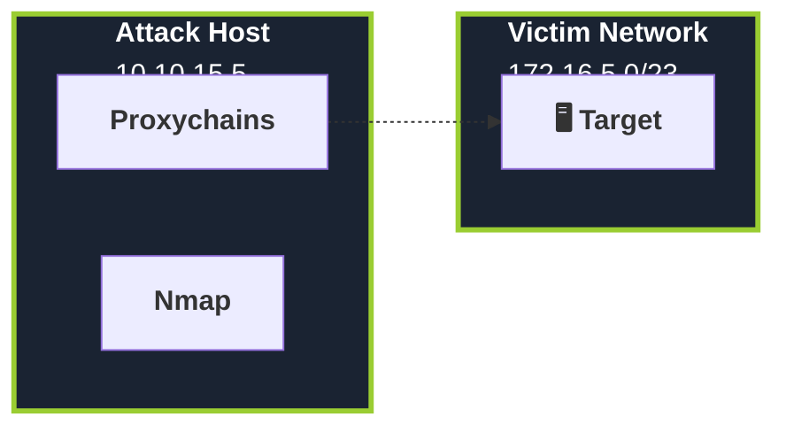
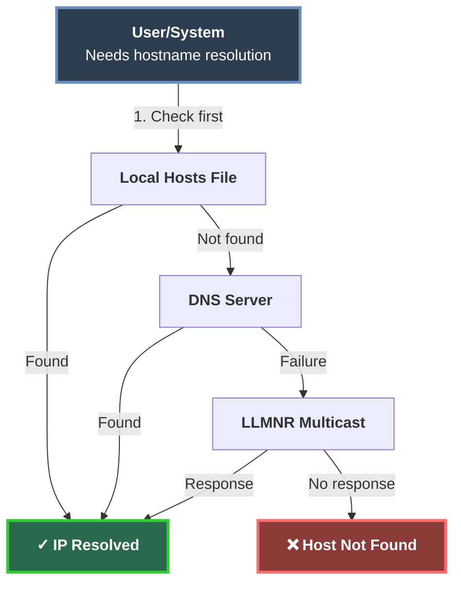
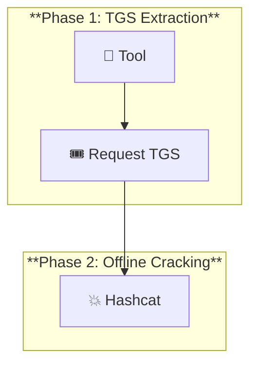
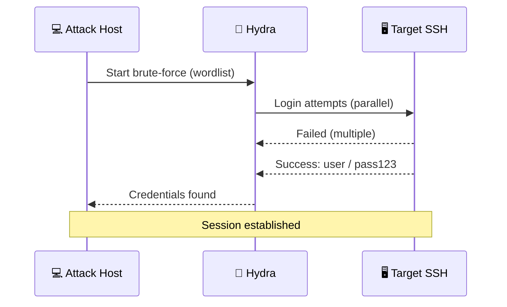
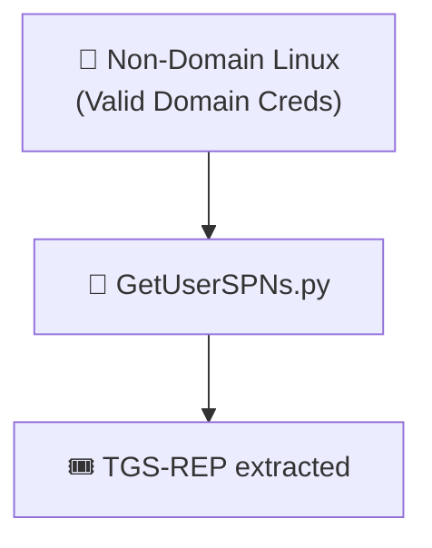
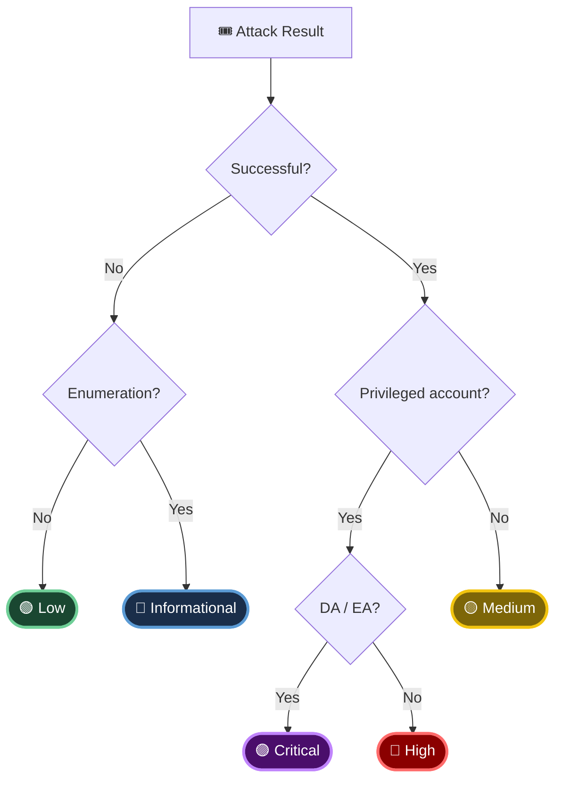

# Pwnomicon Style Guide

This document defines the canonical format for all documentation in this repository. Use this as reference when standardizing or creating new content.

---

## Table of Contents

1. [Document Structure](#document-structure)
2. [Code Blocks (HTML Tables)](#code-blocks-html-tables)
3. [Mermaid Diagrams](#mermaid-diagrams)
4. [Instructions Format](#instructions-format)
5. [Text and Explanations](#text-and-explanations)
6. [Attack Documentation Patterns](#attack-documentation-patterns)

---

## Document Structure

### Header Format

Every document starts with:

```markdown
# [Emoji] Title

_Poetic/thematic introduction describing the topic in 2-3 sentences._

> _"A relevant quote in italics."_

---
```

### Collapsible Sections

Use `<details>` and `<summary>` for all sections. **Headers follow document hierarchy:**

| Level          | Tag | Use For                                 |
| -------------- | --- | --------------------------------------- |
| `#` (markdown) | h1  | Document title only                     |
| `<h2>`         | h2  | Main sections (first `<details>` level) |
| `<h3>`         | h3  | Subsections (nested inside h2)          |
| `<h4>`         | h4  | Sub-subsections (nested inside h3)      |
| `<h5>`         | h5  | Deep sub-subsections (nested inside h4) |

**Example hierarchy:**

```html
<details>
  <summary><h2>🌐 Main Section</h2></summary>

  <details>
    <summary><h3>🪟 Subsection</h3></summary>

    <details>
      <summary><h4>Specific Item</h4></summary>

      Content...
    </details>
  </details>
</details>
```

**Real example from 00-general.md:**

```
# 🧠 General                          ← Document title (h1)
├── <h2>🌐 Get Network Interfaces     ← Main section
│   ├── <h3>🪟 Windows                ← Subsection
│   │   ├── <h4>PowerShell            ← Sub-subsection
│   │   └── <h4>CMD                   ← Sub-subsection
│   └── <h3>🐧 Linux                  ← Subsection
├── <h2>📶 Ping Sweep                 ← Main section (same level)
├── <h2>🔍 Find                       ← Main section
...
```

---

## Code Blocks (HTML Tables)

**NEVER use simple markdown code blocks for commands.** Always use HTML tables with prompts.

### Available Table Types

| Prefix        | Use Case            | Prompt               | Icon |
| ------------- | ------------------- | -------------------- | ---- |
| `!powershell` | PowerShell commands | `PS C:\Users\User >` | ⚡   |
| `!cmd`        | Windows CMD         | `C:\System32 >`      | 📟   |
| `!bash`       | General Linux       | `user@linux:~$`      | 🐧   |
| `!bashattack` | Attack host (Kali)  | `kali@kali:~$`       | ⚔️   |
| `!bashtarget` | Target machine      | `target@victim:~$`   | 🎯   |
| `!bashpivot`  | Pivot host          | `pivot@host:~$`      | 🚇   |
| `!mac`        | macOS               | `user@mac ~ %`       | 🍎   |
| `!metasploit` | Metasploit console  | `msf6 >`             | 💣   |
| `!py`         | Python code         | -                    | 🐍   |
| `!php`        | PHP code            | -                    | 🟦   |
| `!js`         | JavaScript          | -                    | 🟨   |
| `!ruby`       | Ruby code           | -                    | ❤️   |
| `!sql`        | SQL queries         | -                    | 🗄️   |
| `!txt`        | Plain text/config   | -                    | 📄   |
| `!note`       | Notes (no code)     | -                    | 💡   |

### ⚠️ Critical: Blank Lines Around Markdown Inside `<td>`

HTML renderers require blank lines before and after markdown elements (bold, inline code, fences) when inside `<td>` tags. **Always** use the expanded multi-line format. **Never** collapse prompt and code onto the same line.

````html
<!-- ✅ CORRECT — blank lines around ** and around fences -->
<td width="20%">**`kali@kali:~$`**</td>
<td>```bash command</td>
````

</td>

<!-- ❌ WRONG — compact single-line, bold will not render -->
<td width="20%">**`kali@kali:~$`**</td><td>```bash
command
```
</td>
```

---

### Command with Output (Standard Format)

````html
<table width="100%">
  <tr>
    <td colspan="2">⚔️ <b>bash — Linux - AttackHost</b></td>
  </tr>
  <tr>
    <td width="20%">**`kali@kali:~$`**</td>
    <td>```bash nmap -sV -p 22,80,443 10.10.10.5</td>
  </tr>
</table>
````

</td>
</tr>
<tr>
<td colspan="2">

---

```
Starting Nmap 7.94 ( https://nmap.org )
Nmap scan report for 10.10.10.5
PORT    STATE SERVICE VERSION
22/tcp  open  ssh     OpenSSH 8.9
80/tcp  open  http    Apache 2.4.52
443/tcp open  https   Apache 2.4.52
```

</td>
</tr>
</table>
```

### Command without Output (Short Format)

When output is not relevant, omit the output row:

````html
<table width="100%">
  <tr>
    <td colspan="2">🐧 <b>bash — Linux</b></td>
  </tr>
  <tr>
    <td width="20%">**`user@linux:~$`**</td>
    <td>```bash ip addr</td>
  </tr>
</table>
````

</td>
</tr>
</table>
```

### Code-only Tables (Python, PHP, etc.)

For programming languages without prompts:

````html
<table width="100%">
  <tr>
    <td>🐍 <b>Python — Script</b></td>
  </tr>
  <tr>
    <td>
      ```python import socket s = socket.socket(socket.AF_INET,
      socket.SOCK_STREAM) s.connect(("10.10.10.5", 4444))
    </td>
  </tr>
</table>
````

</td>
</tr>
</table>
```

### Custom Prompts (Scenario-Specific Hostnames)

The prompt cell may use a real scenario hostname instead of the generic one for narrative clarity. Valid for `!bash`, `!bashattack`, `!bashtarget`, and `!bashpivot` table types:

```html
<td width="20%">**`htb-student@ea-attack01:~$`**</td>
```

Use the generic prompt in reference docs; use a real hostname when documenting a specific engagement scenario for clarity.

---

### Post-Output Summary Table

After a command table with significant output, add a markdown summary table extracting key findings:

```markdown
| Field | Value |
|---|---|
| Domain | INLANEFREIGHT.LOCAL |
| Domain Controller | DC01 (172.16.5.5) |
| Captured Hashes | 3 NTLMv2 hashes |
```

Place the summary table directly below the closing `</table>` tag of the command table.

---

## Mermaid Diagrams

All diagrams must follow this visual style with colors, emojis, and styled links.

### When to Use Each Diagram Type

| Diagram Type | Direction | Use When | Typical Use Cases |
| --- | --- | --- | --- |
| `flowchart LR` | Left→Right | Network topology, horizontal attack chains | Host maps, pivot architecture, DMZ→internal, relay infrastructure |
| `flowchart TD` | Top→Down | Decision logic, protocol fallback chains, sequential phases | DNS resolution, risk trees, authentication flows |
| `flowchart TD` + phase subgraphs | Top→Down | Multi-stage attacks grouped by objective | Kerberoasting phases, enumeration stages |
| `flowchart LR` + network subgraphs | Left→Right | Segmented networks with subnet zones | DMZ vs Internal, VPN segments, multi-hop pivots |
| `sequenceDiagram` | — | Multi-party tool interaction, protocol handshakes | Hydra→SSH brute-force, Responder→victim capture, ProxyChains→SMB |

---

### Node Shapes

| Shape | Syntax | Use For |
| --- | --- | --- |
| Rectangle | `A["label"]` | Hosts, tools, data objects (default) |
| Diamond | `A{"label"}` | Conditions / decision points |
| Rounded rect | `A(["label"])` | Terminal outcomes (risk levels, success/failure) |
| Subgraph | `subgraph ID ["label"]` | Network segments or attack phases |

---

### Color Palette

| Role             | Fill      | Stroke    | Use For                      |
| ---------------- | --------- | --------- | ---------------------------- |
| Attack Host      | `#8b3a3a` | `#ff6b6b` | Attacker machine             |
| Handler/Listener | `#4a5a8b` | `#9b87f5` | Metasploit, netcat listeners |
| Proxy/Redirector | `#2d3e50` | `#6c8ebf` | Socat, proxychains, tunnels  |
| Victim/Target    | `#3a5a3a` | `#90EE90` | Compromised hosts            |
| Payload/Tool     | `#8b6a3a` | `#ff9500` | Payloads, scripts            |

### Node Format

Always use HTML-style labels with bold titles and line breaks:

```
A["<b>🔴 Attack Host</b><br/>10.10.14.18"]
```

### Link Styles

| Type       | Syntax                       | Style                 |
| ---------- | ---------------------------- | --------------------- |
| Solid      | `A --> B`                    | Normal connection     |
| Dashed     | `A -.-> B`                   | Data flow, forwarding |
| Thick      | `A ==> B`                    | Established session   |
| With label | `A -->|"<b>Label</b>"| B`    | Annotated connection  |

Use `linkStyle N` to color individual edges by semantic meaning in multi-phase diagrams:

| Edge Meaning | Color | Hex |
| --- | --- | --- |
| Discovery / initial traffic | Yellow | `#ffcc00` |
| Active attack traffic | Red | `#ff6b6b` |
| Established session / success | Green | `#6fcf97` |
| Forwarded / proxy traffic | Blue | `#6c8ebf` |
| Ownership ("running on") | Purple | `#9b87f5` |

---

### Pattern: Network Topology (flowchart LR)

Use when showing host relationships across network zones with IPs and connection type labels. Each host = one node; edge labels = connection method.


```mermaid
flowchart LR
    Attacker["💻 <b>Attack Host</b>"]
    DMZ01["🖥️ <b>DMZ01</b><br/>10.129.234.116<br/>172.16.119.13"]
    DC01["🖥️ <b>DC01</b><br/>172.16.119.11"]

    Attacker -->|SSH External| DMZ01
    DMZ01 -->|Internal RPC| DC01

    style Attacker fill:#4a5a8b,stroke:#9b87f5,stroke-width:3px,color:#fff
    style DMZ01 fill:#3a5a3a,stroke:#90EE90,stroke-width:3px,color:#fff
    style DC01 fill:#3a5a3a,stroke:#90EE90,stroke-width:3px,color:#fff
```

---

### Pattern: Network Segments (flowchart LR + subgraphs)

Wrap nodes in subgraphs when network zones need visual separation. Use `direction TB` inside each subgraph.


```mermaid
flowchart LR
  subgraph ATT["<b>Attack Host</b><br/>10.10.15.5"]
    direction TB
    PC["<b>Proxychains</b>"]
    NM["<b>Nmap</b>"]
  end

  subgraph VIC["<b>Victim Network</b><br/>172.16.5.0/23"]
    direction TB
    HOST["<b>🖥️ Target</b>"]
  end

  PC -.-> HOST

  style ATT fill:#1a2332,stroke:#9ACD32,stroke-width:3px,color:#fff
  style VIC fill:#1a2332,stroke:#9ACD32,stroke-width:3px,color:#fff
```

---

### Pattern: Attack Chain — Linear Kill Chain (flowchart LR)

Use for sequential attack progressions where each step leads to the next. All nodes share the same dark fill; differentiate by **border color per phase**.


```mermaid
flowchart LR
    A["💻 <b>Initial Access</b><br/>Phishing / Creds leaked"]
    B["🔐 <b>Dump Creds</b><br/>Mimikatz / LSASS"]
    C["🔁 <b>Reuse Creds</b><br/>PtH / PtT / PtK"]
    D["📡 <b>Lateral Movement</b><br/>SMB / WinRM"]
    E["🏰 <b>DCSync</b><br/>Full Compromise"]

    A --> B --> C --> D --> E

    style A fill:#2d3e50,stroke:#9b87f5,stroke-width:3px,color:#fff
    style B fill:#2d3e50,stroke:#ff6b6b,stroke-width:3px,color:#fff
    style C fill:#2d3e50,stroke:#ff6b6b,stroke-width:3px,color:#fff
    style D fill:#2d3e50,stroke:#6c8ebf,stroke-width:3px,color:#fff
    style E fill:#2d3e50,stroke:#90EE90,stroke-width:3px,color:#fff
```

Phase-color convention for node **borders** in attack chains:

| Phase | Stroke | |
| --- | --- | --- |
| Pre-compromise / recon | `#9b87f5` | Purple |
| Exploitation / credential access | `#ff6b6b` | Red |
| Lateral movement | `#6c8ebf` | Blue |
| Privilege escalation / goal achieved | `#90EE90` | Green |

---

### Pattern: Protocol Flow / Fallback Chain (flowchart TD)

Use for resolution fallback chains, authentication sequences, and any flow with diverging success/failure branches. Terminal success = green, failure = red.


```mermaid
flowchart TD
    A["<b>User/System</b><br/>Needs hostname resolution"]
    B["<b>Local Hosts File</b>"]
    C["<b>DNS Server</b>"]
    D["<b>LLMNR Multicast</b>"]
    Z["<b>✓ IP Resolved</b>"]
    F["<b>❌ Host Not Found</b>"]

    A -->|1. Check first| B
    B -->|Found| Z
    B -->|Not found| C
    C -->|Found| Z
    C -->|Failure| D
    D -->|Response| Z
    D -->|No response| F

    style A fill:#2d3e50,stroke:#6c8ebf,stroke-width:3px,color:#fff
    style Z fill:#2a6a4a,stroke:#32cd32,stroke-width:3px,color:#fff
    style F fill:#8b3a3a,stroke:#ff6b6b,stroke-width:3px,color:#fff
```

---

### Pattern: Full Attack Interaction (flowchart LR)

Use for multi-component attack infrastructure with numbered steps and role-based node colors. Combine role fills with per-edge `linkStyle` semantic colors.


```mermaid
flowchart LR
    %% Nodes
    A["<b>🔴 Attack Host</b><br/>10.10.14.18"]
    MH["<b>Metasploit Handler</b><br/>Listen: 80"]
    S["<b>Socat Redirector</b><br/>Listen: 8080<br/>Forward 10.10.14.18:80"]
    U["<b>🖥️ Ubuntu Server</b><br/>10.129.202.64<br/>172.16.5.129"]
    V["<b>🖥️ Windows Victim</b><br/>172.16.5.19"]
    P["<b>📦 Payload</b><br/>backupscript.exe<br/>LHOST=172.16.5.129:8080"]

    %% Connections
    MH ---|"<b>Running on</b>"| A
    S ---|"<b>Running on</b>"| U
    P ---|"<b>Executed on</b>"| V
    V -.->|"<b>1.</b> Reverse Connection"| S
    S -.->|"<b>2.</b> Forwards to"| MH
    MH ==>|"<b>3.</b> Meterpreter Session<br/>Established"| A

    %% Styling
    style A fill:#8b3a3a,stroke:#ff6b6b,stroke-width:3px,color:#fff
    style MH fill:#4a5a8b,stroke:#9b87f5,stroke-width:3px,color:#fff
    style S fill:#2d3e50,stroke:#6c8ebf,stroke-width:3px,color:#fff
    style U fill:#3a5a3a,stroke:#90EE90,stroke-width:3px,color:#fff
    style V fill:#3a5a3a,stroke:#90EE90,stroke-width:3px,color:#fff
    style P fill:#8b6a3a,stroke:#ff9500,stroke-width:3px,color:#fff

    %% Link styling
    linkStyle 0 stroke:#9b87f5,stroke-width:2px
    linkStyle 1 stroke:#6c8ebf,stroke-width:2px
    linkStyle 2 stroke:#ff9500,stroke-width:2px
    linkStyle 3 stroke:#90EE90,stroke-width:3px,stroke-dasharray:5
    linkStyle 4 stroke:#6c8ebf,stroke-width:3px,stroke-dasharray:5
    linkStyle 5 stroke:#ff6b6b,stroke-width:4px
```

---

### Pattern: Attack Phase Subgraphs (flowchart TD)

Label subgraphs with bold phase titles to group attack steps visually. Cross-subgraph edges are allowed.


```mermaid
flowchart TD
    subgraph Phase1 ["**Phase 1: TGS Extraction**"]
        direction TB
        A["🧰 Tool"] --> B["🎟️ Request TGS"]
    end
    subgraph Phase2 ["**Phase 2: Offline Cracking**"]
        direction TB
        B --> C["💥 Hashcat"]
    end
```

---

### Pattern: Sequence Diagram — Tool Interaction

Use `sequenceDiagram` when **message order** is the main story: tool chains, credential capture, protocol handshakes. Prefer over flowchart when there are 3+ parties and timing matters.


```mermaid
sequenceDiagram
    participant A as 💻 Attack Host
    participant HY as 🔐 Hydra
    participant T as 🖥️ Target SSH

    A->>HY: Start brute-force (wordlist)
    HY->>T: Login attempts (parallel)
    T-->>HY: Failed (multiple)
    T-->>HY: Success: user / pass123
    HY-->>A: Credentials found
    Note over A,T: Session established
```

Use `Note over X,Y:` to annotate a state change spanning multiple participants. Use `-->>` (dashed) for responses, `->>` (solid) for requests.

---

### Pattern: Scenario Narrative + Diagram

For complex attack paths, pair a prose blockquote with a matching flowchart — same IPs/hostnames in both:

```markdown
> **Scenario:** An attacker with valid domain credentials on a non-domain-joined Linux host
> wants to extract Kerberos service ticket hashes.
```


```mermaid
flowchart TD
    A["🐧 Non-Domain Linux<br/>(Valid Domain Creds)"] --> B["🧰 GetUserSPNs.py"]
    B --> C["🎟️ TGS-REP extracted"]
```

---

### Bulk Node Styling (classDef)

Use `classDef` + `class` to style multiple nodes sharing the same role — more maintainable than per-node `style` lines:

```
classDef defaultNode fill:#2d3e50,stroke:#6c8ebf,stroke-width:2px,color:#fff;
class B,C,D,E defaultNode;
```

Reserve individual `style` lines for nodes with unique styling (attack host, risk outcome nodes).

---

## Instructions Format

When providing step-by-step instructions, use numbered lists with bold action verbs:

### Standard Format

```markdown
**Setting up the listener**

1. **Start** Metasploit Framework on your attack host
2. **Select** the multi/handler module
3. **Configure** the payload and listener options
4. **Run** the handler to start listening for connections
```

### With Code Blocks

```markdown
**Configuring SSH Dynamic Port Forwarding**

1. **Establish** the SSH connection with dynamic forwarding enabled

<table width="100%">
...command table here...
</table>

2. **Verify** the SOCKS proxy is listening on the specified port

<table width="100%">
...command table here...
</table>

3. **Configure** proxychains to use the SOCKS proxy
```

---

## Text and Explanations

### Terminology Tables

Use markdown tables for comparing concepts:

```markdown
| Feature        | SOCKS4 | SOCKS5   |
| -------------- | ------ | -------- |
| Authentication | No     | Optional |
| TCP support    | Yes    | Yes      |
| UDP support    | No     | Yes      |
```

### Notes and Warnings

Use blockquotes with indicators:

```markdown
> **NOTE:** Important information the reader should know.

> **WARNING:** Critical information about potential issues.

> **TIP:** Helpful suggestion for better results.
```

### Key Characteristics Lists

Use bold headers with bullet sublists:

```markdown
**Key Characteristics**

- **High Efficiency:** Targets common passwords first
- **Time Optimization:** Critical for limited testing windows
- **Customization:** Wordlists can be tailored to targets
```

---

## Attack Documentation Patterns

Use these patterns at the end of any attack section to document findings and severity.

### Risk Color Palette

Use these colors consistently across all risk tables, decision trees, and mermaid nodes:

| Severity       | Emoji | Fill      | Stroke    | When to use                                      |
| -------------- | ----- | --------- | --------- | ------------------------------------------------ |
| Critical       | 🟣    | `#4a0e6b` | `#c084fc` | Full domain compromise, persistence, ransomware  |
| High           | 🔴    | `#8b0000` | `#ff6b6b` | Privileged account cracked, DA/EA obtained       |
| Medium–High    | 🟠    | `#6e2f00` | `#e67e22` | Credentials useful but not immediately critical  |
| Medium         | 🟡    | `#7d6608` | `#f1c40f` | Attack failed, exposure limited                  |
| Low            | 🟢    | `#1a4731` | `#6fcf97` | Finding noted, no exploitable path               |
| Informational  | 🔵    | `#1a2e4a` | `#5b9bd5` | Observation only, no direct security impact      |

### Risk Rating Table

```markdown
| Scenario | Cracked? | Privileged Account? | Risk |
|---|---|---|---|
| Full domain compromise | ✅ Yes | ✅ DA/EA | 🟣 **Critical** |
| DA obtained directly | ✅ Yes | ✅ Yes | 🔴 **High** |
| Credentials aid path | ✅ Yes | ⚠️ Partial | 🟠 **Medium–High** |
| Cracked, no privilege | ✅ Yes | ❌ No | 🟡 **Medium** |
| No tickets cracked | ❌ No | ❌ No | 🟢 **Low** |
| Enumeration only | — | — | 🔵 **Informational** |
```

Always report the finding — adjust severity for mitigating controls, never omit.

### Outcome Decision Tree

Pair the risk table with a mermaid decision tree using diamond nodes for conditions and rounded nodes for outcomes:


```mermaid
flowchart TD
    A["🎟️ Attack Result"] --> B{"Successful?"}
    B -- No  --> G{"Enumeration?"}
    B -- Yes --> C{"Privileged account?"}
    G -- No  --> H(["🟢 Low"])
    G -- Yes --> I(["🔵 Informational"])
    C -- Yes --> D{"DA / EA?"}
    C -- No  --> F(["🟡 Medium"])
    D -- Yes --> E(["🟣 Critical"])
    D -- No  --> J(["🔴 High"])

    style E fill:#4a0e6b,stroke:#c084fc,stroke-width:3px,color:#fff
    style J fill:#8b0000,stroke:#ff6b6b,stroke-width:3px,color:#fff
    style F fill:#7d6608,stroke:#f1c40f,stroke-width:3px,color:#fff
    style H fill:#1a4731,stroke:#6fcf97,stroke-width:3px,color:#fff
    style I fill:#1a2e4a,stroke:#5b9bd5,stroke-width:3px,color:#fff
```

For Medium–High outcomes, add an intermediate node between "No DA/EA" and the final rating:

```mermaid
    D -- No --> K{"Aids lateral movement?"}
    K -- Yes --> L(["🟠 Medium–High"])
    K -- No  --> J(["🔴 High"])

    style L fill:#6e2f00,stroke:#e67e22,stroke-width:3px,color:#fff
```

---

## Quick Reference

### Emoji Usage

| Location                     | Emoji                 |
| ---------------------------- | --------------------- |
| Document title (`#`)         | Yes (required)        |
| Main sections (`<h2>`)       | Yes (required)        |
| Subsections (`<h3>`, `<h4>`) | No (unless necessary) |
| Code table headers           | Yes (per table type)  |
| Mermaid nodes                | Yes                   |
| Body text                    | No                    |

### Separators

Use `---` between major sections for visual separation.

---

_Last updated: 2025-01-23_
