# Pwnomicon Style Guide

This document defines the canonical format for all documentation in this repository. Use this as reference when standardizing or creating new content.

---

## Table of Contents

1. [Document Structure](#document-structure)
2. [Code Blocks (HTML Tables)](#code-blocks-html-tables)
3. [Mermaid Diagrams](#mermaid-diagrams)
4. [Instructions Format](#instructions-format)
5. [Text and Explanations](#text-and-explanations)

---

## Document Structure

### Header Format

Every document starts with:

```markdown
# [Emoji] Title
*Poetic/thematic introduction describing the topic in 2-3 sentences.*

> *"A relevant quote in italics."*

---
```

### Collapsible Sections

Use `<details>` and `<summary>` for all major sections:

```html
<details>
<summary><h1>[Emoji] Section Title</h1></summary>

Content here...

</details>
```

Nesting is allowed for subsections:

```html
<details>
<summary><h1>[Emoji] Main Section</h1></summary>

<details>
<summary><h2>Subsection</h2></summary>

Content...

</details>

</details>
```

---

## Code Blocks (HTML Tables)

**NEVER use simple markdown code blocks for commands.** Always use HTML tables with prompts.

### Available Table Types

| Prefix | Use Case | Prompt | Icon |
|--------|----------|--------|------|
| `!powershell` | PowerShell commands | `PS C:\Users\User >` | ⚡ |
| `!cmd` | Windows CMD | `C:\System32 >` | 📟 |
| `!bash` | General Linux | `user@linux:~$` | 🐧 |
| `!bashattack` | Attack host (Kali) | `kali@kali:~$` | ⚔️ |
| `!bashtarget` | Target machine | `target@victim:~$` | 🎯 |
| `!bashpivot` | Pivot host | `pivot@host:~$` | 🚇 |
| `!mac` | macOS | `user@mac ~ %` | 🍎 |
| `!metasploit` | Metasploit console | `msf6 >` | 💣 |
| `!py` | Python code | - | 🐍 |
| `!php` | PHP code | - | 🟦 |
| `!js` | JavaScript | - | 🟨 |
| `!ruby` | Ruby code | - | ❤️ |
| `!sql` | SQL queries | - | 🗄️ |
| `!txt` | Plain text/config | - | 📄 |
| `!note` | Notes (no code) | - | 💡 |

### Command with Output (Standard Format)

```html
<table width="100%">
<tr>
<td colspan="2"> ⚔️ <b>bash — Linux - AttackHost</b> </td>
</tr>
<tr>
<td width="20%">

**`kali@kali:~$`**

</td>
<td>

```bash
nmap -sV -p 22,80,443 10.10.10.5
```

</td>
</tr>
<tr>
<td colspan="2">

---

```
Starting Nmap 7.94 ( https://nmap.org )
Nmap scan report for 10.10.10.5
PORT    STATE SERVICE VERSION
22/tcp  open  ssh     OpenSSH 8.9
80/tcp  open  http    Apache 2.4.52
443/tcp open  https   Apache 2.4.52
```

</td>
</tr>
</table>
```

### Command without Output (Short Format)

When output is not relevant, omit the output row:

```html
<table width="100%">
<tr>
<td colspan="2"> 🐧 <b>bash — Linux</b> </td>
</tr>
<tr>
<td width="20%">

**`user@linux:~$`**

</td>
<td>

```bash
ip addr
```

</td>
</tr>
</table>
```

### Code-only Tables (Python, PHP, etc.)

For programming languages without prompts:

```html
<table width="100%">
<tr>
<td> 🐍 <b>Python — Script</b> </td>
</tr>
<tr>
<td>

```python
import socket
s = socket.socket(socket.AF_INET, socket.SOCK_STREAM)
s.connect(("10.10.10.5", 4444))
```

</td>
</tr>
</table>
```

---

## Mermaid Diagrams

All diagrams must follow this visual style with colors, emojis, and styled links.

### Color Palette

| Role | Fill | Stroke | Use For |
|------|------|--------|---------|
| Attack Host | `#8b3a3a` | `#ff6b6b` | Attacker machine |
| Handler/Listener | `#4a5a8b` | `#9b87f5` | Metasploit, netcat listeners |
| Proxy/Redirector | `#2d3e50` | `#6c8ebf` | Socat, proxychains, tunnels |
| Victim/Target | `#3a5a3a` | `#90EE90` | Compromised hosts |
| Payload/Tool | `#8b6a3a` | `#ff9500` | Payloads, scripts |

### Node Format

Always use HTML-style labels with bold titles and line breaks:

```
A["<b>🔴 Attack Host</b><br/>10.10.14.18"]
```

### Link Styles

| Type | Syntax | Style |
|------|--------|-------|
| Solid | `A --> B` | Normal connection |
| Dashed | `A -.-> B` | Data flow, forwarding |
| Thick | `A ==> B` | Established session |
| With label | `A -->\|"<b>Label</b>"\| B` | Annotated connection |

### Complete Example

```mermaid
flowchart LR
    %% Nodes
    A["<b>🔴 Attack Host</b><br/>10.10.14.18"]
    MH["<b>Metasploit Handler</b><br/>Listen: 80"]
    S["<b>Socat Redirector</b><br/>Listen: 8080<br/>Forward 10.10.14.18:80"]
    U["<b>🖥️ Ubuntu Server</b><br/>10.129.202.64<br/>172.16.5.129"]
    V["<b>🖥️ Windows Victim</b><br/>172.16.5.19"]
    P["<b>📦 Payload</b><br/>backupscript.exe<br/>LHOST=172.16.5.129:8080"]

    %% Connections
    MH ---|"<b>Running on</b>"| A
    S ---|"<b>Running on</b>"| U
    P ---|"<b>Executed on</b>"| V
    V -.->|"<b>1.</b> Reverse Connection"| S
    S -.->|"<b>2.</b> Forwards to"| MH
    MH ==>|"<b>3.</b> Meterpreter Session<br/>Established"| A

    %% Styling
    style A fill:#8b3a3a,stroke:#ff6b6b,stroke-width:3px,color:#fff
    style MH fill:#4a5a8b,stroke:#9b87f5,stroke-width:3px,color:#fff
    style S fill:#2d3e50,stroke:#6c8ebf,stroke-width:3px,color:#fff
    style U fill:#3a5a3a,stroke:#90EE90,stroke-width:3px,color:#fff
    style V fill:#3a5a3a,stroke:#90EE90,stroke-width:3px,color:#fff
    style P fill:#8b6a3a,stroke:#ff9500,stroke-width:3px,color:#fff

    %% Link styling
    linkStyle 0 stroke:#9b87f5,stroke-width:2px
    linkStyle 1 stroke:#6c8ebf,stroke-width:2px
    linkStyle 2 stroke:#ff9500,stroke-width:2px
    linkStyle 3 stroke:#90EE90,stroke-width:3px,stroke-dasharray:5
    linkStyle 4 stroke:#6c8ebf,stroke-width:3px,stroke-dasharray:5
    linkStyle 5 stroke:#ff6b6b,stroke-width:4px
```



### Subgraphs (for network segments)

```mermaid
flowchart LR
  subgraph ATT["<b>Attack Host</b><br/>10.10.15.5"]
    direction TB
    PC["<b>Proxychains</b>"]
    NM["<b>Nmap</b>"]
  end

  subgraph VIC["<b>Victim Network</b><br/>172.16.5.0/23"]
    direction TB
    HOST["<b>🖥️ Target</b>"]
  end

  PC -.-> HOST

  style ATT fill:#1a2332,stroke:#9ACD32,stroke-width:3px,color:#fff
  style VIC fill:#1a2332,stroke:#9ACD32,stroke-width:3px,color:#fff
```



---

## Instructions Format

When providing step-by-step instructions, use numbered lists with bold action verbs:

### Standard Format

```markdown
**Setting up the listener**

1. **Start** Metasploit Framework on your attack host
2. **Select** the multi/handler module
3. **Configure** the payload and listener options
4. **Run** the handler to start listening for connections
```

### With Code Blocks

```markdown
**Configuring SSH Dynamic Port Forwarding**

1. **Establish** the SSH connection with dynamic forwarding enabled

<table width="100%">
...command table here...
</table>

2. **Verify** the SOCKS proxy is listening on the specified port

<table width="100%">
...command table here...
</table>

3. **Configure** proxychains to use the SOCKS proxy
```

---

## Text and Explanations

### Terminology Tables

Use markdown tables for comparing concepts:

```markdown
| Feature | SOCKS4 | SOCKS5 |
|---------|--------|--------|
| Authentication | No | Optional |
| TCP support | Yes | Yes |
| UDP support | No | Yes |
```

### Notes and Warnings

Use blockquotes with indicators:

```markdown
> **NOTE:** Important information the reader should know.

> **WARNING:** Critical information about potential issues.

> **TIP:** Helpful suggestion for better results.
```

### Key Characteristics Lists

Use bold headers with bullet sublists:

```markdown
**Key Characteristics**

* **High Efficiency:** Targets common passwords first
* **Time Optimization:** Critical for limited testing windows
* **Customization:** Wordlists can be tailored to targets
```

---

## Quick Reference

### Emoji Usage

| Location | Allowed |
|----------|---------|
| Document title | Yes (one emoji) |
| H1 section headers | Yes (one emoji) |
| H2+ subsections | Optional |
| Code table headers | Yes (per table type) |
| Mermaid nodes | Yes |
| Body text | No |

### Separators

Use `---` between major sections for visual separation.

---

*Last updated: 2025-01-23*
