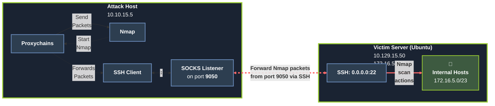

# 🔄 Pivoting, Tunneling, and Port Forwarding  
*Once a foothold is secured within the shadowed network, the true journey begins. Pivoting enables passage through the compromised host to unseen realms, while port forwarding and tunneling cloak the traveler’s path in layers of deception, bending the flow of traffic like an eldritch stream.*

> *“The deeper you delve, the more the paths twist and the darkness thickens.”*

---

<details>
<summary><h1>📢 Introduction</h1></summary>

**Understanding Pivoting in Network Assessments**

During security assessments—such as red team engagements, penetration tests, or Active Directory assessments—a common scenario arises: you possess the necessary credentials (passwords, SSH keys, hashes, tokens) to access a new target, but that host is not directly reachable from your attack machine.

In these situations, you must use a pivot host—a previously compromised system—to route your traffic and reach the next target.

Upon first accessing a host, it is critical to perform immediate reconnaissance. Key checks include:

* **Privilege Level**: What user permissions do you have?
* **Network Connections**: What other systems is this host communicating with?
* **VPN & Remote Access Software**: Is the host acting as a gateway to other networks?

If a host has multiple network adapters, it is a prime candidate for pivoting to different network segments.

<details>
<summary><h2>Pivoting</h2></summary>

Pivoting is the technique of **using a compromised host to gain access to otherwise unreachable networks**, allowing you to discover and engage with new targets on different network segments.

**Common Terminology for a Pivot Host**

A host used for this purpose is often referred to by several names:

* **Pivot Host**
* **Jump Host**
* **Proxy**
* **Foothold**
* **Beach Head System**

Pivoting's primary use is to defeat segmentation (both physically and virtually) to access an isolated network.

**Practical example**

*During one tricky engagement, the target had their network physically and logically separated. This separation made it difficult for us to move around and complete our objectives. We had to search the network and compromise a host that turned out to be the engineering workstation used to maintain and monitor equipment in the operational environment, submit reports, and perform other administrative duties in the enterprise environment. That host turned out to be dual-homed (having more than one physical NIC connected to different networks). Without it having access to both enterprise and operational networks, we would not have been able to pivot as we needed to complete our assessment.*

</details>

<details>
<summary><h2>Tunneling</h2></summary>

Tunneling is a technique used to **encapsulate network traffic within another protocol**. This creates a "tunnel" through a compromised host, allowing you to covertly route traffic and bypass network security controls.

**Common Terminology for Tunneling**

This technique is often described using several related terms:

* **Tunneling**
* **Protocol Tunneling**
* **Traffic Encapsulation**
* **Proxying (in certain contexts)**

Tunneling's primary use is to enable stealthy pivoting. It defeats network segmentation and monitoring by disguising malicious traffic as legitimate, allowed protocol communications (such as HTTP, DNS, or ICMP), making it difficult for defenders to detect.

**Practical example**

*One way we used Tunneling was to craft our traffic to hide in HTTP and HTTPS. This is a common way we maintained Command and Control (C2) of the hosts we had compromised within a network. We masked our instructions inside GET and POST requests that appeared as normal traffic and, to the untrained eye, would look like a web request or response to any old website. If the packet were formed properly, it would be forwarded to our Control server. If it were not, it would be redirected to another website, potentially throwing off the defender checking it out.*

</details>

<details>
<summary><h2>Lateral Movement</h2></summary>

Lateral Movement is the technique adversaries use to **progressively explore, access, and control additional hosts, applications, and services within a network environment after gaining an initial foothold**.

Common Terminology for Lateral Movement
This phase of an attack is often described using several related terms:

* **Lateral Movement**
* **Horizontal Movement**
* **East-West Movement**

The primary purpose of Lateral Movement is to expand access within a network segment. It is used to find specific targets, access critical domain resources, and escalate privileges across multiple systems to achieve the final objective.

**Practical Example**

*During an assessment, we gained initial access to the target environment and were able to gain control of the local administrator account. We performed a network scan and found three more Windows hosts in the network. We attempted to use the same local administrator credentials, and one of those devices shared the same administrator account. We used the credentials to move laterally to that other device, enabling us to compromise the domain further.*

</details>

</details>

---

<details>
<summary><h1>🌐 The Networking Behind Pivoting</h1></summary>

Being able to grasp the concept of pivoting well enough to succeed at it on an engagement requires a solid fundamental understanding of some key networking concepts. This section will be a quick refresher on essential foundational networking concepts to understand pivoting.

<details>
<summary><h2>IP Addressing & Network Interface Controllers (NICs)</h2></summary>

**What is an IP Address?**
Every computer communicating on a network requires an IP address. Without one, a host is effectively not on the network. This address is a software-assigned identifier, typically obtained in one of two ways:

* **Dynamically**: Automatically assigned by a DHCP server.

* **Statically**: Manually configured, which is common for critical network infrastructure and services, such as:
    * Servers
    * Routers
    * Switch Virtual Interfaces
    * Printers

**The Role of the Network Interface Controller (NIC)**

The IP address is assigned to a Network Interface Controller (NIC)—also commonly known as a Network Interface Card or Network Adapter.

A single computer can have multiple NICs (both physical and virtual), each with its own IP address. This allows a host to communicate on multiple, separate networks simultaneously.

**Importance for Pivoting**

Identifying pivoting opportunities is directly dependent on understanding the IP addresses of a compromised host. Additional NICs and their associated networks are primary indicators of other, potentially valuable network segments the host can reach.

**Therefore, one of the first commands to run on a newly compromised host is to check its network configuration:**

<details>
<summary><h3>Windows Example</h3></summary>

```powershell
ipconfig /all
```
```powershell
Windows IP Configuration

Unknown adapter NordLynx:

   Media State . . . . . . . . . . . : Media disconnected
   Connection-specific DNS Suffix  . :

Ethernet adapter Ethernet0 2:

   Connection-specific DNS Suffix  . : .htb
   IPv6 Address. . . . . . . . . . . : dead:beef::1a9
   IPv6 Address. . . . . . . . . . . : dead:beef::f58b:6381:c648:1fb0
   Temporary IPv6 Address. . . . . . : dead:beef::dd0b:7cda:7118:3373
   Link-local IPv6 Address . . . . . : fe80::f58b:6381:c648:1fb0%8
   IPv4 Address. . . . . . . . . . . : 10.129.221.36
   Subnet Mask . . . . . . . . . . . : 255.255.0.0
   Default Gateway . . . . . . . . . : fe80::250:56ff:feb9:df81%8
                                       10.129.0.1

Ethernet adapter Ethernet:

   Media State . . . . . . . . . . . : Media disconnected
   Connection-specific DNS Suffix  . :
```

**Network interfaces (summary)**

| Interface                    |             Address(es) |                      Mask / Prefix | Role / Notes                                                                                                                                                                           |
| ---------------------------- | ----------------------: | ---------------------------------: | -------------------------------------------------------------------------------------------------------------------------------------------------------------------------------------- |
| `NordLynx` (Unknown adapter) |                       — |                                  — | Not connected (media disconnected) — likely a WireGuard/WireGuard-based adapter (NordVPN).                                                                                             |
| `Ethernet0 2`                | IPv4: **10.129.221.36** | Subnet Mask: **255.255.0.0** (/16) | Active interface on HTB lab network (`.htb` DNS suffix). Dual-stack with several IPv6 addresses. Default gateways: IPv6 link-local `fe80::250:56ff:feb9:df81%8` and IPv4 `10.129.0.1`. |
| `Ethernet`                   |                       — |                                  — | Disconnected physical adapter.         

**Key observations & implications**

* The system is on a private IPv4 network (10.129.0.0/16). This is an RFC1918 address space and is reachable only inside the lab network or via VPN/tunnel, not directly from the public Internet.
* The host uses dual-stack: it has both IPv4 and IPv6 addresses. Services or hosts may be reachable over either protocol; testing should consider both when possible.
* The NordLynx adapter is present but disconnected — if it becomes active it may provide an alternative VPN route (different lab or Internet VPN).
* The subnet mask (255.255.0.0) indicates the host shares the 10.129.0.0/16 network with any 10.129.x.x addresses; traffic to other subnets will be sent to the default gateway (10.129.0.1).
* For pivoting or lateral movement: the networks visible from this host are limited to the subnets reachable via its assigned interfaces (and whatever routes the gateway provides). Documenting the IPs, masks and gateway is essential to know what this host can reach.                                                                                                                                                |

</details>

<details>
<summary><h3>Linux & macOS Example</h3></summary>

```bash
ifconfig 
```
```bash
ip addr
```

Example output:
```bash
eth0: flags=4163<UP,BROADCAST,RUNNING,MULTICAST>  mtu 1500
        inet 134.122.100.200  netmask 255.255.240.0  broadcast 134.122.111.255
        inet6 fe80::e973:b08d:7bdf:dc67  prefixlen 64  scopeid 0x20<link>
        ether 12:ed:13:35:68:f5  txqueuelen 1000  (Ethernet)
        RX packets 8844  bytes 803773 (784.9 KiB)
        RX errors 0  dropped 0  overruns 0  frame 0
        TX packets 5698  bytes 9713896 (9.2 MiB)
        TX errors 0  dropped 0 overruns 0  carrier 0  collisions 0

eth1: flags=4163<UP,BROADCAST,RUNNING,MULTICAST>  mtu 1500
        inet 10.106.0.172  netmask 255.255.240.0  broadcast 10.106.15.255
        inet6 fe80::a5bf:1cd4:9bca:b3ae  prefixlen 64  scopeid 0x20<link>
        ether 4e:c7:60:b0:01:8d  txqueuelen 1000  (Ethernet)
        RX packets 15  bytes 1620 (1.5 KiB)
        RX errors 0  dropped 0  overruns 0  frame 0
        TX packets 18  bytes 1858 (1.8 KiB)
        TX errors 0  dropped 0 overruns 0  carrier 0  collisions 0

lo: flags=73<UP,LOOPBACK,RUNNING>  mtu 65536
        inet 127.0.0.1  netmask 255.0.0.0
        inet6 ::1  prefixlen 128  scopeid 0x10<host>
        loop  txqueuelen 1000  (Local Loopback)
        RX packets 19787  bytes 10346966 (9.8 MiB)
        RX errors 0  dropped 0  overruns 0  frame 0
        TX packets 19787  bytes 10346966 (9.8 MiB)
        TX errors 0  dropped 0 overruns 0  carrier 0  collisions 0

tun0: flags=4305<UP,POINTOPOINT,RUNNING,NOARP,MULTICAST>  mtu 1500
        inet 10.10.15.54  netmask 255.255.254.0  destination 10.10.15.54
        inet6 fe80::c85a:5717:5e3a:38de  prefixlen 64  scopeid 0x20<link>
        inet6 dead:beef:2::1034  prefixlen 64  scopeid 0x0<global>
        unspec 00-00-00-00-00-00-00-00-00-00-00-00-00-00-00-00  txqueuelen 500  (UNSPEC)
        RX packets 0  bytes 0 (0.0 B)
        RX errors 0  dropped 0  overruns 0  frame 0
        TX packets 7  bytes 336 (336.0 B)
        TX errors 0  dropped 0 overruns 0  carrier 0  collisions 0
```

**Network interfaces (summary)**

| Interface |                                  Address(es) |    Netmask / Prefix | Role / Notes                                     |
| --------- | -------------------------------------------: | ------------------: | ------------------------------------------------ |
| `eth0`    |                              134.122.100.200 | 255.255.240.0 (/20) | Public IP — host reachable via Internet / DMZ    |
| `eth1`    |                                 10.106.0.172 | 255.255.240.0 (/20) | Private/internal network                         |
| `lo`      |                                    127.0.0.1 |           255.0.0.0 | Local loopback                                   |
| `tun0`    | 10.10.15.54 (IPv4), dead:beef:2::1034 (IPv6) | 255.255.254.0 (/23) | VPN tunnel interface — indicates an active OpenVPN/HTB tunnel. |

**Key observations & implications**

* The presence of `tun0` confirms an active VPN connection. HTB lab access is provided over such a tunnel: without it, lab networks are unreachable.
* `eth0` has a public IP (routable on the Internet). Public-facing interfaces are typically in DMZs and can be reached from outside, subject to firewall rules.
* `eth1` uses a private address (RFC1918) and is routable only inside the local/internal network. Private addresses are not directly reachable from the Internet.
* NAT is typically used at the network edge to translate between private addresses and a public IP on the appliance that connects to the Internet. Devices without a public IP rely on NAT to communicate externally.
* VPNs encrypt traffic and create a logical tunnel over the public network; this enables access to internal lab resources while protecting traffic in transit.

</details>

</details>

<details>
<summary><h2>Routing</h2></summary>

Routing is the process of forwarding packets based on their destination IP. Although people often picture a specialised “router” appliance, **any host can act as a router** if it forwards traffic between interfaces. In pentesting and pivoting you’ll often need a host (pivot) to route traffic into otherwise unreachable networks. Tools like AutoRoute automate adding routes on your attack box so traffic destined for target subnets is forwarded via a pivot host.

```bash
netstat -r
```
```bash
Kernel IP routing table
Destination     Gateway         Genmask         Flags   MSS Window  irtt Iface
default         178.62.64.1     0.0.0.0         UG        0 0          0 eth0
10.10.10.0      10.10.14.1      255.255.254.0   UG        0 0          0 tun0
10.10.14.0      0.0.0.0         255.255.254.0   U         0 0          0 tun0
10.106.0.0      0.0.0.0         255.255.240.0   U         0 0          0 eth1
10.129.0.0      10.10.14.1      255.255.0.0     UG        0 0          0 tun0
178.62.64.0     0.0.0.0         255.255.192.0   U         0 0          0 eth0
```

**Routing table fields**

* **Destination** — network (or default) the route matches.
* **Gateway** — next-hop IP to which packets are forwarded.
* **Genmask** — subnet mask (defines the network size).
* **Flags** — route attributes (e.g. U = up, G = uses gateway).
* **Iface** — interface used to send packets (e.g. eth0, tun0).

**How the system decides where to send a packet**

1. When a packet is created, the OS looks up the destination in the routing table.
2. If a specific route matches, the OS forwards the packet to the route’s Gateway via the listed Iface.
3. If no specific route matches, the packet is sent to the default route (aka default gateway / gateway of last resort).
4. Routes can be learned from:
        * Directly connected interfaces (automatic when an interface is up and has an IP),
        * Static routes configured by an admin,
        * Dynamic routing protocols (OSPF, BGP, etc.) on dedicated routers.

**Pivoting and AutoRoute — practical notes**

* **Pivoting**: to reach a target network from your attack box, the attack box must have a route that forwards traffic to the pivot host which can reach that network.
* **AutoRoute**: common in labs — it installs routes on your attack machine so traffic destined for lab subnets is routed via the pivot automatically.
* **Inspection**: always inspect the host’s routing table to discover which networks are reachable and which additional routes are required for pivoting.

**When to inspect routes during an engagement**

* After gaining code execution on a host (to know what networks that host can reach).
* Before attempting port scans or service connections through a pivot.
* When AutoRoute or proxying fails — confirm the required route exists and points at the pivot.

Short checklist for pivoting

 * *Check routing table on the pivot and on your attack box.*
 * *Confirm the pivot can reach the target network (ping/traceroute from pivot).*
 * *Add a route on your attack box that points to the pivot as next-hop for the target subnet.*
 * *Verify traffic flows (tcpdump / packet captures on pivot or your box).*

</details>

<details>
<summary><h2>Protocols, Services & Ports</h2></summary>

What they are

* **Protocols** — rules that govern how devices communicate over a network (e.g., HTTP, FTP, SSH).
* **Services** — applications that implement protocols (e.g., a web server provides HTTP).
* **Ports** — logical identifiers (numbers) assigned in software to services. Ports are not physical; they let us address an application on a host.

How they relate

* An **IP address** identifies a host on the network.
* An **open port** on that IP identifies a specific application/service we can connect to.
* **Firewalls and network policies** often permit traffic on certain ports (e.g., port 80 for HTTP). Attackers can sometimes abuse those allowed ports to gain a foothold.

Client vs server ports

* The **server** listens on a well-known port (e.g., HTTP → port 80).
* The **client** uses an ephemeral source port to track the connection. Both sides’ ports matter when establishing and maintaining communications.

</details>

</details>

---

<details>
<summary><h1>🔀 Dynamic Port Forwarding with SSH and SOCKS Tunneling</h1></summary>

Port forwarding is a technique that redirects a communication request from one port to another. It typically relies on TCP to maintain interactive communication, but can also use other encapsulation methods — for example, SSH tunnels or SOCKS proxies — to transport the forwarded traffic. This makes it a powerful method for bypassing firewalls and pivoting through compromised hosts to reach internal networks.

<details>
<summary><h3>1. Scanning the Pivot Target</h2></summary>

We have our attack host (10.10.15.x) and a target Ubuntu server (10.129.x.x), which we have compromised. We will scan the target Ubuntu server using Nmap to search for open ports.

```bash
nmap -sT -p22,3306 10.129.202.64
```
```bash
Starting Nmap 7.92 ( https://nmap.org ) at 2022-02-24 12:12 EST
Nmap scan report for 10.129.202.64
Host is up (0.12s latency).

PORT     STATE  SERVICE
22/tcp   open   ssh
3306/tcp closed mysql

Nmap done: 1 IP address (1 host up) scanned in 0.68 seconds
```

Nmap shows the SSH port on the target is open. MySQL is running on the Ubuntu server and listening on localhost:3306, so it is not directly reachable from your machine. There are two practical options:

**Option A** — SSH in and use MySQL locally (direct, interactive)
        1. ssh to the target
        2. Connect with the mysql client on the server

* *When to use:* quick inspection, admin tasks, or when you can run your tooling on the server itself.
* *Pros:* no port forwarding needed; uses native network context.
* *Cons:* some exploit tools or GUI clients run only from your local machine, or require a local TCP connection.

**Option B** — Port-forward MySQL to your localhost (recommended for local tooling)

Why this helps:

* MySQL is hosted locally on the Ubuntu server at 3306 (bound to 127.0.0.1), so it is unreachable directly from your host.
* Port forwarding exposes that local socket on your machine (:1234), letting local tools (exploit frameworks, GUI clients, scripts) connect as if the DB were local.
* Many remote exploit workflows require a direct TCP connection to the service — port forwarding makes that possible without changing the server configuration.

</details>

<details>
<summary><h3>2. Executing the Local Port Forward</h2></summary>

```bash
ssh -L 1234:localhost:3306 ubuntu@10.129.202.64
```
```bash
ubuntu@10.129.202.64's password: 
Welcome to Ubuntu 20.04.3 LTS (GNU/Linux 5.4.0-91-generic x86_64)

 * Documentation:  https://help.ubuntu.com
 * Management:     https://landscape.canonical.com
 * Support:        https://ubuntu.com/advantage

  System information as of Thu 24 Feb 2022 05:23:20 PM UTC

  System load:             0.0
  Usage of /:              28.4% of 13.72GB
  Memory usage:            34%
  Swap usage:              0%
  Processes:               175
  Users logged in:         1
  IPv4 address for ens192: 10.129.202.64
  IPv6 address for ens192: dead:beef::250:56ff:feb9:52eb
  IPv4 address for ens224: 172.16.5.129

 * Super-optimized for small spaces - read how we shrank the memory
   footprint of MicroK8s to make it the smallest full K8s around.

   https://ubuntu.com/blog/microk8s-memory-optimisation

66 updates can be applied immediately.
45 of these updates are standard security updates.
To see these additional updates run: apt list --upgradable
```

By doing this, we should be able to access the MySQL service locally on port 1234.

Similarly, if we want to forward multiple ports from the Ubuntu server to your localhost, you can do so by including the local port:server:port argument to your ssh command.

```bash
ssh -L 1234:localhost:3306 -L 8080:localhost:80 ubuntu@10.129.202.64
```

</details>

<details>
<summary><h3>3. Confirming Port Forward</h2></summary>

**Netstat**

```bash
netstat -antp | grep 1234
```
```bash
(Not all processes could be identified, non-owned process info
 will not be shown, you would have to be root to see it all.)
tcp        0      0 127.0.0.1:1234          0.0.0.0:*               LISTEN      4034/ssh            
tcp6       0      0 ::1:1234                :::*                    LISTEN      4034/ssh  
```

**Nmap**

```bash
nmap -v -sV -p1234 localhost
```
```bash
Starting Nmap 7.92 ( https://nmap.org ) at 2022-02-24 12:18 EST
NSE: Loaded 45 scripts for scanning.
Initiating Ping Scan at 12:18
Scanning localhost (127.0.0.1) [2 ports]
Completed Ping Scan at 12:18, 0.01s elapsed (1 total hosts)
Initiating Connect Scan at 12:18
Scanning localhost (127.0.0.1) [1 port]
Discovered open port 1234/tcp on 127.0.0.1
Completed Connect Scan at 12:18, 0.01s elapsed (1 total ports)
Initiating Service scan at 12:18
Scanning 1 service on localhost (127.0.0.1)
Completed Service scan at 12:18, 0.12s elapsed (1 service on 1 host)
NSE: Script scanning 127.0.0.1.
Initiating NSE at 12:18
Completed NSE at 12:18, 0.01s elapsed
Initiating NSE at 12:18
Completed NSE at 12:18, 0.00s elapsed
Nmap scan report for localhost (127.0.0.1)
Host is up (0.0080s latency).
Other addresses for localhost (not scanned): ::1

PORT     STATE SERVICE VERSION
1234/tcp open  mysql   MySQL 8.0.28-0ubuntu0.20.04.3

Read data files from: /usr/bin/../share/nmap
Service detection performed. Please report any incorrect results at https://nmap.org/submit/ .
Nmap done: 1 IP address (1 host up) scanned in 1.18 seconds
```

</details>

<details>
<summary><h3>4. Setting up to Pivot</h2></summary>

If we type `ifconfig` on the Ubuntu host, you will find that this server has multiple NICs:

* One connected to our attack host (*ens192*)
* One communicating to other hosts within a different network (*ens224*)
* The loopback interface (*lo*).

```bash
ifconfig 
```
```bash
ens192: flags=4163<UP,BROADCAST,RUNNING,MULTICAST>  mtu 1500
        inet 10.129.202.64  netmask 255.255.0.0  broadcast 10.129.255.255
        inet6 dead:beef::250:56ff:feb9:52eb  prefixlen 64  scopeid 0x0<global>
        inet6 fe80::250:56ff:feb9:52eb  prefixlen 64  scopeid 0x20<link>
        ether 00:50:56:b9:52:eb  txqueuelen 1000  (Ethernet)
        RX packets 35571  bytes 177919049 (177.9 MB)
        RX errors 0  dropped 0  overruns 0  frame 0
        TX packets 10452  bytes 1474767 (1.4 MB)
        TX errors 0  dropped 0 overruns 0  carrier 0  collisions 0

ens224: flags=4163<UP,BROADCAST,RUNNING,MULTICAST>  mtu 1500
        inet 172.16.5.129  netmask 255.255.254.0  broadcast 172.16.5.255
        inet6 fe80::250:56ff:feb9:a9aa  prefixlen 64  scopeid 0x20<link>
        ether 00:50:56:b9:a9:aa  txqueuelen 1000  (Ethernet)
        RX packets 8251  bytes 1125190 (1.1 MB)
        RX errors 0  dropped 40  overruns 0  frame 0
        TX packets 1538  bytes 123584 (123.5 KB)
        TX errors 0  dropped 0 overruns 0  carrier 0  collisions 0

lo: flags=73<UP,LOOPBACK,RUNNING>  mtu 65536
        inet 127.0.0.1  netmask 255.0.0.0
        inet6 ::1  prefixlen 128  scopeid 0x10<host>
        loop  txqueuelen 1000  (Local Loopback)
        RX packets 270  bytes 22432 (22.4 KB)
        RX errors 0  dropped 0  overruns 0  frame 0
        TX packets 270  bytes 22432 (22.4 KB)
        TX errors 0  dropped 0 overruns 0  carrier 0  collisions 0
```

When your attack host **has no route** to a target subnet (e.g. `172.16.5.0/23`), but you do have SSH access to a host inside that network (the Ubuntu box), you can pivot your scans and tools through that host using a **SOCKS proxy** created by SSH dynamic port forwarding.

**SOCKS4 vs SOCKS5**

| Feature                  | SOCKS4               | SOCKS5                                     |
| ------------------------ | -------------------- | ------------------------------------------ |
| Authentication           | No                   | Optional (username/password)               |
| TCP support              | Yes                  | Yes                                        |
| UDP support              | No                   | Yes (UDP ASSOCIATE)                        |
| DNS resolution via proxy | No (client resolves) | Yes (can resolve via proxy with `socks5h`) |

> **NOTE:** Use SOCKS5 (`ssh -D` gives SOCKS5) because it supports authentication and UDP, and allows proxy-side DNS resolution when tools request it (use `--socks5-hostname` or `socks5h` where supported).



In the above image, the attack host starts the SSH client and requests the SSH server to allow it to send some TCP data over the ssh socket. The SSH server responds with an acknowledgment, and the SSH client then starts listening on localhost:9050. Whatever data you send here will be broadcasted to the entire network (172.16.5.0/23) over SSH.

<details>
<summary><h3>4.1. Enabling Dynamic Port Forwarding with SSH</h2></summary>

The `-D` argument requests the SSH server to enable dynamic port forwarding. Once we have this enabled, we will require a tool that can route any tool's packets over the port **9050**. We can do this using the tool `proxychains`, which is capable of redirecting TCP connections through TOR, SOCKS, and HTTP/HTTPS proxy servers and also allows us to chain multiple proxy servers together. Using proxychains, we can hide the IP address of the requesting host as well since the receiving host will only see the IP of the pivot host. Proxychains is often used to force an application's **TCP traffic** to go through hosted proxies like **SOCKS4**/**SOCKS5**, **TOR**, or **HTTP**/**HTTPS** proxies.

```bash
ssh -D 9050 ubuntu@10.129.202.64
```

</details>

<details>
<summary><h3>4.2. Checking /etc/proxychains.conf</h2></summary>

To inform proxychains that we must use port 9050, we must modify the proxychains configuration file located at /etc/proxychains.conf. We can add socks4 127.0.0.1 9050 to the last line if it is not already there.

```bash
tail -4 /etc/proxychains.conf
```
```bash
# meanwile
# defaults set to "tor"
socks4 	127.0.0.1 9050
```

</details>

<details>
<summary><h3>4.3. Using Nmap with Proxychains</h2></summary>

Now we want to run nmap through that SOCKS proxy using proxychains so scans originate from the pivot host and can reach an otherwise inaccessible subnet (e.g., `172.16.5.0/23`).

```bash
proxychains nmap -v -sn 172.16.5.1-200
```
```bash
ProxyChains-3.1 (http://proxychains.sf.net)

Starting Nmap 7.92 ( https://nmap.org ) at 2022-02-24 12:30 EST
Initiating Ping Scan at 12:30
Scanning 10 hosts [2 ports/host]
|S-chain|-<>-127.0.0.1:9050-<><>-172.16.5.2:80-<--timeout
|S-chain|-<>-127.0.0.1:9050-<><>-172.16.5.5:80-<><>-OK
|S-chain|-<>-127.0.0.1:9050-<><>-172.16.5.6:80-<--timeout
RTTVAR has grown to over 2.3 seconds, decreasing to 2.0
...
```

* `proxychains` intercepts nmap’s TCP connections and routes them through the SOCKS proxy at `127.0.0.1:9050`.
* That SOCKS proxy forwards the connections over the SSH tunnel to the pivot host, which then performs the network actions from inside the target network.
* From the target network’s perspective, traffic appears to come from the pivot host IP.

*Only full TCP connect scans (`-sT`) and connect-style operations are reliable.*
* proxychains proxies raw TCP streams — it cannot handle partial/raw packets.
* Low-level scans that require raw sockets (e.g., SYN scan `-sS`, many raw ping techniques) will not work correctly through proxychains and will produce false or inconsistent results.

*Host-alive (ping) checks may fail for Windows targets.*
* Windows Defender / host firewalls commonly block ICMP echo requests; a ping scan (`-sn`) may show hosts as down even though TCP ports are open.

*Performance will be slower and higher-latency.*
* All traffic is proxied and serialized through the SSH tunnel, which increases RTT and may affect timing-sensitive scans. Expect longer run times.

*UDP scanning is unreliable (or impossible) over SOCKS in many tools.*
* SOCKS5 supports UDP, but most scanning tools don’t implement UDP-over-SOCKS well. Run UDP scans on the pivot host itself if needed.

</details>

<details>
<summary><h3>4.4. Enumerating the Windows Target through Proxychains</h2></summary>

So, for this module, we will primarily focus on scanning individual hosts, or smaller ranges of hosts we know are alive, which in this case will be a Windows host at `172.16.5.19`.

```bash
proxychains nmap -v -Pn -sT 172.16.5.19
```
```bash
ProxyChains-3.1 (http://proxychains.sf.net)
Host discovery disabled (-Pn). All addresses will be marked 'up' and scan times may be slower.
Starting Nmap 7.92 ( https://nmap.org ) at 2022-02-24 12:33 EST
Initiating Parallel DNS resolution of 1 host. at 12:33
Completed Parallel DNS resolution of 1 host. at 12:33, 0.15s elapsed
Initiating Connect Scan at 12:33
Scanning 172.16.5.19 [1000 ports]
|S-chain|-<>-127.0.0.1:9050-<><>-172.16.5.19:1720-<--timeout
|S-chain|-<>-127.0.0.1:9050-<><>-172.16.5.19-<--timeout
|S-chain|-<>-127.0.0.1:9050-<><>-172.16.5.19:587-<--timeout
|S-chain|-<>-127.0.0.1:9050-<><>-172.16.5.19:445-<><>-OK
Discovered open port 445/tcp on 172.16.5.19
|S-chain|-<>-127.0.0.1:9050-<><>-172.16.5.19:8080-<--timeout
|S-chain|-<>-127.0.0.1:9050-<><>-172.16.5.19:23-<--timeout
|S-chain|-<>-127.0.0.1:9050-<><>-172.16.5.19:135-<><>-OK
Discovered open port 135/tcp on 172.16.5.19
|S-chain|-<>-127.0.0.1:9050-<><>-172.16.5.19:110-<--timeout
|S-chain|-<>-127.0.0.1:9050-<><>-172.16.5.19:21-<--timeout
|S-chain|-<>-127.0.0.1:9050-<><>-172.16.5.19:554-<--timeout
|S-chain|-<>-127.0.0.1:9050-<><>-1172.16.5.19:25-<--timeout
|S-chain|-<>-127.0.0.1:9050-<><>-172.16.5.19:5900-<--timeout
|S-chain|-<>-127.0.0.1:9050-<><>-172.16.5.19:1025-<--timeout
|S-chain|-<>-127.0.0.1:9050-<><>-172.16.5.19:143-<--timeout
|S-chain|-<>-127.0.0.1:9050-<><>-172.16.5.19:199-<--timeout
|S-chain|-<>-127.0.0.1:9050-<><>-172.16.5.19:993-<--timeout
|S-chain|-<>-127.0.0.1:9050-<><>-172.16.5.19:995-<--timeout
|S-chain|-<>-127.0.0.1:9050-<><>-172.16.5.19:3389-<><>-OK
Discovered open port 3389/tcp on 172.16.5.19
|S-chain|-<>-127.0.0.1:9050-<><>-172.16.5.19:443-<--timeout
|S-chain|-<>-127.0.0.1:9050-<><>-172.16.5.19:80-<--timeout
|S-chain|-<>-127.0.0.1:9050-<><>-172.16.5.19:113-<--timeout
|S-chain|-<>-127.0.0.1:9050-<><>-172.16.5.19:8888-<--timeout
|S-chain|-<>-127.0.0.1:9050-<><>-172.16.5.19:139-<><>-OK
Discovered open port 139/tcp on 172.16.5.19
```

The Nmap scan shows several open ports, one of which is RDP port (3389). Similar to the Nmap scan, we can also pivot msfconsole via proxychains to perform vulnerable RDP scans using Metasploit auxiliary modules.

</details>

</details>
<details>
<summary><h3>5. Using Metasploit with Proxychains</h2></summary>

We can also open Metasploit using proxychains and send all associated traffic through the proxy we have established.

```bash
proxychains msfconsole
```
```bash
ProxyChains-3.1 (http://proxychains.sf.net)
...
Press SPACE BAR to continue

       =[ metasploit v6.1.27-dev                          ]
+ -- --=[ 2196 exploits - 1162 auxiliary - 400 post       ]
+ -- --=[ 596 payloads - 45 encoders - 10 nops            ]
+ -- --=[ 9 evasion                                       ]

Metasploit tip: Adapter names can be used for IP params 
set LHOST eth0

msf6 > 
```

**Using rdp_scanner Module**

```bash
msf6 > search rdp_scanner
```
```bash
Matching Modules
================

   #  Name                               Disclosure Date  Rank    Check  Description
   -  ----                               ---------------  ----    -----  -----------
   0  auxiliary/scanner/rdp/rdp_scanner                   normal  No     Identify endpoints speaking the Remote Desktop Protocol (RDP)
```
```bash
msf6 > search rdp_scanner
```
```bash
Matching Modules
================

   #  Name                               Disclosure Date  Rank    Check  Description
   -  ----                               ---------------  ----    -----  -----------
   0  auxiliary/scanner/rdp/rdp_scanner                   normal  No     Identify endpoints speaking the Remote Desktop Protocol (RDP)
```
```bash
msf6 > use 0
msf6 auxiliary(scanner/rdp/rdp_scanner) > set rhosts 172.16.5.19
msf6 auxiliary(scanner/rdp/rdp_scanner) > run
```
```bash
|S-chain|-<>-127.0.0.1:9050-<><>-172.16.5.19:3389-<><>-OK
|S-chain|-<>-127.0.0.1:9050-<><>-172.16.5.19:3389-<><>-OK
|S-chain|-<>-127.0.0.1:9050-<><>-172.16.5.19:3389-<><>-OK

[*] 172.16.5.19:3389      - Detected RDP on 172.16.5.19:3389      (name:DC01) (domain:DC01) (domain_fqdn:DC01) (server_fqdn:DC01) (os_version:10.0.17763) (Requires NLA: No)
[*] 172.16.5.19:3389      - Scanned 1 of 1 hosts (100% complete)
[*] Auxiliary module execution completed
```

At the bottom of the output above, we can see the RDP port open with the Windows OS version.

Depending on the level of access we have to this host during an assessment, we may try to run an exploit or log in using gathered credentials. For this module, we will log in to the Windows remote host over the SOCKS tunnel. This can be done using `xfreerdp`. The user in our case is `victor`, and the password is `pass@123`

**Using rdp_scanner Module**

```bash
proxychains xfreerdp /v:172.16.5.19 /u:victor /p:pass@123
```
```bash
ProxyChains-3.1 (http://proxychains.sf.net)
[13:02:42:481] [4829:4830] [INFO][com.freerdp.core] - freerdp_connect:freerdp_set_last_error_ex resetting error state
[13:02:42:482] [4829:4830] [INFO][com.freerdp.client.common.cmdline] - loading channelEx rdpdr
[13:02:42:482] [4829:4830] [INFO][com.freerdp.client.common.cmdline] - loading channelEx rdpsnd
[13:02:42:482] [4829:4830] [INFO][com.freerdp.client.common.cmdline] - loading channelEx cliprdr
```

The `xfreerdp` command will require an RDP certificate to be accepted before successfully establishing the session. After accepting it, we should have an RDP session, pivoting via the Ubuntu server.

</details>

</details>