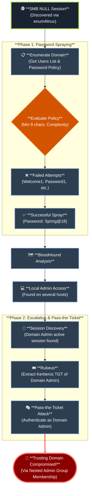
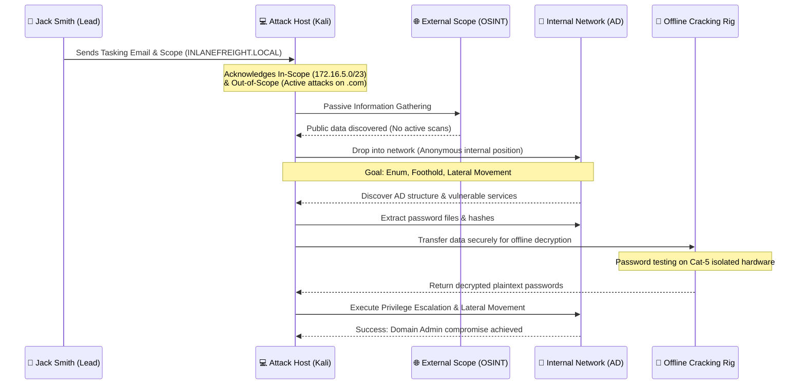
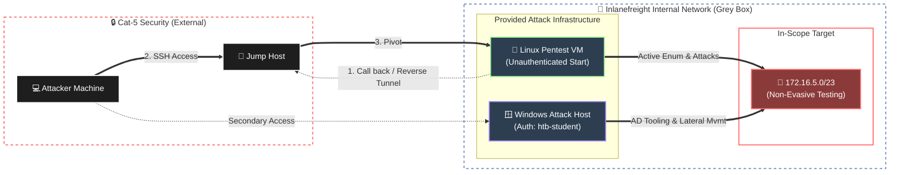
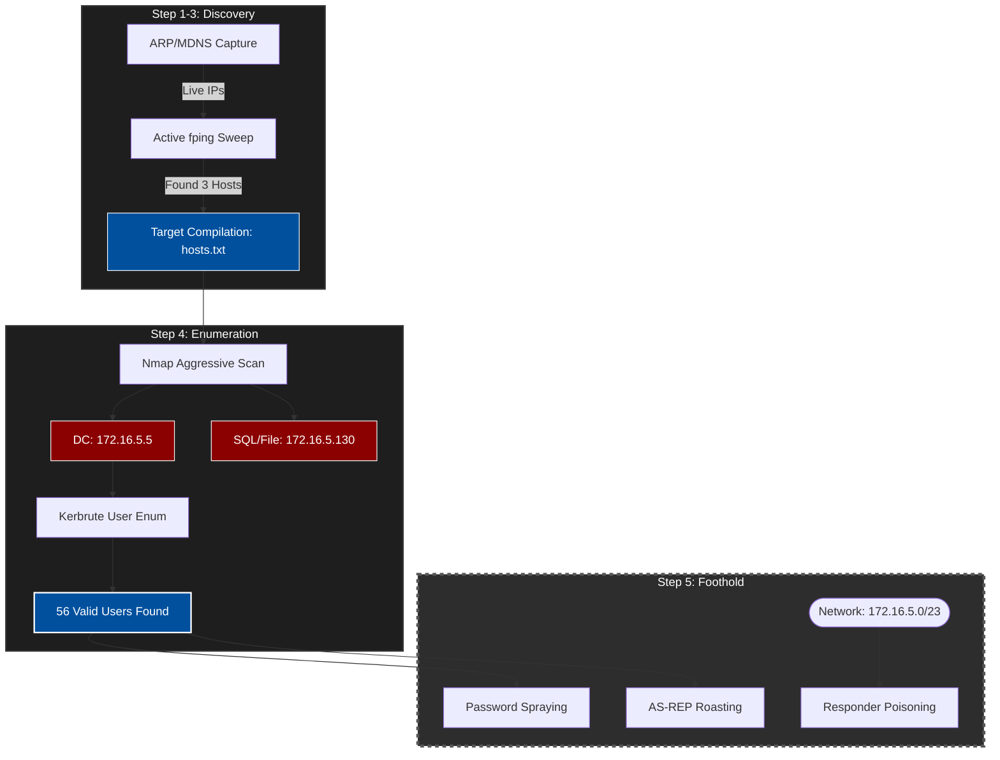

# 🏢 Active Directory Enumeration & Attacks

_Active Directory stands as the citadel of enterprise identity and access management, a sprawling domain ripe with complexity and hidden weaknesses. To navigate its labyrinth and exploit its secrets is to command the very keys of the corporate realm._

> _“In the heart of the domain lies power—and peril for those who wield it unwisely.”_

---

<details>
<summary><h1>📢 Introduction</h1></summary>

<details>
<summary><h2>Active Directory Explained</h2></summary>

Active Directory (AD) is a directory service for Windows enterprise environments that was officially implemented in 2000 with the release of Windows Server 2000 and has been incrementally improved upon with the release of each subsequent server OS since.

AD is based on the protocols **x.500** and **LDAP** that came before it and still utilizes these protocols in some form today.

It is a distributed, hierarchical structure that allows for centralized management of an organization’s resources, including:

- Users
- Computers
- Groups
- Network devices and file shares
- Group policies
- Devices and trusts

Ultimately, AD provides **authentication**, **accounting**, and **authorization** functions within a Windows enterprise environment.

</details>

<details>
<summary><h2>Why Should We Care About AD?
</h2></summary>

At the time of writing this module, Microsoft Active Directory holds around **43% of the market share** for enterprise organizations utilizing Identity and Access Management solutions. This is a huge portion of the market, and it isn't likely to go anywhere any time soon since Microsoft is improving and blending implementations with Azure AD.

Another interesting stat to consider is that just in the last two years, Microsoft has had over **2,000 reported vulnerabilities** tied to a CVE. AD's many services and its main purpose of making information easy to find and access make it a bit of a behemoth to manage and correctly harden. This exposes enterprises to vulnerabilities and exploitation from simple misconfigurations of services and permissions.

Tie these misconfigurations and ease of access with common user and OS vulnerabilities, and you have a perfect storm for an attacker to take advantage of.

<details>
<summary><h3>Enumeration and Attack Techniques
</h3></summary>

With all of this in mind, this module will explore some of these common issues and show us how to identify, enumerate, and take advantage of their existence. We will practice enumerating AD utilizing native tools and languages such as:

- Sysinternals
- WMI
- DNS

Some attacks we will also practice include:

- Password spraying
- Kerberoasting
- Utilizing tools such as Responder, Kerbrute, Bloodhound, and much more.

</details>

<details>
<summary><h3>Assessment Goals & Privilege Escalation
</h3></summary>

We may often find ourselves in a network with no clear path to a foothold through a remote exploit such as a vulnerable application or service. Yet, we are within an Active Directory environment, which can lead to a foothold in many ways.

The general goal of gaining a foothold in a client's AD environment is to **escalate privileges** by moving laterally or vertically throughout the network until we accomplish the intent of the assessment. The goal can vary from client to client. It may be:

- Accessing a specific host.
- Accessing a user's email inbox or a database.
- Complete domain compromise, looking for every possible path to Domain Admin-level access within the testing period.

</details>

<details>
<summary><h3>The "Living Off the Land" Imperative
</h3></summary>

Many open-source tools are available to facilitate enumerating and attacking Active Directory. To be most effective, we must understand how to perform as much of this enumeration manually as possible. More importantly, we need to understand the "why" behind certain flaws and misconfigurations. This makes us more effective attackers and equips us to give sound recommendations and clear, actionable remediation advice to our clients.

We need to be comfortable enumerating and attacking AD from both Windows and Linux, with a limited toolset or built-in Windows tools, also known as **"living off the land."** It is common to run into situations where our tools fail, are being blocked, or we are conducting an assessment where the client has us work from a managed workstation or VDI instance instead of the customized Linux or Windows attack host we may have grown accustomed to. To be effective in all situations, we must be able to adapt quickly on the fly, understand the many nuances of AD, and know how to access them even when severely limited in our options.

</details>

</details>

<details>
<summary><h2>Real-World Examples
</h2></summary>

**Scenario 1 - Waiting On An Admin**

> During this engagement, I compromised a single host and gained **SYSTEM** level access. Because this was a domain-joined host, I was able to use this access to enumerate the domain. I went through all of the standard enumeration, but did not find much. There were **Service Principal Names (SPNs)** present within the environment, and I was able to perform a Kerberoasting attack and retrieve TGS tickets for a few accounts. I attempted to crack these with Hashcat and some of my standard wordlists and rules, but was unsuccessful at first. I ended up leaving a cracking job running overnight with a very large wordlist combined with the [`d3ad0ne`](https://github.com/hashcat/hashcat/blob/master/rules/d3ad0ne.rule) rule that ships with Hashcat. The next morning I had a hit on one ticket and retrieved the cleartext password for a user account. This account did not give me significant access, but it did give me write access on certain file shares. I used this access to drop SCF files around the shares and left Responder going. After a while, I got a single hit, the **NetNTLMv2** hash of a user. I checked through the BloodHound output and noticed that this user was actually a domain admin! Easy day from here.


```mermaid
flowchart TD
    %% Phase 1: Initial Access & Enumeration
    A["💻 **Initial Host Compromise**<br/>(SYSTEM Access)"] --> B["🔍 **Domain Enumeration**"]
    B --> C{"**Quick Wins Found?**"}
    C -- No --> D["🎯 **Discover SPNs**<br/>(Service Principal Names)"]

    %% Phase 2: Credential Access (Kerberoasting)
    subgraph Kerberoasting ["**Phase 1: Kerberoasting Attack**"]
        direction TB
        D --> E["🎟️ **Request TGS Tickets**"]
        E --> F["💥 **Hashcat (Initial)**<br/>Standard wordlists: Failed"]
        F --> G["🌙 **Hashcat (Overnight)**<br/>Large Wordlist + d3ad0ne"]
        G --> H["🔓 **Password Cracked!**<br/>(Cleartext User Credentials)"]
    end

    %% Phase 3: Lateral Movement Preparation
    H --> I["👤 **Enumerate New User Permissions**"]
    I --> J["📂 **Discover Write Access**<br/>(On specific File Shares)"]

    %% Phase 4: Forced Authentication
    subgraph Forced_Auth ["**Phase 2: Forced Authentication**"]
        direction TB
        J --> K["📝 **Drop Malicious SCF Files**<br/>(Across vulnerable shares)"]
        K --> L["🎧 **Run Responder**<br/>(Listening for connections)"]
        L --> M["🎣 **Capture NetNTLMv2 Hash**<br/>(From user accessing the share)"]
    end

    %% Phase 5: Privilege Escalation
    M --> N["🗺️ **BloodHound Analysis**"]
    N -->|"Hash belongs to..."| O(["👑 **Domain Admin Compromised!**<br/>(Full Domain Control)"])

    %% Styling
    style A fill:#1a2332,stroke:#9ACD32,stroke-width:3px,color:#fff
    style O fill:#8b0000,stroke:#ff6b6b,stroke-width:4px,color:#fff
    style C fill:#d35400,stroke:#e67e22,stroke-width:2px,color:#fff

    classDef defaultNode fill:#2d3e50,stroke:#6c8ebf,stroke-width:2px,color:#fff;
    class B,D,E,F,G,H,I,J,K,L,M,N defaultNode;

    %% Link Styling
    linkStyle 12 stroke:#ff6b6b,stroke-width:3px
```

**Scenario 2 - Spraying The Night Away**

> Password spraying can be an extremely effective way to gain a foothold in a domain, but we must exercise great care not to lock out user accounts in the process. On one engagement, I found an SMB NULL session using the [`enum4linux`](https://github.com/CiscoCXSecurity/enum4linux) tool and retrieved both a listing of **all** users from the domain, and the domain password policy. Knowing the **password policy** was crucial because I could ensure that I was staying within the parameters to not lock out any accounts and also knew that the policy was a minimum eight-character password and password complexity was enforced (meaning that a user's password required 3/4 of special character, number, uppercase, or lower case number, i.e., Welcome1). I tried several common weak passwords such as Welcome1, Password1, Password123, Spring2018, etc. but did not get any hits. Finally, I made an attempt with Spring@18 and got a hit! Using this account, I ran BloodHound and found several hosts where this user had local admin access. I noticed that a domain admin account had an active session on one of these hosts. I was able to use the Rubeus tool and extract the Kerberos TGT ticket for this domain user. From there, I was able to perform a **pass-the-ticket** attack and authenticate as this domain admin user. As a bonus, I was able to take over the trusting domain as well because the Domain Administrators group for the domain that I took over was a part of the Administrators group in the trusting domain via nested group membership, meaning I could use the same set of credentials to authenticate to the other domain with full administrative level access.


```mermaid
flowchart TD
    %% Phase 1: Reconnaissance
    A["🕵️ **SMB NULL Session**<br/>(Discovered via enum4linux)"] --> B["📋 **Enumerate Domain**<br/>(Got Users List & Password Policy)"]

    %% Phase 2: Initial Access (Password Spraying)
    subgraph Spraying ["**Phase 1: Password Spraying**"]
        direction TB
        B --> C{"**Evaluate Policy**<br/>(Min 8 chars, Complexity)"}
        C --> D["❌ **Failed Attempts**<br/>(Welcome1, Password1, etc.)"]
        D --> E["✅ **Successful Spray!**<br/>(Password: Spring@18)"]
    end

    %% Phase 3: Internal Recon & Lateral Movement
    E --> F["🗺️ **BloodHound Analysis**"]
    F --> G["💻 **Local Admin Access**<br/>(Found on several hosts)"]
    G --> H["👀 **Session Discovery**<br/>(Domain Admin active session found)"]

    %% Phase 4: Credential Theft & Escalation
    subgraph Privilege_Escalation ["**Phase 2: Escalation & Pass-the-Ticket**"]
        direction TB
        H --> I["🎟️ **Rubeus**<br/>(Extract Kerberos TGT of Domain Admin)"]
        I --> J["🎭 **Pass-the-Ticket Attack**<br/>(Authenticate as Domain Admin)"]
    end

    %% Phase 5: Cross-Domain Compromise
    J --> K(["👑 **Trusting Domain Compromised!**<br/>(Via Nested Admin Group Membership)"])

    %% Styling
    style A fill:#1a2332,stroke:#9ACD32,stroke-width:3px,color:#fff
    style K fill:#8b0000,stroke:#ff6b6b,stroke-width:4px,color:#fff
    style C fill:#d35400,stroke:#e67e22,stroke-width:2px,color:#fff

    classDef defaultNode fill:#2d3e50,stroke:#6c8ebf,stroke-width:2px,color:#fff;
    class B,D,E,F,G,H,I,J defaultNode;

    %% Link Styling - Highlight the final takeover path
    linkStyle 9 stroke:#ff6b6b,stroke-width:4px
```

**Scenario 3 - Fighting In The Dark**

> I had tried all of my standard ways to obtain a foothold on this third engagement, and nothing had worked. I decided that I would use the [`Kerbrute`](https://github.com/ropnop/kerbrute) tool to attempt to enumerate valid usernames and then, if I found any, attempt a targeted password spraying attack since I did not know the password policy and didn't want to lock any accounts out. I used the [`linkedin2username`](https://github.com/initstring/linkedin2username) tool to first mashup potential usernames from the company's LinkedIn page. I combined this list with several username lists from the [`statistically-likely-usernames`](https://github.com/insidetrust/statistically-likely-usernames) GitHub repo and, after using the **userenum** feature of Kerbrute, ended up with 516 valid users. I knew I had to tread carefully with password spraying, so I tried with the password **Welcome2021** and got a single hit! Using this account, I ran the Python version of BloodHound from my attack host and found that all domain users had RDP access to a single box. I logged into this host and used the PowerShell tool DomainPasswordSpray to spray again. I was more confident this time around because I could a) view the password policy and b) the [`DomainPasswordSpray`](https://github.com/dafthack/DomainPasswordSpray) tool will remove accounts close to lockout from the target list. Being that I was authenticated within the domain, I could now spray with all domain users, which gave me significantly more targets. I tried again with the common password Fall2021 and got several hits, all for users not in my initial wordlist. I checked the rights for each of these accounts and found that one was in the Help Desk group, which had [`GenericAll`](https://bloodhound.readthedocs.io/en/latest/data-analysis/edges.html#genericall) rights over the Enterprise Key Admins group. The **[Enterprise Key Admins](https://docs.microsoft.com/en-us/windows/security/identity-protection/access-control/active-directory-security-groups#enterprise-key-admins)** group had GenericAll privileges over a domain controller, so I added the account I controlled to this group, authenticated again, and inherited these privileges. Using these rights, I performed the **[Shadow Credentials](https://posts.specterops.io/shadow-credentials-abusing-key-trust-account-mapping-for-takeover-8ee1a53566ab)** attack and retrieved the NT hash for the domain controller machine account. With this NT hash, I was then able to perform a DCSync attack and retrieve the NTLM password hashes for all users in the domain because a domain controller can perform replication, which is required for DCSync.


```mermaid
flowchart TD
    %% Phase 1: OSINT & Enumeration
    A["🌐 **OSINT & Wordlist Creation**<br/>(linkedin2username + GitHub lists)"] --> B["🕵️ **Kerbrute Userenum**<br/>(Found 516 valid users)"]

    %% Phase 2: External Initial Access
    subgraph External_Spray ["**Phase 1: External Spraying**"]
        direction TB
        B --> C["💦 **Targeted Password Spray**<br/>(Password: Welcome2021)"]
        C --> D["✅ **Initial Foothold!**<br/>(Single account compromised)"]
    end

    %% Phase 3: Internal Recon & Lateral Movement
    D --> E["🗺️ **BloodHound (Python)**"]
    E --> F["🖥️ **RDP Access Discovered**<br/>(All users have access to a single box)"]
    F --> G["🚪 **Log into Internal Host via RDP**"]

    %% Phase 4: Internal Spraying
    subgraph Internal_Spray ["**Phase 2: Internal Spraying**"]
        direction TB
        G --> H["🛡️ **DomainPasswordSpray (PowerShell)**<br/>(Read policy, avoid lockouts)"]
        H --> I["💦 **Internal Password Spray**<br/>(Password: Fall2021)"]
        I --> J["🎯 **Multiple Hits!**<br/>(New user accounts compromised)"]
    end

    %% Phase 5: Privilege Escalation Path
    J --> K["🔍 **Check Account Rights**"]
    K --> L["🛠️ **Help Desk Group Member**<br/>(Has GenericAll over Key Admins)"]
    L --> M["🔑 **Enterprise Key Admins**<br/>(Has GenericAll over Domain Controller)"]
    M --> N["➕ **Add Controlled Account to Key Admins**"]

    %% Phase 6: Full Compromise
    subgraph Domain_Takeover ["**Phase 3: Domain Takeover**"]
        direction TB
        N --> O["👤 **Shadow Credentials Attack**<br/>(Retrieve DC Machine NT Hash)"]
        O --> P(["👑 **DCSync Attack!**<br/>(All Domain NTLM Hashes Retrieved)"])
    end

    %% Styling
    style A fill:#1a2332,stroke:#9ACD32,stroke-width:3px,color:#fff
    style P fill:#8b0000,stroke:#ff6b6b,stroke-width:4px,color:#fff
    style D fill:#d35400,stroke:#e67e22,stroke-width:2px,color:#fff
    style J fill:#d35400,stroke:#e67e22,stroke-width:2px,color:#fff

    classDef defaultNode fill:#2d3e50,stroke:#6c8ebf,stroke-width:2px,color:#fff;
    class B,C,E,F,G,H,I,K,L,M,N,O defaultNode;

    %% Link Styling - Highlight the final takeover path
    linkStyle 14 stroke:#ff6b6b,stroke-width:4px
```

These scenarios may seem overwhelming with many foreign concepts right now, but after completing this module, you will be familiar with most of them (some concepts described in these scenarios are outside the scope of this module).

These scenarios show the importance of:

- **Iterative enumeration**
- **Understanding our target**
- **Adapting and thinking outside the box** as we work our way through an environment.

We will perform many of the parts of the attack chains described above in these module sections, and then you'll get to put your skills to the test by attacking two different AD environments at the end of this module and discovering your own attack chains.

Strap in because this will be a fun, but bumpy, ride through the wild world that is **enumerating** and **attacking** Active Directory.

</details>

</details>

---

<details>
<summary><h1>🧰 Tools of the Trade</h1></summary>

Here is a listing of many of the tools that we will cover in this module:

- **[PowerView](https://github.com/PowerShellMafia/PowerSploit/blob/master/Recon/PowerView.ps1) / [SharpView](https://github.com/dmchell/SharpView)**

  A PowerShell tool and a .NET port of the same used to gain situational awareness in AD. These tools can be used as replacements for various Windows `net*` commands and more. PowerView and SharpView can help us gather much of the data that BloodHound does, but it requires more work to make meaningful relationships among all of the data points. These tools are great for checking what additional access we may have with a new set of credentials, targeting specific users or computers, or finding some "quick wins" such as users that can be attacked via Kerberoasting or ASREPRoasting.

- **[BloodHound](https://github.com/SpecterOps/BloodHound-Legacy)**

  Used to visually map out AD relationships and help plan attack paths that may otherwise go unnoticed. Uses the SharpHound PowerShell or C# ingestor to gather data to later be imported into the BloodHound JavaScript (Electron) application with a Neo4j database for graphical analysis of the AD environment.

- **[SharpHound](https://github.com/SpecterOps/BloodHound-Legacy/tree/master/Collectors)**

  The C# data collector to gather information from Active Directory about varying AD objects such as users, groups, computers, ACLs, GPOs, user and computer attributes, user sessions, and more. The tool produces JSON files which can then be ingested into the BloodHound GUI tool for analysis.

- **[BloodHound.py](https://github.com/dirkjanm/BloodHound.py)**

  A Python-based BloodHound ingestor based on the Impacket toolkit. It supports most BloodHound collection methods and can be run from a non-domain joined attack host. The output can be ingested into the BloodHound GUI for analysis.

- **[Kerbrute](https://github.com/ropnop/kerbrute)**

  A tool written in Go that uses Kerberos Pre-Authentication to enumerate Active Directory accounts, perform password spraying, and brute-forcing.

- **[Impacket toolkit](https://github.com/fortra/impacket)**

  A collection of tools written in Python for interacting with network protocols. The suite of tools contains various scripts for enumerating and attacking Active Directory.

- **[Responder](https://github.com/lgandx/Responder)**

  Responder is a purpose-built tool to poison LLMNR, NBT-NS, and MDNS, with many different functions.

- **[Inveigh.ps1](https://github.com/Kevin-Robertson/Inveigh/blob/master/Inveigh.ps1)**

  Similar to Responder, a PowerShell tool for performing various network spoofing and poisoning attacks.

- **[C# Inveigh (InveighZero)](https://github.com/Kevin-Robertson/Inveigh/tree/master/Inveigh)**

  The C# version of Inveigh with a semi-interactive console for interacting with captured data such as username and password hashes.

- **[rpcinfo](https://learn.microsoft.com/en-us/windows-server/administration/windows-commands/rpcinfo)**

  The rpcinfo utility is used to query the status of an RPC program or enumerate the list of available RPC services on a remote host. The "-p" option is used to specify the target host. For example, the command `rpcinfo -p 10.0.0.1` will return a list of all the RPC services available on the remote host, along with their program number, version number, and protocol. Note that this command must be run with sufficient privileges.

- **[rpcclient](https://www.samba.org/samba/docs/current/man-html/rpcclient.1.html)**

  A part of the Samba suite on Linux distributions that can be used to perform a variety of Active Directory enumeration tasks via the remote RPC service.

- **[CrackMapExec (CME)](https://github.com/byt3bl33d3r/CrackMapExec)**

  CME is an enumeration, attack, and post-exploitation toolkit which can help us greatly in enumeration and performing attacks with the data we gather. CME attempts to "live off the land" and abuse built-in AD features and protocols like SMB, WMI, WinRM, and MSSQL.

- **[Rubeus](https://github.com/GhostPack/Rubeus)**

  Rubeus is a C# tool built for Kerberos Abuse.

- **[GetUserSPNs.py](https://github.com/fortra/impacket/blob/master/examples/GetUserSPNs.py)**

  Another Impacket module geared towards finding Service Principal names tied to normal users.

- **[Hashcat](https://hashcat.net/hashcat/)**

  A great hash cracking and password recovery tool.

- **[enum4linux](https://github.com/CiscoCXSecurity/enum4linux)**

  A tool for enumerating information from Windows and Samba systems.

- **[enum4linux-ng](https://github.com/cddmp/enum4linux-ng)**

  A rework of the original Enum4linux tool that works a bit differently.

- **[ldapsearch](https://linux.die.net/man/1/ldapsearch)**

  Built-in interface for interacting with the LDAP protocol.

- **[windapsearch](https://github.com/ropnop/windapsearch)**

  A Python script used to enumerate AD users, groups, and computers using LDAP queries. Useful for automating custom LDAP queries.

- **[DomainPasswordSpray.ps1](https://github.com/dafthack/DomainPasswordSpray)**

  DomainPasswordSpray is a tool written in PowerShell to perform a password spray attack against users of a domain.

- **[LAPSToolkit](https://github.com/leoloobeek/LAPSToolkit)**

  The toolkit includes functions written in PowerShell that leverage PowerView to audit and attack Active Directory environments that have deployed Microsoft's Local Administrator Password Solution (LAPS).

- **[smbmap](https://github.com/ShawnDEvans/smbmap)**

  SMB share enumeration across a domain.

- **[psexec.py](https://github.com/fortra/impacket/blob/master/examples/psexec.py)**

  Part of the Impacket toolkit, it provides us with Psexec-like functionality in the form of a semi-interactive shell.

- **[wmiexec.py](https://github.com/fortra/impacket/blob/master/examples/wmiexec.py)**

  Part of the Impacket toolkit, it provides the capability of command execution over WMI.

- **[Snaffler](https://github.com/SnaffCon/Snaffler)**

  Useful for finding information (such as credentials) in Active Directory on computers with accessible file shares.

- **[smbserver.py](https://github.com/fortra/impacket/blob/master/examples/smbserver.py)**

  Simple SMB server execution for interaction with Windows hosts. Easy way to transfer files within a network.

- **[setspn.exe](<https://learn.microsoft.com/en-us/previous-versions/windows/it-pro/windows-server-2012-r2-and-2012/cc731241(v=ws.11)>)**

  Adds, reads, modifies and deletes the Service Principal Names (SPN) directory property for an Active Directory service account.

- **[Mimikatz](https://github.com/ParrotSec/mimikatz)**

  Performs many functions. Notably, pass-the-hash attacks, extracting plaintext passwords, and Kerberos ticket extraction from memory on a host.

- **[secretsdump.py](https://github.com/fortra/impacket/blob/master/examples/secretsdump.py)**

  Remotely dump SAM and LSA secrets from a host.

- **[evil-winrm](https://github.com/Hackplayers/evil-winrm)**

  Provides us with an interactive shell on a host over the WinRM protocol.

- **[mssqlclient.py](https://github.com/fortra/impacket/blob/master/examples/mssqlclient.py)**

  Part of the Impacket toolkit, it provides the ability to interact with MSSQL databases.

- **[noPac.py](https://github.com/Ridter/noPac)**

  Exploit combo using CVE-2021-42278 and CVE-2021-42287 to impersonate DA from standard domain user.

- **[rpcdump.py](https://github.com/fortra/impacket/blob/master/examples/rpcdump.py)**

  Part of the Impacket toolset, RPC endpoint mapper.

- **[CVE-2021-1675.py](https://github.com/cube0x0/CVE-2021-1675/blob/main/CVE-2021-1675.py)**

  Printnightmare PoC in python.

- **[ntlmrelayx.py](https://github.com/fortra/impacket/blob/master/examples/ntlmrelayx.py)**

  Part of the Impacket toolset, it performs SMB relay attacks.

- **[PetitPotam.py](https://github.com/topotam/PetitPotam)**

  PoC tool for CVE-2021-36942 to coerce Windows hosts to authenticate to other machines via MS-EFSRPC EfsRpcOpenFileRaw or other functions.

- **[gettgtpkinit.py](https://github.com/dirkjanm/PKINITtools/blob/master/gettgtpkinit.py)**

  Tool for manipulating certificates and TGTs.

- **[getnthash.py](https://github.com/dirkjanm/PKINITtools/blob/master/getnthash.py)**

  This tool will use an existing TGT to request a PAC for the current user using U2U.

- **[adidnsdump](https://github.com/dirkjanm/adidnsdump)**

  A tool for enumerating and dumping DNS records from a domain. Similar to performing a DNS Zone transfer.

- **[gpp-decrypt](https://github.com/t0thkr1s/gpp-decrypt)**

  Extracts usernames and passwords from Group Policy preferences files.

- **[GetNPUsers.py](https://github.com/fortra/impacket/blob/master/examples/GetNPUsers.py)**

  Part of the Impacket toolkit. Used to perform the ASREPRoasting attack to list and obtain AS-REP hashes for users with the 'Do not require Kerberos preauthentication' set. These hashes are then fed into a tool such as Hashcat for attempts at offline password cracking.

- **[lookupsid.py](https://github.com/fortra/impacket/blob/master/examples/lookupsid.py)**

  SID bruteforcing tool.

- **[ticketer.py](https://github.com/fortra/impacket/blob/master/examples/ticketer.py)**

  A tool for creation and customization of TGT/TGS tickets. It can be used for Golden Ticket creation, child to parent trust attacks, etc.

- **[raiseChild.py](https://github.com/fortra/impacket/blob/master/examples/raiseChild.py)**

  Part of the Impacket toolkit, It is a tool for automated child to parent domain privilege escalation.

- **[Active Directory Explorer](https://learn.microsoft.com/en-us/sysinternals/downloads/adexplorer)**

  Active Directory Explorer (AD Explorer) is an AD viewer and editor. It can be used to navigate an AD database and view object properties and attributes. It can also be used to save a snapshot of an AD database for offline analysis. When an AD snapshot is loaded, it can be explored as a live version of the database. It can also be used to compare two AD database snapshots to see changes in objects, attributes, and security permissions.

- **[PingCastle](https://www.pingcastle.com/documentation/)**

  Used for auditing the security level of an AD environment based on a risk assessment and maturity framework (based on CMMI adapted to AD security).

- **[Group3r](https://github.com/Group3r/Group3r)**

  Group3r is useful for auditing and finding security misconfigurations in AD Group Policy Objects (GPO).

- **[ADRecon](https://github.com/adrecon/ADRecon)**

  A tool used to extract various data from a target AD environment. The data can be output in Microsoft Excel format with summary views and analysis to assist with analysis and paint a picture of the environment's overall security state.

</details>

---


<details>
<summary><h1>🎬 Scenario</h1></summary>

We are Penetration Testers working for CAT-5 Security. After a few successful engagements shadowing with the team, the more senior members want to see how well we can do starting an assessment on our own. The team lead sent us the following email detailing what we need to accomplish.

<details>
<summary><h2>Tasking Email</h2></summary>

> **Subject: Enumeration and Attacks against client Inlanefreight**
> 
> **From:** Jack Smith
> **Date:** Mon 2/7/2022 3:27 PM
> **To:** Pentesting Interns
> 
> ---
> 
> Testers,
> 
> You are being tasked with performing the following actions for the upcoming assessment against Inlanefreight:
> 
> * Initial recon and enumeration of the domain "INLANEFREIGHT.LOCAL"
> * Credential discovery from open sources and network enumeration
> * Lateral Movement and follow-on enumeration of internal services and hosts.
> * Privilege Escalation ( Customer wishes to see if we can escalate privileges from no user to a basic user to an administrator )
> * and If possible, acquire Domain Admin credentials and access to the domain
> 
> Your findings will drive further actions against the Inlanefreight network for this assessment, so please take care to completely enumerate the domain, and find users, hosts, and credentials that can be used for further attack paths. The Scoping document and rules of engagement will follow soon.
> 
> R/S  
> J. Smith CISSP.  
> Red Team Lead  
> Cat5 Security LLC.  
> 
> *"The best leader is one who helps his people so that eventually they wont need him."*

</details>

<details>
<summary><h2>Module Assessment: The Inlanefreight Engagement</h2></summary>

This module will allow us to practice our skills (both prior and newly minted) with these tasks. The final assessment for this module is the execution of **two internal penetration tests** against the company Inlanefreight. 

During these assessments, we will work through:

* **Scenario 1:** An internal penetration test simulating starting from an external breach position.
* **Scenario 2:** An internal penetration test beginning with an attack box inside the internal network, as clients often request.

**Objectives and Skill Demonstration**

Completing the skills assessments signifies the successful completion of the tasks mentioned in the scoping document and tasking email above. In doing so, we will demonstrate:
* A firm grasp of many automated and manual AD attack and enumeration concepts.
* Knowledge of and experience with a wide array of tools.
* The ability to interpret data gathered from an AD environment to make critical decisions to advance the assessment.

**Core Focus**

The content in this module is meant to cover core enumeration concepts necessary for anyone to be successful in performing internal penetration tests in Active Directory environments. We will also cover many of the most common attack techniques in great depth while working through some more advanced concepts as a primer for AD-focused material that will be covered in more advanced modules.

</details>

<details>
<summary><h2>Assessment Scope</h2></summary>

The following IPs, hosts, and domains defined below make up the scope of the assessment.

**In Scope For Assessment**

| Range / Domain | Description |
| :--- | :--- |
| **INLANEFREIGHT.LOCAL** | Customer domain to include AD and web services. |
| **LOGISTICS.INLANEFREIGHT.LOCAL** | Customer subdomain. |
| **FREIGHTLOGISTICS.LOCAL** | Subsidiary company owned by Inlanefreight. External forest trust with `INLANEFREIGHT.LOCAL`. |
| **172.16.5.0/23** | In-scope internal subnet. |


**Out Of Scope**

* Any other subdomains of `INLANEFREIGHT.LOCAL`
* Any subdomains of `FREIGHTLOGISTICS.LOCAL`
* Any phishing or social engineering attacks
* Any other IPs/domains/subdomains not explicitly mentioned
* Any types of attacks against the real-world `inlanefreight.com` website outside of passive enumeration shown in this module.

</details>

<details>
<summary><h2>🔬 Methods Used</h2></summary>

The following methods are authorized for assessing Inlanefreight and its systems:

**External Information Gathering (Passive Checks)**

External information gathering is authorized to demonstrate the risks associated with information that can be gathered about the company from the internet. To simulate a real-world attack, CAT-5 and its assessors will conduct external information gathering from an anonymous perspective on the internet with no information provided in advance regarding Inlanefreight outside of what is provided within this document.

Cat-5 will perform passive enumeration to uncover information that may help with internal testing. Testing will employ various degrees of information gathering from open-source resources to identify publicly accessible data that may pose a risk to Inlanefreight and assist with the internal penetration test. 

*No active enumeration, port scans, or attacks will be performed against internet-facing "real-world" IP addresses or the website located at `https://www.inlanefreight.com`.*

**Internal Testing**

The internal assessment portion is designed to demonstrate the risks associated with vulnerabilities on internal hosts and services (**Active Directory specifically**) by attempting to emulate attack vectors from within Inlanefreight's area of operations. The result will allow Inlanefreight to assess the risks of internal vulnerabilities and the potential impact of a successfully exploited vulnerability.

To simulate a real-world attack, Cat-5 will conduct the assessment from an untrusted insider perspective with no advance information outside of what's provided in this documentation and discovered from external testing. 

Testing will start from an anonymous position on the internal network with the goal of:
* Obtaining domain user credentials.
* Enumerating the internal domain.
* Gaining a foothold.
* Moving laterally and vertically to achieve compromise of all in-scope internal domains. 

*Computer systems and network operations will not be intentionally interrupted during the test.*

**Password Testing**

Password files captured from Inlanefreight devices, or provided by the organization, may be loaded onto offline workstations for decryption and utilized to gain further access and accomplish the assessment goals. 

At no time will a captured password file or the decrypted passwords be revealed to persons not officially participating in the assessment. All data will be stored securely on Cat-5 owned and approved systems and retained for a period of time defined in the official contract between Cat-5 and Inlanefreight.

</details>

<details>
<summary><h2>📋 Summary</h2></summary>


```mermaid
sequenceDiagram
    participant JS as 📧 Jack Smith (Lead)
    participant AH as 💻 Attack Host (Kali)
    participant EXT as 🌐 External Scope (OSINT)
    participant INT as 🏢 Internal Network (AD)
    participant CR as 🔐 Offline Cracking Rig

    JS->>AH: Sends Tasking Email & Scope (INLANEFREIGHT.LOCAL)
    Note over AH: Acknowledges In-Scope (172.16.5.0/23)<br/>& Out-of-Scope (Active attacks on .com)
    
    AH->>EXT: Passive Information Gathering
    EXT-->>AH: Public data discovered (No active scans)
    
    AH->>INT: Drop into network (Anonymous internal position)
    Note over AH, INT: Goal: Enum, Foothold, Lateral Movement
    
    INT-->>AH: Discover AD structure & vulnerable services
    AH->>INT: Extract password files & hashes
    
    AH->>CR: Transfer data securely for offline decryption
    Note over CR: Password testing on Cat-5 isolated hardware
    CR-->>AH: Return decrypted plaintext passwords
    
    AH->>INT: Execute Privilege Escalation & Lateral Movement
    INT-->>AH: Success: Domain Admin compromise achieved
```

</details>

</details>

---

<details>
<summary><h1>📋 Initial Enumeration</h1></summary>

<details>
<summary><h2>External Recon and Enumeration Principles</h2></summary>

Before kicking off any pentest, it can be beneficial to perform **external reconnaissance** of your target. This can serve many different functions, such as:

* Validating information provided to you in the scoping document from the client.
* Ensuring you are taking actions against the appropriate scope when working remotely.
* Looking for any information that is publicly accessible that can affect the outcome of your test, such as leaked credentials.

Think of it like this; we are trying to get the **lay of the land** to ensure we provide the most comprehensive test possible for our customer. That also means identifying any potential information leaks and breach data out in the world. This can be as simple as gleaning a username format from the customer's main website or social media. We may also dive as deep as scanning GitHub repositories for credentials left in code pushes, hunting in documents for links to an intranet or remotely accessible sites, and just looking for any information that can key us in on how the enterprise environment is configured.

<details>
<summary><h3>What Are We Looking For?</h3></summary>

When conducting our external reconnaissance, there are several key items that we should be looking for. This information may not always be publicly accessible, but it would be prudent to see what is out there. If we get stuck during a penetration test, looking back at what could be obtained through passive recon can give us that nudge needed to move forward, such as password breach data that could be used to access a VPN or other externally facing service. 

The table below highlights the "**What**" in what we would be searching for during this phase of our engagement.

| Data Point | Description |
| :--- | :--- |
| **IP Space** | Valid ASN for our target, netblocks in use for the organization's public-facing infrastructure, cloud presence and the hosting providers, DNS record entries, etc. |
| **Domain Information** | Based on IP data, DNS, and site registrations. Who administers the domain? Are there any subdomains tied to our target? Are there any publicly accessible domain services present? (Mailservers, DNS, Websites, VPN portals, etc.) Can we determine what kind of defenses are in place? (SIEM, AV, IPS/IDS in use, etc.) |
| **Schema Format** | Can we discover the organization's email accounts, AD usernames, and even password policies? Anything that will give us information we can use to build a valid username list to test external-facing services for password spraying, credential stuffing, brute forcing, etc. |
| **Data Disclosures** | For data disclosures we will be looking for publicly accessible files ( .pdf, .ppt, .docx, .xlsx, etc. ) for any information that helps shed light on the target. For example, any published files that contain intranet site listings, user metadata, shares, or other critical software or hardware in the environment (credentials pushed to a public GitHub repo, the internal AD username format in the metadata of a PDF, for example.) |
| **Breach Data** | Any publicly released usernames, passwords, or other critical information that can help an attacker gain a foothold. |

We have addressed the **why** and **what** of external reconnaissance; let's dive into the **where** and **how**.

</details>

<details>
<summary><h3>Where Are We Looking?</h3></summary>

Our list of data points above can be gathered in many different ways. There are many different websites and tools that can provide us with some or all of the information above that we could use to obtain information vital to our assessment. 

The table below lists a few potential resources and examples that can be used.


| Resource | Examples |
| :--- | :--- |
| **ASN / IP registrars** | IANA, arin for searching the Americas, RIPE for searching in Europe, BGP Toolkit. |
| **Domain Registrars & DNS** | Domaintools, PTRArchive, ICANN, manual DNS record requests against the domain in question or against well known DNS servers, such as `8.8.8.8`. |
| **Social Media** | Searching LinkedIn, Twitter, Facebook, your region's major social media sites, news articles, and any relevant info you can find about the organization. |
| **Public-Facing Company Websites** | Often, the public website for a corporation will have relevant info embedded. News articles, embedded documents, and the "About Us" and "Contact Us" pages can also be gold mines. |
| **Cloud & Dev Storage Spaces** | GitHub, AWS S3 buckets & Azure Blob storage containers, Google searches using "Dorks". |
| **Breach Data Sources** | HaveIBeenPwned to determine if any corporate email accounts appear in public breach data, Dehashed to search for corporate emails with cleartext passwords or hashes we can try to crack offline. We can then try these passwords against any exposed login portals (Citrix, RDS, OWA, O365, VPN, VMware Horizon, custom applications, etc.) that may use AD authentication. |

<details>
<summary><h4>Finding Address Spaces</h4></summary>

Understanding where a target's infrastructure resides is critical to avoid attacking out-of-scope, third-party assets.
* **Large Corporations:** Typically self-host their infrastructure and have their own Autonomous System Number (ASN).
* **Small Organizations:** Often rely on third-party hosting (Cloudflare, AWS, Azure, GCP).
* **Tools:** **BGP-Toolkit** (by Hurricane Electric) is excellent for researching assigned address blocks and ASNs.
* **Rules of Engagement (RoE) Warning:** Always clarify scope when dealing with shared or cloud infrastructure. Some providers (like AWS) have specific testing guidelines that don't require prior approval, while others (like Oracle) require a Cloud Security Testing Notification. *If in doubt, escalate and get written permission before attacking.*

</details>

<details>
<summary><h4>DNS</h4></summary>

DNS enumeration helps validate your scope and can uncover reachable hosts not listed in the initial scoping document.
* **Tools:** **domaintools** and **viewdns.info**.
* **What to look for:** DNS resolution, DNSSEC status, regional accessibility, and hidden subdomains on in-scope IPs.
* **Actionable Intel:** If you find interesting out-of-scope hosts, bring them to the client to verify if they should be included in the assessment.

</details>

<details>
<summary><h4>Public Data & OSINT</h4></summary>

Publicly available information can provide a massive advantage, revealing organizational structure, tech stacks, and potential vulnerabilities before you even send a single packet.

* **Social Media & Job Boards (LinkedIn, Indeed, Glassdoor):** Job postings are gold mines. For example, a listing for a SharePoint Admin requiring "SharePoint 2013 and 2016" experience suggests legacy systems and potential in-place upgrade vulnerabilities.
* **Corporate Websites:** Look for contact info, org charts, and embedded documents (PDFs, Word docs). These files often contain metadata or direct links to internal intranet sites.
* **Cloud & Code Repositories:** Developers occasionally leak credentials or hardcoded notes in public spaces.
    * **Sources:** GitHub, AWS S3 Buckets, Azure Blob storage, Google Dorks.
    * **Tools:** **Trufflehog** (for finding secrets in code) and **Greyhat Warfare** (for open cloud storage). 
    * **Impact:** Finding leaked dev credentials can bypass hours of password spraying and grant immediate, elevated access.

</details>

</details>

<details>
<summary><h3>Example Enumeration Process</h3></summary>


**1. ASN, IP, and Domain Discovery**
* **Objective:** Identify the core infrastructure footprint of the target.
* **Action:** Query Netblocks and ASN databases (e.g., BGP toolkits) to map out associated IP addresses, mail servers, and nameservers.
* **Consideration:** Large corporations typically own their own ASN, whereas smaller companies often host their infrastructure on third-party providers (AWS, Azure, Cloudflare).

**2. Infrastructure Validation**

* **Objective:** Confirm the accuracy of your initial findings and discover hidden infrastructure.
* **Action:** 
  * Cross-reference discovered IP addresses using secondary DNS tools (like Viewdns).
  * Use CLI tools like `nslookup` or `dig` against the discovered nameservers to resolve and uncover additional IP addresses.
* **Critical Rule:** Always verify that newly discovered IPs and hosts fall strictly within your authorized RoE (Rules of Engagement) before initiating any active scanning or web browsing.

**3. Public Documents & Search Engine Dorking**

* **Objective:** Find publicly exposed internal documents that leak metadata, software versions, or internal network links.
* **Action:** Utilize advanced search operators (Google Dorks) such as `filetype:pdf inurl:targetdomain.com` to hunt for files.
* **Best Practice:** Download any discovered document locally immediately. Maintain a comprehensive offline record by saving files, screenshots, and tool outputs the moment they are generated.

**4. Email & Employee Harvesting**

* **Objective:** Understand the human element of the target and deduce corporate formatting.
* **Action:** Search the target's website and search engines for contact pages or directories using dorks (e.g., `intext:"@targetdomain.com"`).
* **Application:** Analyze these results to map out the organization's email naming convention (e.g., `first.last@domain.com`). This intelligence is vital for building accurate lists for future password spraying or social engineering campaigns.

**5. Social Media & Username Generation**

* **Objective:** Build a comprehensive list of valid active employees.
* **Action:** Investigate professional social media platforms (primarily LinkedIn) for employee rosters.
* **Application:** Use scraping tools (like `linkedin2username`) to automatically generate various username permutations (`flast`, `f.last`, `first.last`) based on the scraped employee names, drastically expanding your attack surface for authentication portals.

**6. Breach Data & Credential Hunting**

* **Objective:** Capitalize on historical security incidents to gain a quick foothold.
* **Action:** Search public breach databases (like Dehashed or HaveIBeenPwned) via web interfaces or API scripts to find exposed cleartext passwords or password hashes associated with the target's email domain.
* **Application:** Compile these breached passwords into custom wordlists. Even if the passwords are old, they remain highly effective when tested against externally-facing portals (VPNs, OWA, Citrix) or when used for targeted internal password spraying to secure a low-privilege Active Directory account.


```mermaid
flowchart TD
    %% Define Nodes
    START(["🎯 <b>Target Scope Defined</b>"])
    
    subgraph INFRA ["<b>Phase 1: Infrastructure Recon</b>"]
        S1["<b>🌐 1. ASN, IP & Domain Discovery</b><br/>BGP Toolkits, Netblocks"]
        S2["<b>🔍 2. Infrastructure Validation</b><br/>DNS Enumeration, RoE Verification"]
    end
    
    subgraph OSINT ["<b>Phase 2: Open Source Intelligence (OSINT)</b>"]
        S3["<b>📄 3. Public Docs & Dorking</b><br/>Google Dorks, Metadata Extraction"]
        S4["<b>📧 4. Email Harvesting</b><br/>Contact Pages, Naming Conventions"]
        S5["<b>👥 5. Social Media Scraping</b><br/>LinkedIn scraping, Username Generation"]
    end
    
    subgraph CREDS ["<b>Phase 3: Credential Weaponization</b>"]
        S6["<b>🔓 6. Breach Data Hunting</b><br/>Dehashed, HaveIBeenPwned, API Scripts"]
    end
    
    END(["⚔️ <b>Ready for Active Testing / Password Spraying</b>"])

    %% Connections
    START ==> S1
    S1 --> S2
    S2 ==> S3
    S3 --> S4
    S4 --> S5
    S5 ==> S6
    S6 ==> END

    %% Styling
    style START fill:#3a5a3a,stroke:#90EE90,stroke-width:2px,color:#fff
    style END fill:#8b3a3a,stroke:#ff6b6b,stroke-width:2px,color:#fff
    
    style S1 fill:#2d3e50,stroke:#6c8ebf,stroke-width:2px,color:#fff
    style S2 fill:#2d3e50,stroke:#6c8ebf,stroke-width:2px,color:#fff
    style S3 fill:#4a5a8b,stroke:#9b87f5,stroke-width:2px,color:#fff
    style S4 fill:#4a5a8b,stroke:#9b87f5,stroke-width:2px,color:#fff
    style S5 fill:#4a5a8b,stroke:#9b87f5,stroke-width:2px,color:#fff
    style S6 fill:#8b5a2b,stroke:#ffa500,stroke-width:2px,color:#fff

    style INFRA fill:none,stroke:#6c8ebf,stroke-width:2px,stroke-dasharray: 5
    style OSINT fill:none,stroke:#9b87f5,stroke-width:2px,stroke-dasharray: 5
    style CREDS fill:none,stroke:#ffa500,stroke-width:2px,stroke-dasharray: 5
```

</details>

<details>
<summary><h3>Excercise</h3></summary>

**While looking at inlanefreights public records; A flag can be seen. Find the flag and submit it. ( format == HTB{******} )**

**Option 1: `dig`**

<table width="100%">
<tr>
<td colspan="2"> ⚔️ <b>bash — Linux - AttackHost</b> </td>
</tr>
<tr>
<td width="20%">

**`kali@kali:~$`**

</td>
<td>

```bash
dig txt inlanefreight.com
```

</td>
</tr>
<tr>
<td colspan="2">

---

```bash
# ; <<>> DiG 9.18.33-1~deb12u2-Debian <<>> txt inlanefreight.com
# ;; global options: +cmd
# ;; Got answer:
# ;; ->>HEADER<<- opcode: QUERY, status: NOERROR, id: 2186
# ;; flags: qr rd ra; QUERY: 1, ANSWER: 1, AUTHORITY: 0, ADDITIONAL: 1

# ;; OPT PSEUDOSECTION:
# ; EDNS: version: 0, flags:; udp: 1232
# ; EDE: 18 (Prohibited)
# ;; QUESTION SECTION:
# ;inlanefreight.com.		IN	TXT

# ;; ANSWER SECTION:
# inlanefreight.com.	300	IN	TXT	"HTB{*********************}"

# ;; Query time: 319 msec
# ;; SERVER: 1.1.1.1#53(1.1.1.1) (UDP)
# ;; WHEN: Wed Mar 04 19:06:27 CST 2026
# ;; MSG SIZE  rcvd: 95
```

</td>
</tr>
</table>

**Option 2: `nslookup`**

<table width="100%">
<tr>
<td colspan="2"> ⚔️ <b>bash — Linux - AttackHost</b> </td>
</tr>
<tr>
<td width="20%">

**`kali@kali:~$`**

</td>
<td>

```bash
nslookup -type=txt inlanefreight.com
```

</td>
</tr>
<tr>
<td colspan="2">

---

```bash
# Server:		1.1.1.1
# Address:	1.1.1.1#53

# Non-authoritative answer:
# inlanefreight.com	text = "HTB{*********************}"

# Authoritative answers can be found from:
```

</td>
</tr>
</table>

**Option 3: `host`**

<table width="100%">
<tr>
<td colspan="2"> ⚔️ <b>bash — Linux - AttackHost</b> </td>
</tr>
<tr>
<td width="20%">

**`kali@kali:~$`**

</td>
<td>

```bash
host -t txt inlanefreight.com
```

</td>
</tr>
<tr>
<td colspan="2">

---

```bash
# inlanefreight.com descriptive text "HTB{*********************}"
```

</td>
</tr>
</table>

</details>

> **Note:** Up to this point, our enumeration has been strictly **passive**. However, it is crucial to understand that enumeration is not a one-time task; it is an *iterative process* that we will repeat continuously throughout the entire penetration test. Aside from the client's scoping document, this is our primary source of truth for finding a viable route inside the network, so we must leave no stone unturned. 
>
> The strategy is a funnel: we start wide using passive open-source intelligence (OSINT) and narrow our focus as we gather data. Once we have exhausted all passive resources and analyzed the results, we transition into the **active enumeration** phase, where we will directly probe the target's infrastructure to validate our findings and uncover new attack vectors.

</details>

<details>
<summary><h2>Initial Enumeration of the Domain</h2></summary>

We are at the very beginning of our AD-focused penetration test against Inlanefreight. We have done some basic information gathering and gotten a picture of what to expect from the customer via the scoping documents.

<details>
<summary><h3>Setting Up</h3></summary>

When starting an internal penetration test, clients may provision access in several different ways. Understanding these setups is crucial, as they dictate the types of attacks that can be successfully performed.

**Common Network Access Setups**

* **Internal Linux VM:** A penetration testing distro configured to call back to an attacker-controlled jump host over VPN, allowing remote SSH access.
* **Physical Dropbox:** A physical hardware device plugged directly into the client's ethernet port that calls back over VPN.
* **Physical Presence:** The assessor's personal laptop plugged directly into a physical office ethernet port.
* **Cloud-based Linux VM:** An Azure or AWS instance with internal network routing, accessed via SSH with public key authentication and a whitelisted public IP address.
* **Direct VPN Access:** Connecting to the client's internal network via a standard VPN connection. *(Note: This often restricts broadcast traffic, limiting attacks like LLMNR/NBT-NS Poisoning).*
* **Corporate Hardware:** Using a client-provided corporate laptop connected to their VPN.
* **Managed Workstation:** Using a client-provisioned Windows host, physically sitting in their office. Privileges and internet access can vary wildly—from strictly locked down to having local admin rights with endpoint protection placed into monitor mode.
* **Virtual Desktop Infrastructure (VDI):** Accessing a managed environment via Citrix or similar technologies, typically over a VPN or from a corporate laptop.

**Testing Methodologies & Perspectives**

Beyond physical or logical access, the client will define the engagement's visibility and stealth requirements:
* **Knowledge Level:** "Grey Box" (provided a list of in-scope IPs/CIDRs) vs. "Black Box" (zero prior knowledge, requiring completely blind discovery).
* **Stealth:** Evasive (testing SOC response), Non-evasive (standard vulnerability identification), or Hybrid (starting quiet to test detection thresholds, then switching to non-evasive).
* **Initial Perspective:** Starting completely unauthenticated versus starting with standard domain user credentials (an "Assumed Breach" scenario).

**Assessment Scenario: Inlanefreight**

Inlanefreight has requested a comprehensive assessment. Because their security program is not yet mature enough to benefit from evasive testing or a "black box" approach, they have chosen a setup that maximizes vulnerability discovery.

Their specific engagement structure is defined as follows:

| Parameter | Scope / Configuration |
| :--- | :--- |
| **Network Access** | Custom internal Linux Pentest VM (calling back to our jump host via SSH). |
| **Secondary Access** | A provisioned Windows host available for loading additional tools if necessary. |
| **Starting Perspective** | Unauthenticated network position. |
| **Provided Accounts** | `htb-student` (Standard domain user, authorized *only* to access the provided Windows attack host). |
| **Knowledge Level** | Grey Box testing. No detailed internal network map or general credentials provided. |
| **Target Range** | `172.16.5.0/23` |
| **Stealth Requirement** | Non-evasive testing. |


```mermaid
flowchart LR
    %% Definición de zonas
    subgraph CAT5 ["🔒 Cat-5 Security (External)"]
        A[💻 Attacker Machine]
        JH[🌉 Jump Host]
    end

    subgraph INLANE ["🏢 Inlanefreight Internal Network (Grey Box)"]
        direction TB
        
        subgraph INFRA ["Provided Attack Infrastructure"]
            LVM["🐧 Linux Pentest VM<br>(Unauthenticated Start)"]
            WIN["🪟 Windows Attack Host<br>(Auth: htb-student)"]
        end
        
        subgraph TARGET ["In-Scope Target"]
            NET["🎯 172.16.5.0/23<br>(Non-Evasive Testing)"]
        end
    end

    %% Conexiones y flujos de acceso
    LVM -.->|1. Call back / Reverse Tunnel| JH
    A ===>|2. SSH Access| JH
    JH ===>|3. Pivot| LVM
    
    A -.->|Secondary Access| WIN
    
    LVM ==>|Active Enum & Attacks| NET
    WIN ==>|AD Tooling & Lateral Mvmt| NET

    %% Estilos
    style CAT5 fill:none,stroke:#ff6b6b,stroke-width:2px,stroke-dasharray: 5
    style INLANE fill:none,stroke:#6c8ebf,stroke-width:2px,stroke-dasharray: 5
    style TARGET fill:none,stroke:#ff6b6b,stroke-width:2px
    
    style A fill:#1e1e1e,stroke:#fff,stroke-width:2px,color:#fff
    style JH fill:#1e1e1e,stroke:#fff,stroke-width:2px,color:#fff
    style LVM fill:#2d3e50,stroke:#90EE90,stroke-width:2px,color:#fff
    style WIN fill:#2d3e50,stroke:#9b87f5,stroke-width:2px,color:#fff
    style NET fill:#8b3a3a,stroke:#ff6b6b,stroke-width:2px,color:#fff
```

</details>

<details>
<summary><h3>Tasks</h3></summary>

Our tasks to accomplish for this section of the assessment are:

* **Enumerate the internal network:** Identify hosts, critical services, and potential avenues for a foothold.
* **Execute active and passive measures:** Identify users, hosts, and vulnerabilities we may be able to take advantage of to further our access.
* **Document any findings:** Save scan and tool outputs to files for later use. Extremely important!

**The "Blind" Perspective (Unauthenticated Start)**

We will start from our Linux attack host without domain user credentials. It's a common practice to start a pentest off in this manner. Many organizations wish to see what you can do from a blind perspective before providing further information. 

This approach gives a more realistic look at the potential avenues an adversary would use to infiltrate the domain, simulating:

* Unauthorized access via the internet (e.g., a successful phishing attack).
* Physical access to the building (e.g., plugging a device into an open ethernet port).
* Wireless access from outside (if the Wi-Fi touches the AD environment).
* A rogue or malicious employee.

Depending on the success of this phase, the customer may later provide us with access to a domain-joined host or a set of credentials to expedite testing and maximize coverage.

**Key Data Points**

Below are some of the key data points that we should be looking for at this time. Always note these down in your notetaking tool of choice and save tool outputs to files whenever possible.

| Data Point | Description |
| :--- | :--- |
| **AD Users** | We are trying to enumerate valid user accounts we can target for password spraying or brute-forcing. |
| **AD Joined Computers** | Key Computers include Domain Controllers, file servers, SQL servers, web servers, Exchange mail servers, database servers, etc. |
| **Key Services** | Kerberos, NetBIOS, LDAP, DNS. |
| **Vulnerable Hosts and Services** | Anything that can be a "quick win" (a.k.a. an easy host to exploit and gain an immediate foothold). |

</details>

<details>
<summary><h3>TTPs</h3></summary>

Enumerating an AD environment can be overwhelming if approached without a plan. There is an abundance of data stored in AD, and it can take a long time to sift through it. We need to set a game plan and tackle it piece by piece, starting with passive identification and moving toward active validation.

To start, we will SSH to our Linux Pentest machine through SSH:

<table width="100%">
<tr>
<td colspan="2"> ⚔️ <b>bash — Linux - AttackHost</b> </td>
</tr>
<tr>
<td width="20%">

**`kali@kali:~$`**

</td>
<td>

```bash
ssh htb-student@10.129.4.22
```

</td>
</tr>
<tr>
<td colspan="2">

---

```bash
# The authenticity of host '10.129.4.22 (10.129.4.22)' can't be established.
# ED25519 key fingerprint is SHA256:V725mj/gY+cKN6lWeODp9siHpvL9GMNLqiuvihxvP+8.
# This key is not known by any other names.
# Are you sure you want to continue connecting (yes/no/[fingerprint])? yes
# Warning: Permanently added '10.129.4.22' (ED25519) to the list of known hosts.

# htb-student@10.129.4.22's password: 

# Linux ea-attack01 5.15.0-15parrot1-amd64 #1 SMP Debian 5.15.15-15parrot2 (2022-02-15) x86_64
#  ____                      _     ____            
# |  _ \ __ _ _ __ _ __ ___ | |_  / ___|  ___  ___ 
# | |_) / _` | '__| '__/ _ \| __| \___ \ / _ \/ __|
# |  __/ (_| | |  | | | (_) | |_   ___) |  __/ (__ 
# |_|   \__,_|_|  |_|  \___/ \__| |____/ \___|\___|

# The programs included with the Parrot GNU/Linux are free software;
# the exact distribution terms for each program are described in the
# individual files in /usr/share/doc/*/copyright.

# Parrot GNU/Linux comes with ABSOLUTELY NO WARRANTY, to the extent
# permitted by applicable law.

# Last login: Sat Apr  9 18:29:27 2022 from 10.10.14.15
```

</td>
</tr>
</table>

<details>
<summary><h4>Step 1: Passive Network Listening (Ear to the Wire)</h4></summary>

First, take some time to listen to the network. This is particularly helpful in a "black box" or blind unauthenticated approach.

* **Objective:** Catch broadcast traffic like ARP requests/replies, MDNS, and other Layer 2 packets.
* **GUI Tools:** `wireshark`
* **CLI Tools:** `tcpdump`, `net-creds`, `NetMiner`, or even Windows built-in tools like `pktmon.exe`.

**Example (Wireshark/tcpdump):**
```bash
sudo tcpdump -i ens224 -w passive_capture.pcap
```

<table width="100%">
<tr>
<td colspan="2"> 🚇 <b>bash — Linux Pentest VM - Pivot</b> </td>
</tr>
<tr>
<td width="20%">

**`htb-student@ea-attack01:~$`**

</td>
<td>

```bash
sudo tcpdump -i ens224 -w passive_capture.pcap
```

</td>
</tr>
<tr>
<td colspan="2">

---

```bash
# tcpdump: listening on ens224, link-type EN10MB (Ethernet), snapshot length 262144 bytes
^C
# 3030 packets captured
# 3036 packets received by filter
# 0 packets dropped by kernel
```

</td>
</tr>
</table>

<table width="100%">
<tr>
<td colspan="2"> 🚇 <b>bash — Linux Pentest VM - Pivot</b> </td>
</tr>
<tr>
<td width="20%">

**`htb-student@ea-attack01:~$`**

</td>
<td>

```bash
tcpdump -r passive_capture.pcap arp
```

</td>
</tr>
<tr>
<td colspan="2">

---

```bash
# reading from file passive_capture.pcap, link-type EN10MB (Ethernet), snapshot length 262144
# 23:50:58.925815 ARP, Request who-has 169.254.169.254 tell 172.16.5.130, length 46
# 23:50:59.815396 ARP, Request who-has 172.16.5.1 tell 172.16.5.130, length 46
# 23:50:59.815419 ARP, Request who-has 169.254.169.254 tell 172.16.5.130, length 46
# 23:51:00.074492 ARP, Request who-has 172.16.5.1 tell 172.16.5.5, length 46
# 23:51:00.816599 ARP, Request who-has 169.254.169.254 tell 172.16.5.130, length 46
# 23:51:00.964808 ARP, Request who-has 172.16.5.1 tell 172.16.5.5, length 46
# 23:51:01.964715 ARP, Request who-has 172.16.5.1 tell 172.16.5.5, length 46
# 23:51:03.308273 ARP, Request who-has 172.16.5.1 tell 172.16.5.5, length 46
# 23:51:03.964674 ARP, Request who-has 172.16.5.1 tell 172.16.5.5, length 46
# 23:51:04.814677 ARP, Request who-has 172.16.5.225 (00:50:56:b0:d7:19 (oui Unknown)) tell 172.16.5.130, length 46
# 23:51:04.814709 ARP, Reply 172.16.5.225 is-at 00:50:56:b0:d7:19 (oui Unknown), length 28
# 23:51:04.964645 ARP, Request who-has 172.16.5.1 tell 172.16.5.5, length 46
# 23:51:05.255570 ARP, Request who-has 172.16.5.130 tell 172.16.5.225, length 28
# 23:51:05.255886 ARP, Reply 172.16.5.130 is-at 00:50:56:b0:fd:c9 (oui Unknown), length 46
# 23:51:07.301617 ARP, Request who-has 172.16.5.1 tell 172.16.5.5, length 46
# 23:51:07.965085 ARP, Request who-has 172.16.5.1 tell 172.16.5.5, length 46
# 23:51:08.965352 ARP, Request who-has 172.16.5.1 tell 172.16.5.5, length 46
# 23:51:10.559085 ARP, Request who-has 172.16.5.1 tell 172.16.5.5, length 46
# 23:51:11.465577 ARP, Request who-has 172.16.5.1 tell 172.16.5.5, length 46
# 23:51:12.465161 ARP, Request who-has 172.16.5.1 tell 172.16.5.5, length 46
# 23:51:13.465023 ARP, Request who-has 172.16.5.1 tell 172.16.5.5, length 46
# 23:51:13.465045 ARP, Request who-has 172.16.5.240 tell 172.16.5.5, length 46
# 23:51:15.167857 ARP, Request who-has 172.16.5.240 tell 172.16.5.5, length 46
# 23:51:15.964915 ARP, Request who-has 172.16.5.240 tell 172.16.5.5, length 46
# 23:51:16.964732 ARP, Request who-has 172.16.5.240 tell 172.16.5.5, length 46
# 23:51:20.878581 ARP, Request who-has 172.16.5.25 tell 172.16.5.130, length 46
# 23:51:20.906496 ARP, Request who-has 172.16.5.1 tell 172.16.5.5, length 46
# 23:51:21.183770 ARP, Request who-has 172.16.5.240 tell 172.16.5.5, length 46
# 23:51:21.465008 ARP, Request who-has 172.16.5.1 tell 172.16.5.5, length 46
# 23:51:21.815785 ARP, Request who-has 172.16.5.25 tell 172.16.5.130, length 46
# 23:51:21.964838 ARP, Request who-has 172.16.5.240 tell 172.16.5.5, length 46
# 23:51:22.464857 ARP, Request who-has 172.16.5.1 tell 172.16.5.5, length 46
# 23:51:22.816371 ARP, Request who-has 172.16.5.25 tell 172.16.5.130, length 46
# 23:51:22.964736 ARP, Request who-has 172.16.5.240 tell 172.16.5.5, length 46
# 23:51:23.893796 ARP, Request who-has 172.16.5.25 tell 172.16.5.130, length 46
# 23:51:24.152822 ARP, Request who-has 172.16.5.1 tell 172.16.5.5, length 46
# 23:51:24.815406 ARP, Request who-has 172.16.5.25 tell 172.16.5.130, length 46
# 23:51:24.964762 ARP, Request who-has 172.16.5.1 tell 172.16.5.5, length 46
# 23:51:25.827611 ARP, Request who-has 172.16.5.25 tell 172.16.5.130, length 46
# 23:51:25.964908 ARP, Request who-has 172.16.5.1 tell 172.16.5.5, length 46
# 23:51:29.910529 ARP, Request who-has 172.16.5.25 tell 172.16.5.130, length 46
# 23:51:30.816948 ARP, Request who-has 172.16.5.25 tell 172.16.5.130, length 46
# 23:51:31.815807 ARP, Request who-has 172.16.5.25 tell 172.16.5.130, length 46
# 23:51:43.005809 ARP, Request who-has 172.16.5.25 tell 172.16.5.130, length 46
# 23:51:43.816165 ARP, Request who-has 172.16.5.25 tell 172.16.5.130, length 46
# 23:51:44.816891 ARP, Request who-has 172.16.5.25 tell 172.16.5.130, length 46
# 23:51:46.019133 ARP, Request who-has 172.16.5.25 tell 172.16.5.130, length 46
# 23:51:46.815930 ARP, Request who-has 172.16.5.25 tell 172.16.5.130, length 46
# 23:51:47.816278 ARP, Request who-has 172.16.5.25 tell 172.16.5.130, length 46
# 23:51:49.036041 ARP, Request who-has 172.16.5.25 tell 172.16.5.130, length 46
# 23:51:49.832071 ARP, Request who-has 172.16.5.25 tell 172.16.5.130, length 46
# 23:51:50.816283 ARP, Request who-has 172.16.5.25 tell 172.16.5.130, length 46
# 23:52:00.816962 ARP, Request who-has 172.16.5.1 tell 172.16.5.130, length 46
# 23:52:08.745915 ARP, Request who-has 172.16.5.1 tell 172.16.5.5, length 46
# 23:52:09.465434 ARP, Request who-has 172.16.5.1 tell 172.16.5.5, length 46
# 23:52:10.465255 ARP, Request who-has 172.16.5.1 tell 172.16.5.5, length 46
# 23:52:12.184461 ARP, Request who-has 172.16.5.1 tell 172.16.5.5, length 46
# 23:52:12.966059 ARP, Request who-has 172.16.5.1 tell 172.16.5.5, length 46
# 23:52:13.815401 ARP, Request who-has 172.16.5.225 (00:50:56:b0:d7:19 (oui Unknown)) tell 172.16.5.130, length 46
# 23:52:13.815429 ARP, Reply 172.16.5.225 is-at 00:50:56:b0:d7:19 (oui Unknown), length 28
# 23:52:13.965571 ARP, Request who-has 172.16.5.1 tell 172.16.5.5, length 46
# 23:52:14.162255 ARP, Request who-has 172.16.5.130 tell 172.16.5.225, length 28
# 23:52:14.162680 ARP, Reply 172.16.5.130 is-at 00:50:56:b0:fd:c9 (oui Unknown), length 46
# ...
```

</td>
</tr>
</table>

<table width="100%">
<tr>
<td colspan="2"> 🚇 <b>bash — Linux Pentest VM - Pivot</b> </td>
</tr>
<tr>
<td width="20%">

**`htb-student@ea-attack01:~$`**

</td>
<td>

```bash
tcpdump -r passive_capture.pcap port 5353
```

</td>
</tr>
<tr>
<td colspan="2">

---

```bash
# reading from file passive_capture.pcap, link-type EN10MB (Ethernet), snapshot length 262144
# (No output returned)
```

</td>
</tr>
</table>

> **NOTE:** Returning no output for port `5353` (**MDNS**) is a valid finding. Unlike ARP, which is a constant requirement for routing, Multicast DNS is situational. Devices only broadcast MDNS when booting up, joining the network, or actively seeking local services (like printers or file shares). An empty result simply confirms that no devices were actively broadcasting their hostnames during our specific capture window.

> **NOTE:** Saving your PCAP traffic is a best practice for reviewing hints later and adding concrete evidence to your final reports.

</details>

<details>
<summary><h4>Step 2: Passive Name Resolution Analysis</h4></summary>

Once we have an initial pulse from ARP/MDNS, we can analyze the network for name resolution requests to find unique hosts and potential DNS/NetBIOS names.

* **Objective:** Passively listen for LLMNR, NBT-NS, and MDNS requests.
* **Tool:** Responder (in Analyze mode only).

**Example (Responder):**

<table width="100%">
<tr>
<td colspan="2"> 🚇 <b>bash — Linux Pentest VM - Pivot</b> </td>
</tr>
<tr>
<td width="20%">

**`htb-student@ea-attack01:~$`**

</td>
<td>

```bash
sudo responder -I ens224 -A
```

</td>
</tr>
<tr>
<td colspan="2">

---

```bash
# [i] Responder is in analyze mode. No NBT-NS, LLMNR, MDNS requests will be poisoned.
# [+] Listening for events...

# [Analyze mode: NBT-NS] Request by 172.16.5.130 for ACADEMY-EA-WEB0, ignoring
# [Analyze mode: LLMNR] Request by 172.16.5.130 for academy-ea-web0, ignoring
# [Analyze mode: MDNS] Request by 172.16.5.130 for academy-ea-web0.local, ignoring
# <SNIP>
# [+] Exiting...
```

</td>
</tr>
</table>

> **NOTE:** Running Responder in analyze mode (`-A`) revealed that host `172.16.5.130` is repeatedly broadcasting requests for `ACADEMY-EA-WEB0`. This indicates that a web server by that name likely exists (or existed) and that host `.130` has a service or application configured to reach out to it. We must add this hostname to our target list for further active enumeration.

> **NOTE:** Note down any new IP addresses or DNS hostnames that pop up in the Responder session. Combine these with the IPs found in Step 1 to build your initial target list.

</details>

<details>
<summary><h4>Step 3: Active Host Discovery (ICMP Sweep)</h4></summary>

After exhausting passive checks, transition to active enumeration to confirm which hosts are actually alive on the network subnet.

* **Objective:** Perform a quiet, round-robin ICMP sweep to discover active IPs.
* **Tool:** fping (scriptable and faster than standard ping).

**Example (fping):**

<table width="100%">
<tr>
<td colspan="2"> 🚇 <b>bash — Linux Pentest VM - Pivot</b> </td>
</tr>
<tr>
<td width="20%">

**`htb-student@ea-attack01:~$`**

</td>
<td>

```bash
fping -asgq 172.16.5.0/23
```

</td>
</tr>
<tr>
<td colspan="2">

---

```bash
# 172.16.5.5
# 172.16.5.130
# 172.16.5.225

#      510 targets
#        3 alive
#      507 unreachable
#        0 unknown addresses

#     2028 timeouts (waiting for response)
#     2031 ICMP Echos sent
#        3 ICMP Echo Replies received
#     2028 other ICMP received

#  0.058 ms (min round trip time)
#  0.993 ms (avg round trip time)
#  2.25 ms (max round trip time)
#        13.511 sec (elapsed real time)
```

</td>
</tr>
</table>

> **NOTE:** Notice that our `fping` sweep only found 3 alive hosts. However, our previous passive ARP capture found several others (e.g., `.1`, `.25`, `.240`). **Why the discrepancy?** Windows Defender Firewall blocks ICMP Echo Requests (ping) by default. Relying only on active ping sweeps will cause you to miss targets. This perfectly demonstrates why combining passive (ARP) and active (ICMP) discovery is critical before compiling your final target list for port scanning.

</details>

<details>
<summary><h4>Step 4: Active Service Enumeration</h4></summary>

With a curated list of active IPs, we now probe the hosts to determine what services are running, specifically hunting for AD-centric protocols (DNS, SMB, LDAP, Kerberos, MS-RPC).

* **Objective:** Identify Domain Controllers, web servers, file servers, and potential legacy vulnerabilities.
* **Tool:** Nmap

**Example (Nmap):**

<table width="100%">
<tr>
<td colspan="2"> 🚇 <b>bash — Linux Pentest VM - Pivot</b> </td>
</tr>
<tr>
<td width="20%">

**`htb-student@ea-attack01:~$`**

</td>
<td>

```bash
printf "172.16.5.1\n172.16.5.5\n172.16.5.25\n172.16.5.130\n172.16.5.225\n172.16.5.240\n" > hosts.txt
```

</td>
</tr>
</table>

<table width="100%">
<tr>
<td colspan="2"> 🚇 <b>bash — Linux Pentest VM - Pivot</b> </td>
</tr>
<tr>
<td width="20%">

**`htb-student@ea-attack01:~$`**

</td>
<td>

```bash
sudo nmap -v -A -iL hosts.txt -oA /home/htb-student/Documents/host-enum
```

</td>
</tr>
<tr>
<td colspan="2">

---

```bash
# Starting Nmap 7.92 ( https://nmap.org ) at 2026-03-08 01:20 EST
# NSE: Loaded 155 scripts for scanning.
# NSE: Script Pre-scanning.
# Initiating NSE at 01:20
# Completed NSE at 01:20, 0.00s elapsed
# Initiating NSE at 01:20
# Completed NSE at 01:20, 0.00s elapsed
# Initiating NSE at 01:20
# Completed NSE at 01:20, 0.00s elapsed
# Initiating ARP Ping Scan at 01:20
# Scanning 5 hosts [1 port/host]
# Completed ARP Ping Scan at 01:20, 1.22s elapsed (5 total hosts)
# Initiating Parallel DNS resolution of 1 host. at 01:20
# Completed Parallel DNS resolution of 1 host. at 01:20, 13.00s elapsed
# Nmap scan report for 172.16.5.1 [host down]
# Nmap scan report for 172.16.5.25 [host down]
# Nmap scan report for 172.16.5.240 [host down]
# Initiating Parallel DNS resolution of 1 host. at 01:20
# Completed Parallel DNS resolution of 1 host. at 01:20, 13.00s elapsed
# Initiating SYN Stealth Scan at 01:20
# Scanning 2 hosts [1000 ports/host]
# Discovered open port 53/tcp on 172.16.5.5
# Discovered open port 135/tcp on 172.16.5.130
# Discovered open port 135/tcp on 172.16.5.5
# Discovered open port 445/tcp on 172.16.5.130
# Discovered open port 445/tcp on 172.16.5.5
# Discovered open port 80/tcp on 172.16.5.130
# Discovered open port 139/tcp on 172.16.5.130
# Discovered open port 139/tcp on 172.16.5.5
# Discovered open port 3389/tcp on 172.16.5.5
# Discovered open port 3389/tcp on 172.16.5.130
# Discovered open port 389/tcp on 172.16.5.5
# Discovered open port 1433/tcp on 172.16.5.130
# Discovered open port 16001/tcp on 172.16.5.130
# Discovered open port 464/tcp on 172.16.5.5
# Discovered open port 3269/tcp on 172.16.5.5
# Discovered open port 636/tcp on 172.16.5.5
# Discovered open port 88/tcp on 172.16.5.5
# Discovered open port 3268/tcp on 172.16.5.5
# Discovered open port 808/tcp on 172.16.5.130
# Discovered open port 593/tcp on 172.16.5.5
# Completed SYN Stealth Scan against 172.16.5.5 in 1.76s (1 host left)
# Completed SYN Stealth Scan at 01:20, 1.76s elapsed (2000 total ports)
# Initiating Service scan at 01:20
# Scanning 20 services on 2 hosts
# Completed Service scan at 01:21, 44.58s elapsed (20 services on 2 hosts)
# Initiating OS detection (try #1) against 2 hosts
# Retrying OS detection (try #2) against 2 hosts
# Retrying OS detection (try #3) against 2 hosts
# Retrying OS detection (try #4) against 2 hosts
# Retrying OS detection (try #5) against 2 hosts
# NSE: Script scanning 2 hosts.
# Initiating NSE at 01:21
# Completed NSE at 01:22, 65.14s elapsed
# Initiating NSE at 01:22
# Completed NSE at 01:22, 7.12s elapsed
# Initiating NSE at 01:22
# Completed NSE at 01:22, 0.00s elapsed
# Nmap scan report for inlanefreight.local (172.16.5.5)
# Host is up (0.0016s latency).
# Not shown: 988 closed tcp ports (reset)
# PORT     STATE SERVICE       VERSION
# 53/tcp   open  domain        Simple DNS Plus
# 88/tcp   open  kerberos-sec  Microsoft Windows Kerberos (server time: 2026-03-08 06:20:40Z)
# 135/tcp  open  msrpc         Microsoft Windows RPC
# 139/tcp  open  netbios-ssn   Microsoft Windows netbios-ssn
# 389/tcp  open  ldap          Microsoft Windows Active Directory LDAP (Domain: INLANEFREIGHT.LOCAL0., Site: Default-First-Site-Name)
# | ssl-cert: Subject: 
# | Subject Alternative Name: DNS:ACADEMY-EA-DC01.INLANEFREIGHT.LOCAL, DNS:INLANEFREIGHT.LOCAL, DNS:INLANEFREIGHT
# | Issuer: commonName=INLANEFREIGHT-CA
# | Public Key type: rsa
# | Public Key bits: 2048
# | Signature Algorithm: sha256WithRSAEncryption
# | Not valid before: 2023-10-27T13:11:32
# | Not valid after:  2024-10-26T13:11:32
# | MD5:   31bb 5869 5467 ea6b c85e 8018 7ed8 2c1e
# |_SHA-1: 4fc1 ebe6 4995 0e8b 761b 38b5 d411 4162 5690 8d4c
# |_ssl-date: 2026-03-08T06:22:35+00:00; +2s from scanner time.
# 445/tcp  open  microsoft-ds?
# 464/tcp  open  kpasswd5?
# 593/tcp  open  ncacn_http    Microsoft Windows RPC over HTTP 1.0
# 636/tcp  open  ssl/ldap      Microsoft Windows Active Directory LDAP (Domain: INLANEFREIGHT.LOCAL0., Site: Default-First-Site-Name)
# |_ssl-date: 2026-03-08T06:22:34+00:00; +1s from scanner time.
# | ssl-cert: Subject: 
# | Subject Alternative Name: DNS:ACADEMY-EA-DC01.INLANEFREIGHT.LOCAL, DNS:INLANEFREIGHT.LOCAL, DNS:INLANEFREIGHT
# | Issuer: commonName=INLANEFREIGHT-CA
# | Public Key type: rsa
# | Public Key bits: 2048
# | Signature Algorithm: sha256WithRSAEncryption
# | Not valid before: 2023-10-27T13:11:32
# | Not valid after:  2024-10-26T13:11:32
# | MD5:   31bb 5869 5467 ea6b c85e 8018 7ed8 2c1e
# |_SHA-1: 4fc1 ebe6 4995 0e8b 761b 38b5 d411 4162 5690 8d4c
# 3268/tcp open  ldap          Microsoft Windows Active Directory LDAP (Domain: INLANEFREIGHT.LOCAL0., Site: Default-First-Site-Name)
# |_ssl-date: 2026-03-08T06:22:34+00:00; +1s from scanner time.
# | ssl-cert: Subject: 
# | Subject Alternative Name: DNS:ACADEMY-EA-DC01.INLANEFREIGHT.LOCAL, DNS:INLANEFREIGHT.LOCAL, DNS:INLANEFREIGHT
# | Issuer: commonName=INLANEFREIGHT-CA
# | Public Key type: rsa
# | Public Key bits: 2048
# | Signature Algorithm: sha256WithRSAEncryption
# | Not valid before: 2023-10-27T13:11:32
# | Not valid after:  2024-10-26T13:11:32
# | MD5:   31bb 5869 5467 ea6b c85e 8018 7ed8 2c1e
# |_SHA-1: 4fc1 ebe6 4995 0e8b 761b 38b5 d411 4162 5690 8d4c
# 3269/tcp open  ssl/ldap      Microsoft Windows Active Directory LDAP (Domain: INLANEFREIGHT.LOCAL0., Site: Default-First-Site-Name)
# | ssl-cert: Subject: 
# | Subject Alternative Name: DNS:ACADEMY-EA-DC01.INLANEFREIGHT.LOCAL, DNS:INLANEFREIGHT.LOCAL, DNS:INLANEFREIGHT
# | Issuer: commonName=INLANEFREIGHT-CA
# | Public Key type: rsa
# | Public Key bits: 2048
# | Signature Algorithm: sha256WithRSAEncryption
# | Not valid before: 2023-10-27T13:11:32
# | Not valid after:  2024-10-26T13:11:32
# | MD5:   31bb 5869 5467 ea6b c85e 8018 7ed8 2c1e
# |_SHA-1: 4fc1 ebe6 4995 0e8b 761b 38b5 d411 4162 5690 8d4c
# |_ssl-date: 2026-03-08T06:22:34+00:00; +1s from scanner time.
# 3389/tcp open  ms-wbt-server Microsoft Terminal Services
# |_ssl-date: 2026-03-08T06:22:34+00:00; +1s from scanner time.
# | ssl-cert: Subject: commonName=ACADEMY-EA-DC01.INLANEFREIGHT.LOCAL
# | Issuer: commonName=ACADEMY-EA-DC01.INLANEFREIGHT.LOCAL
# | Public Key type: rsa
# | Public Key bits: 2048
# | Signature Algorithm: sha256WithRSAEncryption
# | Not valid before: 2026-03-07T05:45:09
# | Not valid after:  2026-09-06T05:45:09
# | MD5:   d10a 7e0e 3a81 b36a 890c 2c47 f2d8 8128
# |_SHA-1: d77c 1dc3 cfee 3cbe 950b 74d3 72c2 da7e 3ba5 ba1a
# | rdp-ntlm-info: 
# |   Target_Name: INLANEFREIGHT
# |   NetBIOS_Domain_Name: INLANEFREIGHT
# |   NetBIOS_Computer_Name: ACADEMY-EA-DC01
# |   DNS_Domain_Name: INLANEFREIGHT.LOCAL
# |   DNS_Computer_Name: ACADEMY-EA-DC01.INLANEFREIGHT.LOCAL
# |   Product_Version: 10.0.17763
# |_  System_Time: 2026-03-08T06:21:29+00:00
# MAC Address: 00:50:56:B0:00:16 (VMware)
# No exact OS matches for host (If you know what OS is running on it, see https://nmap.org/submit/ ).
# TCP/IP fingerprint:
# OS:SCAN(V=7.92%E=4%D=3/8%OT=53%CT=1%CU=41114%PV=Y%DS=1%DC=D%G=Y%M=005056%TM
# OS:=69AD15B0%P=x86_64-pc-linux-gnu)SEQ(SP=104%GCD=1%ISR=107%TI=I%CI=I%II=I%
# OS:SS=S%TS=U)SEQ(SP=104%GCD=1%ISR=107%CI=I%II=I%TS=U)OPS(O1=M5B4NW8NNS%O2=M
# OS:5B4NW8NNS%O3=M5B4NW8%O4=M5B4NW8NNS%O5=M5B4NW8NNS%O6=M5B4NNS)WIN(W1=FFFF%
# OS:W2=FFFF%W3=FFFF%W4=FFFF%W5=FFFF%W6=FF70)ECN(R=Y%DF=Y%T=80%W=FFFF%O=M5B4N
# OS:W8NNS%CC=Y%Q=)T1(R=Y%DF=Y%T=80%S=O%A=S+%F=AS%RD=0%Q=)T2(R=Y%DF=Y%T=80%W=
# OS:0%S=Z%A=S%F=AR%O=%RD=0%Q=)T3(R=Y%DF=Y%T=80%W=0%S=Z%A=O%F=AR%O=%RD=0%Q=)T
# OS:4(R=Y%DF=Y%T=80%W=0%S=A%A=O%F=R%O=%RD=0%Q=)T5(R=Y%DF=Y%T=80%W=0%S=Z%A=S+
# OS:%F=AR%O=%RD=0%Q=)T6(R=Y%DF=Y%T=80%W=0%S=A%A=O%F=R%O=%RD=0%Q=)T7(R=Y%DF=Y
# OS:%T=80%W=0%S=Z%A=S+%F=AR%O=%RD=0%Q=)U1(R=Y%DF=N%T=80%IPL=164%UN=0%RIPL=G%
# OS:RID=G%RIPCK=G%RUCK=G%RUD=G)IE(R=Y%DFI=N%T=80%CD=Z)

# Network Distance: 1 hop
# TCP Sequence Prediction: Difficulty=260 (Good luck!)
# IP ID Sequence Generation: Incremental
# Service Info: Host: ACADEMY-EA-DC01; OS: Windows; CPE: cpe:/o:microsoft:windows

# Host script results:
# | smb2-time: 
# |   date: 2026-03-08T06:21:30
# |_  start_date: N/A
# | nbstat: NetBIOS name: ACADEMY-EA-DC01, NetBIOS user: <unknown>, NetBIOS MAC: 00:50:56:b0:00:16 (VMware)
# | Names:
# |   ACADEMY-EA-DC01<00>  Flags: <unique><active>
# |   INLANEFREIGHT<00>    Flags: <group><active>
# |   INLANEFREIGHT<1c>    Flags: <group><active>
# |   ACADEMY-EA-DC01<20>  Flags: <unique><active>
# |_  INLANEFREIGHT<1b>    Flags: <unique><active>
# |_clock-skew: mean: 1s, deviation: 0s, median: 0s
# | smb2-security-mode: 
# |   3.1.1: 
# |_    Message signing enabled and required

# TRACEROUTE
# HOP RTT     ADDRESS
# 1   1.56 ms inlanefreight.local (172.16.5.5)

# Nmap scan report for 172.16.5.130
# Host is up (0.0022s latency).
# Not shown: 992 closed tcp ports (reset)
# PORT      STATE SERVICE       VERSION
# 80/tcp    open  http          Microsoft HTTPAPI httpd 2.0 (SSDP/UPnP)
# 135/tcp   open  msrpc         Microsoft Windows RPC
# 139/tcp   open  netbios-ssn   Microsoft Windows netbios-ssn
# 445/tcp   open  microsoft-ds?
# 808/tcp   open  ccproxy-http?
# 1433/tcp  open  ms-sql-s      Microsoft SQL Server 2019 15.00.2000.00; RTM
# | ssl-cert: Subject: commonName=SSL_Self_Signed_Fallback
# | Issuer: commonName=SSL_Self_Signed_Fallback
# | Public Key type: rsa
# | Public Key bits: 2048
# | Signature Algorithm: sha256WithRSAEncryption
# | Not valid before: 2026-03-08T05:45:29
# | Not valid after:  2056-03-08T05:45:29
# | MD5:   bb33 f7ee 960e ee3e 6f18 6361 4392 8078
# |_SHA-1: 8bbc c1d6 dc8e 052f becb 7037 c0af 7e5e 07cd 1fa2
# |_ssl-date: 2026-03-08T06:22:34+00:00; +1s from scanner time.
# | ms-sql-ntlm-info: 
# |   Target_Name: INLANEFREIGHT
# |   NetBIOS_Domain_Name: INLANEFREIGHT
# |   NetBIOS_Computer_Name: ACADEMY-EA-FILE
# |   DNS_Domain_Name: INLANEFREIGHT.LOCAL
# |   DNS_Computer_Name: ACADEMY-EA-FILE.INLANEFREIGHT.LOCAL
# |   DNS_Tree_Name: INLANEFREIGHT.LOCAL
# |_  Product_Version: 10.0.17763
# 3389/tcp  open  ms-wbt-server Microsoft Terminal Services
# | ssl-cert: Subject: commonName=ACADEMY-EA-FILE.INLANEFREIGHT.LOCAL
# | Issuer: commonName=ACADEMY-EA-FILE.INLANEFREIGHT.LOCAL
# | Public Key type: rsa
# | Public Key bits: 2048
# | Signature Algorithm: sha256WithRSAEncryption
# | Not valid before: 2026-03-07T05:45:10
# | Not valid after:  2026-09-06T05:45:10
# | MD5:   61ae 9013 ec06 cdbc 03c7 2fb8 81ad 7be5
# |_SHA-1: 4461 df62 b862 c9b3 91fa 6bf8 9474 fd00 1097 8c50
# |_ssl-date: 2026-03-08T06:22:34+00:00; +1s from scanner time.
# | rdp-ntlm-info: 
# |   Target_Name: INLANEFREIGHT
# |   NetBIOS_Domain_Name: INLANEFREIGHT
# |   NetBIOS_Computer_Name: ACADEMY-EA-FILE
# |   DNS_Domain_Name: INLANEFREIGHT.LOCAL
# |   DNS_Computer_Name: ACADEMY-EA-FILE.INLANEFREIGHT.LOCAL
# |   DNS_Tree_Name: INLANEFREIGHT.LOCAL
# |   Product_Version: 10.0.17763
# |_  System_Time: 2026-03-08T06:21:30+00:00
# 16001/tcp open  mc-nmf        .NET Message Framing
# MAC Address: 00:50:56:B0:FD:C9 (VMware)
# No exact OS matches for host (If you know what OS is running on it, see https://nmap.org/submit/ ).
# TCP/IP fingerprint:
# OS:SCAN(V=7.92%E=4%D=3/8%OT=80%CT=1%CU=35508%PV=Y%DS=1%DC=D%G=Y%M=005056%TM
# OS:=69AD15B0%P=x86_64-pc-linux-gnu)SEQ(SP=100%GCD=1%ISR=10B%TI=I%CI=I%II=I%
# OS:SS=S%TS=U)OPS(O1=M5B4NW8NNS%O2=M5B4NW8NNS%O3=M5B4NW8%O4=M5B4NW8NNS%O5=M5
# OS:B4NW8NNS%O6=M5B4NNS)WIN(W1=FFFF%W2=FFFF%W3=FFFF%W4=FFFF%W5=FFFF%W6=FF70)
# OS:ECN(R=Y%DF=Y%T=80%W=FFFF%O=M5B4NW8NNS%CC=Y%Q=)T1(R=Y%DF=Y%T=80%S=O%A=S+%
# OS:F=AS%RD=0%Q=)T2(R=Y%DF=Y%T=80%W=0%S=Z%A=S%F=AR%O=%RD=0%Q=)T3(R=Y%DF=Y%T=
# OS:80%W=0%S=Z%A=O%F=AR%O=%RD=0%Q=)T4(R=Y%DF=Y%T=80%W=0%S=A%A=O%F=R%O=%RD=0%
# OS:Q=)T5(R=Y%DF=Y%T=80%W=0%S=Z%A=S+%F=AR%O=%RD=0%Q=)T6(R=Y%DF=Y%T=80%W=0%S=
# OS:A%A=O%F=R%O=%RD=0%Q=)T7(R=Y%DF=Y%T=80%W=0%S=Z%A=S+%F=AR%O=%RD=0%Q=)U1(R=
# OS:Y%DF=N%T=80%IPL=164%UN=0%RIPL=G%RID=G%RIPCK=G%RUCK=G%RUD=G)IE(R=Y%DFI=N%
# OS:T=80%CD=Z)

# Network Distance: 1 hop
# TCP Sequence Prediction: Difficulty=256 (Good luck!)
# IP ID Sequence Generation: Incremental
# Service Info: OS: Windows; CPE: cpe:/o:microsoft:windows

# Host script results:
# | smb2-time: 
# |   date: 2026-03-08T06:21:30
# |_  start_date: N/A
# | ms-sql-info: 
# |   172.16.5.130:1433: 
# |     Version: 
# |       name: Microsoft SQL Server 2019 RTM
# |       number: 15.00.2000.00
# |       Product: Microsoft SQL Server 2019
# |       Service pack level: RTM
# |       Post-SP patches applied: false
# |_    TCP port: 1433
# | nbstat: NetBIOS name: ACADEMY-EA-FILE, NetBIOS user: <unknown>, NetBIOS MAC: 00:50:56:b0:fd:c9 (VMware)
# | Names:
# |   ACADEMY-EA-FILE<00>  Flags: <unique><active>
# |   INLANEFREIGHT<00>    Flags: <group><active>
# |_  ACADEMY-EA-FILE<20>  Flags: <unique><active>
# | smb2-security-mode: 
# |   3.1.1: 
# |_    Message signing enabled but not required

# TRACEROUTE
# HOP RTT     ADDRESS
# 1   2.23 ms 172.16.5.130

# Initiating SYN Stealth Scan at 01:22
# Scanning 172.16.5.225 [1000 ports]
# Discovered open port 22/tcp on 172.16.5.225
# Discovered open port 3389/tcp on 172.16.5.225
# Completed SYN Stealth Scan at 01:22, 1.43s elapsed (1000 total ports)
# Initiating Service scan at 01:22
# Scanning 2 services on 172.16.5.225
# Completed Service scan at 01:22, 11.12s elapsed (2 services on 1 host)
# Initiating OS detection (try #1) against 172.16.5.225
# Retrying OS detection (try #2) against 172.16.5.225
# Retrying OS detection (try #3) against 172.16.5.225
# Retrying OS detection (try #4) against 172.16.5.225
# Retrying OS detection (try #5) against 172.16.5.225
# NSE: Script scanning 172.16.5.225.
# Initiating NSE at 01:23
# Completed NSE at 01:23, 0.19s elapsed
# Initiating NSE at 01:23
# Completed NSE at 01:23, 0.27s elapsed
# Initiating NSE at 01:23
# Completed NSE at 01:23, 0.00s elapsed
# Nmap scan report for 172.16.5.225
# Host is up (0.0012s latency).
# Not shown: 998 closed tcp ports (reset)
# PORT     STATE SERVICE       VERSION
# 22/tcp   open  ssh           OpenSSH 8.4p1 Debian 5 (protocol 2.0)
# | ssh-hostkey: 
# |   3072 97:cc:9f:d0:a3:84:da:d1:a2:01:58:a1:f2:71:37:e5 (RSA)
# |   256 03:15:a9:1c:84:26:87:b7:5f:8d:72:73:9f:96:e0:f2 (ECDSA)
# |_  256 55:c9:4a:d2:63:8b:5f:f2:ed:7b:4e:38:e1:c9:f5:71 (ED25519)
# 3389/tcp open  ms-wbt-server xrdp
# No exact OS matches for host (If you know what OS is running on it, see https://nmap.org/submit/ ).
# TCP/IP fingerprint:
# OS:SCAN(V=7.92%E=4%D=3/8%OT=22%CT=1%CU=35711%PV=Y%DS=0%DC=L%G=Y%TM=69AD15C9
# OS:%P=x86_64-pc-linux-gnu)SEQ(SP=107%GCD=1%ISR=10E%TI=Z%CI=Z%II=I%TS=A)OPS(
# OS:O1=MFFD7ST11NWA%O2=MFFD7ST11NWA%O3=MFFD7NNT11NWA%O4=MFFD7ST11NWA%O5=MFFD
# OS:7ST11NWA%O6=MFFD7ST11)WIN(W1=FFCB%W2=FFCB%W3=FFCB%W4=FFCB%W5=FFCB%W6=FFC
# OS:B)ECN(R=Y%DF=Y%T=40%W=FFD7%O=MFFD7NNSNWA%CC=Y%Q=)T1(R=Y%DF=Y%T=40%S=O%A=
# OS:S+%F=AS%RD=0%Q=)T2(R=N)T3(R=N)T4(R=Y%DF=Y%T=40%W=0%S=A%A=Z%F=R%O=%RD=0%Q
# OS:=)T5(R=Y%DF=Y%T=40%W=0%S=Z%A=S+%F=AR%O=%RD=0%Q=)T6(R=Y%DF=Y%T=40%W=0%S=A
# OS:%A=Z%F=R%O=%RD=0%Q=)T7(R=Y%DF=Y%T=40%W=0%S=Z%A=S+%F=AR%O=%RD=0%Q=)U1(R=Y
# OS:%DF=N%T=40%IPL=164%UN=0%RIPL=G%RID=G%RIPCK=G%RUCK=G%RUD=G)IE(R=Y%DFI=N%T
# OS:=40%CD=S)

# Uptime guess: 31.140 days (since Wed Feb  4 22:02:04 2026)
# Network Distance: 0 hops
# TCP Sequence Prediction: Difficulty=263 (Good luck!)
# IP ID Sequence Generation: All zeros
# Service Info: OS: Linux; CPE: cpe:/o:linux:linux_kernel

# NSE: Script Post-scanning.
# Initiating NSE at 01:23
# Completed NSE at 01:23, 0.00s elapsed
# Initiating NSE at 01:23
# Completed NSE at 01:23, 0.00s elapsed
# Initiating NSE at 01:23
# Completed NSE at 01:23, 0.00s elapsed
# Post-scan script results:
# | clock-skew: 
# |   1s: 
# |     172.16.5.5 (inlanefreight.local)
# |_    172.16.5.130
# Read data files from: /usr/bin/../share/nmap
# OS and Service detection performed. Please report any incorrect results at https://nmap.org/submit/ .
# Nmap done: 6 IP addresses (3 hosts up) scanned in 182.14 seconds
#            Raw packets sent: 3278 (155.294KB) | Rcvd: 4374 (191.904KB)
```

</td>
</tr>
</table>

**Nmap Scan Summary: 172.16.5.0/23**

| IP Address | Hostname / NetBIOS | Operating System | Key Services & Ports | Probable Network Role |
| :--- | :--- | :--- | :--- | :--- |
| **`172.16.5.5`** | `ACADEMY-EA-DC01`<br>`INLANEFREIGHT.LOCAL` | Windows | • DNS (53)<br>• Kerberos (88)<br>• RPC (135)<br>• LDAP (389, 636, 3268)<br>• SMB (445)<br>• RDP (3389) | **Primary Domain Controller (DC)** |
| **`172.16.5.130`** | `ACADEMY-EA-FILE` | Windows<br>*(Build 10.0.17763)* | • HTTP (80, 808)<br>• RPC (135)<br>• SMB (445)<br>• **MSSQL 2019** (1433)<br>• RDP (3389) | **File & Database Server** |
| **`172.16.5.225`** | *N/A* | Linux<br>*(Debian)* | • SSH (22)<br>• xrdp (3389) | **Attacker Pivot VM** *(Self)* |
| **`.1, .25, .240`** | *Unknown* | *Unknown* | • *Host down*<br>• *(ICMP blocked)* | *Stealthy / Firewalled Hosts* |

</details>

<details>
<summary><h4>⚠️ Crucial Considerations & Warnings</h4></summary>

**Legacy Systems:** Scans may reveal outdated OS versions (e.g., Windows Server 2008 R2, Windows 7). While these are prime targets for exploits like MS08-067 or EternalBlue (SYSTEM-level access), **always alert the client and get written approval** before exploiting. Legacy systems are fragile and exploiting them might crash production equipment (like HVAC or assembly lines).

**Fragile Infrastructure:** Understand the Nmap scripts you are running. Aggressive discovery scans against network segments with IoT, sensors, or industrial logic controllers can overload them and disrupt business operations.

**Next Objective:** We have enumerated the network and identified domain services (like `ACADEMY-EA-DC01`). We must now find our way to a standard domain user account or SYSTEM-level access to gain our foothold.

</details>

</details>

<details>
<summary><h3>Identifying Users</h3></summary>

Obtaining a valid user account is the most critical step in the early stages of an unauthenticated internal penetration test. A valid username (even without a password) allows us to launch targeted attacks like **Password Spraying** or **AS-REP Roasting**.

`Kerbrute` is a stealthy and extremely fast tool for domain account enumeration. It leverages Kerberos Pre-Authentication failures, which typically do not trigger standard login failure alerts in the SIEM/logs.

<table width="100%">
<tr>
<td colspan="2"> ⚔️ <b>bash — Linux - AttackHost</b> </td>
</tr>
<tr>
<td width="20%">

**`kali@kali:~$`**

</td>
<td>

```bash
wget https://github.com/ropnop/kerbrute/releases/download/v1.0.3/kerbrute_linux_amd64
```

</td>
</tr>
<tr>
<td colspan="2">

---

```bash
# --2026-03-08 00:32:38--  https://github.com/ropnop/kerbrute/releases/download/v1.0.3/kerbrute_linux_amd64
# Resolving github.com (github.com)... 140.82.116.4
# Connecting to github.com (github.com)|140.82.116.4|:443... connected.
# HTTP request sent, awaiting response... 302 Found
# ...
# HTTP request sent, awaiting response... 200 OK
# Length: 8286607 (7.9M) [application/octet-stream]
# Saving to: ‘kerbrute_linux_amd64’

# kerbrute_linux_amd64                                            
#                               100%
# [===========================================================>]   7.90M  --.-KB/s    in 0.09s   

# 2026-03-08 00:32:38 (87.0 MB/s) - ‘kerbrute_linux_amd64’ saved [8286607/8286607]
```

</td>
</tr>
</table>

<table width="100%">
<tr>
<td colspan="2"> ⚔️ <b>bash — Linux - AttackHost</b> </td>
</tr>
<tr>
<td width="20%">

**`kali@kali:~$`**

</td>
<td>

```bash
wget https://raw.githubusercontent.com/insidetrust/statistically-likely-usernames/master/jsmith.txt
```

</td>
</tr>
<tr>
<td colspan="2">

---

```bash
# --2026-03-08 00:39:25--  https://raw.githubusercontent.com/insidetrust/statistically-likely-usernames/master/jsmith.txt
# Resolving raw.githubusercontent.com (raw.githubusercontent.com)... 185.199.111.133, 185.199.108.133, 185.199.110.133, ...
# Connecting to raw.githubusercontent.com (raw.githubusercontent.com)|185.199.111.133|:443... connected.
# HTTP request sent, awaiting response... 200 OK
# Length: 387861 (379K) [text/plain]
# Saving to: ‘jsmith.txt’

# jsmith.txt                                           
#                               100%
# [===========================================================>]   378.77K  --.-KB/s    in 0.002s   

# 2026-03-08 00:39:25 (187 MB/s) - ‘jsmith.txt’ saved [387861/387861]
```

</td>
</tr>
</table>

<table width="100%">
<tr>
<td colspan="2"> ⚔️ <b>bash — Linux - AttackHost</b> </td>
</tr>
<tr>
<td width="20%">

**`kali@kali:~$`**

</td>
<td>

```bash
scp kerbrute_linux_amd64 htb-student@10.129.4.22:/home/htb-student/
```

</td>
</tr>
<tr>
<td colspan="2">

---

```bash
# htb-student@10.129.4.22's password: 
# kerbrute_linux_amd64      100% 8092KB   5.1MB/s   00:01  
```

</td>
</tr>
</table>

<table width="100%">
<tr>
<td colspan="2"> ⚔️ <b>bash — Linux - AttackHost</b> </td>
</tr>
<tr>
<td width="20%">

**`kali@kali:~$`**

</td>
<td>

```bash
scp jsmith.txt htb-student@10.129.4.22:~/
```

</td>
</tr>
<tr>
<td colspan="2">

---

```bash
# htb-student@10.129.4.22's password: 
# jsmith.txt      100%  379KB 943.3KB/s   00:00 
```

</td>
</tr>
</table>

<table width="100%">
<tr>
<td colspan="2"> 🚇 <b>bash — Linux Pentest VM - Pivot</b> </td>
</tr>
<tr>
<td width="20%">

**`htb-student@ea-attack01:~$`**

</td>
<td>

```bash
chmod +x kerbrute_linux_amd64
sudo mv kerbrute_linux_amd64 /usr/local/bin/kerbrute
```

</td>
</tr>
</table>

<table width="100%">
<tr>
<td colspan="2"> 🚇 <b>bash — Linux Pentest VM - Pivot</b> </td>
</tr>
<tr>
<td width="20%">

**`htb-student@ea-attack01:~$`**

</td>
<td>

```bash
kerbrute userenum -d INLANEFREIGHT.LOCAL --dc 172.16.5.5 jsmith.txt -o valid_ad_users
```

</td>
</tr>
<tr>
<td colspan="2">

---

```bash
#     __             __               __     
#    / /_____  _____/ /_  _______  __/ /____ 
#   / //_/ _ \/ ___/ __ \/ ___/ / / / __/ _ \
#  / ,< /  __/ /  / /_/ / /  / /_/ / /_/  __/
# /_/|_|\___/_/  /_.___/_/   \__,_/\__/\___/                                        

# Version: v1.0.3 (9dad6e1) - 03/08/26 - Ronnie Flathers @ropnop

# 2026/03/08 01:41:54 >  Using KDC(s):
# 2026/03/08 01:41:54 >  	172.16.5.5:88

# 2026/03/08 01:41:54 >  [+] VALID USERNAME:	 jjones@INLANEFREIGHT.LOCAL
# 2026/03/08 01:41:54 >  [+] VALID USERNAME:	 sbrown@INLANEFREIGHT.LOCAL
# 2026/03/08 01:41:54 >  [+] VALID USERNAME:	 jwilson@INLANEFREIGHT.LOCAL
# 2026/03/08 01:41:54 >  [+] VALID USERNAME:	 tjohnson@INLANEFREIGHT.LOCAL
# 2026/03/08 01:41:54 >  [+] VALID USERNAME:	 bdavis@INLANEFREIGHT.LOCAL
# 2026/03/08 01:41:54 >  [+] VALID USERNAME:	 njohnson@INLANEFREIGHT.LOCAL
# 2026/03/08 01:41:54 >  [+] VALID USERNAME:	 asanchez@INLANEFREIGHT.LOCAL
# 2026/03/08 01:41:54 >  [+] VALID USERNAME:	 dlewis@INLANEFREIGHT.LOCAL
# 2026/03/08 01:41:54 >  [+] VALID USERNAME:	 ccruz@INLANEFREIGHT.LOCAL
# 2026/03/08 01:41:54 >  [+] VALID USERNAME:	 mmorgan@INLANEFREIGHT.LOCAL
# 2026/03/08 01:41:54 >  [+] VALID USERNAME:	 rramirez@INLANEFREIGHT.LOCAL
# 2026/03/08 01:41:54 >  [+] VALID USERNAME:	 jwallace@INLANEFREIGHT.LOCAL
# 2026/03/08 01:41:54 >  [+] VALID USERNAME:	 jsantiago@INLANEFREIGHT.LOCAL
# 2026/03/08 01:41:54 >  [+] VALID USERNAME:	 gdavis@INLANEFREIGHT.LOCAL
# 2026/03/08 01:41:54 >  [+] VALID USERNAME:	 mrichardson@INLANEFREIGHT.LOCAL
# 2026/03/08 01:41:54 >  [+] VALID USERNAME:	 mharrison@INLANEFREIGHT.LOCAL
# 2026/03/08 01:41:54 >  [+] VALID USERNAME:	 tgarcia@INLANEFREIGHT.LOCAL
# 2026/03/08 01:41:54 >  [+] VALID USERNAME:	 jmay@INLANEFREIGHT.LOCAL
# 2026/03/08 01:41:54 >  [+] VALID USERNAME:	 jmontgomery@INLANEFREIGHT.LOCAL
# 2026/03/08 01:41:54 >  [+] VALID USERNAME:	 jhopkins@INLANEFREIGHT.LOCAL
# 2026/03/08 01:41:54 >  [+] VALID USERNAME:	 dpayne@INLANEFREIGHT.LOCAL
# 2026/03/08 01:41:54 >  [+] VALID USERNAME:	 mhicks@INLANEFREIGHT.LOCAL
# 2026/03/08 01:41:54 >  [+] VALID USERNAME:	 adunn@INLANEFREIGHT.LOCAL
# 2026/03/08 01:41:54 >  [+] VALID USERNAME:	 lmatthews@INLANEFREIGHT.LOCAL
# 2026/03/08 01:41:54 >  [+] VALID USERNAME:	 avazquez@INLANEFREIGHT.LOCAL
# 2026/03/08 01:41:54 >  [+] VALID USERNAME:	 mlowe@INLANEFREIGHT.LOCAL
# 2026/03/08 01:41:55 >  [+] VALID USERNAME:	 jmcdaniel@INLANEFREIGHT.LOCAL
# 2026/03/08 01:41:55 >  [+] VALID USERNAME:	 csteele@INLANEFREIGHT.LOCAL
# 2026/03/08 01:41:55 >  [+] VALID USERNAME:	 mmullins@INLANEFREIGHT.LOCAL
# 2026/03/08 01:41:55 >  [+] VALID USERNAME:	 mochoa@INLANEFREIGHT.LOCAL
# 2026/03/08 01:41:56 >  [+] VALID USERNAME:	 aslater@INLANEFREIGHT.LOCAL
# 2026/03/08 01:41:56 >  [+] VALID USERNAME:	 ehoffman@INLANEFREIGHT.LOCAL
# 2026/03/08 01:41:56 >  [+] VALID USERNAME:	 ehamilton@INLANEFREIGHT.LOCAL
# 2026/03/08 01:41:56 >  [+] VALID USERNAME:	 cpennington@INLANEFREIGHT.LOCAL
# 2026/03/08 01:41:57 >  [+] VALID USERNAME:	 srosario@INLANEFREIGHT.LOCAL
# 2026/03/08 01:41:57 >  [+] VALID USERNAME:	 lbradford@INLANEFREIGHT.LOCAL
# 2026/03/08 01:41:57 >  [+] VALID USERNAME:	 halvarez@INLANEFREIGHT.LOCAL
# 2026/03/08 01:41:57 >  [+] VALID USERNAME:	 gmccarthy@INLANEFREIGHT.LOCAL
# 2026/03/08 01:41:57 >  [+] VALID USERNAME:	 dbranch@INLANEFREIGHT.LOCAL
# 2026/03/08 01:41:57 >  [+] VALID USERNAME:	 mshoemaker@INLANEFREIGHT.LOCAL
# 2026/03/08 01:41:58 >  [+] VALID USERNAME:	 mholliday@INLANEFREIGHT.LOCAL
# 2026/03/08 01:41:58 >  [+] VALID USERNAME:	 ngriffith@INLANEFREIGHT.LOCAL
# 2026/03/08 01:41:58 >  [+] VALID USERNAME:	 sinman@INLANEFREIGHT.LOCAL
# 2026/03/08 01:41:58 >  [+] VALID USERNAME:	 minman@INLANEFREIGHT.LOCAL
# 2026/03/08 01:41:58 >  [+] VALID USERNAME:	 rhester@INLANEFREIGHT.LOCAL
# 2026/03/08 01:41:58 >  [+] VALID USERNAME:	 rburrows@INLANEFREIGHT.LOCAL
# 2026/03/08 01:42:00 >  [+] VALID USERNAME:	 dpalacios@INLANEFREIGHT.LOCAL
# 2026/03/08 01:42:00 >  [+] VALID USERNAME:	 strent@INLANEFREIGHT.LOCAL
# 2026/03/08 01:42:01 >  [+] VALID USERNAME:	 fanthony@INLANEFREIGHT.LOCAL
# 2026/03/08 01:42:01 >  [+] VALID USERNAME:	 evalentin@INLANEFREIGHT.LOCAL
# 2026/03/08 01:42:01 >  [+] VALID USERNAME:	 sgage@INLANEFREIGHT.LOCAL
# 2026/03/08 01:42:02 >  [+] VALID USERNAME:	 jshay@INLANEFREIGHT.LOCAL
# 2026/03/08 01:42:03 >  [+] VALID USERNAME:	 jhermann@INLANEFREIGHT.LOCAL
# 2026/03/08 01:42:03 >  [+] VALID USERNAME:	 whouse@INLANEFREIGHT.LOCAL
# 2026/03/08 01:42:03 >  [+] VALID USERNAME:	 emercer@INLANEFREIGHT.LOCAL
# 2026/03/08 01:42:05 >  [+] VALID USERNAME:	 wshepherd@INLANEFREIGHT.LOCAL
# 2026/03/08 01:42:08 >  Done! Tested 48705 usernames (56 valid) in 14.582 seconds
```

</td>
</tr>
</table>

</details>

<details>
<summary><h3>Identifying Potential Vulnerabilities</h3></summary>

If a client does not provide a starting user, or if password spraying fails, the alternative path to establishing a foothold is exploiting a vulnerable domain-joined host to obtain a SYSTEM shell.

**What is `NT AUTHORITY\SYSTEM`?**

The `local system` account is a built-in account with the highest level of access in the Windows OS, used to run most core services. 

Crucially for Active Directory pentesting: **A SYSTEM account on a domain-joined host can enumerate AD by impersonating the computer account** (which AD treats as just another user account). Having SYSTEM-level access within a domain environment is nearly equivalent to having a standard domain user account for enumeration and lateral movement.

**💥 Attack Vectors: How to Gain SYSTEM**

There are several ways to compromise a host and escalate to SYSTEM-level access:

* **Remote Windows Exploits:** Exploiting unpatched, network-facing vulnerabilities like MS08-067, EternalBlue (MS17-010), or BlueKeep.
* **Service Abuse & Token Impersonation:** Abusing a service already running as SYSTEM, or exploiting a service account's `SeImpersonate` privileges using tools like **Juicy Potato** *(Note: Highly effective on older OS versions, but largely mitigated in Windows Server 2019+)*.
* **Local Privilege Escalation (LPE):** Exploiting internal OS-level flaws, such as the Windows 10 Task Scheduler 0-day.
* **Admin to SYSTEM:** Gaining local admin access on a domain-joined host (e.g., via a local account) and using tools like `PsExec` to launch a SYSTEM command prompt.

**🎯 Post-Exploitation: Capabilities with SYSTEM**

Once SYSTEM-level access is achieved on a domain-joined machine, you unlock a massive offensive arsenal:

* **Domain Enumeration:** Map the network and identify attack paths using offensive tools like **BloodHound** and **PowerView**.
* **Credential Attacks:** Perform Kerberoasting or AS-REP Roasting against domain accounts.
* **Network Attacks:** Run tools like **Inveigh** to spoof traffic, gather Net-NTLMv2 hashes, or perform SMB Relay attacks.
* **Account Hijacking:** Perform token impersonation to hijack the session of a privileged domain user logged into the compromised host.
* **ACL Attacks:** Abuse Access Control Lists to grant yourself persistent or elevated privileges.

</details>

<details>
<summary><h3>A Word of Caution: Stealth vs. Noise</h3></summary>

Before launching any offensive tool, you must align your actions with the defined **Scope of Work (SoW)**. The tools you choose and how you use them depend entirely on the engagement type:

* **Non-Evasive Pentest:** Since the internal staff is aware of the assessment, making "noise" (e.g., loud Nmap scans against the entire subnet) is usually acceptable. The goal is maximum coverage in minimum time.
* **Evasive / Red Team Engagement:** Here, you are mimicking a real-world adversary. Stealth is paramount. Loud scans and automated tools will quickly trigger alarms for an educated SOC or Blue Team.

> **NOTE:** Always clarify the goal of the assessment with the client **in writing** before you start "throwing" tools at the network.

</details>

<details>
<summary><h3>The Next Mission: Hunting for Credentials</h3></summary>

Now that we have mapped the network and identified the Domain Controller and key hosts, our primary objective is to obtain a **Domain User Account**. We have 56 potential usernames; now we need their keys.


```mermaid
graph TD
    %% Global Nodes
    Subnet([Network: 172.16.5.0/23])
    
    %% Passive Recon Phase
    subgraph Phase1 [Step 1-3: Discovery]
        ARP[ARP/MDNS Capture] -->|Live IPs| ICMP[Active fping Sweep]
        ICMP -->|Found 3 Hosts| TargetList[Target Compilation: hosts.txt]
    end

    %% Active Recon Phase
    subgraph Phase2 [Step 4: Enumeration]
        TargetList --> Nmap[Nmap Aggressive Scan]
        Nmap --> DC[DC: 172.16.5.5]
        Nmap --> SQL[SQL/File: 172.16.5.130]
        
        DC --> Kerbrute[Kerbrute User Enum]
        Kerbrute --> Users[56 Valid Users Found]
    end

    %% Current Phase
    subgraph Phase3 [Step 5: Foothold]
        direction TB
        Users --> Spray[Password Spraying]
        Users --> ASREP[AS-REP Roasting]
        Subnet --> Responder[Responder Poisoning]
    end

    %% High Contrast Styling
    style Phase1 fill:#1e1e1e,stroke:#333,stroke-width:2px,color:#fff
    style Phase2 fill:#1e1e1e,stroke:#333,stroke-width:2px,color:#fff
    style Phase3 fill:#2d2d2d,stroke:#555,stroke-width:4px,stroke-dasharray: 5 5,color:#fff
    style Users fill:#00509e,stroke:#fff,stroke-width:2px,color:#fff
    style TargetList fill:#00509e,stroke:#fff,color:#fff
    style DC fill:#8b0000,stroke:#fff,color:#fff
    style SQL fill:#8b0000,stroke:#fff,color:#fff
```

In the upcoming sections, we will deploy two of the most effective techniques for gaining an initial foothold:

1.  **LLMNR/NBT-NS Poisoning:** Exploiting Windows name resolution flaws to intercept hashes from the network.
2.  **Password Spraying:** Testing a single common password against our entire list of 56 users to find the "weakest link" without locking out accounts.

**Current Status:**

* **Network Range:** `172.16.5.0/23` [DONE]
* **Domain Controller:** `172.16.5.5` (ACADEMY-EA-DC01) [IDENTIFIED]
* **Target User List:** 56 Valid Usernames [COLLECTED]
* **Next Step:** Establish a Foothold (Credential Hunting).

</details>

</details>

</details>

---