# 🏢 Active Directory Enumeration & Attacks

_Active Directory stands as the citadel of enterprise identity and access management, a sprawling domain ripe with complexity and hidden weaknesses. To navigate its labyrinth and exploit its secrets is to command the very keys of the corporate realm._

> _“In the heart of the domain lies power—and peril for those who wield it unwisely.”_

---

<h1>📢 Introduction</h1>

<h2>Active Directory Explained</h2>

Active Directory (AD) is a directory service for Windows enterprise environments that was officially implemented in 2000 with the release of Windows Server 2000 and has been incrementally improved upon with the release of each subsequent server OS since.

AD is based on the protocols **x.500** and **LDAP** that came before it and still utilizes these protocols in some form today.

It is a distributed, hierarchical structure that allows for centralized management of an organization’s resources, including:

- Users
- Computers
- Groups
- Network devices and file shares
- Group policies
- Devices and trusts

Ultimately, AD provides **authentication**, **accounting**, and **authorization** functions within a Windows enterprise environment.

<h2>Why Should We Care About AD?
</h2>

At the time of writing this module, Microsoft Active Directory holds around **43% of the market share** for enterprise organizations utilizing Identity and Access Management solutions. This is a huge portion of the market, and it isn't likely to go anywhere any time soon since Microsoft is improving and blending implementations with Azure AD.

Another interesting stat to consider is that just in the last two years, Microsoft has had over **2,000 reported vulnerabilities** tied to a CVE. AD's many services and its main purpose of making information easy to find and access make it a bit of a behemoth to manage and correctly harden. This exposes enterprises to vulnerabilities and exploitation from simple misconfigurations of services and permissions.

Tie these misconfigurations and ease of access with common user and OS vulnerabilities, and you have a perfect storm for an attacker to take advantage of.

<h3>Enumeration and Attack Techniques
</h3>

With all of this in mind, this module will explore some of these common issues and show us how to identify, enumerate, and take advantage of their existence. We will practice enumerating AD utilizing native tools and languages such as:

- Sysinternals
- WMI
- DNS

Some attacks we will also practice include:

- Password spraying
- Kerberoasting
- Utilizing tools such as Responder, Kerbrute, Bloodhound, and much more.

<h3>Assessment Goals & Privilege Escalation
</h3>

We may often find ourselves in a network with no clear path to a foothold through a remote exploit such as a vulnerable application or service. Yet, we are within an Active Directory environment, which can lead to a foothold in many ways.

The general goal of gaining a foothold in a client's AD environment is to **escalate privileges** by moving laterally or vertically throughout the network until we accomplish the intent of the assessment. The goal can vary from client to client. It may be:

- Accessing a specific host.
- Accessing a user's email inbox or a database.
- Complete domain compromise, looking for every possible path to Domain Admin-level access within the testing period.

<h3>The "Living Off the Land" Imperative
</h3>

Many open-source tools are available to facilitate enumerating and attacking Active Directory. To be most effective, we must understand how to perform as much of this enumeration manually as possible. More importantly, we need to understand the "why" behind certain flaws and misconfigurations. This makes us more effective attackers and equips us to give sound recommendations and clear, actionable remediation advice to our clients.

We need to be comfortable enumerating and attacking AD from both Windows and Linux, with a limited toolset or built-in Windows tools, also known as **"living off the land."** It is common to run into situations where our tools fail, are being blocked, or we are conducting an assessment where the client has us work from a managed workstation or VDI instance instead of the customized Linux or Windows attack host we may have grown accustomed to. To be effective in all situations, we must be able to adapt quickly on the fly, understand the many nuances of AD, and know how to access them even when severely limited in our options.

<h2>Real-World Examples
</h2>

**Scenario 1 - Waiting On An Admin**

> During this engagement, I compromised a single host and gained **SYSTEM** level access. Because this was a domain-joined host, I was able to use this access to enumerate the domain. I went through all of the standard enumeration, but did not find much. There were **Service Principal Names (SPNs)** present within the environment, and I was able to perform a Kerberoasting attack and retrieve TGS tickets for a few accounts. I attempted to crack these with Hashcat and some of my standard wordlists and rules, but was unsuccessful at first. I ended up leaving a cracking job running overnight with a very large wordlist combined with the [`d3ad0ne`](https://github.com/hashcat/hashcat/blob/master/rules/d3ad0ne.rule) rule that ships with Hashcat. The next morning I had a hit on one ticket and retrieved the cleartext password for a user account. This account did not give me significant access, but it did give me write access on certain file shares. I used this access to drop SCF files around the shares and left Responder going. After a while, I got a single hit, the **NetNTLMv2** hash of a user. I checked through the BloodHound output and noticed that this user was actually a domain admin! Easy day from here.
>

```mermaid
flowchart TD
    %% Phase 1: Initial Access & Enumeration
    A["💻 **Initial Host Compromise**<br/>(SYSTEM Access)"] --> B["🔍 **Domain Enumeration**"]
    B --> C{"**Quick Wins Found?**"}
    C -- No --> D["🎯 **Discover SPNs**<br/>(Service Principal Names)"]
    
    %% Phase 2: Credential Access (Kerberoasting)
    subgraph Kerberoasting ["**Phase 1: Kerberoasting Attack**"]
        direction TB
        D --> E["🎟️ **Request TGS Tickets**"]
        E --> F["💥 **Hashcat (Initial)**<br/>Standard wordlists: Failed"]
        F --> G["🌙 **Hashcat (Overnight)**<br/>Large Wordlist + d3ad0ne"]
        G --> H["🔓 **Password Cracked!**<br/>(Cleartext User Credentials)"]
    end
    
    %% Phase 3: Lateral Movement Preparation
    H --> I["👤 **Enumerate New User Permissions**"]
    I --> J["📂 **Discover Write Access**<br/>(On specific File Shares)"]
    
    %% Phase 4: Forced Authentication
    subgraph Forced_Auth ["**Phase 2: Forced Authentication**"]
        direction TB
        J --> K["📝 **Drop Malicious SCF Files**<br/>(Across vulnerable shares)"]
        K --> L["🎧 **Run Responder**<br/>(Listening for connections)"]
        L --> M["🎣 **Capture NetNTLMv2 Hash**<br/>(From user accessing the share)"]
    end
    
    %% Phase 5: Privilege Escalation
    M --> N["🗺️ **BloodHound Analysis**"]
    N -->|"Hash belongs to..."| O(["👑 **Domain Admin Compromised!**<br/>(Full Domain Control)"])
    
    %% Styling
    style A fill:#1a2332,stroke:#9ACD32,stroke-width:3px,color:#fff
    style O fill:#8b0000,stroke:#ff6b6b,stroke-width:4px,color:#fff
    style C fill:#d35400,stroke:#e67e22,stroke-width:2px,color:#fff
    
    classDef defaultNode fill:#2d3e50,stroke:#6c8ebf,stroke-width:2px,color:#fff;
    class B,D,E,F,G,H,I,J,K,L,M,N defaultNode;
    
    %% Link Styling
    linkStyle 12 stroke:#ff6b6b,stroke-width:3px
```

**Scenario 2 - Spraying The Night Away**

> Password spraying can be an extremely effective way to gain a foothold in a domain, but we must exercise great care not to lock out user accounts in the process. On one engagement, I found an SMB NULL session using the [`enum4linux`](https://github.com/CiscoCXSecurity/enum4linux) tool and retrieved both a listing of **all** users from the domain, and the domain password policy. Knowing the **password policy** was crucial because I could ensure that I was staying within the parameters to not lock out any accounts and also knew that the policy was a minimum eight-character password and password complexity was enforced (meaning that a user's password required 3/4 of special character, number, uppercase, or lower case number, i.e., Welcome1). I tried several common weak passwords such as Welcome1, Password1, Password123, Spring2018, etc. but did not get any hits. Finally, I made an attempt with Spring@18 and got a hit! Using this account, I ran BloodHound and found several hosts where this user had local admin access. I noticed that a domain admin account had an active session on one of these hosts. I was able to use the Rubeus tool and extract the Kerberos TGT ticket for this domain user. From there, I was able to perform a **pass-the-ticket** attack and authenticate as this domain admin user. As a bonus, I was able to take over the trusting domain as well because the Domain Administrators group for the domain that I took over was a part of the Administrators group in the trusting domain via nested group membership, meaning I could use the same set of credentials to authenticate to the other domain with full administrative level access.
>

```mermaid
flowchart TD
    %% Phase 1: Reconnaissance
    A["🕵️ **SMB NULL Session**<br/>(Discovered via enum4linux)"] --> B["📋 **Enumerate Domain**<br/>(Got Users List & Password Policy)"]
    
    %% Phase 2: Initial Access (Password Spraying)
    subgraph Spraying ["**Phase 1: Password Spraying**"]
        direction TB
        B --> C{"**Evaluate Policy**<br/>(Min 8 chars, Complexity)"}
        C --> D["❌ **Failed Attempts**<br/>(Welcome1, Password1, etc.)"]
        D --> E["✅ **Successful Spray!**<br/>(Password: Spring@18)"]
    end
    
    %% Phase 3: Internal Recon & Lateral Movement
    E --> F["🗺️ **BloodHound Analysis**"]
    F --> G["💻 **Local Admin Access**<br/>(Found on several hosts)"]
    G --> H["👀 **Session Discovery**<br/>(Domain Admin active session found)"]
    
    %% Phase 4: Credential Theft & Escalation
    subgraph Privilege_Escalation ["**Phase 2: Escalation & Pass-the-Ticket**"]
        direction TB
        H --> I["🎟️ **Rubeus**<br/>(Extract Kerberos TGT of Domain Admin)"]
        I --> J["🎭 **Pass-the-Ticket Attack**<br/>(Authenticate as Domain Admin)"]
    end
    
    %% Phase 5: Cross-Domain Compromise
    J --> K(["👑 **Trusting Domain Compromised!**<br/>(Via Nested Admin Group Membership)"])
    
    %% Styling
    style A fill:#1a2332,stroke:#9ACD32,stroke-width:3px,color:#fff
    style K fill:#8b0000,stroke:#ff6b6b,stroke-width:4px,color:#fff
    style C fill:#d35400,stroke:#e67e22,stroke-width:2px,color:#fff
    
    classDef defaultNode fill:#2d3e50,stroke:#6c8ebf,stroke-width:2px,color:#fff;
    class B,D,E,F,G,H,I,J defaultNode;
    
    %% Link Styling - Highlight the final takeover path
    linkStyle 9 stroke:#ff6b6b,stroke-width:4px
```

**Scenario 3 - Fighting In The Dark**

> I had tried all of my standard ways to obtain a foothold on this third engagement, and nothing had worked. I decided that I would use the [`Kerbrute`](https://github.com/ropnop/kerbrute) tool to attempt to enumerate valid usernames and then, if I found any, attempt a targeted password spraying attack since I did not know the password policy and didn't want to lock any accounts out. I used the [`linkedin2username`](https://github.com/initstring/linkedin2username) tool to first mashup potential usernames from the company's LinkedIn page. I combined this list with several username lists from the [`statistically-likely-usernames`](https://github.com/insidetrust/statistically-likely-usernames) GitHub repo and, after using the **userenum** feature of Kerbrute, ended up with 516 valid users. I knew I had to tread carefully with password spraying, so I tried with the password **Welcome2021** and got a single hit! Using this account, I ran the Python version of BloodHound from my attack host and found that all domain users had RDP access to a single box. I logged into this host and used the PowerShell tool DomainPasswordSpray to spray again. I was more confident this time around because I could a) view the password policy and b) the [`DomainPasswordSpray`](https://github.com/dafthack/DomainPasswordSpray) tool will remove accounts close to lockout from the target list. Being that I was authenticated within the domain, I could now spray with all domain users, which gave me significantly more targets. I tried again with the common password Fall2021 and got several hits, all for users not in my initial wordlist. I checked the rights for each of these accounts and found that one was in the Help Desk group, which had [`GenericAll`](https://bloodhound.readthedocs.io/en/latest/data-analysis/edges.html#genericall) rights over the Enterprise Key Admins group. The **[Enterprise Key Admins](https://docs.microsoft.com/en-us/windows/security/identity-protection/access-control/active-directory-security-groups#enterprise-key-admins)** group had GenericAll privileges over a domain controller, so I added the account I controlled to this group, authenticated again, and inherited these privileges. Using these rights, I performed the **[Shadow Credentials](https://posts.specterops.io/shadow-credentials-abusing-key-trust-account-mapping-for-takeover-8ee1a53566ab)** attack and retrieved the NT hash for the domain controller machine account. With this NT hash, I was then able to perform a DCSync attack and retrieve the NTLM password hashes for all users in the domain because a domain controller can perform replication, which is required for DCSync.

```mermaid
flowchart TD
    %% Phase 1: OSINT & Enumeration
    A["🌐 **OSINT & Wordlist Creation**<br/>(linkedin2username + GitHub lists)"] --> B["🕵️ **Kerbrute Userenum**<br/>(Found 516 valid users)"]
    
    %% Phase 2: External Initial Access
    subgraph External_Spray ["**Phase 1: External Spraying**"]
        direction TB
        B --> C["💦 **Targeted Password Spray**<br/>(Password: Welcome2021)"]
        C --> D["✅ **Initial Foothold!**<br/>(Single account compromised)"]
    end
    
    %% Phase 3: Internal Recon & Lateral Movement
    D --> E["🗺️ **BloodHound (Python)**"]
    E --> F["🖥️ **RDP Access Discovered**<br/>(All users have access to a single box)"]
    F --> G["🚪 **Log into Internal Host via RDP**"]
    
    %% Phase 4: Internal Spraying
    subgraph Internal_Spray ["**Phase 2: Internal Spraying**"]
        direction TB
        G --> H["🛡️ **DomainPasswordSpray (PowerShell)**<br/>(Read policy, avoid lockouts)"]
        H --> I["💦 **Internal Password Spray**<br/>(Password: Fall2021)"]
        I --> J["🎯 **Multiple Hits!**<br/>(New user accounts compromised)"]
    end
    
    %% Phase 5: Privilege Escalation Path
    J --> K["🔍 **Check Account Rights**"]
    K --> L["🛠️ **Help Desk Group Member**<br/>(Has GenericAll over Key Admins)"]
    L --> M["🔑 **Enterprise Key Admins**<br/>(Has GenericAll over Domain Controller)"]
    M --> N["➕ **Add Controlled Account to Key Admins**"]
    
    %% Phase 6: Full Compromise
    subgraph Domain_Takeover ["**Phase 3: Domain Takeover**"]
        direction TB
        N --> O["👤 **Shadow Credentials Attack**<br/>(Retrieve DC Machine NT Hash)"]
        O --> P(["👑 **DCSync Attack!**<br/>(All Domain NTLM Hashes Retrieved)"])
    end
    
    %% Styling
    style A fill:#1a2332,stroke:#9ACD32,stroke-width:3px,color:#fff
    style P fill:#8b0000,stroke:#ff6b6b,stroke-width:4px,color:#fff
    style D fill:#d35400,stroke:#e67e22,stroke-width:2px,color:#fff
    style J fill:#d35400,stroke:#e67e22,stroke-width:2px,color:#fff
    
    classDef defaultNode fill:#2d3e50,stroke:#6c8ebf,stroke-width:2px,color:#fff;
    class B,C,E,F,G,H,I,K,L,M,N,O defaultNode;
    
    %% Link Styling - Highlight the final takeover path
    linkStyle 14 stroke:#ff6b6b,stroke-width:4px
```

These scenarios may seem overwhelming with many foreign concepts right now, but after completing this module, you will be familiar with most of them (some concepts described in these scenarios are outside the scope of this module). 

These scenarios show the importance of:
* **Iterative enumeration**
* **Understanding our target**
* **Adapting and thinking outside the box** as we work our way through an environment.

We will perform many of the parts of the attack chains described above in these module sections, and then you'll get to put your skills to the test by attacking two different AD environments at the end of this module and discovering your own attack chains. 

Strap in because this will be a fun, but bumpy, ride through the wild world that is **enumerating** and **attacking** Active Directory.

---

<h1>🧰 Tools of the Trade</h1>

Here is a listing of many of the tools that we will cover in this module:

* **[PowerView](https://github.com/PowerShellMafia/PowerSploit/blob/master/Recon/PowerView.ps1) / [SharpView](https://github.com/dmchell/SharpView)**
    A PowerShell tool and a .NET port of the same used to gain situational awareness in AD. These tools can be used as replacements for various Windows `net*` commands and more. PowerView and SharpView can help us gather much of the data that BloodHound does, but it requires more work to make meaningful relationships among all of the data points. These tools are great for checking what additional access we may have with a new set of credentials, targeting specific users or computers, or finding some "quick wins" such as users that can be attacked via Kerberoasting or ASREPRoasting.

* **[BloodHound](https://github.com/SpecterOps/BloodHound-Legacy)**
    Used to visually map out AD relationships and help plan attack paths that may otherwise go unnoticed. Uses the SharpHound PowerShell or C# ingestor to gather data to later be imported into the BloodHound JavaScript (Electron) application with a Neo4j database for graphical analysis of the AD environment.

* **[SharpHound](https://github.com/SpecterOps/BloodHound-Legacy/tree/master/Collectors)**
    The C# data collector to gather information from Active Directory about varying AD objects such as users, groups, computers, ACLs, GPOs, user and computer attributes, user sessions, and more. The tool produces JSON files which can then be ingested into the BloodHound GUI tool for analysis.

* **[BloodHound.py](https://github.com/dirkjanm/BloodHound.py)**
    A Python-based BloodHound ingestor based on the Impacket toolkit. It supports most BloodHound collection methods and can be run from a non-domain joined attack host. The output can be ingested into the BloodHound GUI for analysis.

* **[Kerbrute](https://github.com/ropnop/kerbrute)**
    A tool written in Go that uses Kerberos Pre-Authentication to enumerate Active Directory accounts, perform password spraying, and brute-forcing.

* **[Impacket toolkit](https://github.com/fortra/impacket)**
    A collection of tools written in Python for interacting with network protocols. The suite of tools contains various scripts for enumerating and attacking Active Directory.

* **[Responder](https://github.com/lgandx/Responder)**
    Responder is a purpose-built tool to poison LLMNR, NBT-NS, and MDNS, with many different functions.

* **[Inveigh.ps1](https://github.com/Kevin-Robertson/Inveigh/blob/master/Inveigh.ps1)**
    Similar to Responder, a PowerShell tool for performing various network spoofing and poisoning attacks.

* **[C# Inveigh (InveighZero)](https://github.com/Kevin-Robertson/Inveigh/tree/master/Inveigh)**
    The C# version of Inveigh with a semi-interactive console for interacting with captured data such as username and password hashes.

* **[rpcinfo](https://learn.microsoft.com/en-us/windows-server/administration/windows-commands/rpcinfo)**
    The rpcinfo utility is used to query the status of an RPC program or enumerate the list of available RPC services on a remote host. The "-p" option is used to specify the target host. For example, the command `rpcinfo -p 10.0.0.1` will return a list of all the RPC services available on the remote host, along with their program number, version number, and protocol. Note that this command must be run with sufficient privileges.

* **[rpcclient](https://www.samba.org/samba/docs/current/man-html/rpcclient.1.html)**
    A part of the Samba suite on Linux distributions that can be used to perform a variety of Active Directory enumeration tasks via the remote RPC service.

* **[CrackMapExec (CME)](https://github.com/byt3bl33d3r/CrackMapExec)**
    CME is an enumeration, attack, and post-exploitation toolkit which can help us greatly in enumeration and performing attacks with the data we gather. CME attempts to "live off the land" and abuse built-in AD features and protocols like SMB, WMI, WinRM, and MSSQL.

* **[Rubeus](https://github.com/GhostPack/Rubeus)**
    Rubeus is a C# tool built for Kerberos Abuse.

* **[GetUserSPNs.py](https://github.com/fortra/impacket/blob/master/examples/GetUserSPNs.py)**
    Another Impacket module geared towards finding Service Principal names tied to normal users.

* **[Hashcat](https://hashcat.net/hashcat/)**
    A great hash cracking and password recovery tool.

* **[enum4linux](https://github.com/CiscoCXSecurity/enum4linux)**
    A tool for enumerating information from Windows and Samba systems.

* **[enum4linux-ng](https://github.com/cddmp/enum4linux-ng)**
    A rework of the original Enum4linux tool that works a bit differently.

* **[ldapsearch](https://linux.die.net/man/1/ldapsearch)**
    Built-in interface for interacting with the LDAP protocol.

* **[windapsearch](https://github.com/ropnop/windapsearch)**
    A Python script used to enumerate AD users, groups, and computers using LDAP queries. Useful for automating custom LDAP queries.

* **[DomainPasswordSpray.ps1](https://github.com/dafthack/DomainPasswordSpray)**
    DomainPasswordSpray is a tool written in PowerShell to perform a password spray attack against users of a domain.

* **[LAPSToolkit](https://github.com/leoloobeek/LAPSToolkit)**
    The toolkit includes functions written in PowerShell that leverage PowerView to audit and attack Active Directory environments that have deployed Microsoft's Local Administrator Password Solution (LAPS).

* **[smbmap](https://github.com/ShawnDEvans/smbmap)**
    SMB share enumeration across a domain.

* **[psexec.py](https://github.com/fortra/impacket/blob/master/examples/psexec.py)**
    Part of the Impacket toolkit, it provides us with Psexec-like functionality in the form of a semi-interactive shell.

* **[wmiexec.py](https://github.com/fortra/impacket/blob/master/examples/wmiexec.py)**
    Part of the Impacket toolkit, it provides the capability of command execution over WMI.

* **[Snaffler](https://github.com/SnaffCon/Snaffler)**
    Useful for finding information (such as credentials) in Active Directory on computers with accessible file shares.

* **[smbserver.py](https://github.com/fortra/impacket/blob/master/examples/smbserver.py)**
    Simple SMB server execution for interaction with Windows hosts. Easy way to transfer files within a network.

* **[setspn.exe](https://learn.microsoft.com/en-us/previous-versions/windows/it-pro/windows-server-2012-r2-and-2012/cc731241(v=ws.11))**
    Adds, reads, modifies and deletes the Service Principal Names (SPN) directory property for an Active Directory service account.

* **[Mimikatz](https://github.com/ParrotSec/mimikatz)**
    Performs many functions. Notably, pass-the-hash attacks, extracting plaintext passwords, and Kerberos ticket extraction from memory on a host.

* **[secretsdump.py](https://github.com/fortra/impacket/blob/master/examples/secretsdump.py)**
    Remotely dump SAM and LSA secrets from a host.

* **[evil-winrm](https://github.com/Hackplayers/evil-winrm)**
    Provides us with an interactive shell on a host over the WinRM protocol.

* **[mssqlclient.py](https://github.com/fortra/impacket/blob/master/examples/mssqlclient.py)**
    Part of the Impacket toolkit, it provides the ability to interact with MSSQL databases.

* **[noPac.py](https://github.com/Ridter/noPac)**
    Exploit combo using CVE-2021-42278 and CVE-2021-42287 to impersonate DA from standard domain user.

* **[rpcdump.py](https://github.com/fortra/impacket/blob/master/examples/rpcdump.py)**
    Part of the Impacket toolset, RPC endpoint mapper.

* **[CVE-2021-1675.py](https://github.com/cube0x0/CVE-2021-1675/blob/main/CVE-2021-1675.py)**
    Printnightmare PoC in python.

* **[ntlmrelayx.py](https://github.com/fortra/impacket/blob/master/examples/ntlmrelayx.py)**
    Part of the Impacket toolset, it performs SMB relay attacks.

* **[PetitPotam.py](https://github.com/topotam/PetitPotam)**
    PoC tool for CVE-2021-36942 to coerce Windows hosts to authenticate to other machines via MS-EFSRPC EfsRpcOpenFileRaw or other functions.

* **[gettgtpkinit.py](https://github.com/dirkjanm/PKINITtools/blob/master/gettgtpkinit.py)**
    Tool for manipulating certificates and TGTs.

* **[getnthash.py](https://github.com/dirkjanm/PKINITtools/blob/master/getnthash.py)**
    This tool will use an existing TGT to request a PAC for the current user using U2U.

* **[adidnsdump](https://github.com/dirkjanm/adidnsdump)**
    A tool for enumerating and dumping DNS records from a domain. Similar to performing a DNS Zone transfer.

* **[gpp-decrypt](https://github.com/t0thkr1s/gpp-decrypt)**
    Extracts usernames and passwords from Group Policy preferences files.

* **[GetNPUsers.py](https://github.com/fortra/impacket/blob/master/examples/GetNPUsers.py)**
    Part of the Impacket toolkit. Used to perform the ASREPRoasting attack to list and obtain AS-REP hashes for users with the 'Do not require Kerberos preauthentication' set. These hashes are then fed into a tool such as Hashcat for attempts at offline password cracking.

* **[lookupsid.py](https://github.com/fortra/impacket/blob/master/examples/lookupsid.py)**
    SID bruteforcing tool.

* **[ticketer.py](https://github.com/fortra/impacket/blob/master/examples/ticketer.py)**
    A tool for creation and customization of TGT/TGS tickets. It can be used for Golden Ticket creation, child to parent trust attacks, etc.

* **[raiseChild.py](https://github.com/fortra/impacket/blob/master/examples/raiseChild.py)**
    Part of the Impacket toolkit, It is a tool for automated child to parent domain privilege escalation.

* **[Active Directory Explorer](https://learn.microsoft.com/en-us/sysinternals/downloads/adexplorer)**
    Active Directory Explorer (AD Explorer) is an AD viewer and editor. It can be used to navigate an AD database and view object properties and attributes. It can also be used to save a snapshot of an AD database for offline analysis. When an AD snapshot is loaded, it can be explored as a live version of the database. It can also be used to compare two AD database snapshots to see changes in objects, attributes, and security permissions.

* **[PingCastle](https://www.pingcastle.com/documentation/)**
    Used for auditing the security level of an AD environment based on a risk assessment and maturity framework (based on CMMI adapted to AD security).

* **[Group3r](https://github.com/Group3r/Group3r)**
    Group3r is useful for auditing and finding security misconfigurations in AD Group Policy Objects (GPO).

* **[ADRecon](https://github.com/adrecon/ADRecon)**
    A tool used to extract various data from a target AD environment. The data can be output in Microsoft Excel format with summary views and analysis to assist with analysis and paint a picture of the environment's overall security state.

