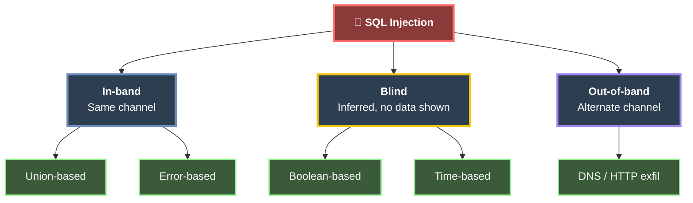
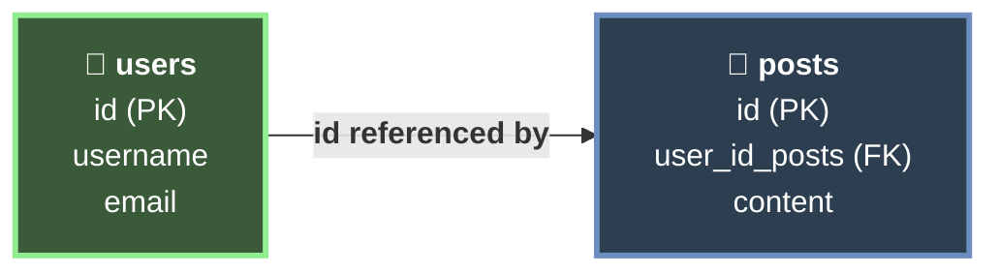

# 🛢️ SQL Injection Fundamentals  
*Unlock the arcane pathways hidden within databases, where ill-guarded gates yield secrets and command the shadows. This module reveals the mysteries of exploiting SQL injection vulnerabilities.*

> *“In the crypts of data, a single malformed whisper can unravel entire vaults.”*

---

### 🔷 Chapter 1: SQL Injection
### 🔶 Chapter 2: Types of SQL Injection
### 🟠 Chapter 3: Use Cases & Impact
### 🟢 Chapter 4: Prevention
### 🔵 Chapter 5: Types of Databases
### 🟣 Chapter 6: SQL (Structured Query Language)

---

<h2>🔷 SQL Injection</h2>

Databases are used to store and retrieve information. This interaction happens in real time through HTTP requests that travel from the frontend to the backend, which then queries the database to build the response.

When information provided by the user is used to build the query, a malicious user could take advantage of that to give it a different use than the one intended. This is what is known as **SQL Injection (SQLi)**.

Once an attacker discovers that they can inject, the next step is to execute different queries directly in, for example, the login input. This can be achieved by crafting a query that runs the original query **and** a new one, or that completely changes the result. The result can then be obtained and interpreted in the frontend.

There are different types of queries that can achieve this, such as **stacked** or **UNION** queries.

---

<h2>🔶 Types of SQL Injection</h2>

SQL injection is classified by **how the results of the injected query are retrieved**. The right technique depends on how much feedback the application returns to the attacker.

| Type | Sub-type | How data is retrieved |
|---|---|---|
| **In-band** | Union-based | The `UNION` operator appends the injected query's results to the original response. |
| **In-band** | Error-based | The database is forced to throw errors that leak data inside the error message. |
| **Blind** | Boolean-based | No data is returned directly; data is inferred from `true`/`false` differences in the response. |
| **Blind** | Time-based | Data is inferred from response delays (e.g. `SLEEP()`) when there is no visible difference. |
| **Out-of-band (OOB)** | — | Data is exfiltrated through a different channel (e.g. DNS/HTTP) when there is no direct or timing feedback. |

- **In-band:** Injection and results travel over the **same channel** — the fastest and most direct.
- **Blind:** The response shows **no data**, so it must be extracted bit by bit through inferred behavior.
- **Out-of-band:** Used when the server has no visible or timing-based response, forcing it to reach out over another protocol.

---

<h2>🟠 Use Cases & Impact</h2>

This attack can have a tremendous impact, such as accessing sensitive data like login credentials or card information. This type of information is also often used to access other services when passwords are reused, along with other nefarious purposes.

Other risks include:

- **Bypassing** permissions or logins.
- **Accessing** functions intended for specific roles, such as administrators.
- **Reading or writing** files on the server, which can result in the creation of backdoors on the server itself and gaining control over it.

---

<h2>🟢 Prevention</h2>

This can be prevented through good programming practices. Defenses are layered — the first item is the primary control, the rest add depth:

1. **Prepared statements / parameterized queries** — the main defense. They separate SQL **code** from **data**, so user input is never interpreted as part of the query.
2. **Input validation & sanitization** — an extra layer, **not** a substitute. Sanitization alone can be bypassed.
3. **Least privilege** — the database account used by the app should have only the permissions it needs (privilege control).
4. **Web Application Firewall (WAF)** — defense in depth, filtering known malicious patterns.

> **NOTE:** Sanitization by itself is weak. Always rely on prepared statements first; treat validation and a WAF as additional layers, never as the primary fix.

---

<h2>🔵 Types of Databases</h2>

Databases, in general, are catalogued as **Relational** and **Non-Relational**. Only relational databases use SQL, while non-relational databases use a variety of methods for communication.

<h3>Relational Databases</h3>

Relational databases use **keys** to communicate and access information quickly. For example, the `users` table can have an `ID`. That `ID` can be referenced by another table, such as `posts`, through `user_id_posts`. This way, we do not need to store all of the user's details in every post.

The overall structure of a database — its tables, columns, data types, and the relationships between them — is known as the **schema**. The relationships themselves are enforced through **foreign keys** (like `user_id_posts` referencing `users.id`). This type of database is fast and reliable.

<h3>Non-Relational Databases (NoSQL)</h3>

Non-relational databases (**NoSQL**) do not use tables, rows, columns, or primary keys. This type of database stores information depending on the type of information. Due to the lack of structure and their flexibility, they are highly scalable.

There are four common models:

- **Key-Value**
- **Document based**
- **Wide column**
- **Graph**

One of the most popular is **MongoDB**.

---

<h2>🟣 SQL (Structured Query Language)</h2>

The syntax can vary between management systems (**RDBMS**). However, they all follow the **ISO standard** for SQL.

This language can be used to:

- **Read**, **create**, **update**, and **delete** information.
- **Add** or **remove** users.
- **Grant** or **revoke** permissions.

---

📘 **Next step:** Continue with [SQLMap Essentials](./15-sqlmap-essentials.md)
