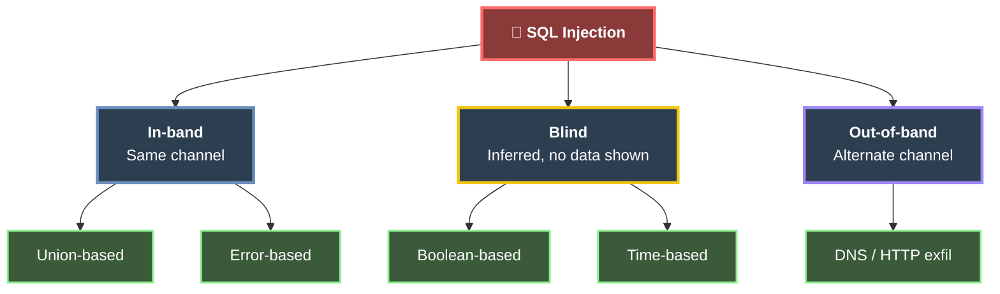
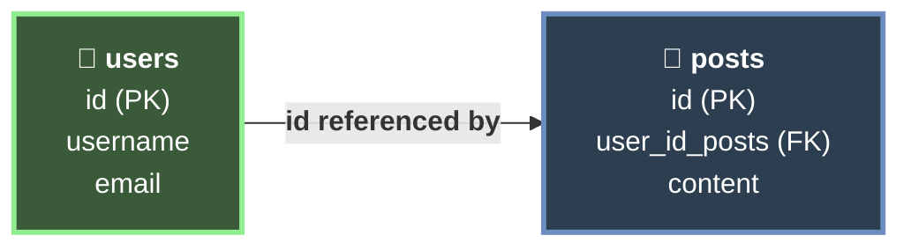

# 🛢️ SQL Injection Fundamentals  
*Unlock the arcane pathways hidden within databases, where ill-guarded gates yield secrets and command the shadows. This module reveals the mysteries of exploiting SQL injection vulnerabilities.*

> *“In the crypts of data, a single malformed whisper can unravel entire vaults.”*

---

### 🔷 Chapter 1: SQL Injection
### 🔶 Chapter 2: Types of SQL Injection
### 🟠 Chapter 3: Use Cases & Impact
### 🟢 Chapter 4: Prevention
### 🔵 Chapter 5: Types of Databases
### 🟣 Chapter 6: SQL (Structured Query Language)
### 🐬 Chapter 7: Using SQL (MySQL)
- Intro to MySQL
- SQL Statements
- Query Results
- SQL Operators
### 📋 Chapter 8: Command Reference

---

<details>
<summary><h2>🔷 SQL Injection</h2></summary>

Databases are used to store and retrieve information. This interaction happens in real time through HTTP requests that travel from the frontend to the backend, which then queries the database to build the response.

When information provided by the user is used to build the query, a malicious user could take advantage of that to give it a different use than the one intended. This is what is known as **SQL Injection (SQLi)**.

Once an attacker discovers that they can inject, the next step is to execute different queries directly in, for example, the login input. This can be achieved by crafting a query that runs the original query **and** a new one, or that completely changes the result. The result can then be obtained and interpreted in the frontend.

There are different types of queries that can achieve this, such as **stacked** or **UNION** queries.

</details>

---

<details>
<summary><h2>🔶 Types of SQL Injection</h2></summary>

SQL injection is classified by **how the results of the injected query are retrieved**. The right technique depends on how much feedback the application returns to the attacker.

| Type | Sub-type | How data is retrieved |
|---|---|---|
| **In-band** | Union-based | The `UNION` operator appends the injected query's results to the original response. |
| **In-band** | Error-based | The database is forced to throw errors that leak data inside the error message. |
| **Blind** | Boolean-based | No data is returned directly; data is inferred from `true`/`false` differences in the response. |
| **Blind** | Time-based | Data is inferred from response delays (e.g. `SLEEP()`) when there is no visible difference. |
| **Out-of-band (OOB)** | — | Data is exfiltrated through a different channel (e.g. DNS/HTTP) when there is no direct or timing feedback. |

- **In-band:** Injection and results travel over the **same channel** — the fastest and most direct.
- **Blind:** The response shows **no data**, so it must be extracted bit by bit through inferred behavior.
- **Out-of-band:** Used when the server has no visible or timing-based response, forcing it to reach out over another protocol.



</details>

---

<details>
<summary><h2>🟠 Use Cases & Impact</h2></summary>

This attack can have a tremendous impact, such as accessing sensitive data like login credentials or card information. This type of information is also often used to access other services when passwords are reused, along with other nefarious purposes.

Other risks include:

- **Bypassing** permissions or logins.
- **Accessing** functions intended for specific roles, such as administrators.
- **Reading or writing** files on the server, which can result in the creation of backdoors on the server itself and gaining control over it.

</details>

---

<details>
<summary><h2>🟢 Prevention</h2></summary>

This can be prevented through good programming practices. Defenses are layered — the first item is the primary control, the rest add depth:

1. **Prepared statements / parameterized queries** — the main defense. They separate SQL **code** from **data**, so user input is never interpreted as part of the query.
2. **Input validation & sanitization** — an extra layer, **not** a substitute. Sanitization alone can be bypassed.
3. **Least privilege** — the database account used by the app should have only the permissions it needs (privilege control).
4. **Web Application Firewall (WAF)** — defense in depth, filtering known malicious patterns.

> **NOTE:** Sanitization by itself is weak. Always rely on prepared statements first; treat validation and a WAF as additional layers, never as the primary fix.

</details>

---

<details>
<summary><h2>🔵 Types of Databases</h2></summary>

Databases, in general, are catalogued as **Relational** and **Non-Relational**. Only relational databases use SQL, while non-relational databases use a variety of methods for communication.

<details>
<summary><h3>Relational Databases</h3></summary>

Relational databases use **keys** to communicate and access information quickly. For example, the `users` table can have an `ID`. That `ID` can be referenced by another table, such as `posts`, through `user_id_posts`. This way, we do not need to store all of the user's details in every post.

The overall structure of a database — its tables, columns, data types, and the relationships between them — is known as the **schema**. The relationships themselves are enforced through **foreign keys** (like `user_id_posts` referencing `users.id`). This type of database is fast and reliable.



</details>

<details>
<summary><h3>Non-Relational Databases (NoSQL)</h3></summary>

Non-relational databases (**NoSQL**) do not use tables, rows, columns, or primary keys. This type of database stores information depending on the type of information. Due to the lack of structure and their flexibility, they are highly scalable.

There are four common models:

- **Key-Value**
- **Document based**
- **Wide column**
- **Graph**

One of the most popular is **MongoDB**.

</details>

</details>

---

<details>
<summary><h2>🟣 SQL (Structured Query Language)</h2></summary>

The syntax can vary between management systems (**RDBMS**). However, they all follow the **ISO standard** for SQL.

This language can be used to:

- **Read**, **create**, **update**, and **delete** information.
- **Add** or **remove** users.
- **Grant** or **revoke** permissions.

</details>

---

<details>
<summary><h2>🐬 Using SQL (MySQL)</h2></summary>

The following sections cover the practical use of SQL through MySQL/MariaDB: connecting and creating databases, the core statements, controlling query results, and combining conditions with operators.

<details>
<summary><h3>🐬 Intro to MySQL</h3></summary>

To understand SQL injection through MySQL, we first need the basics of MySQL/SQL syntax. The following examples follow the **MySQL/MariaDB** syntax.

With SQL we can: retrieve, update, and delete data; create new tables and databases; add / remove users; and assign permissions to those users.

<details>
<summary><h4>Command Line</h4></summary>

The `mysql` utility authenticates to and interacts with a MySQL/MariaDB database. The `-u` flag supplies the username and `-p` the password. **Pass `-p` empty** so we are prompted for the password — passing it inline could store it in cleartext in the `.bash_history` file.

<table width="100%">
<tr><td colspan="2"> ⚔️ <b>AttackHost</b> </td></tr>
<tr><td width="20%">

**`Roothulhu@htb[/htb]$`**

</td><td>

```bash
mysql -u root -p
```

</td></tr>
<tr><td colspan="2">

---

```
Enter password: <password>
...SNIP...

mysql>
```

</td></tr>
</table>

It is also possible to pass the password directly, though this should be **avoided** (it may be kept in logs and terminal history):

<table width="100%">
<tr><td colspan="2"> ⚔️ <b>AttackHost</b> </td></tr>
<tr><td width="20%">

**`Roothulhu@htb[/htb]$`**

</td><td>

```bash
mysql -u root -p<password>
```

</td></tr>
</table>

> **TIP:** There must be **no space** between `-p` and the password.

When no host is specified, it defaults to `localhost`. A remote host and port can be set with `-h` and `-P`:

<table width="100%">
<tr><td colspan="2"> ⚔️ <b>AttackHost</b> </td></tr>
<tr><td width="20%">

**`Roothulhu@htb[/htb]$`**

</td><td>

```bash
mysql -u root -h docker.hackthebox.eu -P 3306 -p
```

</td></tr>
</table>

| Flag | Purpose |
|---|---|
| `-u` | Username |
| `-p` | Password (leave empty to be prompted) |
| `-h` | Host (defaults to `localhost`) |
| `-P` | Port (uppercase; default `3306`) |

> **NOTE:** The default MySQL/MariaDB port is `3306`, but it can be reconfigured. Port uses uppercase `-P`, unlike the lowercase `-p` used for passwords.

The examples above log in as the superuser `root`, which has privileges to run all commands. Other DBMS users have limited privileges. Privileges can be viewed with the `SHOW GRANTS` command (covered later).

</details>

<details>
<summary><h4>Creating a Database</h4></summary>

Once logged in, SQL queries interact with the DBMS. A new database is created with the `CREATE DATABASE` statement. **MySQL expects command-line queries to end with a semicolon (`;`).**

<table width="100%">
<tr><td colspan="2"> 🐬 <b>MySQL</b> </td></tr>
<tr><td width="20%">

**`mysql>`**

</td><td>

```sql
CREATE DATABASE users;
```

</td></tr>
<tr><td colspan="2">

---

```
Query OK, 1 row affected (0.02 sec)
```

</td></tr>
</table>

The list of databases is shown with `SHOW DATABASES`, and we switch to one with the `USE` statement:

<table width="100%">
<tr><td colspan="2"> 🐬 <b>MySQL</b> </td></tr>
<tr><td width="20%">

**`mysql>`**

</td><td>

```sql
SHOW DATABASES;
```

</td></tr>
<tr><td colspan="2">

---

```
+--------------------+
| Database           |
+--------------------+
| information_schema |
| mysql              |
| performance_schema |
| sys                |
| users              |
+--------------------+
```

</td></tr>
</table>

<table width="100%">
<tr><td colspan="2"> 🐬 <b>MySQL</b> </td></tr>
<tr><td width="20%">

**`mysql>`**

</td><td>

```sql
USE users;
```

</td></tr>
<tr><td colspan="2">

---

```
Database changed
```

</td></tr>
</table>

> **NOTE:** SQL statements are **not** case sensitive (`USE users;` == `use users;`), but the **database name is** — `USE USERS;` is not the same as `USE users;`. Writing statements in uppercase is good practice to avoid confusion.

</details>

<details>
<summary><h4>Tables</h4></summary>

A DBMS stores data in **tables**: horizontal **rows** and vertical **columns**, where the intersection of a row and column is a **cell**. Every table has a fixed set of columns, each with a specific **data type** (numbers, strings, date, time, binary data, etc.).

For example, create a `logins` table to store user data with `CREATE TABLE`:

<table width="100%">
<tr><td> 🗄️ <b>SQL</b> </td></tr>
<tr><td>

```sql
CREATE TABLE logins (
    id INT,
    username VARCHAR(100),
    password VARCHAR(100),
    date_of_joining DATETIME
    );
```

</td></tr>
</table>

`CREATE TABLE` specifies the table name, then (within parentheses) each column by name and data type, comma-separated. `id` is an integer; `username` and `password` are strings up to 100 characters (longer input errors out); `date_of_joining` is a `DATETIME`.

A list of tables in the current database is shown with `SHOW TABLES`:

<table width="100%">
<tr><td colspan="2"> 🐬 <b>MySQL</b> </td></tr>
<tr><td width="20%">

**`mysql>`**

</td><td>

```sql
SHOW TABLES;
```

</td></tr>
<tr><td colspan="2">

---

```
+-----------------+
| Tables_in_users |
+-----------------+
| logins          |
+-----------------+
1 row in set (0.00 sec)
```

</td></tr>
</table>

The `DESCRIBE` keyword lists the table structure with its fields and data types:

<table width="100%">
<tr><td colspan="2"> 🐬 <b>MySQL</b> </td></tr>
<tr><td width="20%">

**`mysql>`**

</td><td>

```sql
DESCRIBE logins;
```

</td></tr>
<tr><td colspan="2">

---

```
+-----------------+--------------+
| Field           | Type         |
+-----------------+--------------+
| id              | int          |
| username        | varchar(100) |
| password        | varchar(100) |
| date_of_joining | date         |
+-----------------+--------------+
4 rows in set (0.00 sec)
```

</td></tr>
</table>

</details>

<details>
<summary><h4>Table Properties</h4></summary>

`CREATE TABLE` supports many properties per table and column:

| Property | Purpose |
|---|---|
| `AUTO_INCREMENT` | Increments the value by one for each new record. |
| `NOT NULL` | Ensures the column is never empty (required field). |
| `UNIQUE` | Ensures inserted values are always unique. |
| `DEFAULT` | Sets a default value (e.g. `NOW()` returns the current date/time). |
| `PRIMARY KEY` | Uniquely identifies each record in the table. |

<table width="100%">
<tr><td> 🗄️ <b>SQL</b> </td></tr>
<tr><td>

```sql
    id INT NOT NULL AUTO_INCREMENT,
    username VARCHAR(100) UNIQUE NOT NULL,
    date_of_joining DATETIME DEFAULT NOW(),
    PRIMARY KEY (id)
```

</td></tr>
</table>

The final `CREATE TABLE` query:

<table width="100%">
<tr><td> 🗄️ <b>SQL</b> </td></tr>
<tr><td>

```sql
CREATE TABLE logins (
    id INT NOT NULL AUTO_INCREMENT,
    username VARCHAR(100) UNIQUE NOT NULL,
    password VARCHAR(100) NOT NULL,
    date_of_joining DATETIME DEFAULT NOW(),
    PRIMARY KEY (id)
    );
```

</td></tr>
</table>

> **NOTE:** Allow 10–15 seconds for lab servers to start, giving Apache/MySQL enough time to initiate.

</details>

</details>

---

<details>
<summary><h3>✍️ SQL Statements</h3></summary>

With databases and tables in place, these are the essential SQL statements used to manipulate records.

<details>
<summary><h4>INSERT Statement</h4></summary>

`INSERT` adds new records to a table. The full syntax requires a value for **every** column:

<table width="100%">
<tr><td> 🗄️ <b>SQL</b> </td></tr>
<tr><td>

```sql
INSERT INTO table_name VALUES (column1_value, column2_value, column3_value, ...);
```

</td></tr>
</table>

<table width="100%">
<tr><td colspan="2"> 🐬 <b>MySQL</b> </td></tr>
<tr><td width="20%">

**`mysql>`**

</td><td>

```sql
INSERT INTO logins VALUES(1, 'admin', 'p@ssw0rd', '2020-07-02');
```

</td></tr>
<tr><td colspan="2">

---

```
Query OK, 1 row affected (0.00 sec)
```

</td></tr>
</table>

Columns with default values (like `id` and `date_of_joining`) can be skipped by naming only the columns to fill:

<table width="100%">
<tr><td> 🗄️ <b>SQL</b> </td></tr>
<tr><td>

```sql
INSERT INTO table_name(column2, column3, ...) VALUES (column2_value, column3_value, ...);
```

</td></tr>
</table>

> **NOTE:** Skipping a column with the `NOT NULL` constraint results in an error — it is a required value.

<table width="100%">
<tr><td colspan="2"> 🐬 <b>MySQL</b> </td></tr>
<tr><td width="20%">

**`mysql>`**

</td><td>

```sql
INSERT INTO logins(username, password) VALUES('administrator', 'adm1n_p@ss');
```

</td></tr>
<tr><td colspan="2">

---

```
Query OK, 1 row affected (0.00 sec)
```

</td></tr>
</table>

> **WARNING:** These examples insert **cleartext** passwords for demonstration only. This is bad practice — passwords should always be hashed/encrypted before storage.

Multiple records can be inserted at once, separated by commas:

<table width="100%">
<tr><td colspan="2"> 🐬 <b>MySQL</b> </td></tr>
<tr><td width="20%">

**`mysql>`**

</td><td>

```sql
INSERT INTO logins(username, password) VALUES ('john', 'john123!'), ('tom', 'tom123!');
```

</td></tr>
<tr><td colspan="2">

---

```
Query OK, 2 rows affected (0.00 sec)
Records: 2  Duplicates: 0  Warnings: 0
```

</td></tr>
</table>

</details>

<details>
<summary><h4>SELECT Statement</h4></summary>

`SELECT` retrieves data. The asterisk (`*`) is a wildcard selecting all columns; `FROM` denotes the table:

<table width="100%">
<tr><td> 🗄️ <b>SQL</b> </td></tr>
<tr><td>

```sql
SELECT * FROM table_name;
SELECT column1, column2 FROM table_name;
```

</td></tr>
</table>

<table width="100%">
<tr><td colspan="2"> 🐬 <b>MySQL</b> </td></tr>
<tr><td width="20%">

**`mysql>`**

</td><td>

```sql
SELECT * FROM logins;
```

</td></tr>
<tr><td colspan="2">

---

```
+----+---------------+------------+---------------------+
| id | username      | password   | date_of_joining     |
+----+---------------+------------+---------------------+
|  1 | admin         | p@ssw0rd   | 2020-07-02 00:00:00 |
|  2 | administrator | adm1n_p@ss | 2020-07-02 11:30:50 |
|  3 | john          | john123!   | 2020-07-02 11:47:16 |
|  4 | tom           | tom123!    | 2020-07-02 11:47:16 |
+----+---------------+------------+---------------------+
4 rows in set (0.00 sec)
```

</td></tr>
</table>

Selecting only specific columns:

<table width="100%">
<tr><td colspan="2"> 🐬 <b>MySQL</b> </td></tr>
<tr><td width="20%">

**`mysql>`**

</td><td>

```sql
SELECT username,password FROM logins;
```

</td></tr>
<tr><td colspan="2">

---

```
+---------------+------------+
| username      | password   |
+---------------+------------+
| admin         | p@ssw0rd   |
| administrator | adm1n_p@ss |
| john          | john123!   |
| tom           | tom123!    |
+---------------+------------+
4 rows in set (0.00 sec)
```

</td></tr>
</table>

</details>

<details>
<summary><h4>DROP Statement</h4></summary>

`DROP` removes tables and databases from the server:

<table width="100%">
<tr><td colspan="2"> 🐬 <b>MySQL</b> </td></tr>
<tr><td width="20%">

**`mysql>`**

</td><td>

```sql
DROP TABLE logins;
```

</td></tr>
<tr><td colspan="2">

---

```
Query OK, 0 rows affected (0.01 sec)
```

</td></tr>
</table>

<table width="100%">
<tr><td colspan="2"> 🐬 <b>MySQL</b> </td></tr>
<tr><td width="20%">

**`mysql>`**

</td><td>

```sql
SHOW TABLES;
```

</td></tr>
<tr><td colspan="2">

---

```
Empty set (0.00 sec)
```

</td></tr>
</table>

> **WARNING:** `DROP` permanently and completely deletes the table with **no confirmation**. Use with caution.

</details>

<details>
<summary><h4>ALTER Statement</h4></summary>

`ALTER` changes a table's name, its fields, or adds/removes columns (requires sufficient privileges).

**Add** a new column with `ADD`:

<table width="100%">
<tr><td colspan="2"> 🐬 <b>MySQL</b> </td></tr>
<tr><td width="20%">

**`mysql>`**

</td><td>

```sql
ALTER TABLE logins ADD newColumn INT;
```

</td></tr>
<tr><td colspan="2">

---

```
Query OK, 0 rows affected (0.01 sec)
```

</td></tr>
</table>

**Rename** a column with `RENAME COLUMN`:

<table width="100%">
<tr><td colspan="2"> 🐬 <b>MySQL</b> </td></tr>
<tr><td width="20%">

**`mysql>`**

</td><td>

```sql
ALTER TABLE logins RENAME COLUMN newColumn TO newerColumn;
```

</td></tr>
<tr><td colspan="2">

---

```
Query OK, 0 rows affected (0.01 sec)
```

</td></tr>
</table>

**Change** a column's datatype with `MODIFY`:

<table width="100%">
<tr><td colspan="2"> 🐬 <b>MySQL</b> </td></tr>
<tr><td width="20%">

**`mysql>`**

</td><td>

```sql
ALTER TABLE logins MODIFY newerColumn DATE;
```

</td></tr>
<tr><td colspan="2">

---

```
Query OK, 0 rows affected (0.01 sec)
```

</td></tr>
</table>

**Drop** a column with `DROP`:

<table width="100%">
<tr><td colspan="2"> 🐬 <b>MySQL</b> </td></tr>
<tr><td width="20%">

**`mysql>`**

</td><td>

```sql
ALTER TABLE logins DROP newerColumn;
```

</td></tr>
<tr><td colspan="2">

---

```
Query OK, 0 rows affected (0.01 sec)
```

</td></tr>
</table>

</details>

<details>
<summary><h4>UPDATE Statement</h4></summary>

While `ALTER` changes a table's structure, `UPDATE` changes specific **records** based on a condition:

<table width="100%">
<tr><td> 🗄️ <b>SQL</b> </td></tr>
<tr><td>

```sql
UPDATE table_name SET column1=newvalue1, column2=newvalue2, ... WHERE <condition>;
```

</td></tr>
</table>

<table width="100%">
<tr><td colspan="2"> 🐬 <b>MySQL</b> </td></tr>
<tr><td width="20%">

**`mysql>`**

</td><td>

```sql
UPDATE logins SET password = 'change_password' WHERE id > 1;
```

</td></tr>
<tr><td colspan="2">

---

```
Query OK, 3 rows affected (0.00 sec)
Rows matched: 3  Changed: 3  Warnings: 0
```

</td></tr>
</table>

<table width="100%">
<tr><td colspan="2"> 🐬 <b>MySQL</b> </td></tr>
<tr><td width="20%">

**`mysql>`**

</td><td>

```sql
SELECT * FROM logins;
```

</td></tr>
<tr><td colspan="2">

---

```
+----+---------------+-----------------+---------------------+
| id | username      | password        | date_of_joining     |
+----+---------------+-----------------+---------------------+
|  1 | admin         | p@ssw0rd        | 2020-07-02 00:00:00 |
|  2 | administrator | change_password | 2020-07-02 11:30:50 |
|  3 | john          | change_password | 2020-07-02 11:47:16 |
|  4 | tom           | change_password | 2020-07-02 11:47:16 |
+----+---------------+-----------------+---------------------+
4 rows in set (0.00 sec)
```

</td></tr>
</table>

> **NOTE:** A `WHERE` clause **must** be specified with `UPDATE` to define which records get updated. The `WHERE` clause is covered next.

</details>

</details>

---

<details>
<summary><h3>🔎 Query Results</h3></summary>

These clauses control the output of a query — how it is sorted, how much is returned, and which records match.

<details>
<summary><h4>Sorting Results — ORDER BY</h4></summary>

`ORDER BY` sorts results by a chosen column (ascending by default):

<table width="100%">
<tr><td colspan="2"> 🐬 <b>MySQL</b> </td></tr>
<tr><td width="20%">

**`mysql>`**

</td><td>

```sql
SELECT * FROM logins ORDER BY password;
```

</td></tr>
<tr><td colspan="2">

---

```
+----+---------------+------------+---------------------+
| id | username      | password   | date_of_joining     |
+----+---------------+------------+---------------------+
|  2 | administrator | adm1n_p@ss | 2020-07-02 11:30:50 |
|  3 | john          | john123!   | 2020-07-02 11:47:16 |
|  1 | admin         | p@ssw0rd   | 2020-07-02 00:00:00 |
|  4 | tom           | tom123!    | 2020-07-02 11:47:16 |
+----+---------------+------------+---------------------+
4 rows in set (0.00 sec)
```

</td></tr>
</table>

Sort direction can be set with `ASC` or `DESC`:

<table width="100%">
<tr><td colspan="2"> 🐬 <b>MySQL</b> </td></tr>
<tr><td width="20%">

**`mysql>`**

</td><td>

```sql
SELECT * FROM logins ORDER BY password DESC;
```

</td></tr>
<tr><td colspan="2">

---

```
+----+---------------+------------+---------------------+
| id | username      | password   | date_of_joining     |
+----+---------------+------------+---------------------+
|  4 | tom           | tom123!    | 2020-07-02 11:47:16 |
|  1 | admin         | p@ssw0rd   | 2020-07-02 00:00:00 |
|  3 | john          | john123!   | 2020-07-02 11:47:16 |
|  2 | administrator | adm1n_p@ss | 2020-07-02 11:30:50 |
+----+---------------+------------+---------------------+
4 rows in set (0.00 sec)
```

</td></tr>
</table>

Multiple columns can be given for a secondary sort on duplicate values:

<table width="100%">
<tr><td colspan="2"> 🐬 <b>MySQL</b> </td></tr>
<tr><td width="20%">

**`mysql>`**

</td><td>

```sql
SELECT * FROM logins ORDER BY password DESC, id ASC;
```

</td></tr>
<tr><td colspan="2">

---

```
+----+---------------+-----------------+---------------------+
| id | username      | password        | date_of_joining     |
+----+---------------+-----------------+---------------------+
|  1 | admin         | p@ssw0rd        | 2020-07-02 00:00:00 |
|  2 | administrator | change_password | 2020-07-02 11:30:50 |
|  3 | john          | change_password | 2020-07-02 11:47:16 |
|  4 | tom           | change_password | 2020-07-02 11:50:20 |
+----+---------------+-----------------+---------------------+
4 rows in set (0.00 sec)
```

</td></tr>
</table>

</details>

<details>
<summary><h4>LIMIT Results</h4></summary>

`LIMIT` restricts the number of records returned:

<table width="100%">
<tr><td colspan="2"> 🐬 <b>MySQL</b> </td></tr>
<tr><td width="20%">

**`mysql>`**

</td><td>

```sql
SELECT * FROM logins LIMIT 2;
```

</td></tr>
<tr><td colspan="2">

---

```
+----+---------------+------------+---------------------+
| id | username      | password   | date_of_joining     |
+----+---------------+------------+---------------------+
|  1 | admin         | p@ssw0rd   | 2020-07-02 00:00:00 |
|  2 | administrator | adm1n_p@ss | 2020-07-02 11:30:50 |
+----+---------------+------------+---------------------+
2 rows in set (0.00 sec)
```

</td></tr>
</table>

An offset can be given before the count (`LIMIT offset, count`):

<table width="100%">
<tr><td colspan="2"> 🐬 <b>MySQL</b> </td></tr>
<tr><td width="20%">

**`mysql>`**

</td><td>

```sql
SELECT * FROM logins LIMIT 1, 2;
```

</td></tr>
<tr><td colspan="2">

---

```
+----+---------------+------------+---------------------+
| id | username      | password   | date_of_joining     |
+----+---------------+------------+---------------------+
|  2 | administrator | adm1n_p@ss | 2020-07-02 11:30:50 |
|  3 | john          | john123!   | 2020-07-02 11:47:16 |
+----+---------------+------------+---------------------+
2 rows in set (0.00 sec)
```

</td></tr>
</table>

> **NOTE:** The offset marks the order of the first record to include, starting from `0`. Above, it starts at (and includes) the 2nd record and returns two values.

</details>

<details>
<summary><h4>WHERE Clause</h4></summary>

The `WHERE` clause filters records to those matching a condition:

<table width="100%">
<tr><td> 🗄️ <b>SQL</b> </td></tr>
<tr><td>

```sql
SELECT * FROM table_name WHERE <condition>;
```

</td></tr>
</table>

<table width="100%">
<tr><td colspan="2"> 🐬 <b>MySQL</b> </td></tr>
<tr><td width="20%">

**`mysql>`**

</td><td>

```sql
SELECT * FROM logins WHERE id > 1;
```

</td></tr>
<tr><td colspan="2">

---

```
+----+---------------+------------+---------------------+
| id | username      | password   | date_of_joining     |
+----+---------------+------------+---------------------+
|  2 | administrator | adm1n_p@ss | 2020-07-02 11:30:50 |
|  3 | john          | john123!   | 2020-07-02 11:47:16 |
|  4 | tom           | tom123!    | 2020-07-02 11:47:16 |
+----+---------------+------------+---------------------+
3 rows in set (0.00 sec)
```

</td></tr>
</table>

Filtering by a string value:

<table width="100%">
<tr><td colspan="2"> 🐬 <b>MySQL</b> </td></tr>
<tr><td width="20%">

**`mysql>`**

</td><td>

```sql
SELECT * FROM logins WHERE username = 'admin';
```

</td></tr>
<tr><td colspan="2">

---

```
+----+----------+----------+---------------------+
| id | username | password | date_of_joining     |
+----+----------+----------+---------------------+
|  1 | admin    | p@ssw0rd | 2020-07-02 00:00:00 |
+----+----------+----------+---------------------+
1 row in set (0.00 sec)
```

</td></tr>
</table>

> **NOTE:** String and date values must be wrapped in single (`'`) or double (`"`) quotes, while numbers can be used directly.

</details>

<details>
<summary><h4>LIKE Clause</h4></summary>

`LIKE` selects records matching a pattern. `%` matches zero or more characters; `_` matches exactly one character.

The query below retrieves all usernames starting with `admin`:

<table width="100%">
<tr><td colspan="2"> 🐬 <b>MySQL</b> </td></tr>
<tr><td width="20%">

**`mysql>`**

</td><td>

```sql
SELECT * FROM logins WHERE username LIKE 'admin%';
```

</td></tr>
<tr><td colspan="2">

---

```
+----+---------------+------------+---------------------+
| id | username      | password   | date_of_joining     |
+----+---------------+------------+---------------------+
|  1 | admin         | p@ssw0rd   | 2020-07-02 00:00:00 |
|  4 | administrator | adm1n_p@ss | 2020-07-02 15:19:02 |
+----+---------------+------------+---------------------+
2 rows in set (0.00 sec)
```

</td></tr>
</table>

Matching usernames with exactly three characters using `_`:

<table width="100%">
<tr><td colspan="2"> 🐬 <b>MySQL</b> </td></tr>
<tr><td width="20%">

**`mysql>`**

</td><td>

```sql
SELECT * FROM logins WHERE username LIKE '___';
```

</td></tr>
<tr><td colspan="2">

---

```
+----+----------+----------+---------------------+
| id | username | password | date_of_joining     |
+----+----------+----------+---------------------+
|  3 | tom      | tom123!  | 2020-07-02 15:18:56 |
+----+----------+----------+---------------------+
1 row in set (0.01 sec)
```

</td></tr>
</table>

| Wildcard | Matches |
|---|---|
| `%` | Zero or more characters |
| `_` | Exactly one character |

</details>

</details>

---

<details>
<summary><h3>🧮 SQL Operators</h3></summary>

When a single condition is not enough, SQL supports **logical operators** to combine multiple conditions. The most common are `AND`, `OR`, and `NOT`.

> **NOTE:** In MySQL, any **non-zero** value is `true` (usually returned as `1`), and `0` is `false`.

<details>
<summary><h4>AND Operator</h4></summary>

`AND` takes two conditions and returns true **only if both** evaluate to true:

<table width="100%">
<tr><td> 🗄️ <b>SQL</b> </td></tr>
<tr><td>

```sql
condition1 AND condition2
```

</td></tr>
</table>

<table width="100%">
<tr><td colspan="2"> 🐬 <b>MySQL</b> </td></tr>
<tr><td width="20%">

**`mysql>`**

</td><td>

```sql
SELECT 1 = 1 AND 'test' = 'test';
SELECT 1 = 1 AND 'test' = 'abc';
```

</td></tr>
<tr><td colspan="2">

---

```
+---------------------------+
| 1 = 1 AND 'test' = 'test' |
+---------------------------+
|                         1 |
+---------------------------+

+--------------------------+
| 1 = 1 AND 'test' = 'abc' |
+--------------------------+
|                        0 |
+--------------------------+
```

</td></tr>
</table>

The first query is true (both conditions true); the second is false (`'test' = 'abc'` is false).

</details>

<details>
<summary><h4>OR Operator</h4></summary>

`OR` returns true when **at least one** condition evaluates to true:

<table width="100%">
<tr><td colspan="2"> 🐬 <b>MySQL</b> </td></tr>
<tr><td width="20%">

**`mysql>`**

</td><td>

```sql
SELECT 1 = 1 OR 'test' = 'abc';
SELECT 1 = 2 OR 'test' = 'abc';
```

</td></tr>
<tr><td colspan="2">

---

```
+-------------------------+
| 1 = 1 OR 'test' = 'abc' |
+-------------------------+
|                       1 |
+-------------------------+

+-------------------------+
| 1 = 2 OR 'test' = 'abc' |
+-------------------------+
|                       0 |
+-------------------------+
```

</td></tr>
</table>

The first query is true (`1 = 1` is true); the second is false (both conditions false).

</details>

<details>
<summary><h4>NOT Operator</h4></summary>

`NOT` toggles a boolean value — true becomes false and vice versa:

<table width="100%">
<tr><td colspan="2"> 🐬 <b>MySQL</b> </td></tr>
<tr><td width="20%">

**`mysql>`**

</td><td>

```sql
SELECT NOT 1 = 1;
SELECT NOT 1 = 2;
```

</td></tr>
<tr><td colspan="2">

---

```
+-----------+
| NOT 1 = 1 |
+-----------+
|         0 |
+-----------+

+-----------+
| NOT 1 = 2 |
+-----------+
|         1 |
+-----------+
```

</td></tr>
</table>

The first is false (inverse of true); the second is true (inverse of false).

</details>

<details>
<summary><h4>Symbol Operators</h4></summary>

`AND`, `OR`, and `NOT` can also be written as `&&`, `||`, and `!`:

| Keyword | Symbol |
|---|---|
| `AND` | `&&` |
| `OR` | `\|\|` |
| `NOT` | `!` |

<table width="100%">
<tr><td colspan="2"> 🐬 <b>MySQL</b> </td></tr>
<tr><td width="20%">

**`mysql>`**

</td><td>

```sql
SELECT 1 = 1 && 'test' = 'abc';
SELECT 1 = 1 || 'test' = 'abc';
SELECT 1 != 1;
```

</td></tr>
<tr><td colspan="2">

---

```
+-------------------------+
| 1 = 1 && 'test' = 'abc' |
+-------------------------+
|                       0 |
+-------------------------+
1 row in set, 1 warning (0.00 sec)

+-------------------------+
| 1 = 1 || 'test' = 'abc' |
+-------------------------+
|                       1 |
+-------------------------+
1 row in set, 1 warning (0.00 sec)

+--------+
| 1 != 1 |
+--------+
|      0 |
+--------+
```

</td></tr>
</table>

</details>

<details>
<summary><h4>Operators in Queries</h4></summary>

Operators fine-tune `WHERE` conditions. This query lists all records where the username is **not** `john`:

<table width="100%">
<tr><td colspan="2"> 🐬 <b>MySQL</b> </td></tr>
<tr><td width="20%">

**`mysql>`**

</td><td>

```sql
SELECT * FROM logins WHERE username != 'john';
```

</td></tr>
<tr><td colspan="2">

---

```
+----+---------------+------------+---------------------+
| id | username      | password   | date_of_joining     |
+----+---------------+------------+---------------------+
|  1 | admin         | p@ssw0rd   | 2020-07-02 00:00:00 |
|  2 | administrator | adm1n_p@ss | 2020-07-02 11:30:50 |
|  4 | tom           | tom123!    | 2020-07-02 11:47:16 |
+----+---------------+------------+---------------------+
3 rows in set (0.00 sec)
```

</td></tr>
</table>

Combining conditions — `id` greater than 1 **AND** username not equal to `john`:

<table width="100%">
<tr><td colspan="2"> 🐬 <b>MySQL</b> </td></tr>
<tr><td width="20%">

**`mysql>`**

</td><td>

```sql
SELECT * FROM logins WHERE username != 'john' AND id > 1;
```

</td></tr>
<tr><td colspan="2">

---

```
+----+---------------+------------+---------------------+
| id | username      | password   | date_of_joining     |
+----+---------------+------------+---------------------+
|  2 | administrator | adm1n_p@ss | 2020-07-02 11:30:50 |
|  4 | tom           | tom123!    | 2020-07-02 11:47:16 |
+----+---------------+------------+---------------------+
2 rows in set (0.00 sec)
```

</td></tr>
</table>

</details>

<details>
<summary><h4>Multiple Operator Precedence</h4></summary>

SQL also supports arithmetic and bitwise operations, so a query may contain multiple operations at once. Their evaluation order is decided by **operator precedence** (from the MariaDB Documentation):

| Precedence | Operators |
|---|---|
| 1 (highest) | Division (`/`), Multiplication (`*`), Modulus (`%`) |
| 2 | Addition (`+`), Subtraction (`-`) |
| 3 | Comparison (`=`, `>`, `<`, `<=`, `>=`, `!=`, `LIKE`) |
| 4 | `NOT` (`!`) |
| 5 | `AND` (`&&`) |
| 6 (lowest) | `OR` (`\|\|`) |

Operators at the top are evaluated before those at the bottom. Consider:

<table width="100%">
<tr><td> 🗄️ <b>SQL</b> </td></tr>
<tr><td>

```sql
SELECT * FROM logins WHERE username != 'tom' AND id > 3 - 2;
```

</td></tr>
</table>

This has four operations: `!=`, `AND`, `>`, and `-`. Subtraction has the highest precedence, so `3 - 2` evaluates to `1` first:

<table width="100%">
<tr><td> 🗄️ <b>SQL</b> </td></tr>
<tr><td>

```sql
SELECT * FROM logins WHERE username != 'tom' AND id > 1;
```

</td></tr>
</table>

Next, the two comparisons (`>` and `!=`, same precedence) are evaluated, then `AND` combines both conditions:

<table width="100%">
<tr><td colspan="2"> 🐬 <b>MySQL</b> </td></tr>
<tr><td width="20%">

**`mysql>`**

</td><td>

```sql
SELECT * FROM logins WHERE username != 'tom' AND id > 3 - 2;
```

</td></tr>
<tr><td colspan="2">

---

```
+----+---------------+------------+---------------------+
| id | username      | password   | date_of_joining     |
+----+---------------+------------+---------------------+
|  2 | administrator | adm1n_p@ss | 2020-07-03 12:03:53 |
|  3 | john          | john123!   | 2020-07-03 12:03:57 |
+----+---------------+------------+---------------------+
2 rows in set (0.00 sec)
```

</td></tr>
</table>

</details>

</details>

</details>

---

<details>
<summary><h2>📋 Command Reference</h2></summary>

Quick reference of the statements covered so far — this table will grow as more commands are added.

| Command | Utility |
|---|---|
| `mysql -u <user> -p` | Connect to the DBMS (prompted for password) |
| `mysql -u <user> -h <host> -P <port> -p` | Connect to a remote DBMS |
| `CREATE DATABASE <name>;` | Create a new database |
| `SHOW DATABASES;` | List all databases |
| `USE <name>;` | Switch to a database |
| `CREATE TABLE <name> (...);` | Create a new table |
| `SHOW TABLES;` | List tables in the current database |
| `DESCRIBE <table>;` | Show a table's structure (fields + types) |
| `INSERT INTO <table> VALUES (...);` | Add a new record (all columns) |
| `INSERT INTO <table>(cols) VALUES (...);` | Add a new record (selected columns) |
| `SELECT * FROM <table>;` | Retrieve all columns / records |
| `SELECT c1, c2 FROM <table>;` | Retrieve specific columns |
| `DROP TABLE <table>;` | Permanently delete a table |
| `ALTER TABLE <table> ADD/MODIFY/DROP/RENAME ...` | Change a table's structure |
| `UPDATE <table> SET col=val WHERE <cond>;` | Update records matching a condition |
| `SELECT ... ORDER BY col [ASC\|DESC];` | Sort results by one or more columns |
| `SELECT ... LIMIT <count>;` | Limit number of records returned |
| `SELECT ... LIMIT <offset>, <count>;` | Limit results with an offset |
| `SELECT ... WHERE <condition>;` | Filter records by a condition |
| `SELECT ... WHERE col LIKE '<pattern>';` | Filter records by pattern (`%`, `_`) |
| `AND` / `&&` | Logical AND — true only if both conditions are true |
| `OR` / `\|\|` | Logical OR — true if at least one condition is true |
| `NOT` / `!` | Logical NOT — inverts a boolean value |
| `SHOW GRANTS;` | View the current user's privileges |

</details>

---

📘 **Next step:** Continue with [SQLMap Essentials](./15-sqlmap-essentials.md)
